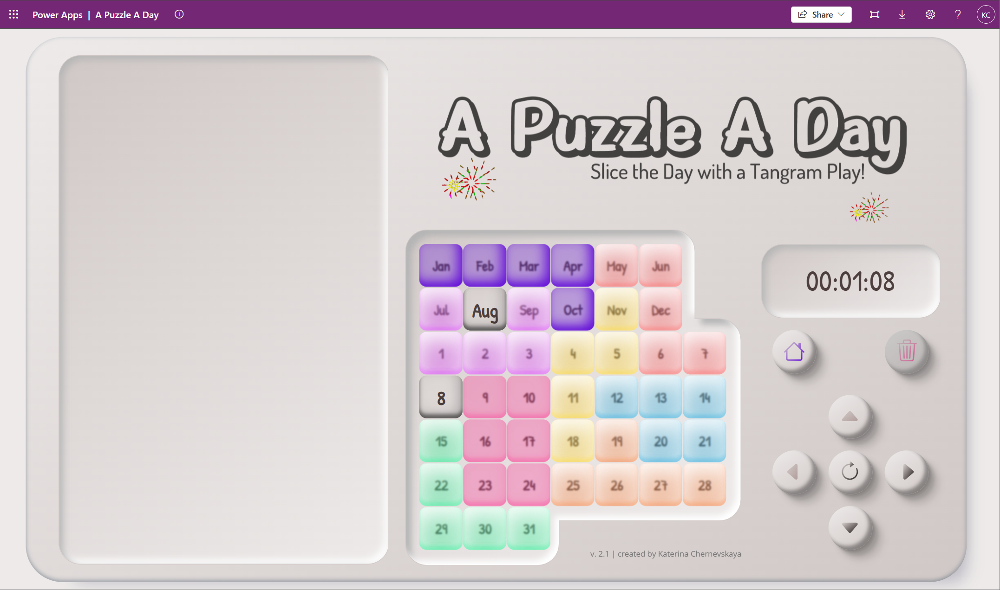
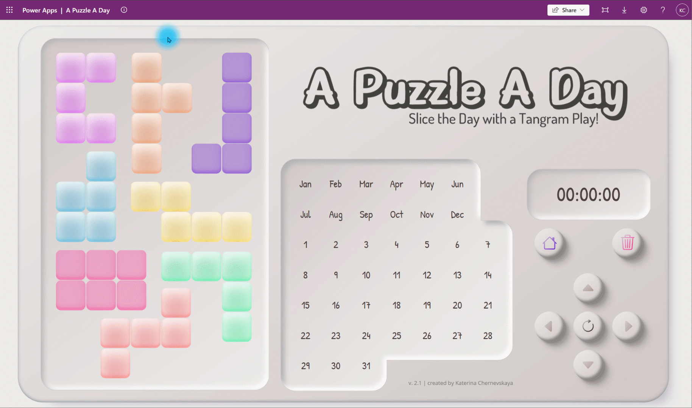
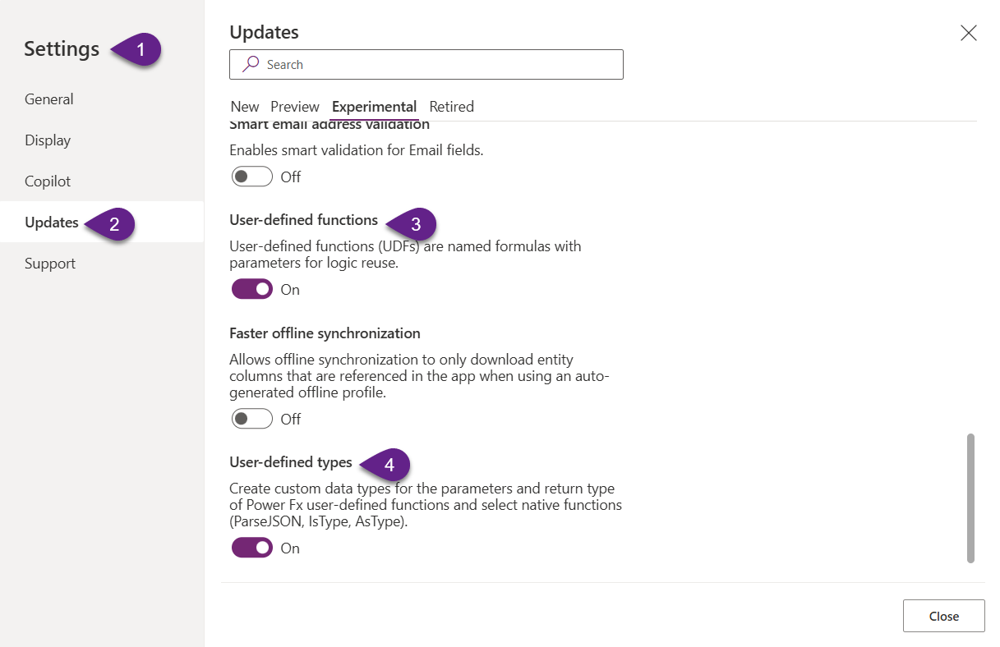

# A Puzzle a Day

## Summary

A **Puzzle a Day** is a clever twist on the classic tangram concept. You’re given 8 colorful, irregular shapes and a game board that resembles a 7×7 grid - but with a catch: some cells are blocked and unusable, which changes how the pieces fit.
Your goal: place all the pieces so that they don’t overlap, and exactly two valid cells remain empty - one for the month, and one for the day.

Behind the scenes, the entire game is powered by Named Formulas and User Defined Functions - a modern, maintainable approach to building logic in Power Apps. This design dramatically reduces code duplication, standardizes all calculations, and improves code redability by keeping the logic declarative and modular. Every shape move, rotation, or board update is calculated cleanly and efficiently.




## Applies to


## Compatibility


## Contributors

* [Katerina Chernevskaya](https://github.com/Katerina-Chernevskaya)

## Version history

Version|Date|Comments
-------|----|--------
1.0|April 17, 2025|Initial release

## Prerequisites

Make sure that experimental features are enabled: 
- User-defined functions
- User-defined types


## Minimal path to awesome

### Using the solution zip

* [Download](./solution/a-puzzle-a-day.zip) the `.zip` from the `solution` folder
* Within **Power Apps Studio**, import the solution `.zip` file using **Solutions** > **Import Solution** and select the `.zip` file you just packed.

### Using the source code

You can also use the [Power Apps CLI](https://docs.microsoft.com/powerapps/developer/data-platform/powerapps-cli) to pack the source code by following these steps:

* Clone the repository to a local drive
* Pack the source files back into a solution `.zip` file:

  ```bash
  pac solution pack --zipfile pathtodestinationfile --folder pathtosourcefolder --processCanvasApps
  ```

  Making sure to replace `pathtosourcefolder` to point to the path to this sample's `sourcecode` folder, and `pathtodestinationfile` to point to the path of this solution's `.zip` file (located under the `solution` folder)
* Within **Power Apps Studio**, import the solution `.zip` file using **Solutions** > **Import Solution** and select the `.zip` file you just packed.

## Features

- Fully declarative Power Fx architecture: no Power Automate, no connectors - built entirely with Named Formulas, User Defined Functions, and native Power Apps logic.
- Named Formulas as data model:
   - `nfCanva` — generates the board with titles and coordinates
   - `nfShapesDefault` — stores default shape geometry, rotations, positions
   - `nfForbiddenCells` — defines blocked cells on the board
- User Defined Functions (UDFs) for all game logic:
   - `udfShape(shapeName)` — central lookup returning all dynamic shape parameters
   - `udfShapeCanvaCells(shapeName)` — calculates absolute positions of shape cells based on position and rotation
   - `udfMovementAvailability(shapeName)` — returns movement availability in all four directions using smart collision detection
- Modular gameplay functions:
   - `udfMove(...)`, `udfRotate(...)`, `udfRemoveShape(...)` — all actions update both shape position and the board status (_canva)
   - `udfUpdateCanva(...)` — modular board painter used consistently for all shape actions

## Help

We do not support samples, but this community is always willing to help, and we want to improve these samples. We use GitHub to track issues, which makes it easy for  community members to volunteer their time and help resolve issues.

If you encounter any issues while using this sample, you can [create a new issue](https://github.com/pnp/powerapps-samples/issues/new?assignees=&labels=Needs%3A+Triage+%3Amag%3A%2Ctype%3Abug-suspected&template=bug-report.yml&sample=a-puzzle-a-day&authors=@Katerina-Chernevskaya&title=a-puzzle-a-day%20-%20).

For questions regarding this sample, [create a new question](https://github.com/pnp/powerapps-samples/issues/new?assignees=&labels=Needs%3A+Triage+%3Amag%3A%2Ctype%3Abug-suspected&template=question.yml&sample=a-puzzle-a-day&authors=@Katerina-Chernevskaya&title=a-puzzle-a-day%20-%20).

Finally, if you have an idea for improvement, [make a suggestion](https://github.com/pnp/powerapps-samples/issues/new?assignees=&labels=Needs%3A+Triage+%3Amag%3A%2Ctype%3Abug-suspected&template=suggestion.yml&sample=a-puzzle-a-day&authors=@Katerina-Chernevskaya&title=a-puzzle-a-day%20-%20).

## Disclaimer

**THIS CODE IS PROVIDED *AS IS* WITHOUT WARRANTY OF ANY KIND, EITHER EXPRESS OR IMPLIED, INCLUDING ANY IMPLIED WARRANTIES OF FITNESS FOR A PARTICULAR PURPOSE, MERCHANTABILITY, OR NON-INFRINGEMENT.**


