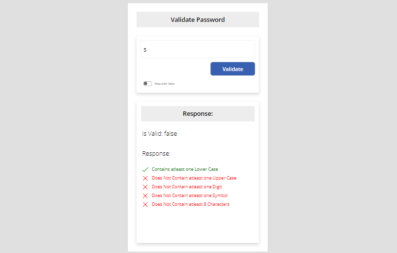

# Advanced Validations UDF

## Summary

Experience the power of advanced validation techniques with our User Defined Function (UDF) component library. Seamlessly integrate these advanced validation functionalities into your canvas apps, enhancing user input validation and ensuring data accuracy.

🔍 Explore a comprehensive set of validation techniques designed to meet diverse validation requirements, from basic email validation to complex custom patterns.

💡 Empower your canvas apps with real-time validation feedback, improving user experience and data integrity.

## Applies to

## Compatibility

## Contributors

* [Shaheer Ahmad](https://github.com/shaheerahmadch)

## Version history

Version|Date|Comments
-------|----|--------
1.0|18 March, 2024|Initial release

## Prerequisites

* Power Apps Environment

## Solution Components

The following solution components are included in this library:

* Advanced Validations (Component Library)

## Minimal Path to Awesome

1. Clone the repository or download the component library files.
2. Import the component library into your Power Apps environment.
3. Access the advanced validation functions within your canvas apps.

## Features

The Advanced Validations UDF component library offers the following features:

* Seamless integration with canvas apps for enhanced validation capabilities.
* User-defined functions for complex validation scenarios, including email validation, custom patterns, and more.
* Real-time feedback mechanisms to improve user experience and data quality.

## Help

For support or inquiries related to this component library, please refer to the [GitHub repository](https://github.com/yourrepository/advanced-validations-udf) or create a new issue.

## Disclaimer

**THIS COMPONENT LIBRARY IS PROVIDED *AS IS* WITHOUT WARRANTY OF ANY KIND, EITHER EXPRESS OR IMPLIED, INCLUDING ANY IMPLIED WARRANTIES OF FITNESS FOR A PARTICULAR PURPOSE, MERCHANTABILITY, OR NON-INFRINGEMENT.**

Feel free to leverage the Advanced Validations UDF component library to enhance your canvas apps with sophisticated validation techniques! 🚀✨
