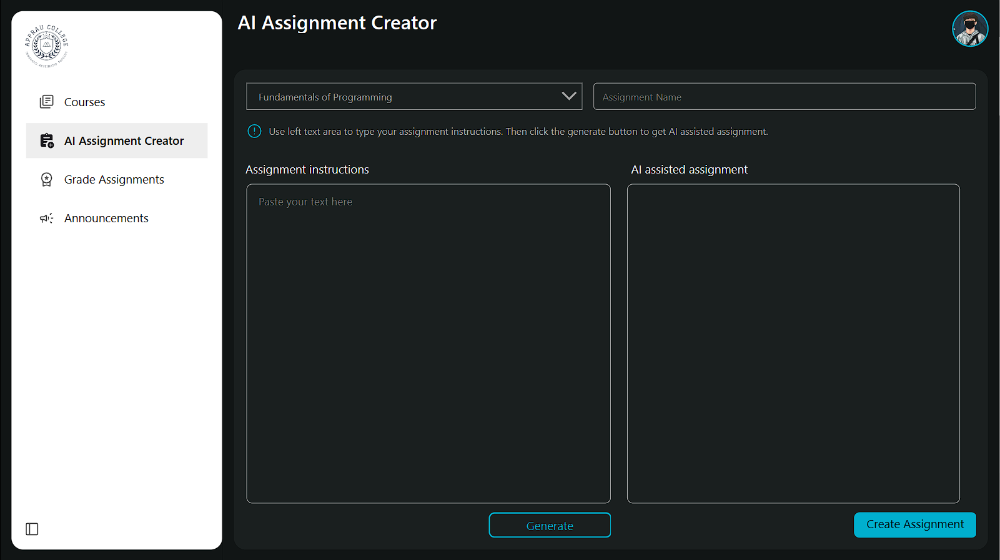
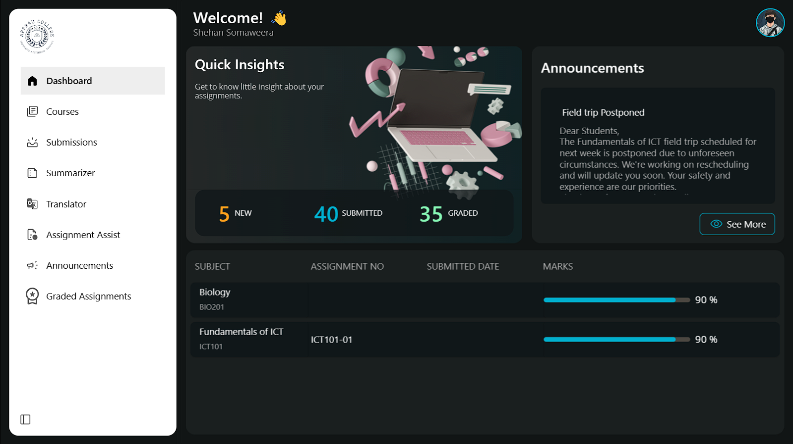
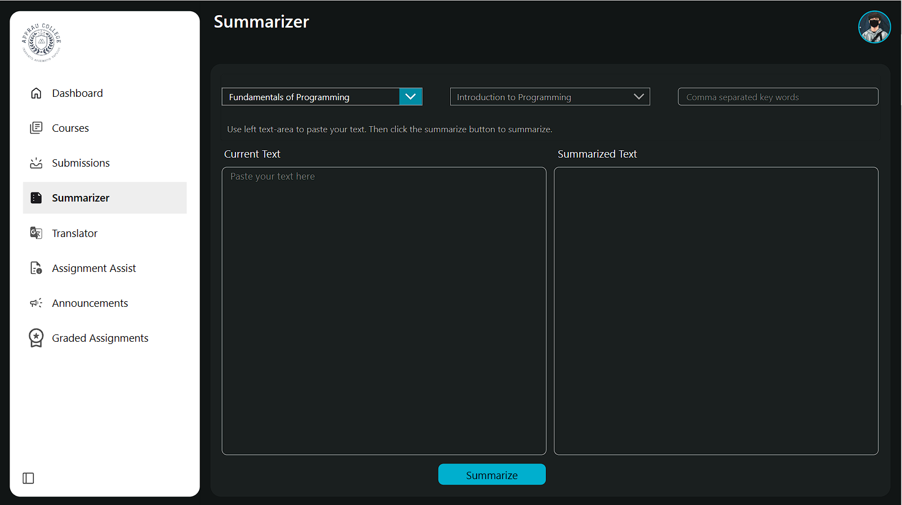
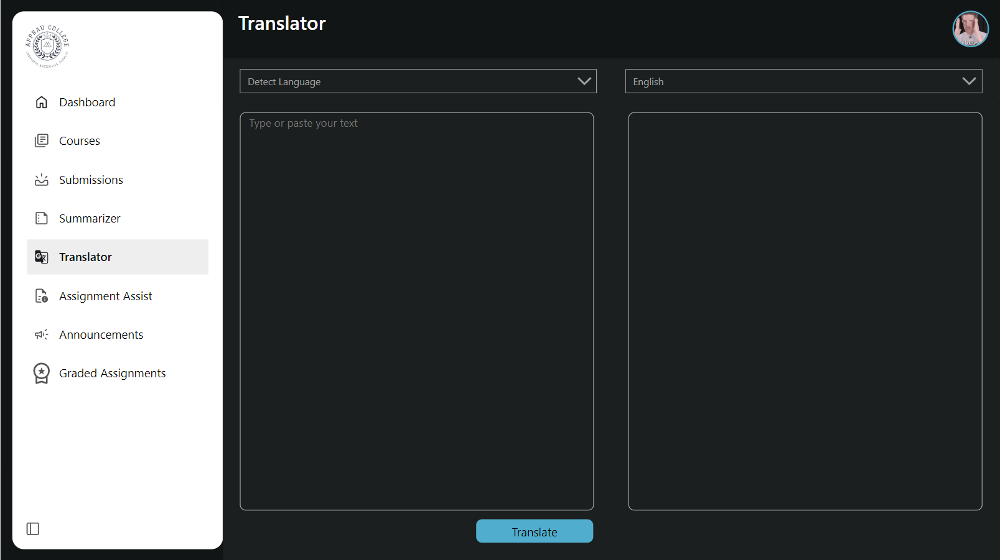
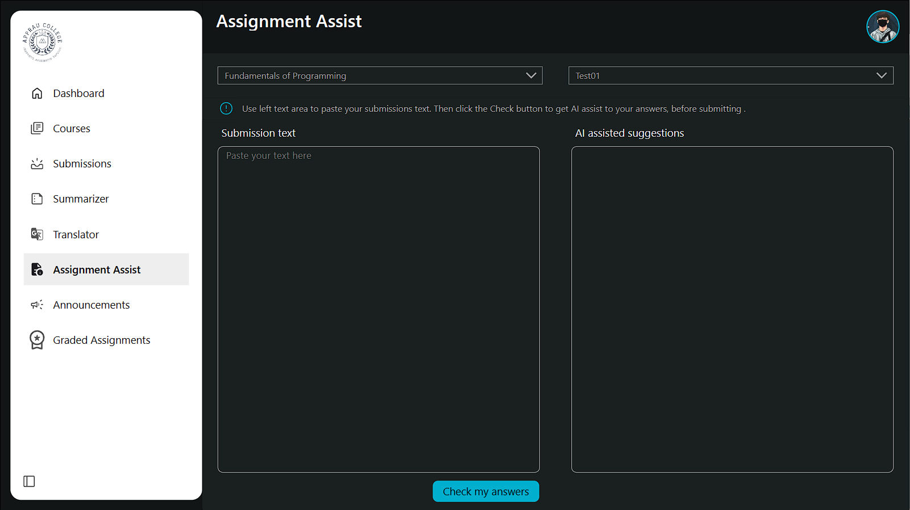

# AI EDUCATION APPS - A Microsoft Power Platform Student Management System


## Summary

Education has never been this efficient and innovative! Introducing the future of education with our AI-infused Microsoft Power Platform Student Management System. 

In this solution, we provide a number of features for educators and students to ease their work with embedded AI solutions and specially designed features.

For students, the 'AI Education' app offers seamless access to courses, announcements, and assignment submissions. Experience AI-powered features like Language Translator, Summarizer and Assignmentsassist, making learning more accessible and efficient.

Teachers can simplify their workload with the 'AI Education Teachers' App,' enabling easy subject management, assignment grading, and even AI-generated assignments.












## Applies to


## Compatibility

<!--
Update the compatibility below.

If a premium license is not required and there are no experimental features used in your solution:


If a premium license is required and there are experimental features used in your solution:


Don't worry if you're unsure about the compatibility matrix above. We'll verify it when we approve the PR. 
-->


## Contributors
<!--
We use this section to recognize and promote your contributions. Please provide one author per line -- even if you worked together on it.

We'll only use the info you provided here. Make sure to include your full name, not just your GitHub username.

Provide a link to your GitHub profile to help others find more cool things you have done. The only link we'll accept is a link to your GitHub profile.

If you want to provide links to your social media, blog, and employer name, make sure to update your GitHub profile.
-->

* [Hiruka Ranasinghe](https://github.com/apprauHiruka)
* [Shehan Somaweera](https://github.com/apprauShehan)
* [Sandaruwan Ranathunge](https://github.com/SandaruwanR)

## Version history

Version|Date|Comments
-------|----|--------
1.1|September 28, 2023|Add Canvas Apps
1.0|September 21, 2023|Initial release

## Prerequisites
None.
<!--
Any special pre-requisites? Include any lists, permissions, offerings to the demo gods, or whatever else needs to be done for this sample to work.

Please describe the steps to configure the pre-requisites. Feel free to add screen shots, but make sure that there is a text description of the steps to perform.
 
-->

## Minimal path to awesome

<!-- 
PRO TIP:

For commands, use the `code syntax`

For button labels, page names, dialog names, etc. as they appear on the screen, use **Bold**

Don't use "click", use "select" or "use"

As tempting as it may be, don't just use images to describe the steps. Let's be as inclusive as possible and think about accessibility.

-->

### Using the solution zip

* [Download](./solution/solution.zip) the `.zip` from the `solution` folder
* Within **Power Apps Studio**, import the solution `.zip` file using **Solutions** > **Import Solution** and select the `.zip` file you just packed.
* Open the app in edit mode and make sure the data source **Data source name** is connected correctly.

### Using the source code

You can also use the [Power Apps CLI](https://docs.microsoft.com/powerapps/developer/data-platform/powerapps-cli) to pack the source code by following these steps:

* Clone the repository to a local drive
* Pack the source files back into a solution `.zip` file:

  ```bash
  pac solution pack --zipfile pathtodestinationfile --folder pathtosourcefolder --processCanvasApps
  ```

  Making sure to replace `pathtosourcefolder` to point to the path to this sample's `sourcecode` folder, and `pathtodestinationfile` to point to the path of this solution's `.zip` file (located under the `solution` folder)
* Within **Power Apps Studio**, import the solution `.zip` file using **Solutions** > **Import Solution** and select the `.zip` file you just packed.

## Features

With two powerful apps, 'AI Education' for students and 'AI Education Teachers' App' for educators, we're transforming the way you learn and teach. From instant language translation and text summarization to intelligent assignment assistance and automated assignment creation, these apps are designed to streamline every aspect of the educational experience. Join us on this exciting journey as we revolutionize education through the power of AI.

This solution gives you the features below with essence of microsoft power platform:

#### "AI Education" App for Students features:

* Course Access : Access your courses with ease, view course materials, and stay organized throughout your educational journey.
* Announcement Center: Stay updated with the latest announcements from your instructors and school administration, keeping you informed about important events and deadlines.
* Effortless Assignment Submission: Submit assignments effortlessly through the app, streamlining the submission process and ensuring you never miss a deadline.
* Language Translator: Break down language barriers with the built-in Language Translator. Translate texts instantly to understand and communicate in multiple languages.
* Summarizer: Simplify complex texts by using the Summarizer feature. It condenses lengthy documents into concise summaries, saving you time and helping you grasp key information more quickly.
* AI Assignment Assist: Ensure the quality of your assignments with the AI Assignment Assist. It checks your work for errors and suggests improvements before you submit, helping you achieve your best possible results.

#### "AI Education Teachers' App" for Educators features:

* Course Material Management: Upload and manage course materials directly through the app. Organize resources efficiently for your students' benefit.
* Announcement Creation: Communicate important updates, announcements, and class information to your students through the Announcement feature, enhancing the teacher-student connection.
* Efficient Assignment Grading: Simplify the grading process with the Assignment Grading feature. Grade assignments with ease and provide timely feedback to your students.
* AI Assignment Creator: Experience a groundbreaking feature that generates assignments tailored to your subject matter. Save time on assignment creation while maintaining the quality and relevance of tasks.

<!--
Note that better pictures and documentation will increase the sample usage and the value you are providing for others. Thanks for your submissions in advance! You rock ❤.
-->

<!--
RESERVED FOR REPO MAINTAINERS

We'll add the video from the community call recording here

## Video

[](https://www.youtube.com/watch?v=XXXXX "YouTube video title")
-->

## Help

<!--
You can just search and replace this page with the following values:

Search for:
YOUR-SOLUTION-NAME

Replace with your sample folder name. E.g.: my-cool-sample

Search for:
@YOURGITHUBUSERNAME

Replace with your GitHub username, prefixed with an "@". If you have more than one author, use %20 to separate them, making sure t0 prefix everyone's username individually with an "@".

Example:
@hugoabernier

Or:
@hugoabernier%20@VesaJuvonen%20@PopWarner
-->

> Note: don't worry about this section, we'll update the links.

We do not support samples, but this community is always willing to help, and we want to improve these samples. We use GitHub to track issues, which makes it easy for  community members to volunteer their time and help resolve issues.

If you encounter any issues while using this sample, you can [create a new issue](https://github.com/pnp/powerapps-samples/issues/new?assignees=&labels=Needs%3A+Triage+%3Amag%3A%2Ctype%3Abug-suspected&template=bug-report.yml&sample=YOURSAMPLENAME&authors=@YOURGITHUBUSERNAME&title=YOURSAMPLENAME%20-%20).

For questions regarding this sample, [create a new question](https://github.com/pnp/powerapps-samples/issues/new?assignees=&labels=Needs%3A+Triage+%3Amag%3A%2Ctype%3Abug-suspected&template=question.yml&sample=YOURSAMPLENAME&authors=@YOURGITHUBUSERNAME&title=YOURSAMPLENAME%20-%20).

Finally, if you have an idea for improvement, [make a suggestion](https://github.com/pnp/powerapps-samples/issues/new?assignees=&labels=Needs%3A+Triage+%3Amag%3A%2Ctype%3Abug-suspected&template=suggestion.yml&sample=YOURSAMPLENAME&authors=@YOURGITHUBUSERNAME&title=YOURSAMPLENAME%20-%20).

## Disclaimer

**THIS CODE IS PROVIDED *AS IS* WITHOUT WARRANTY OF ANY KIND, EITHER EXPRESS OR IMPLIED, INCLUDING ANY IMPLIED WARRANTIES OF FITNESS FOR A PARTICULAR PURPOSE, MERCHANTABILITY, OR NON-INFRINGEMENT.**


