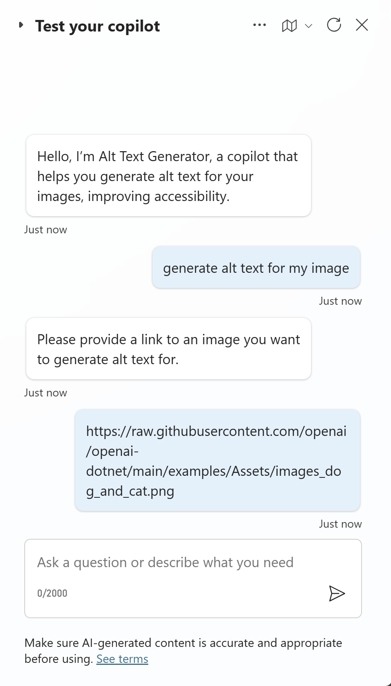
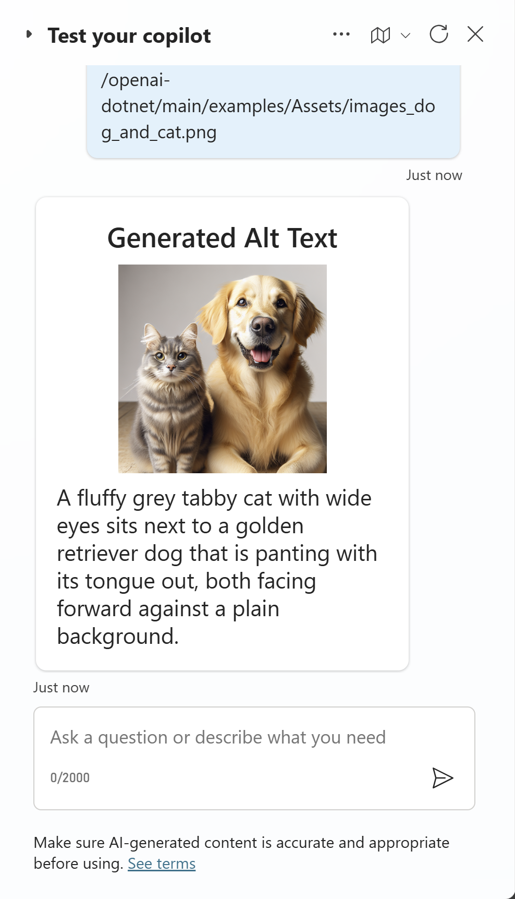
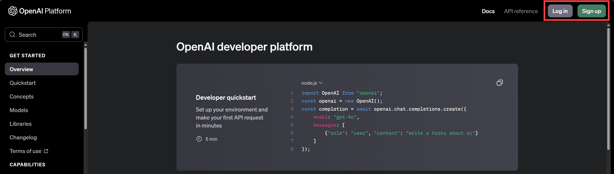
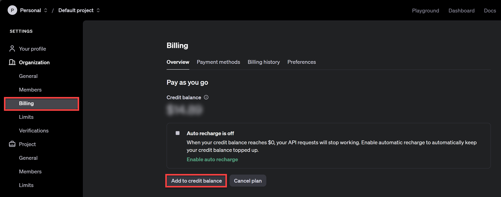
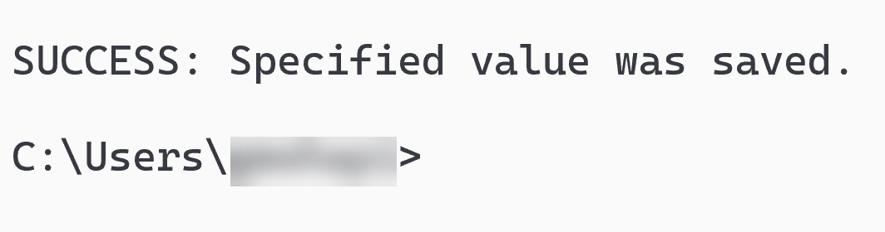
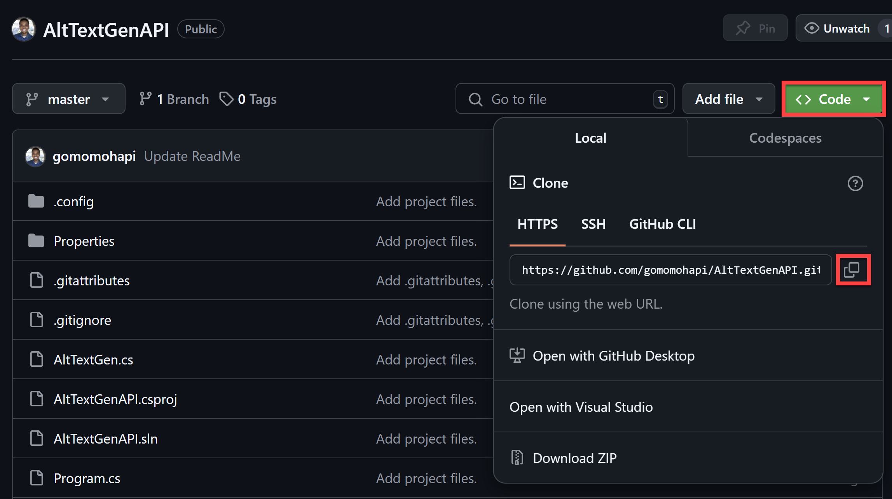
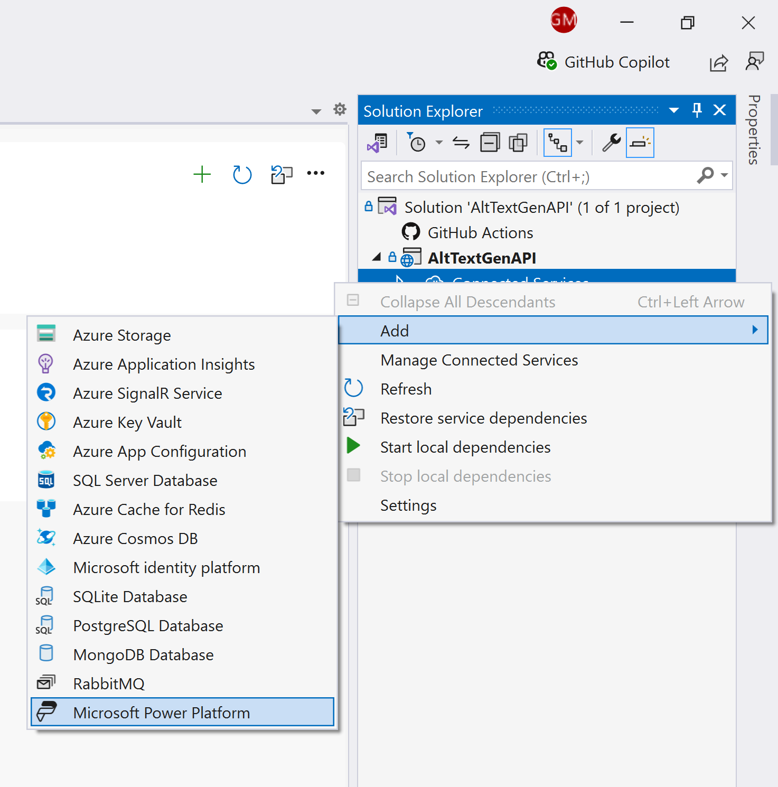
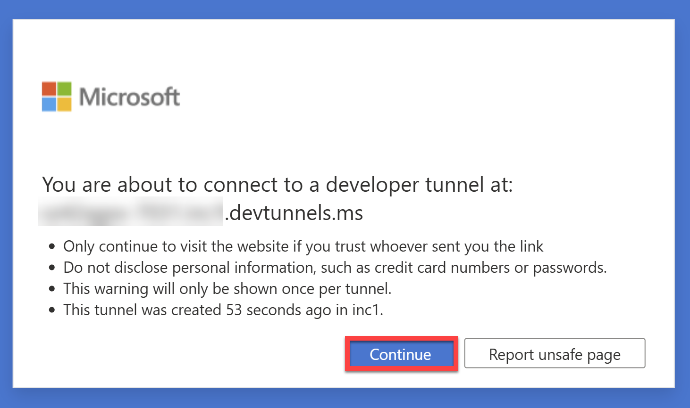
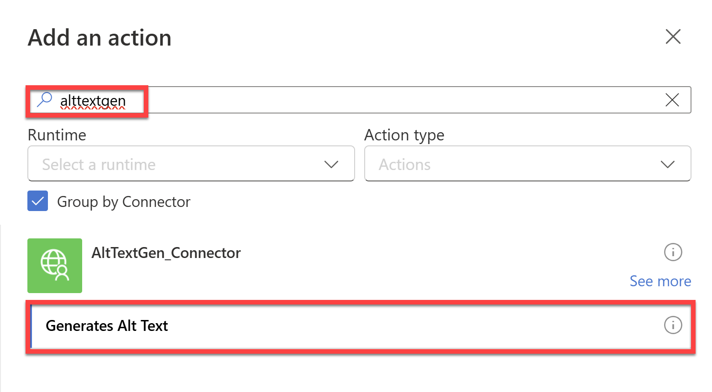
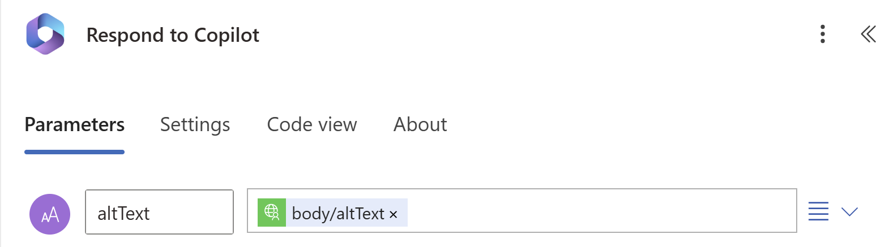

# Alt Text Generator

## Summary

This sample allows the user to enter a link to a .png image into a copilot and then it generates alt text for the image using OpenAI's gpt-4o model. This alt text can be used to describe the image for accessibility purposes.

Sample consists of a Power Automate flow and a Copilot Studio copilot.

🗣️ Start a simple conversation with the copilot by asking it to generate alt text for you.



🤖 Once you enter the image URL, the copilot will generate appropriate alt text for that image displaying both the image and the alt text in an adaptive card.



## Applies to


## Compatibility


## Contributors

* [Gomolemo Mohapi](https://github.com/gomomohapi)

## Version history

Version|Date|Comments
-------|----|--------
1.0|September 11, 2024|Initial release

## Prerequisites

* Make sure you have access to Power Apps, Power Automate, and Copilot Studio.

* Create an [OpenAI](https://platform.openai.com/) account by selecting **Sign Up** in the top right corner. Or **Log In** if you already have an account.

    

* Once logged in, navigate to **Settings** by selecting the gear icon in the top right corner.

* On the left-hand side, select **Billing** and then **Add to credit balance**.

    

* Follow the prompts to add funds to your account. The minimum amount of $5 is more than enough to get started.

* Once done, navigate to **Your profile** on the top left corner and select **User API keys**.

* Select **+ Create new secret key** and optionally give it a name. Make sure it has **All** permissions and then select **Create secret key**.

* Once the key has been generated, copy it and store it in a safe place. You will need it in the next step.

* Set up a local environment variables to store the OpenAI API key. Open up a command prompt on your computer and run this command:

    ```bash
    setx OPENAI_API_KEY "REPLACE_WITH_YOUR_KEY_VALUE_HERE"
    ```

    Replace `REPLACE_WITH_YOUR_KEY_VALUE` with the key you copied earlier.

* You should then see a message that says **SUCCESS: Specified value was saved.**

     

* To use this sample, you will create your own Custom Connector using the [Visual Studio Connected Service for the Power Platform](https://learn.microsoft.com/en-us/power-platform/developer/visual-studio-connected-service). For this; download and install [Visual Studio (Community Edition)](https://visualstudio.microsoft.com/vs/features/net-development/)

    

    This installer comes pre-packaged with all the components you need for .NET development.

* Finally, clone the [AltTextGenAPI Sample Project](https://github.com/gomomohapi/AltTextGenAPI) to your local machine and open Visual Studio. 
    * Once you follow the link to the project, select **Code** and then copy the git URL.

    

    * Open Visual Studio and select **Clone a repository**.

    

    * Then paste in the link you copied from GitHub and select **Clone**.

    * The project will be cloned and then opened in Visual Studio.

## Minimal Path to Awesome

### Using the solution zip

**Step 1: Import the solution into your Power Apps environment**

* [Download](./solution/alt-text-generator.zip) the `.zip` from the solution folder.
* Within the [Power Apps Studio](https://make.powerapps.com/), import the solution `.zip` file using **Solutions** > **Import Solution** and select the `.zip` file you just downloaded.
* Once the solution has been imported, leave the Solutions tab open and then open Visual Studio with the cloned AltTextGenAPI project.

**Step 2: Create a Custom Connector using Visual Studio Connected Service for the Power Platform**

* In Visual Studio, open the solution explorer and right-click on **Connected Services** and select **Add** > **Microsoft Power Platform**.

    

* Ensure you're signed in with the same Power Apps account you used to import the solution, and configure the following:
    * **Power Platform environments**: Select the environment where you imported the solution
    * **Solution**: Select the **Accessibility Applications** solution
    * **Custom Connector**: Create a new custom connector and call it `AltTextGen_Connector`
    * **OpenAPI specification**: Select the `Auto-generate the OpenAPI V2 Specification` option
    * **Dev Tunnel**: Create a new dev tunnel and call it `AltTextGen_Tunnel`
* Select **Finish** and the custom connector will be created.
* Once complete, run the project in Visual Studio.
* In the newly opened browser window, select **Continue** to connect to your Developer Tunnel.

    

* Once connected, the custom connector will be active and available to use in your Power Apps environment. Don't close the browser window and navigate back to the **Solutions** tab in Power Apps Studio.

**Step 3: Add the Custom Connector to the Power Automate flow**

* Open the **Accessibility Applications** solution and navigate to **Cloud Flows** > **Generate Image with AI**.
* Open the flow in **Edit mode**.
* Between the two nodes, add a new action and search for `alttextgen` and select **Generates Alt Text**.

    

* Create a connection to the `AltTextGen_Connector`.
* Once the connection has been created, select the **ImageUrl** field and then select the **Dynamic Content** icon and select **ImageUrl** from the list of dynamic content.
* Then select the **Respond to Copilot** node and select **body/altText** from the Dynamic Content list for **altText**

    

* Publish the flow.

### Using the source code

You can also use the [Power Apps CLI](https://docs.microsoft.com/powerapps/developer/data-platform/powerapps-cli) to pack the source code by following these steps:

* Clone the repository to a local drive
* Pack the source files back into a solution `.zip` file:

  ```bash
  pac solution pack --zipfile pathtodestinationfile --folder pathtosourcefolder --processCanvasApps
  ```

  Making sure to replace `pathtosourcefolder` to point to the path to this sample's `sourcecode` folder, and `pathtodestinationfile` to point to the path of this solution's `.zip` file (located under the `solution` folder)
* Within **Power Apps Studio**, import the solution `.zip` file using **Solutions** > **Import Solution** and select the `.zip` file you just packed.

* Once completed, follow along from **Step 2** above.

## Features

This solution illustrates the following concepts on top of the Power Platform. With the OpenAI, .NET, and the Power Platform, this solution demonstrates an easy way to generate alt text for images with AI through a copilot - improving accessibility for the web.

In the copilot, you can start a conversation by asking it how to generate alt text:

* The copilot will then trigger a topic that prompts you to enter a link to the image that you want to generate alt text for.
* Once you enter the image URL, the copilot will call a Power Automate flow that connects to a Custom Connector.
* This Custom Connector is connected to a .NET API that uses OpenAI's gpt-4o model to generate alt text for the image.
* The image along with the generated alt text is then returned to the copilot and displayed in the chat as an adaptive card.

## Help

We do not support samples, but this community is always willing to help, and we want to improve these samples. We use GitHub to track issues, which makes it easy for  community members to volunteer their time and help resolve issues.

If you encounter any issues while using this sample, you can [create a new issue](https://github.com/pnp/powerapps-samples/issues/new?assignees=&labels=Needs%3A+Triage+%3Amag%3A%2Ctype%3Abug-suspected&template=bug-report.yml&sample=alt-text-generator&authors=@gomomohapi&title=alt-text-generator%20-%20).

For questions regarding this sample, [create a new question](https://github.com/pnp/powerapps-samples/issues/new?assignees=&labels=Needs%3A+Triage+%3Amag%3A%2Ctype%3Abug-suspected&template=question.yml&sample=alt-text-generator&authors=@gomomohapi&title=alt-text-generator%20-%20).

Finally, if you have an idea for improvement, [make a suggestion](https://github.com/pnp/powerapps-samples/issues/new?assignees=&labels=Needs%3A+Triage+%3Amag%3A%2Ctype%3Abug-suspected&template=suggestion.yml&sample=alt-text-generator&authors=@gomomohapi&title=alt-text-generator%20-%20).

## Disclaimer

**THIS CODE IS PROVIDED *AS IS* WITHOUT WARRANTY OF ANY KIND, EITHER EXPRESS OR IMPLIED, INCLUDING ANY IMPLIED WARRANTIES OF FITNESS FOR A PARTICULAR PURPOSE, MERCHANTABILITY, OR NON-INFRINGEMENT.**


