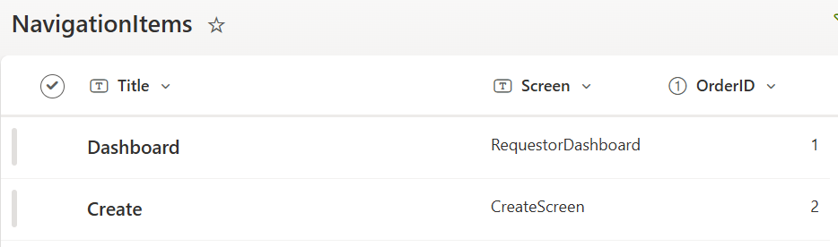

# Title of the sample
Power App template with reusable header, footer & left navigation

## Summary

This tablet-based canvas app helps to kickstart the development in Power Apps using reusable header, footer and left navigation components.

## Applies to

## Compatibility

## Contributors

* [Author Name](https://github.com/vipulj03/)

## Version history

Version|Date|Comments
-------|----|--------
1.0|Feburary 23, 2025|Initial release

## Prerequisites
* This app uses Office365.Users connection (data source).
* This app uses SharePoint as a data source and requires a SharePoint List with the following fields:
List Name: NavigationItems
List Fields:
1. Title (Single line of text)
2. Screen (Single line of text) => E.g. - Dashboard, Create
3. OrderID (Number)

## Features

This sample illustrates the following concepts:
* Creating reusable components in Power Apps
* Creating a base/template app which helps in faster development

### Using the solution zip

* [Download](./solution/AppTemplate.zip) the `.zip` from the `solution` folder
* Within **Power Apps Studio**, import the solution `.zip` file using **Solutions** > **Import Solution** and select the `.zip` file you just packed.
* Open the app in edit mode and make sure the data source **Data source name** is connected correctly.

