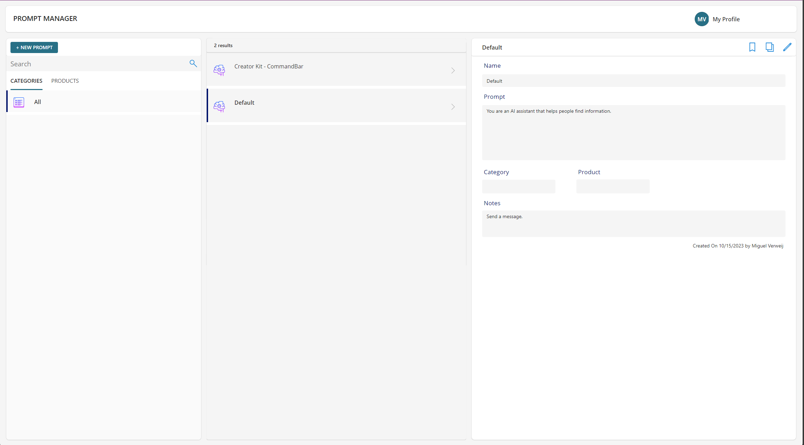

# Azure OpenAI Service Chat

## Summary

This solution combines the interface of ChatGPT, The [Azure OpenAI service custom connector](https://github.com/microsoft/PowerPlatformConnectors/tree/dev/custom-connectors/AzureOpenAIService) to process the prompt, and the [Prompt Library](https://adoption.microsoft.com/en-us/sample-solution-gallery/sample/pnp-powerplatform-samples-prompt-library/) solution where prompts can be saved. This way the data stays within the organization, super users can save good working prompts, and all other employees can use these valuable prompts directly from within the app.

<!-- 
ER MOET NOG EEN SCREENSHOT GEMAAKT WORDEN VAN DE APP IN GEBRUIK, LIEFST 1920x1080. KON NOG NIET DOOR DLP ISSUE. ER KUNNEN ER MEERDERE TOEGEVOEGD WORDEN.


-->

## Applies to


## Compatibility


## Contributors

* [Miguel Verweij](https://github.com/miguelverweij)

## Version history

| Version | Date             | Comments        |
| ------- | ---------------- | --------------- |
| 1.0     | October 15, 2023 | Initial release |

## Prerequisites

Below you can find a summary of the steps that are required to make this solution work. For a full step-by-step guide you can check out [Challenge 019](https://www.powerplatformchallenge.com/post/challenge-019) of the **Power Platform Challenge**.

1. Deploy Azure OpenAI Service to a resource group
2. Deploy the gpt-35-turbo model
3. Create the AzureOpenAIService custom connector and [setup the connection](https://github.com/microsoft/PowerPlatformConnectors/tree/dev/custom-connectors/).
   > The Custom Connector can easily be installed by selecting Import from GitHub when creating a new custom connector.
4. Install [Creator Kit](https://learn.microsoft.com/en-us/power-platform/guidance/creator-kit/setup)
5. Install the [Prompt Library]() solution

## Minimal path to awesome



1. Add a Default prompt to the Prompt Manager app (see image above). This prompt will act just like ChatGPT will, which makes it a good default option. It is good to know that the Notes field will be shown as hint text in the Azure OpenAI Sercive Chat app.
2. Add more custom prompts. You can find some very helpful prompts browsing the [Power Platform Prompt Library](https://pnp.github.io/powerplatform-prompts/?filters=azure%20open%20ai).
3. Open the Azure OpenAI Sercive Chat app and create a new chat. In the top-right corner you can see a bot icon. all the available prompts will be listed when clicking on that icon. Select the prompt that you want to use. You can only do this at the start of the conversation.

<!-- 
UPDATE DE SOLUTION PATH
-->

### Using the solution zip

* [Download](./solution/solution.zip) the `.zip` from the `solution` folder
* Within **Power Apps Studio**, import the solution `.zip` file using **Solutions** > **Import Solution** and select the `.zip` file you just packed.
* Open the app in edit mode and make sure the data source **Data source name** is connected correctly.

### Using the source code

You can also use the [Power Apps CLI](https://docs.microsoft.com/powerapps/developer/data-platform/powerapps-cli) to pack the source code by following these steps:

* Clone the repository to a local drive
* Pack the source files back into a solution `.zip` file:

  ```bash
  pac solution pack --zipfile pathtodestinationfile --folder pathtosourcefolder --processCanvasApps
  ```

  Making sure to replace `pathtosourcefolder` to point to the path to this sample's `sourcecode` folder, and `pathtodestinationfile` to point to the path of this solution's `.zip` file (located under the `solution` folder)
* Within **Power Apps Studio**, import the solution `.zip` file using **Solutions** > **Import Solution** and select the `.zip` file you just packed.

## Features

* Enterprise safe ChatGPT
* Quickly use saved prompts
* consumption-based licensing

<!--
RESERVED FOR REPO MAINTAINERS

We'll add the video from the community call recording here

## Video

[](https://www.youtube.com/watch?v=XXXXX "YouTube video title")
-->

## Help

<!--
You can just search and replace this page with the following values:

Search for:
YOUR-SOLUTION-NAME

Replace with your sample folder name. E.g.: my-cool-sample

Search for:
@YOURGITHUBUSERNAME

Replace with your GitHub username, prefixed with an "@". If you have more than one author, use %20 to separate them, making sure to prefix everyone's username individually with an "@".

Example:
@hugoabernier

Or:
@hugoabernier%20@VesaJuvonen%20@PopWarner
-->

> Note: don't worry about this section, we'll update the links.

We do not support samples, but this community is always willing to help, and we want to improve these samples. We use GitHub to track issues, which makes it easy for  community members to volunteer their time and help resolve issues.

If you encounter any issues while using this sample, you can [create a new issue](https://github.com/pnp/powerapps-samples/issues/new?assignees=&labels=Needs%3A+Triage+%3Amag%3A%2Ctype%3Abug-suspected&template=bug-report.yml&sample=YOURSAMPLENAME&authors=@YOURGITHUBUSERNAME&title=YOURSAMPLENAME%20-%20).

For questions regarding this sample, [create a new question](https://github.com/pnp/powerapps-samples/issues/new?assignees=&labels=Needs%3A+Triage+%3Amag%3A%2Ctype%3Abug-suspected&template=question.yml&sample=YOURSAMPLENAME&authors=@YOURGITHUBUSERNAME&title=YOURSAMPLENAME%20-%20).

Finally, if you have an idea for improvement, [make a suggestion](https://github.com/pnp/powerapps-samples/issues/new?assignees=&labels=Needs%3A+Triage+%3Amag%3A%2Ctype%3Abug-suspected&template=suggestion.yml&sample=YOURSAMPLENAME&authors=@YOURGITHUBUSERNAME&title=YOURSAMPLENAME%20-%20).

## Disclaimer

**THIS CODE IS PROVIDED *AS IS* WITHOUT WARRANTY OF ANY KIND, EITHER EXPRESS OR IMPLIED, INCLUDING ANY IMPLIED WARRANTIES OF FITNESS FOR A PARTICULAR PURPOSE, MERCHANTABILITY, OR NON-INFRINGEMENT.**


