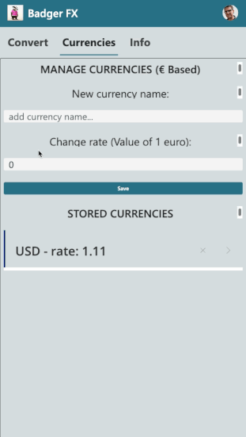

# Badger FX

## Summary

This sample app allows you to convert the value of any currency (to be added within the app) and convert an amount, from the selected currency to euros. It was created for the purpose of experimenting with modern controls and managing the data in the phone's local cache (Where the currencies entered are saved), and also because I need it for my next trip :-)



## Applies to


## Compatibility


## Contributors

* [Angelo Gulisano](https://github.com/angelogulisano)

## Version history

Version|Date|Comments
-------|----|--------
1.0|January 1, 2024|Initial release

## Prerequisites

Modern theme enabled

## Solution Components

The following solution components are used in this sample:

* BadgerFX-App (Canvas app)


## Minimal Path to Awesome

1. [Download](./solution/bodgerfx.zip) the solution `.zip` from the `solution` folder.
2. Within **https://make.powerapps.com**, import the `.zip` file via **Solutions** > **Import solution** > **Browse** and select the `.zip` file you just downloaded.
3. Follow the on-screen instructions to deploy the application.
4. Access the Incident Reporting Canvas App and start reporting incidents.

## Using the Source Code

You can also use the [Power Apps CLI](https://aka.ms/pac/docs) to pack the source code by following these steps:

1. Clone the repository to a local drive.
2. Pack the source files back into `.zip` file:
   ```bash
   pac solution pack --folder pathtosourcefolder --zipfile pathtosolution  --processCanvasApps
   ```

## Features

This sample illustrates the following concepts:

* Use modern controls
* Save and load data locally on mobile device

## Help

We do not support samples, but this community is always willing to help, and we want to improve these samples. We use GitHub to track issues, which makes it easy for  community members to volunteer their time and help resolve issues.

If you encounter any issues while using this sample, you can [create a new issue](https://github.com/pnp/powerapps-samples/issues/new?assignees=&labels=Needs%3A+Triage+%3Amag%3A%2Ctype%3Abug-suspected&template=bug-report.yml&sample=badgerfx&authors=@angelogulisano&title=badgerfx%20-%20).

For questions regarding this sample, [create a new question](https://github.com/pnp/powerapps-samples/issues/new?assignees=&labels=Needs%3A+Triage+%3Amag%3A%2Ctype%3Abug-suspected&template=question.yml&sample=badgerfx&authors=@angelogulisano&title=badgerfx%20-%20).

Finally, if you have an idea for improvement, [make a suggestion](https://github.com/pnp/powerapps-samples/issues/new?assignees=&labels=Needs%3A+Triage+%3Amag%3A%2Ctype%3Abug-suspected&template=suggestion.yml&sample=badgerfx&authors=@angelogulisano&title=badgerfx%20-%20).

## Disclaimer

**THIS CODE IS PROVIDED *AS IS* WITHOUT WARRANTY OF ANY KIND, EITHER EXPRESS OR IMPLIED, INCLUDING ANY IMPLIED WARRANTIES OF FITNESS FOR A PARTICULAR PURPOSE, MERCHANTABILITY, OR NON-INFRINGEMENT.**

## For more information

* [Overview of creating apps in Power Apps](https://docs.microsoft.com/powerapps/maker/)
* [Power Apps canvas apps documentation](https://docs.microsoft.com/powerapps/maker/canvas-apps/)
* [Read my blog or contact me - https://angelogulisano.com](https://angelogulisano.com/)

