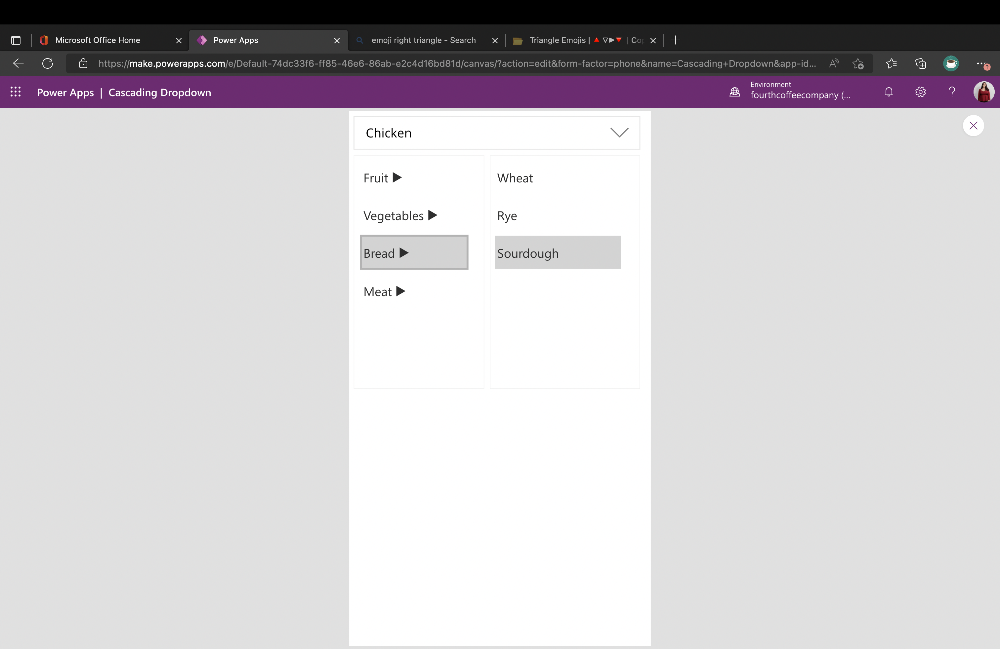

# Cascading Dropdown Component

## Summary

This is a Power Apps Canvas component that demonstrates how to implement a custom cascading dropdown control. This control handles a two-level cascading dropdown and can even be customized to handle a single selection or multiple selection of items. 

  

## Features

This sample app is a great way to learn some fundamental Power Apps concepts like:

* How to build a component and use component input and output properties
* How to show/hide elements
* How to leverage collections and split out collection items into a string

## Applies to


## Compatibility


## Contributors
* [April Dunnam](https://github.com/aprildunnam) ([@aprildunnam](https://www.twitter.com/aprildunnam) )

## Version history

Version|Date|Comments
-------|----|--------
1.0|Oct 29, 2022|Initial release
2.0|July 15, 2025|Migration from powerapps-samples repository with solution repacking by [Jan Chlebek](https://github.com/jan-chlebek)

## Minimal path to awesome

### Using the solution zip

* [Download](./solution/cascading-dropdown-component.zip) the `.zip` from the `solution` folder
* Within **Power Apps Studio**, import the solution `.zip` file using **Solutions** > **Import Solution** and select the `.zip` file you just packed.
* Open the app in edit mode and make sure the data source **Data source name** is connected correctly.

### Using the source code

You can also use the [Power Apps CLI](https://docs.microsoft.com/powerapps/developer/data-platform/powerapps-cli) to pack the source code by following these steps:

* Clone the repository to a local drive
* Pack the source files back into a solution `.zip` file:

  ```bash
  pac solution pack --zipfile pathtodestinationfile --folder pathtosourcefolder --processCanvasApps
  ```

  Making sure to replace `pathtosourcefolder` to point to the path to this sample's `sourcecode` folder, and `pathtodestinationfile` to point to the path of this solution's `.zip` file (located under the `solution` folder)
* Within **Power Apps Studio**, import the solution `.zip` file using **Solutions** > **Import Solution** and select the `.zip` file you just packed.


## Prerequisites

### Using the component

To use the component in this sample, you'll need to either hard code in the items you want to display in the 1st level and 2nd level menus or pull them in from your data source. The cascading effect is dependent on having a property in your 1st level items called "Name" and a property inyour 2nd level items called "ParentItem" which can be matched back to the name field of the 1st level items.  Look at the default 1stLevelItems and 2ndLevelItems properties to see the format that the component is expecting.

## Data Sources
 
None


## Help

We do not support samples, but this community is always willing to help, and we want to improve these samples. We use GitHub to track issues, which makes it easy for  community members to volunteer their time and help resolve issues.

If you encounter any issues while using this sample, you can [create a new issue](https://github.com/pnp/powerapps-samples/issues/new?assignees=&labels=Needs%3A+Triage+%3Amag%3A%2Ctype%3Abug-suspected&template=bug-report.yml&sample=cascading-dropdown-component&authors=@aprildunnam&title=cascading-dropdown-component%20-%20).

For questions regarding this sample, [create a new question](https://github.com/pnp/powerapps-samples/issues/new?assignees=&labels=Needs%3A+Triage+%3Amag%3A%2Ctype%3Abug-suspected&template=question.yml&sample=cascading-dropdown-component&authors=@aprildunnam&title=cascading-dropdown-component%20-%20).

Finally, if you have an idea for improvement, [make a suggestion](https://github.com/pnp/powerapps-samples/issues/new?assignees=&labels=Needs%3A+Triage+%3Amag%3A%2Ctype%3Abug-suspected&template=suggestion.yml&sample=cascading-dropdown-component&authors=@aprildunnam&title=cascading-dropdown-component%20-%20).

## Disclaimer

**THIS CODE IS PROVIDED *AS IS* WITHOUT WARRANTY OF ANY KIND, EITHER EXPRESS OR IMPLIED, INCLUDING ANY IMPLIED WARRANTIES OF FITNESS FOR A PARTICULAR PURPOSE, MERCHANTABILITY, OR NON-INFRINGEMENT.**


