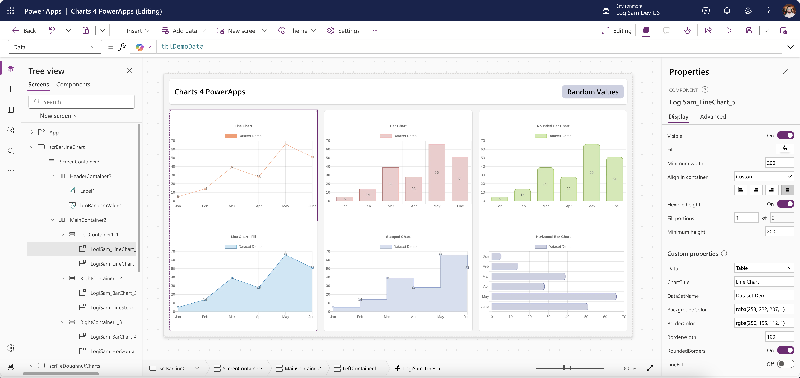
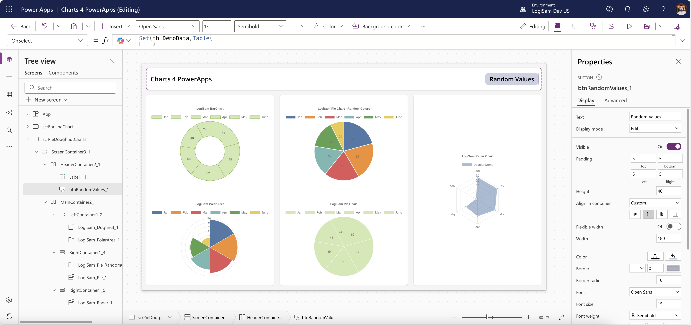

# Charts 4 PowerApps

## Summary

Chart4PowerApps is a versatile demo app offering a collection of ready-to-use chart components, enabling you to create professional, data-driven visuals effortlessly—without complex development.





### **Key Benefits:**

✔  **Diverse Chart Options**  – Bar, Line, Pie, Donut, Column, and more  
✔  **Fully Customizable**  – Easily modify colors, labels, and layouts  
✔  **Real-Time Data Support**  – Connect live data for dynamic updates  
✔  **Seamless Power Apps Integration**  – Optimized for Canvas Apps  
✔  **No-Code/Low-Code Friendly**  – Set up quickly without advanced coding

Enhance your Power Apps with intuitive, engaging charts in just a few clicks!

## Applies to
  


## Compatibility


## Contributors

- [Samir Daoudi](https://github.com/Samir-Daoudi)

## Version history

Version|Date|Comments
-------|----|--------
1.0|March 2, 2025|Initial release

## Data Sources

Static table with body part title

## Minimal Path to Awesome

### Using the solution zip

* [Download](./solution/charts-4-powerapps.zip) the `.zip` from the `solution` folder
* Within **Power Apps Studio**, import the solution `.zip` file using **Solutions** > **Import Solution** and select the `.zip` file you just packed.
* Open the app in edit mode and make sure the data source **Data source name** is connected correctly.

### Using the source code

You can also use the [Power Apps CLI](https://docs.microsoft.com/powerapps/developer/data-platform/powerapps-cli) to pack the source code by following these steps:

* Clone the repository to a local drive
* Pack the source files back into a solution `.zip` file:

  ```bash
  pac solution pack --zipfile pathtodestinationfile --folder pathtosourcefolder --processCanvasApps
  ```

  Making sure to replace `pathtosourcefolder` to point to the path to this sample's `sourcecode` folder, and `pathtodestinationfile` to point to the path of this solution's `.zip` file (located under the `solution` folder)
* Within **Power Apps Studio**, import the solution `.zip` file using **Solutions** > **Import Solution** and select the `.zip` file you just packed.

## Help

We do not support samples, but this community is always willing to help, and we want to improve these samples. We use GitHub to track issues, which makes it easy for  community members to volunteer their time and help resolve issues.

If you encounter any issues while using this sample, you can [create a new issue](https://github.com/pnp/powerapps-samples/issues/new?assignees=&labels=Needs%3A+Triage+%3Amag%3A%2Ctype%3Abug-suspected&template=bug-report.yml&sample=charts-4-powerapps&authors=@Samir-Daoudi&title=charts-4-powerapps%20-%20).

For questions regarding this sample, [create a new question](https://github.com/pnp/powerapps-samples/issues/new?assignees=&labels=Needs%3A+Triage+%3Amag%3A%2Ctype%3Abug-suspected&template=question.yml&sample=charts-4-powerapps&authors=@Samir-Daoudi&title=charts-4-powerapps%20-%20).

Finally, if you have an idea for improvement, [make a suggestion](https://github.com/pnp/powerapps-samples/issues/new?assignees=&labels=Needs%3A+Triage+%3Amag%3A%2Ctype%3Abug-suspected&template=suggestion.yml&sample=charts-4-powerapps&authors=@Samir-Daoudi&title=charts-4-powerapps%20-%20).

## Disclaimer

**THIS CODE IS PROVIDED *AS IS* WITHOUT WARRANTY OF ANY KIND, EITHER EXPRESS OR IMPLIED, INCLUDING ANY IMPLIED WARRANTIES OF FITNESS FOR A PARTICULAR PURPOSE, MERCHANTABILITY, OR NON-INFRINGEMENT.**


