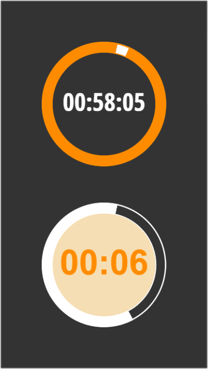

# Circular Timer Component

## Summary

A control that performs a countdown  and triggers a specific action after a certain amount of time passes.




## Applies to


## Compatibility


## Contributors

* [Olga Staszek-Kornet](https://github.com/OlgaStaszekKornet)

## Version history

Version|Date|Comments
-------|----|--------
1.0|January 06, 2024|Initial release

<!--## Prerequisites

Any special pre-requisites? Include any lists, permissions, offerings to the demo gods, or whatever else needs to be done for this sample to work.

Please describe the steps to configure the pre-requisites. Feel free to add screen shots, but make sure that there is a text description of the steps to perform.
 
-->

## Minimal path to awesome

### Using the solution zip

* [Download](./solution/circular-timer-component.zip) the `.zip` from the `solution` folder
* Within **Power Apps Studio**, import the solution `.zip` file using **Solutions** > **Import Solution** and select the `.zip` file you just downloaded.

### Using the source code

You can also use the [Power Apps CLI](https://docs.microsoft.com/powerapps/developer/data-platform/powerapps-cli) to pack the source code by following these steps:

* Clone the repository to a local drive
* Pack the source files back into a solution `.zip` file:

  ```bash
  pac solution pack --zipfile pathtodestinationfile --folder pathtosourcefolder --processCanvasApps
  ```

  Making sure to replace `pathtosourcefolder` to point to the path to this sample's `sourcecode` folder, and `pathtodestinationfile` to point to the path of this solution's `.zip` file (located under the `solution` folder)
* Within **Power Apps Studio**, import the solution `.zip` file using **Solutions** > **Import Solution** and select the `.zip` file you just packed.

## Features

This sample features a component library with a customizable clock-like timer component. The timer control counts down a specified duration and displays the elapsed and remaining time in the form of a linear or sector gauge.

The component properties cover the standard properties of the Power Apps Timer control allowing for determining the logic of the time counter:

* AutoPause – Whether the timer control automatically pauses if the user navigates to a different screen
* AutoStart – Whether the timer control automatically starts to play when the user navigates to the screen that contains that control
* DisplayMode – Whether the control allows user input (Edit), only displays data (View), or is disabled (Disabled)
* Duration – How long a timer runs in milliseconds. The maximum is 24 hours expressed in milliseconds. Default is 60 seconds
* OnSelect – Actions to perform when the user taps or clicks a control
* OnTimerStart – Actions to perform when a timer starts to run
* OnTimerEnd – Actions to perform when a timer finishes running
* Repeat – Whether a timer automatically restarts when it finishes running
* Reset – Whether a control reverts to its default value
* Start – Whether the timer starts

The other properties allow for steering the visual aspect of the control:

* Font - The name of the family of fonts in which text appears
* Color - The color of text in a control
* Hover Color - The color of the text in a control when the user keeps the mouse pointer on it
* Circle Fill - A colour of the remaining time gauge
* Null Circle Fill - A colour of the past time gauge
* Inner Fill - A colour of the inner circle
* Inner Circle Visibility - Steers the visibility of the inner circle to switch between the linear or sector gauge mode

<!--
RESERVED FOR REPO MAINTAINERS

We'll add the video from the community call recording here

## Video

[](https://www.youtube.com/watch?v=XXXXX "YouTube video title")
-->

## Help

We do not support samples, but this community is always willing to help, and we want to improve these samples. We use GitHub to track issues, which makes it easy for  community members to volunteer their time and help resolve issues.

If you encounter any issues while using this sample, you can [create a new issue](https://github.com/pnp/powerapps-samples/issues/new?assignees=&labels=Needs%3A+Triage+%3Amag%3A%2Ctype%3Abug-suspected&template=bug-report.yml&sample=circular-timer-component&authors=@OlgaStaszekKornet&title=circular-timer-component%20-%20).

For questions regarding this sample, [create a new question](https://github.com/pnp/powerapps-samples/issues/new?assignees=&labels=Needs%3A+Triage+%3Amag%3A%2Ctype%3Abug-suspected&template=question.yml&sample=circular-timer-component&authors=@OlgaStaszekKornet&title=circular-timer-component%20-%20).

Finally, if you have an idea for improvement, [make a suggestion](https://github.com/pnp/powerapps-samples/issues/new?assignees=&labels=Needs%3A+Triage+%3Amag%3A%2Ctype%3Abug-suspected&template=suggestion.yml&sample=circular-timer-component&authors=@OlgaStaszekKornet&title=circular-timer-component%20-%20).

## Disclaimer

**THIS CODE IS PROVIDED *AS IS* WITHOUT WARRANTY OF ANY KIND, EITHER EXPRESS OR IMPLIED, INCLUDING ANY IMPLIED WARRANTIES OF FITNESS FOR A PARTICULAR PURPOSE, MERCHANTABILITY, OR NON-INFRINGEMENT.**

