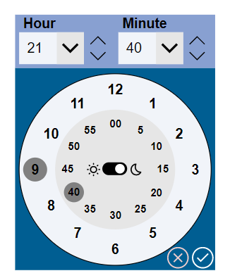

# Clock Time Picker Component

## Summary

A re-usable component that allows you to select times through a user friendly and convenient UI.

  
  

## Applies to


## Compatibility


## Contributors

* [Nati Turtledove](https://github.com/NatiTurts) ([@NatiTurts](https://www.twitter.com/NatiTurts))

## Version history

Version|Date|Comments
-------|----|--------
1.0|Dec 1, 2022|Initial release
2.0|July 15, 2025|Migration from powerapps-samples repository with solution repacking by [Jan Chlebek](https://github.com/jan-chlebek)

## Prerequisites

### Using the component

To use the component in this sample, you'll need to pass the components Output Properties to a local or global variable within the Canvas App.

The component consists of the following Output Properties that can pass through data:
`Hour` - the selected hour in HH format.
`Minute` - the selected minute
`FullTime` - the full time selected in HH:mm format
`AMPM` - the selected Ante/Post Meridiem

The two Input Properties are:
`SaveTime`
`Close`

The pass the selected time from the clock component to a variable within the app, assign a `Set()` or `UpdateContext({})` function to the component Input Property `SaveTime`. When the `Save` button is pressed, the selected time will be passed through and the clock will reset.

When the `Close` button is pressed, the clock will reset.

## Minimal path to awesome

### Using the solution zip

* [Download](./solution/clock-time-picker-component.zip) the `.zip` from the `solution` folder
* Within **Power Apps Studio**, import the solution `.zip` file using **Solutions** > **Import Solution** and select the `.zip` file you just packed.

### Using the source code

You can also use the [Power Apps CLI](https://docs.microsoft.com/powerapps/developer/data-platform/powerapps-cli) to pack the source code by following these steps:

* Clone the repository to a local drive
* Pack the source files back into a solution `.zip` file:

  ```bash
  pac solution pack --zipfile pathtodestinationfile --folder pathtosourcefolder
  ```

  Making sure to replace `pathtosourcefolder` to point to the path to this sample's `sourcecode` folder, and `pathtodestinationfile` to point to the path of this solution's `.zip` file (located under the `solution` folder)
* Within **Power Apps Studio**, import the solution `.zip` file using **Solutions** > **Import Solution** and select the `.zip` file you just packed.

## Features

This sample illustrates the following concepts:

* The ability for users to interact with a clock to select a preferred time
* Allowing for users to select a time by clicking on the clock numbers 
* Allowing for users to select a time from the dropdowns
* Allowing for users to select a time by increasing/deacreasing a selected hour and minute
* Allowing for users to select am or pm times
* Save the chosen time through an Output Property
* Reset the times after saved or cleared

## Help

We do not support samples, but this community is always willing to help, and we want to improve these samples. We use GitHub to track issues, which makes it easy for  community members to volunteer their time and help resolve issues.

If you encounter any issues while using this sample, you can [create a new issue](https://github.com/pnp/powerapps-samples/issues/new?assignees=&labels=Needs%3A+Triage+%3Amag%3A%2Ctype%3Abug-suspected&template=bug-report.yml&sample=clock-time-picker-component&authors=@NatiTurts&title=clock-time-picker-component%20-%20).

For questions regarding this sample, [create a new question](https://github.com/pnp/powerapps-samples/issues/new?assignees=&labels=Needs%3A+Triage+%3Amag%3A%2Ctype%3Abug-suspected&template=question.yml&sample=clock-time-picker-component&authors=@NatiTurts&title=clock-time-picker-component%20-%20).

Finally, if you have an idea for improvement, [make a suggestion](https://github.com/pnp/powerapps-samples/issues/new?assignees=&labels=Needs%3A+Triage+%3Amag%3A%2Ctype%3Abug-suspected&template=suggestion.yml&sample=clock-time-picker-component&authors=@NatiTurts&title=clock-time-picker-component%20-%20).

## Disclaimer

**THIS CODE IS PROVIDED *AS IS* WITHOUT WARRANTY OF ANY KIND, EITHER EXPRESS OR IMPLIED, INCLUDING ANY IMPLIED WARRANTIES OF FITNESS FOR A PARTICULAR PURPOSE, MERCHANTABILITY, OR NON-INFRINGEMENT.**


