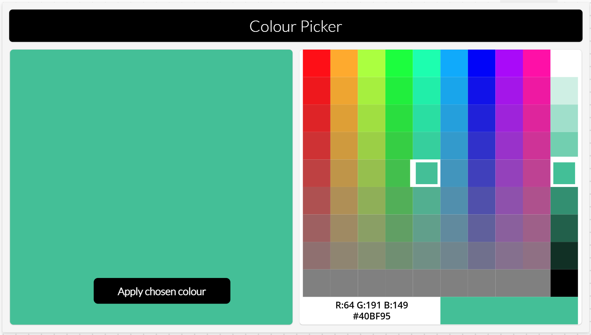
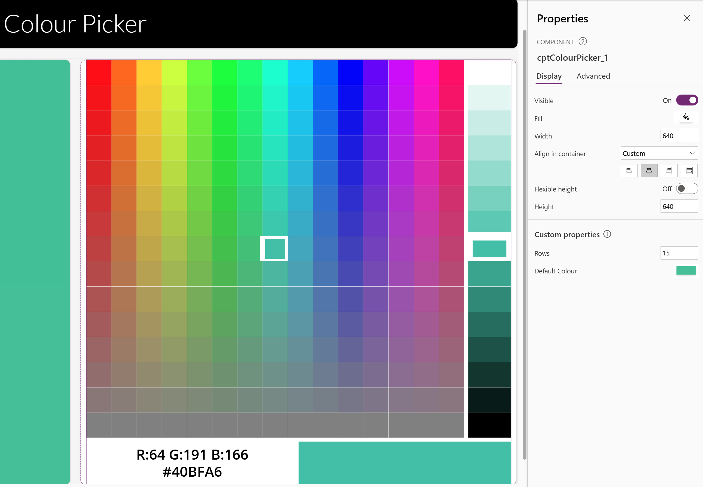
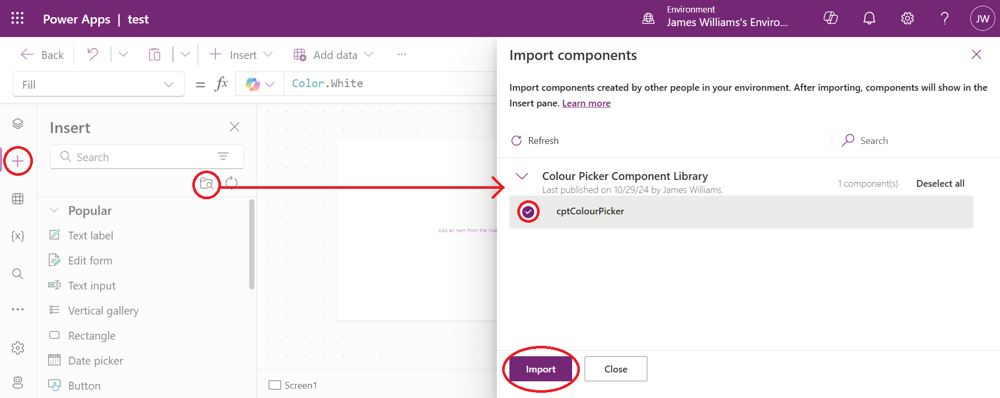
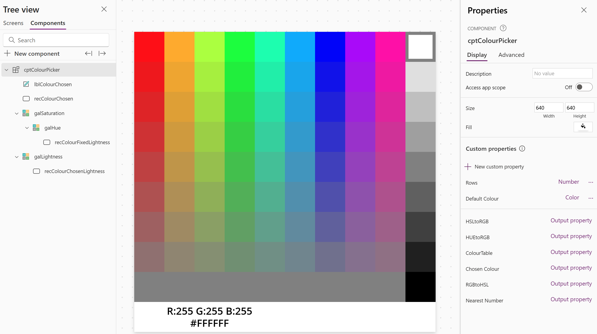

# Colour Picker Component

## Summary

This Power App demonstrates a component which uses enhanced component properties to produce a colour picker in the style of a hue/saturation grid and a lightness picker, which users may be familiar with from applications like MS Paint. Users first choose a hue and saturation from the grid, then the lightness picker provides the available options of lightness for that colour. The final chosen colour is provided as an output property of the component for use in the Power App.



The component is customisable by setting the number of rows/columns in the grid and picker. This works best with odd numbers (so that 0.5 Lightness can be selected) divisible by 3 (so that pure red, green and blue can be selected) but a higher number of rows increases the time to render the component.

A default colour can be provided, which will be selected when this input property is updated.



## Applies to


## Compatibility


## Contributors

* [James Williams](https://github.com/wjamesw)

## Version history

Version|Date|Comments
-------|----|--------
1.0|October 26, 2024|Initial release

## Prerequisites

None

## Minimal path to awesome

### Using the solution zip

* [Download](./solution/colour-picker.zip) the `.zip` from the `solution` folder
* Within **Power Apps Studio**, import the solution `.zip` file using **Solutions** > **Import Solution** and select the `.zip` file you just downloaded.

### Using the source code

You can also use the [Power Apps CLI](https://docs.microsoft.com/powerapps/developer/data-platform/powerapps-cli) to pack the source code by following these steps:

* Clone the repository to a local drive
* Pack the source files back into a solution `.zip` file:

  ```bash
  pac solution pack --zipfile pathtodestinationfile --folder pathtosourcefolder --processCanvasApps
  ```

  Making sure to replace `pathtosourcefolder` to point to the path to this sample's `sourcecode` folder, and `pathtodestinationfile` to point to the path of this solution's `.zip` file (located under the `solution` folder)
* Within **Power Apps Studio**, import the solution `.zip` file using **Solutions** > **Import Solution** and select the `.zip` file you just packed.

### Use the component in your app

Open your target app and click the **Get more components** icon from the **Insert** tab. On the **Import components** pane, select **cptColourPicker** from the **Colour Picker Component Library** and then click **Import** to import the component into your target app:



Then select **cptColourPicker** from the **Library components** group on the **Insert** tab.

Set the **Rows** property of the component instance to an odd number divisible by 3 (default is 9).

Set the **Default Colour** property.

Add logic to your app to retrieve the **Chosen Colour** property from the component instance.

## Features

The component consists of a grid to select hue and saturation formed using a nested gallery, and a lightness picker using a gallery. Each contain a single rectangle to show the colour represented by the item.

The items for the grid are records containing H (hue), S (saturation) and L (lightness) values, generated in the ColourTable property of the component. Each has L preset to 0.5 which is the most colourful value; adjustments to the L value lighten or darken the colour.

As Power Apps works with RGB colours, the component contains some functions to convert between RGB and HSL colour formats.

The rectangle in each gallery has its fill colour set using the function property "HSLtoRGB", and its helper function "HUEtoRGB".

In addition, the component's Default Colour input property is an RGB colour which, when changed, triggers the OnReset action of the component, where it is converted to HSL by first extracting the R, G and B components by converting the colour to JSON and back to a text string, then using Mid and Hex2Dec to extract the values. These RGB values are then concerted to HSL using the "RGBtoHSL" function property.

As there are 256^3 possible RGB colours, and only Rows^3 possible colours in the picker, the default selected items in the galleries are then set to the nearest available colour using a function property "Nearest Number" on each of the H, S and L values.



This solution illustrates the following concepts:

* Power Apps components
* Enhanced component properties (Experimental feature): function properties

<!--
RESERVED FOR REPO MAINTAINERS

We'll add the video from the community call recording here

## Video

[](https://www.youtube.com/watch?v=XXXXX "YouTube video title")
-->

## Help

We do not support samples, but this community is always willing to help, and we want to improve these samples. We use GitHub to track issues, which makes it easy for  community members to volunteer their time and help resolve issues.

If you encounter any issues while using this sample, you can [create a new issue](https://github.com/pnp/powerapps-samples/issues/new?assignees=&labels=Needs%3A+Triage+%3Amag%3A%2Ctype%3Abug-suspected&template=bug-report.yml&sample=colour-picker&authors=@wjamesw&title=colour-picker%20-%20).

For questions regarding this sample, [create a new question](https://github.com/pnp/powerapps-samples/issues/new?assignees=&labels=Needs%3A+Triage+%3Amag%3A%2Ctype%3Abug-suspected&template=question.yml&sample=colour-picker&authors=@wjamesw&title=colour-picker%20-%20).

Finally, if you have an idea for improvement, [make a suggestion](https://github.com/pnp/powerapps-samples/issues/new?assignees=&labels=Needs%3A+Triage+%3Amag%3A%2Ctype%3Abug-suspected&template=suggestion.yml&sample=colour-picker&authors=@wjamesw&title=colour-picker%20-%20).

## Disclaimer

**THIS CODE IS PROVIDED *AS IS* WITHOUT WARRANTY OF ANY KIND, EITHER EXPRESS OR IMPLIED, INCLUDING ANY IMPLIED WARRANTIES OF FITNESS FOR A PARTICULAR PURPOSE, MERCHANTABILITY, OR NON-INFRINGEMENT.**


