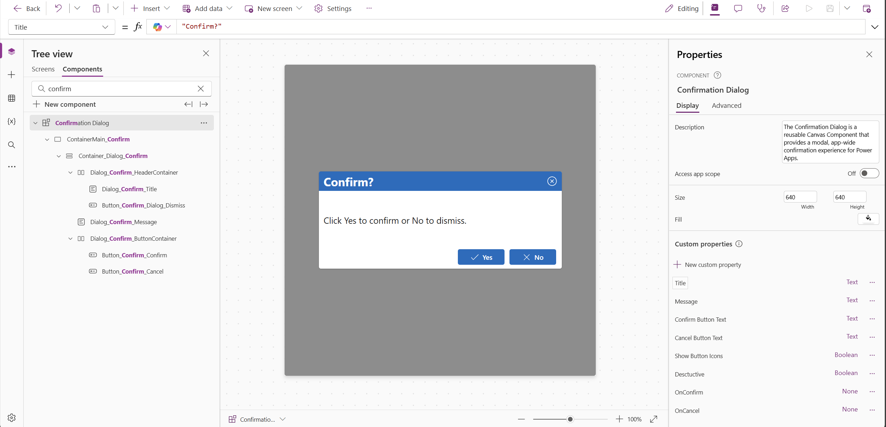
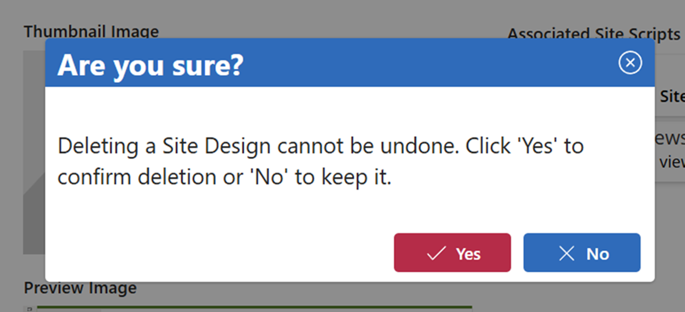

# Confirmation Dialog Component

## Summary

The Confirmation Dialog is a reusable Canvas Component that provides a modal, app-wide confirmation experience for Power Apps. It displays a centered dialog with a customizable title, message, and configurable Confirm and Cancel buttons. The component supports destructive‑action styling (highlighting the confirm button in red), optional button icons, and exposes OnConfirm and OnCancel events for app logic integration. This makes it ideal for consistent, accessible confirmation prompts across your app without rewriting the UI each time.
#### Key features:

- Customizable Title, Message, Confirm Button Text, and Cancel Button Text
- Optional destructive mode for high‑risk actions
- Optional button icons
- Modal overlay with built‑in close/dismiss behavior
- Event properties (OnConfirm, OnCancel) for clean app integration

Use this component to standardize confirmation UI patterns throughout your Canvas Apps.

## Applies to

## Compatibility

## Contributors

* [Jim Duncan](https://github.com/sparkitect)

## Version history

Version|Date|Comments
-------|----|--------
1.0|December 30, 2025|Initial release

## Prerequisites
None

## Minimal path to awesome

### Using the solution zip
N/A

### Using the source code
1. Copy the [source code](sourcecode/confirmation-dialog-component.yaml) to your clipboard.
2. Navigate to the Components area of your Canvas App in the editor.
3. Paste the code from your clipboard.
4. Navigate to the Screens area of your Canvas App in the editor.
5. Add the component (highest z-index) and configure it to your liking.

## Features

This solution illustrates the following concepts on top of the Power Platform:

* Custom Components
* Component Properties (Data + Event)

<!--
Note that better pictures and documentation will increase the sample usage and the value you are providing for others. Thanks for your submissions in advance! You rock ❤.
-->

<!--
RESERVED FOR REPO MAINTAINERS

We'll add the video from the community call recording here

## Video

-->

## Help

> Note: don't worry about this section, we'll update the links.

We do not support samples, but this community is always willing to help, and we want to improve these samples. We use GitHub to track issues, which makes it easy for  community members to volunteer their time and help resolve issues.

If you encounter any issues while using this sample, you can [create a new issue](https://github.com/pnp/powerapps-samples/issues/new?assignees=&labels=Needs%3A+Triage+%3Amag%3A%2Ctype%3Abug-suspected&template=bug-report.yml&sample=confirmation-dialog-component&authors=@sparkitect&title=confirmation-dialog-component%20-%20).

For questions regarding this sample, [create a new question](https://github.com/pnp/powerapps-samples/issues/new?assignees=&labels=Needs%3A+Triage+%3Amag%3A%2Ctype%3Abug-suspected&template=question.yml&sample=confirmation-dialog-component&authors=@sparkitect&title=confirmation-dialog-component%20-%20).

Finally, if you have an idea for improvement, [make a suggestion](https://github.com/pnp/powerapps-samples/issues/new?assignees=&labels=Needs%3A+Triage+%3Amag%3A%2Ctype%3Abug-suspected&template=suggestion.yml&sample=confirmation-dialog-component&authors=@sparkitect&title=confirmation-dialog-component%20-%20).

## Disclaimer

**THIS CODE IS PROVIDED *AS IS* WITHOUT WARRANTY OF ANY KIND, EITHER EXPRESS OR IMPLIED, INCLUDING ANY IMPLIED WARRANTIES OF FITNESS FOR A PARTICULAR PURPOSE, MERCHANTABILITY, OR NON-INFRINGEMENT.**

