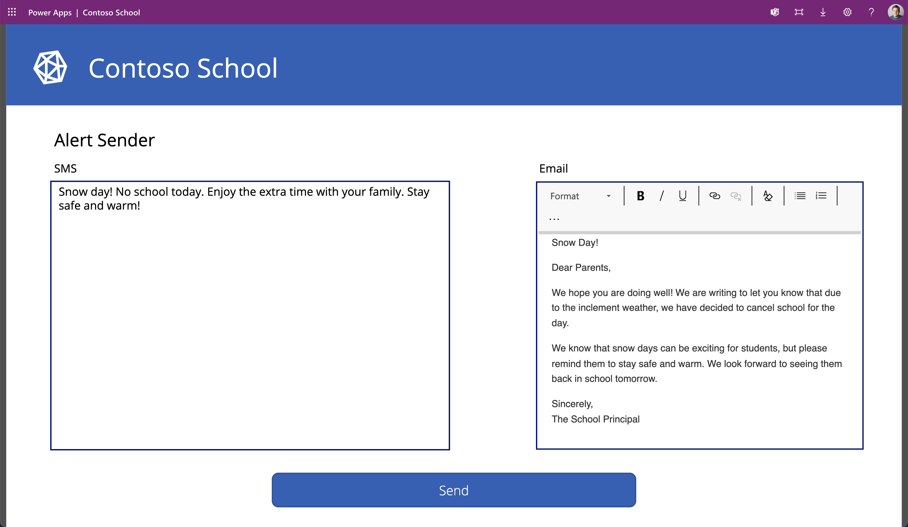

# Contoso School

## Summary

This sample how you can use Azure Communication Services, Power Apps and AI Builder GPT together!




## Applies to


## Compatibility


## Contributors

- [David de Matheu](https://github.com/ddematheu2)

## Version history

Version|Date|Comments
-------|----|--------
1.0|April 28, 2023|Initial release

## Features

This sample how you can use Azure Communication Services, Power Apps and AI Builder GPT together!

## Data Sources

* Azure Communication Services Email
* Azure Communication Services SMS
* Dataverse (for the parents table)
* AI Builder (Azure OpenAI Service model - [request access here](https://forms.office.com/Pages/ResponsePage.aspx?id=v4j5cvGGr0GRqy180BHbR2LogRPRiTJDo1Rd8KnmcFRUMzlLTDZVQlJKSzNIWkVCMzE0VDFYVzk2QS4u))

## Minimal Path to Awesome

* Request access to the AI Builder Azure OpenAI Service model [here](https://forms.office.com/Pages/ResponsePage.aspx?id=v4j5cvGGr0GRqy180BHbR2LogRPRiTJDo1Rd8KnmcFRUMzlLTDZVQlJKSzNIWkVCMzE0VDFYVzk2QS4u).
* An Azure account with an active subscription. [Create an account for free](https://azure.microsoft.com/free/?WT.mc_id=A261C142F).
* An active Communication Services resource and connection string. [Create a Communication Services resource](https://docs.microsoft.com/azure/communication-services/quickstarts/create-communication-resource).
* An active Azure Communication Services resource connected to an Email Domain and its connection string. [Get started by connecting an Email Communication Resource with a Azure Communication Resource](../connect-email-communication-resource.md).
* (Optional) An SMS enabled telephone number. [Get a phone number](https://docs.microsoft.com/azure/communication-services/quickstarts/telephony-sms/get-phone-number).
* [Download](./solution/contoso-school.zip) the `.zip` from the `solution` folder
* Within **Power Apps Studio**, import the solution `.zip` file using **Solutions** > **Import Solution** and select the `.zip` file you just packed.
* Select the right connections in the connectors window.
* Enter the right email (donotreply@<Azure Communication Services Domain>) and phone number (Format: +1555555555) in the environment variables window. Make sure to link this email and this phone number in Azure Communication Services.
* Add contact information entries into the `Parents` table. Make sure to add the email and phone number (Format: +155555555) of the parents.
* Run the app.

## Using the Source Code

You can also use the [Power Apps CLI](https://docs.microsoft.com/powerapps/developer/data-platform/powerapps-cli) to pack the source code by following these steps::

* Clone the repository to a local drive
* Pack the source files back into a solution `.zip` file:

  ```bash
  pac solution pack --zipfile pathtodestinationfile --folder pathtosourcefolder --processCanvasApps
  ```

  Making sure to replace `pathtosourcefolder` to point to the path to this sample's `sourcecode` folder, and `pathtodestinationfile` to point to the path of this solution's `.zip` file (located under the `solution` folder)
* Within **Power Apps Studio**, import the solution `.zip` file using **Solutions** > **Import Solution** and select the `.zip` file you just packed.

## Disclaimer

**THIS CODE IS PROVIDED *AS IS* WITHOUT WARRANTY OF ANY KIND, EITHER EXPRESS OR IMPLIED, INCLUDING ANY IMPLIED WARRANTIES OF FITNESS FOR A PARTICULAR PURPOSE, MERCHANTABILITY, OR NON-INFRINGEMENT.**

## Help

We do not support samples, but we this community is always willing to help, and we want to improve these samples. We use GitHub to track issues, which makes it easy for  community members to volunteer their time and help resolve issues.

If you encounter any issues while using this sample, you can [create a new issue](https://github.com/pnp/powerapps-samples/issues/new?assignees=&labels=Needs%3A+Triage+%3Amag%3A%2Ctype%3Abug-suspected&template=bug-report.yml&sample=contoso-school&authors=@Laskewitz&title=contoso-school%20-%20).

For questions regarding this sample, [create a new question](https://github.com/pnp/powerapps-samples/issues/new?assignees=Laskewitz&labels=Needs%3A+Triage+%3Amag%3A%2Ctype%3Abug-suspected&template=question.yml&sample=contoso-school&authors=@Laskewitz&title=contoso-school%20-%20).

Finally, if you have an idea for improvement, [make a suggestion](https://github.com/pnp/powerapps-samples/issues/new?assignees=Laskewitz&labels=Needs%3A+Triage+%3Amag%3A%2Ctype%3Abug-suspected&template=suggestion.yml&sample=contoso-school&authors=@Laskewitz&title=contoso-school%20-%20).

## For more information

* [Overview of creating apps in Power Apps](https://docs.microsoft.com/powerapps/maker/)
* [Power Apps canvas apps documentation](https://docs.microsoft.com/powerapps/maker/canvas-apps/)


