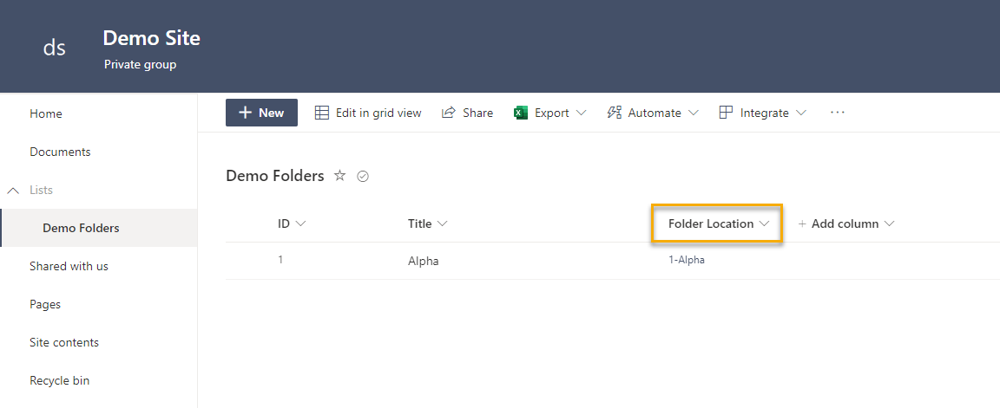

# Create folder with link back to list

## Summary

This sample creates a folder in a *SharePoint* document library and then stores the link to the newly created folder inside of *Microsoft Lists* using *Power Automate*. The folder name is based on a combination of list columns and provides a better link experience compared to the default URL. 

Our list item looks like the image below. Clicking on the *FolderLocation* link will take you to the folder location. 

## Applies to

## Compatibility

## Contributors
* [Norm Young](https://github.com/nyoung30) ([@stormin_30](https://twitter.com/stormin_30))

## Version history

Version|Date|Comments
-------|----|--------
1.0|October 10, 2022|Initial release
2.0|October 07, 2025|Migration from powerapps-samples repository with solution repacking by [Jan Chlebek](https://github.com/jan-chlebek)
3.0|December 16, 2025|Add environment variables into solution by [Katerina Chernevskaya](https://github.com/Katerina-Chernevskaya)

## Prerequisites

This Flow requires the following list columns and settings:
* **Title**
	* Settings: "Require that this column contains information" set to **Yes**
* **FolderLocation**
	* Type: *Hyperlink* 

## Minimal Path to Awesome
* [Download](./solution/create-folder-with-link-back-to-list.zip) the `.zip` from the `solution` folder
* Within **Power Automate**, import the solution `.zip` file using **Solutions** > **Import Solution** and select the `.zip` file you just packed.

*  Test your *Flow* by adding a new item to your list. If successful the Flow will:
    *  Create a folder in our target *SharePoint* Document Library with a name that concatenates the *ID* and *Title* columns
    *  Update list item *FolderLocation* column to match the folder name

## Features

This sample illustrates the following concepts:

* Expressions
* SharePoint REST API
* Variables

## Help

We do not support samples, but this community is always willing to help, and we want to improve these samples. We use GitHub to track issues, which makes it easy for  community members to volunteer their time and help resolve issues.

If you encounter any issues while using this sample, you can [create a new issue](https://github.com/pnp/powerapps-samples/issues/new?assignees=&labels=Needs%3A+Triage+%3Amag%3A%2Ctype%3Abug-suspected&template=bug-report.yml&sample=create-folder-with-link-back-to-list&authors=@nyoung30&title=create-folder-with-link-back-to-list%20-%20).

For questions regarding this sample, [create a new question](https://github.com/pnp/powerapps-samples/issues/new?assignees=&labels=Needs%3A+Triage+%3Amag%3A%2Ctype%3Abug-suspected&template=question.yml&sample=create-folder-with-link-back-to-list&authors=@nyoung30&title=create-folder-with-link-back-to-list%20-%20).

Finally, if you have an idea for improvement, [make a suggestion](https://github.com/pnp/powerapps-samples/issues/new?assignees=&labels=Needs%3A+Triage+%3Amag%3A%2Ctype%3Abug-suspected&template=suggestion.yml&sample=create-folder-with-link-back-to-list&authors=@nyoung30&title=create-folder-with-link-back-to-list%20-%20).

## For more information

- [Create your first flow](https://docs.microsoft.com/en-us/power-automate/getting-started#create-your-first-flow)
- [Microsoft Power Automate documentation](https://docs.microsoft.com/en-us/power-automate/)

## Disclaimer

**THIS CODE IS PROVIDED *AS IS* WITHOUT WARRANTY OF ANY KIND, EITHER EXPRESS OR IMPLIED, INCLUDING ANY IMPLIED WARRANTIES OF FITNESS FOR A PARTICULAR PURPOSE, MERCHANTABILITY, OR NON-INFRINGEMENT.**

