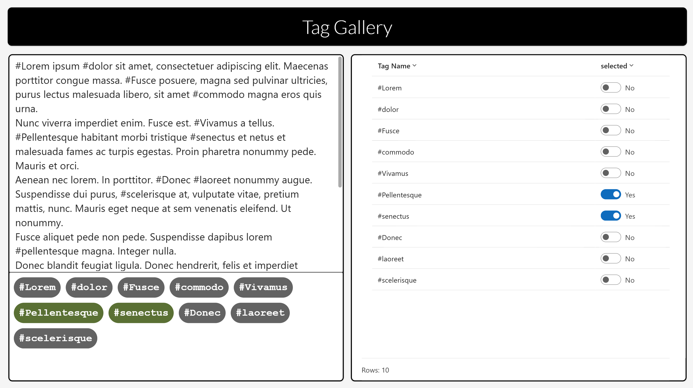

# Dynamic Tag Gallery Component

## Summary

This Power App demonstrates a component displaying a gallery of hashtags detected automatically from text and which dynamically places the hashtags in buttons across rows depending on the width of each and the room available on the row.



Kudos to Dave Wyatt for his implementation of this concept and for giving me the idea for this approach. Building on his version that uses a predetermined number of buttons within a container, my approach uses a gallery to create as many buttons as required dynamically. Please do read [Dave’s excellent blog](https://community.powerplatform.com/blogs/post/?postid=b3d4acb9-bfc6-ef11-b8e8-7c1e5267b708) first.

## Applies to


## Compatibility


## Contributors

* [James Williams](https://github.com/wjamesw)

## Version history

Version|Date|Comments
-------|----|--------
1.0|Febrary 2nd, 2025|Initial release

## Prerequisites

None

## Minimal path to awesome

### Using the solution zip

* [Download](./solution/dynamic-tag-gallery.zip) the `.zip` from the `solution` folder
* Within **Power Apps Studio**, import the solution `.zip` file using **Solutions** > **Import Solution** and select the `.zip` file you just downloaded.

### Using the source code

You can also use the [Power Apps CLI](https://docs.microsoft.com/powerapps/developer/data-platform/powerapps-cli) to pack the source code by following these steps:

* Clone the repository to a local drive
* Pack the source files back into a solution `.zip` file:

  ```bash
  pac solution pack --zipfile pathtodestinationfile --folder pathtosourcefolder --processCanvasApps
  ```

  Making sure to replace `pathtosourcefolder` to point to the path to this sample's `sourcecode` folder, and `pathtodestinationfile` to point to the path of this solution's `.zip` file (located under the `solution` folder)
* Within **Power Apps Studio**, import the solution `.zip` file using **Solutions** > **Import Solution** and select the `.zip` file you just packed.

### Use the component in your app

Open your target app and click the **Get more components** icon from the **Insert** tab. On the **Import components** pane, select **cptTagGallery** from the **Dynamic Tag Gallery Component Library** and then click **Import** to import the component into your target app.

Then select **cptTagGallery** from the **Library components** group on the **Insert** tab.

Set the **Input Text** property of the component instance to the text, or the source of the text, you want the component to analyse.

Set the **Button Padding** and **Button Margin** properties of the component instance, or leave these as their default values.

Add logic to your app to retrieve the **Output Tags** property from the component instance.

## Features

The component displays a gallery of hashtags detected automatically from text and which dynamically places the hashtags in buttons across rows depending on the width of each and the room available on the row.

This is done using a technique whereby the controls in the gallery all have their co-ordinates calculated dynamically using the whole space within the gallery, rather than just the usual row per item within the gallery. This technique can be used to create many interesting visuals.

The dynamic calculations take place predominantly within the OnReset function of the component.

The key to successfully aligning controls in a gallery space is ensuring that you compensate for the offset of (at least) one pixel, resulting from the Template Size property of the vertical gallery control, which can not be set to zero. Apart from that one issue, controls across items in a gallery do not have to stay within the bounds of their item's row.

This solution illustrates the following concepts:

* Power Apps components

## Help

We do not support samples, but this community is always willing to help, and we want to improve these samples. We use GitHub to track issues, which makes it easy for  community members to volunteer their time and help resolve issues.

If you encounter any issues while using this sample, you can [create a new issue](https://github.com/pnp/powerapps-samples/issues/new?assignees=&labels=Needs%3A+Triage+%3Amag%3A%2Ctype%3Abug-suspected&template=bug-report.yml&sample=dynamic-tag-gallery&authors=@wjamesw&title=dynamic-tag-gallery%20-%20).

For questions regarding this sample, [create a new question](https://github.com/pnp/powerapps-samples/issues/new?assignees=&labels=Needs%3A+Triage+%3Amag%3A%2Ctype%3Abug-suspected&template=question.yml&sample=dynamic-tag-gallery&authors=@wjamesw&title=dynamic-tag-gallery%20-%20).

Finally, if you have an idea for improvement, [make a suggestion](https://github.com/pnp/powerapps-samples/issues/new?assignees=&labels=Needs%3A+Triage+%3Amag%3A%2Ctype%3Abug-suspected&template=suggestion.yml&sample=dynamic-tag-gallery&authors=@wjamesw&title=dynamic-tag-gallery%20-%20).

## Disclaimer

**THIS CODE IS PROVIDED *AS IS* WITHOUT WARRANTY OF ANY KIND, EITHER EXPRESS OR IMPLIED, INCLUDING ANY IMPLIED WARRANTIES OF FITNESS FOR A PARTICULAR PURPOSE, MERCHANTABILITY, OR NON-INFRINGEMENT.**


