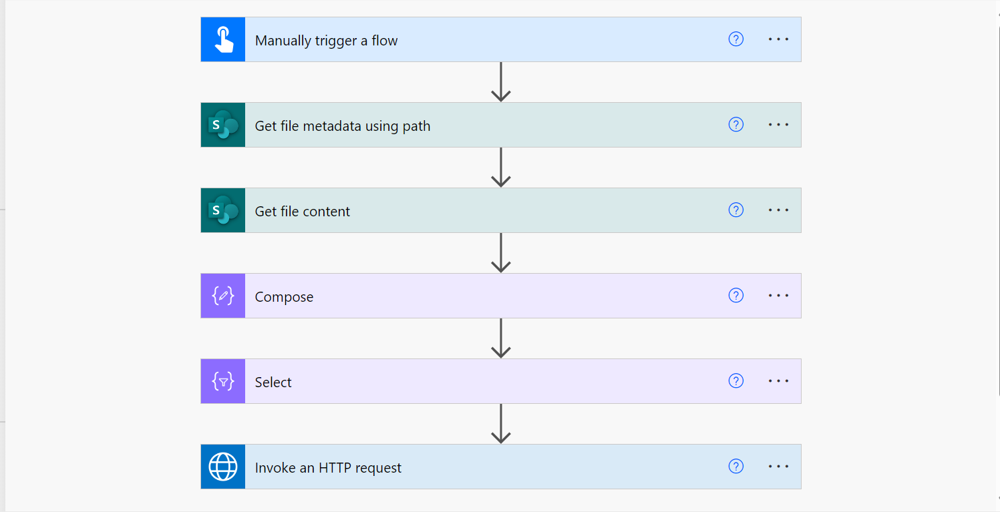

# Embed Image In Email Body

## Summary

This sample gets an image content from SharePoint document library and embed in it email body to share it with recipient(s). The flow calls graph API by utilizing premium **Invoke an HTTP request** action to overcome size limitation(~1 MB) when embedding image using URI method.




## Applies to

* [Power Automate](https://docs.microsoft.com/power-automate/)
* [Microsoft Graph](https://learn.microsoft.com/en-us/graph/)
* [Microsoft Entra](https://learn.microsoft.com/en-us/entra/)

## Compatibility


## Contributors

* [Manish Solanki](https://github.com/Solanki-Manish)


## Version history

Version|Date|Comments
-------|----|--------
1.0|Jul 7, 2024|Initial release


## Features

This sample illustrates the following concepts:

* Embed image in Email Body
* Overcome embed image size limit (~1 MB) using data URI method
* Send an email using Graph API
* Expression


## Prerequisites

### Connection References
The solution includes two connection references.
* SharePoint Connection
* HTTP with Microsoft Entra ID (preauthorized). Note: You need to enter https://graph.microsoft.com URL in both parameters i.e. 'Base Resource URL' & 'Microsoft Entra ID Resource URI'.

### Environment Variable
When importing the solution, there are a variety of environment variables that need to be completed.

Variable|Type|Details
-------|----|--------
SharePoint Site URL | DataSource | URL of the SharePoint site where image is saved.
Relative FilePath of Image | String | Relative path of the image in SharePoint library like 
Recipient email address | String | Colon(;) seprated email address of all recpients. Don't use colon in case of single recepient.


## Minimal Path to Awesome

### Import Solution

* [Download](./solution/embed-image-in-email-body.zip the `.zip` from the `solution` folder
* [Import](https://learn.microsoft.com/en-us/power-apps/maker/data-platform/import-update-export-solutions) the `.zip` file using **Solutions** > **Import Solution**.


### Using the source code

You can also use the [Power Apps CLI](https://docs.microsoft.com/powerapps/developer/data-platform/powerapps-cli) to pack the source code by following these steps:

* Clone the repository to a local drive
* Pack the source files back into a solution `.zip` file:

  ```bash
  pac solution pack --zipfile pathtodestinationfile --folder pathtosourcefolder --processCanvasApps
  ```

  Making sure to replace `pathtosourcefolder` to point to the path to this sample's `sourcecode` folder, and `pathtodestinationfile` to point to the path of this solution's `.zip` file (located under the `solution` folder)
* Within **Power Apps Studio**, import the solution `.zip` file using **Solutions** > **Import Solution** and select the `.zip` file you just packed.

## Help

We do not support samples, but this community is always willing to help, and we want to improve these samples. We use GitHub to track issues, which makes it easy for  community members to volunteer their time and help resolve issues.

If you encounter any issues while using this sample, you can [create a new issue](https://github.com/pnp/powerapps-samples/issues/new?assignees=&labels=Needs%3A+Triage+%3Amag%3A%2Ctype%3Abug-suspected&template=bug-report.yml&sample=embed-image-in-email-body&authors=@Solanki-Manish&title=embed-image-in-email-body).

For questions regarding this sample, [create a new question](https://github.com/pnp/powerapps-samples/issues/new?assignees=&labels=Needs%3A+Triage+%3Amag%3A%2Ctype%3Abug-suspected&template=question.yml&sample=embed-image-in-email-body&authors=@Solanki-Manish&title=embed-image-in-email-body).

Finally, if you have an idea for improvement, [make a suggestion](https://github.com/pnp/powerapps-samples/issues/new?assignees=&labels=Needs%3A+Triage+%3Amag%3A%2Ctype%3Abug-suspected&template=suggestion.yml&sample=embed-image-in-email-body&authors=@Solanki-Manish&title=embed-image-in-email-body).

## Disclaimer

**THIS CODE IS PROVIDED *AS IS* WITHOUT WARRANTY OF ANY KIND, EITHER EXPRESS OR IMPLIED, INCLUDING ANY IMPLIED WARRANTIES OF FITNESS FOR A PARTICULAR PURPOSE, MERCHANTABILITY, OR NON-INFRINGEMENT.**


