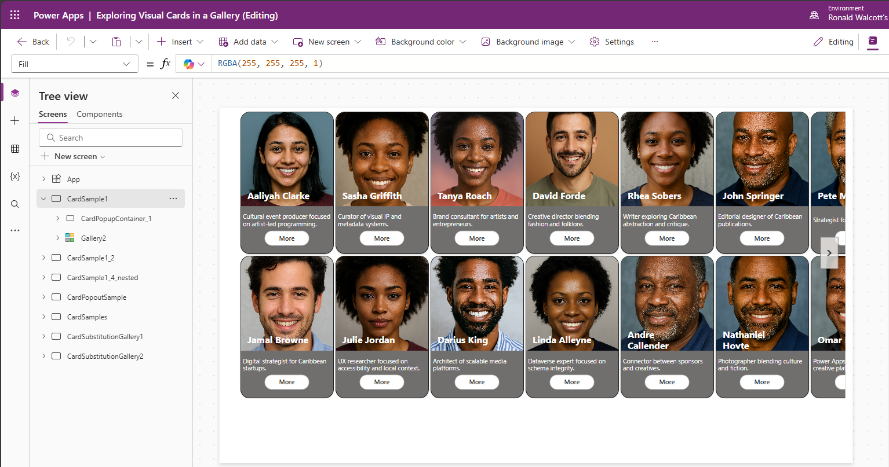
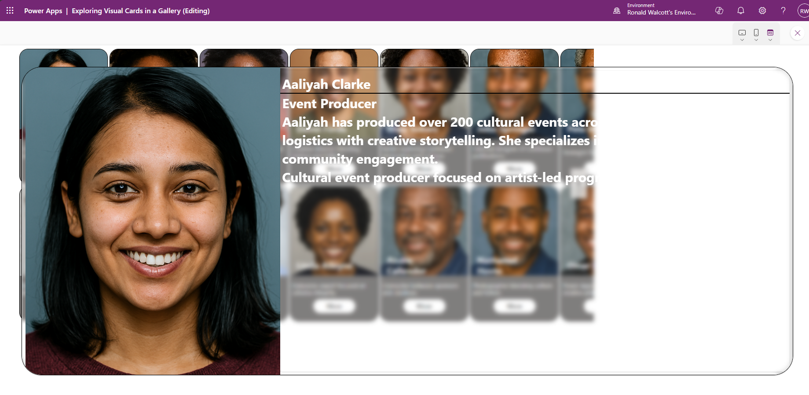
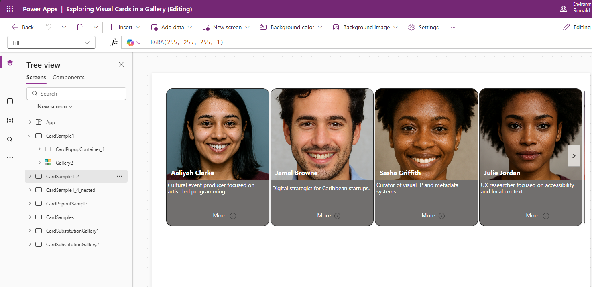
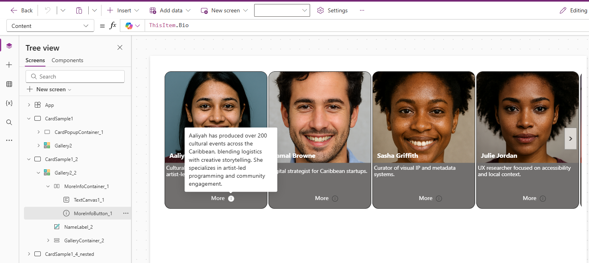
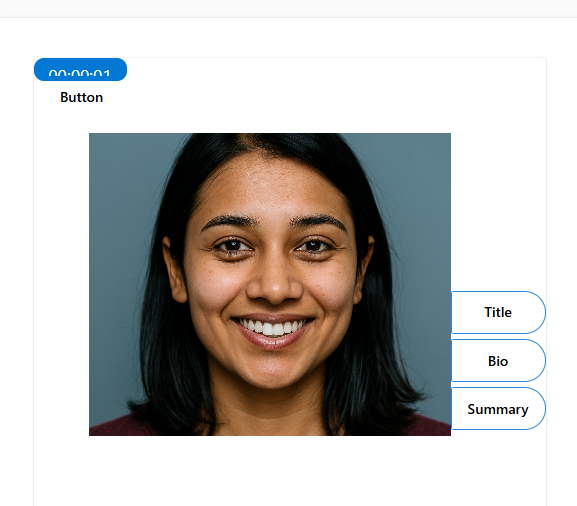
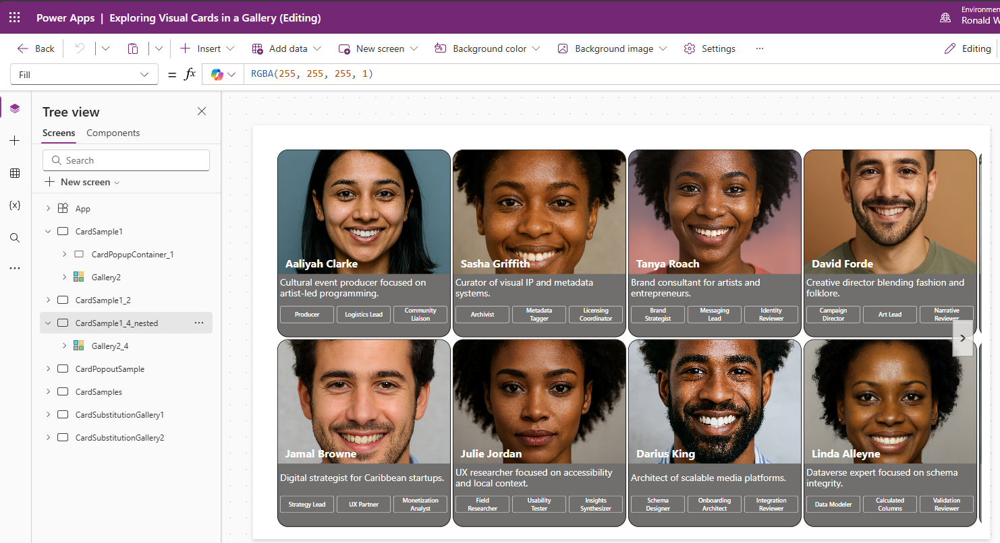
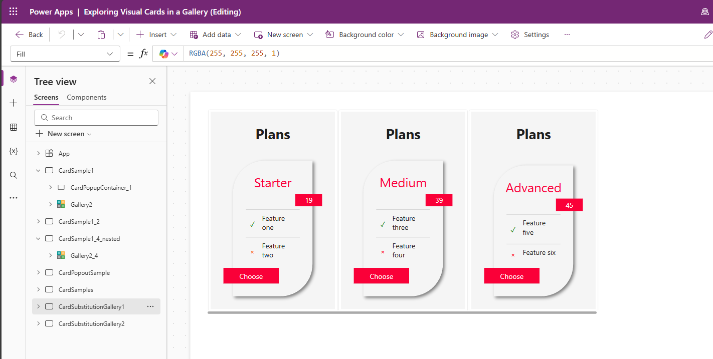
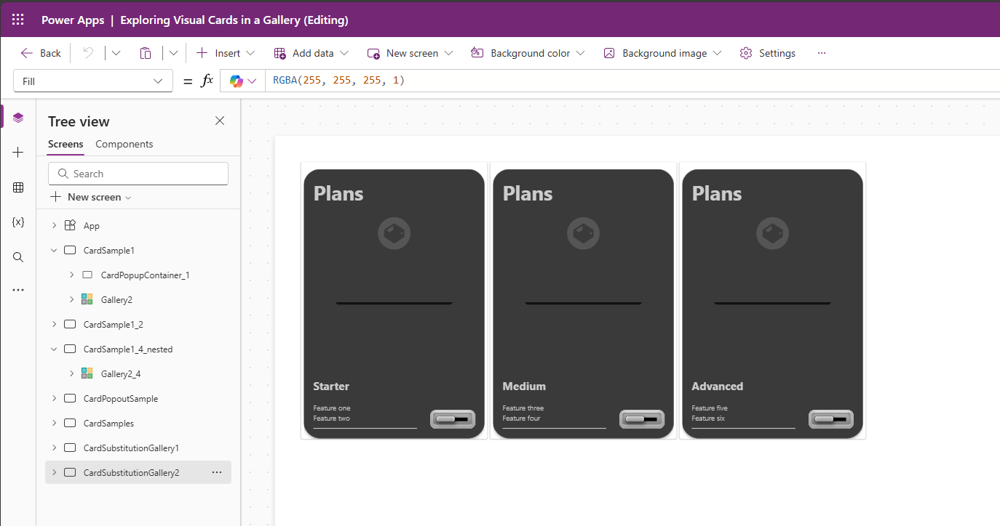

# Exploring Visual Cards in a Gallery


## Summary

This sample explores gallery card designs using controls and HTML text boxes. The html based cards were generated based on designs from https://freefrontend.com/. Most of the card designs using HTML and CSS are not compatible with the HTML control so Copilot was used to combine the HTML and CSS to make it at least 80% compatible for use with the HTML text box. The data in these samples uses collections created in the OnStart.



*Screen - CardSample1*

## Applies to

* [Microsoft Power Apps](https://docs.microsoft.com/powerapps/)


## Compatibility


## Authors


Solution|Author(s)
--------|---------
Ronald Walcott | [GitHub](https://github.com/ronaldwalcott) - [LinkedIn](https://www.linkedin.com/in/ronald-b-walcott/)


## Version history

Version|Date|Comments
-------|----|--------
1.0|December 18, 2025|Initial release

## Features


*Screen - CardSample1*


Clicking more pop ups a modal box diplaying detailed information

 
*Screen - CardSample1*


versus a gallery using an info button

 
*Screen - CardSample1_2*


Clicking the info button shows more details of the card
 
*Screen - CardSample1_2*


Also tried creating a modal popup with animation where the info buttons slide out when the card is selected in the gallery. It is simulated using a button
 
*Screen - CardPopoutSample*


Nested Galleries sample based on the collection added to the OnStart starting with

      ClearCollect(
          PeopleSample,
          {
              Name: "Aaliyah Clarke",
              JobTitle: "Event Producer",
              Bio: "Aaliyah has produced over 200 cultural events across the Caribbean, blending logistics with creative storytelling. She specializes in artist-led programming and community engagement.",
              Summary: "Cultural event producer focused on artist-led programming.",
              Img: Face1,
              Roles: Table(
                  { Role: "Producer", Area: "Events", Level: "Senior" },
                  { Role: "Logistics Lead", Area: "Operations", Level: "Mid" },
                  { Role: "Community Liaison", Area: "Programming", Level: "Mid" }
              )
          },

where the roles are added as a nested gallery

 
*Screen - CardSample1_4_nested*

Cards created using HTML text controls


*Screen - CardSamples*

Sample galleries using HTML text controls

*Screen - CardSubstitutionGallery1*


*Screen - CardSubstitutionGallery2*


This collection is used as the data source for these galleries
```
ClearCollect(SampleVisual, 
    {
        Heading: "Plans",
        SubHeading: "Starter",
        AmountValue: "19",
        Item1: "Feature one",
        Item2: "Feature two",
        Symbol1: "✓",
        Symbol2: "×",
        ItemLabel: "Choose"
    },
    {
        Heading: "Plans",
        SubHeading: "Medium",
        AmountValue: "39",
        Item1: "Feature three",
        Item2: "Feature four",
        Symbol1: "✓",
        Symbol2: "×",
        ItemLabel: "Choose"
    },
    {
        Heading: "Plans",
        SubHeading: "Advanced",
        AmountValue: "45",
        Item1: "Feature five",
        Item2: "Feature six",
        Symbol1: "✓",
        Symbol2: "×",
        ItemLabel: "Choose"
    }
);

```


## Prerequisites

No prerequisites are needed for these samples


## Solution Components

This sample consist of one canvas app using collections for the data source


## Minimal Path to Awesome

* [Download](./solution/exploring-visual-cards-in-galleries.zip) the solution `.zip` from the `solution` folder
* Within **https://make.powerapps.com**, import the `.zip` file via **Solutions** > **Import solution** > **Browse** and select the `.zip` file you just downloaded.
* Click next.
* ...

## Using the Source Code

You can also use the [Power Apps CLI](https://aka.ms/pac/docs) to pack the source code by following these steps::

* Clone the repository to a local drive
* Pack the source files back into `.zip` file:
  ```bash
  pac solution pack --folder pathtosourcefolder --zipfile pathtosolution  --processCanvasApps
  ```
  Making sure to replace `pathtosourcefolder` to point to the path to this sample's `sourcecode` folder, and `pathtosolution` to point to the path of this solution's `.zip` file (located under the `solution` folder)
* Within **https://make.powerapps.com**, import the `.zip` file via **Solutions** > **Import solution** > **Browse** and select the `.zip` file you just downloaded.
* Click next.
* ...

## Disclaimer

**THIS CODE IS PROVIDED *AS IS* WITHOUT WARRANTY OF ANY KIND, EITHER EXPRESS OR IMPLIED, INCLUDING ANY IMPLIED WARRANTIES OF FITNESS FOR A PARTICULAR PURPOSE, MERCHANTABILITY, OR NON-INFRINGEMENT.**

## Help


We do not support samples, but we this community is always willing to help, and we want to improve these samples. We use GitHub to track issues, which makes it easy for  community members to volunteer their time and help resolve issues.

If you encounter any issues while using this sample, you can [create a new issue](https://github.com/pnp/powerapps-samples/issues/new?assignees=&labels=Needs%3A+Triage+%3Amag%3A%2Ctype%3Abug-suspected&template=bug-report.yml&sample=YOURSAMPLENAME&authors=@YOURGITHUBUSERNAME&title=YOURSAMPLENAME%20-%20).

For questions regarding this sample, [create a new question](https://github.com/pnp/powerapps-samples/issues/new?assignees=&labels=Needs%3A+Triage+%3Amag%3A%2Ctype%3Abug-suspected&template=question.yml&sample=YOURSAMPLENAME&authors=@YOURGITHUBUSERNAME&title=YOURSAMPLENAME%20-%20).

Finally, if you have an idea for improvement, [make a suggestion](https://github.com/pnp/powerapps-samples/issues/new?assignees=&labels=Needs%3A+Triage+%3Amag%3A%2Ctype%3Abug-suspected&template=suggestion.yml&sample=YOURSAMPLENAME&authors=@YOURGITHUBUSERNAME&title=YOURSAMPLENAME%20-%20).

## For more information

- [Overview of creating apps in Power Apps](https://docs.microsoft.com/powerapps/maker/)
- [Power Apps canvas apps documentation](https://docs.microsoft.com/en-us/powerapps/maker/canvas-apps/)


---

