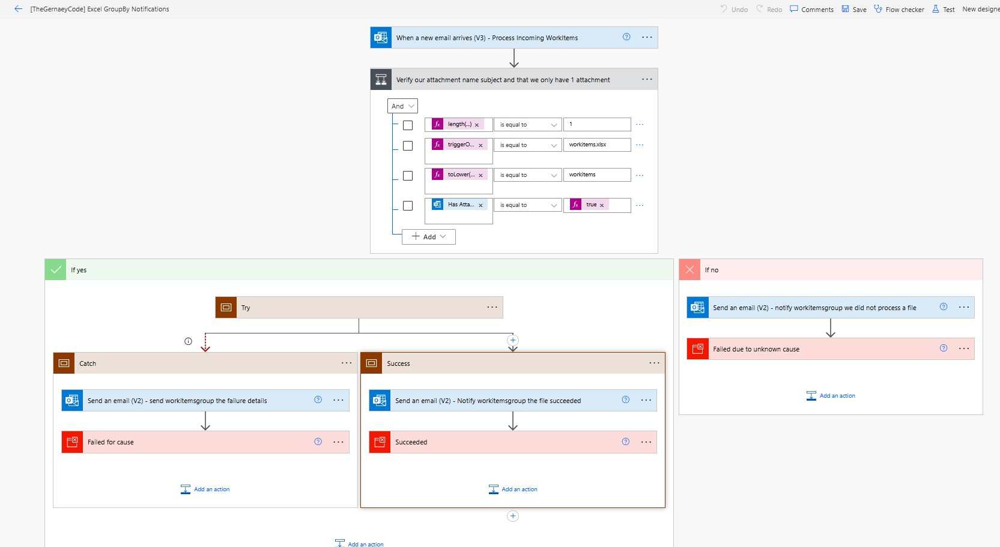
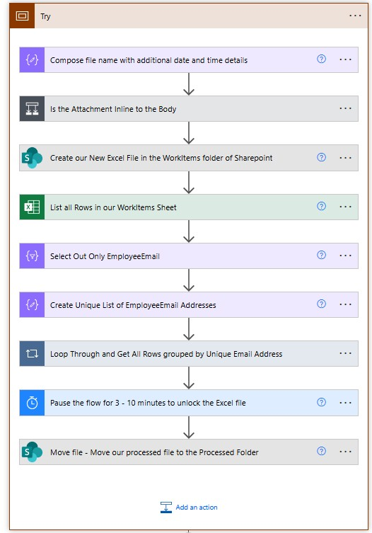

# Demonstration flow on how to process incoming excel email attachments, to group work items by EmailAddress for employees and email them their tasks

## Summary

This sample demonstrates how to receive an Excel File over email, download the file, save it to SharePoint, then process the file by grouping by value EmployeeEmail and then emailing each employee their work items in an HTML Table.
There are instructions and details in the assets folder, in a file called Excel GroupBy Example Phase I.docx





## Applies to


## Compatibility


## Contributors

* [Michael Gernaey](https://github.com/MichaelGernaey)

## Version history

Version|Date|Comments
-------|----|--------
1.0|June 20, 2025|Initial release

## Prerequisites

### Instructions

* Review the Excel GroupBy Example Phase 1.docx that covers the entire flow from a functional and technical perspective in the assest folder as your first step
* Please use the workitems.xlsx in the assets folder for your Attachment
* Please use the term workitems for your Emails Subject. This is the email that you will send yourself(or whatever emai you configure) to trigger your flow
* Change the Connections and Folder pointers in the Flow to point to your own SharePoint
* Note: Image Flow_Image_4.jpg shows the folder structure I am using, you can use whatever you like as long as you configure it in the flow that way
* Change the Outlook Trigger Details pointing to the correct folder and account
* Change the Outlook Send Email, Email Addresses in the Catch, Success and if no (false) condition/action areas to send to whomever you like.
* These are emails that are intended to tell operations the status of the flow as part of the "business requirements in the document"
* NOTE: the 10 minute delay is due to the Excel locking issue it will go from seconds to upwards of 10 minutes when used with SharePoint
* Please use the following <strong>environment variables</strong>. Please read about them more in the instructions in the asset folder
* <strong>Attachment_File_Creation_Folder</strong> : This is the path to the location where the attachment will be saved (Example: /ExcelExamples/GroupBy/WorkItems) 
* <strong>Email_Subject_Filter_String</strong> : This is the email subject filter used to validate we want to process this email (Example: WorkItems)
* <strong>Email_Attachment_Name</strong> : The name of the attachment file (Example workitems.xlsx)
* <strong>Excel_File_Location_Uri_For_List_Rows</strong> : In the Excel List Rows, the Uri to where the new file to process is in SharePoint (Example: GroupBy/WorkItems/)
* <strong>Excel_Table_Name</strong> : The Excel Table Name (Example: WorkItems)
* <strong>Notification_Email_Address</strong> : The pretend operations email address (Example: myopts@mytestopts.com) 
* <strong>SharePoint_Document_Library_Metadata_Id</strong> : This is the actual Meta-Data Id of the document library for the Excel List Rows. This requires more information and is detailed in the manual but you can get it like this:
-Get your full url to your site
-Append the following as such 
<strong>https://mysharpeointhostname.sharepoint.com/sites/TGC/_api/v2.1/drives</strong>
-This will generate a JSON. You must look into the JSON and grab the document library Id, not the GUID, for the library you want to use. This is another learning exercise as well :-)
(Example: b!GIfmRAVVw0mcFoQzYGhW-r3_yytMP19AvCd-ZdKecbLx0LomIb1QQJRqbnEl1-ia), noting  that this is NOT the GUID, its the ID.
* <strong>SharePoint_Processed_Folder_Target_Location</strong> : The sharepoint folder path to store successfully processed files (Example: /ExcelExamples/GroupBy/Processed)
* <strong>Source_SharePoint_Url</strong> : The Source SharePoint Url to store the files and process them in (Example https://mysharepoint.com/sites/TGC)
* <strong>Target_SharePoint_Url</strong> : The Target SharePoint Url to store the processed files (Example https://mytargetsharepoint.com/sites/TGC)
## Minimal Path to Awesome

### Import Solution

* [Download](./solution/flow-excel-groupbyemail-notification-example.zip) the `.zip` from the `solution` folder
* [Import](https://learn.microsoft.com/en-us/power-apps/maker/data-platform/import-update-export-solutions) the `.zip` file using **Solutions** > **Import Solution**.

### Using the source code

You can also use the [Power Apps CLI](https://docs.microsoft.com/powerapps/developer/data-platform/powerapps-cli) to pack the source code by following these steps:

* Clone the repository to a local drive
* Pack the source files back into a solution `.zip` file:

  ```bash
  pac solution pack --zipfile pathtodestinationfile --folder pathtosourcefolder --processCanvasApps
  ```

  Making sure to replace `pathtosourcefolder` to point to the path to this sample's `sourcecode` folder, and `pathtodestinationfile` to point to the path of this solution's `.zip` file (located under the `solution` folder)
* Within **Power Apps Studio**, import the solution `.zip` file using **Solutions** > **Import Solution** and select the `.zip` file you just packed.

## Features

This sample illustrates the following concepts:

* Reusablility
* Use of using Excel  
* Use of using Outlook Triggers
* Email Attachment Processing
* Creating a Unique Email by Grouping Excel Rows by Value
* Terminating Flows to capture Success or Failure into the Flow Detail 28 day Run Logs

## Help

We do not support samples, but this community is always willing to help, and we want to improve these samples. We use GitHub to track issues, which makes it easy for  community members to volunteer their time and help resolve issues.

If you encounter any issues while using this sample, you can [create a new issue](https://github.com/pnp/powerapps-samples/issues/new?assignees=&labels=Needs%3A+Triage+%3Amag%3A%2Ctype%3Abug-suspected&template=bug-report.yml&sample=utility-flow-for-aggregrate-operations-on-array&authors=@Solanki-Manish&title=utility-flow-for-aggregrate-operations-on-array).

For questions regarding this sample, [create a new question](https://github.com/pnp/powerapps-samples/issues/new?assignees=&labels=Needs%3A+Triage+%3Amag%3A%2Ctype%3Abug-suspected&template=question.yml&sample=utility-flow-for-aggregrate-operations-on-array&authors=@Solanki-Manish&title=utility-flow-for-aggregrate-operations-on-array).

Finally, if you have an idea for improvement, [make a suggestion](https://github.com/pnp/powerapps-samples/issues/new?assignees=&labels=Needs%3A+Triage+%3Amag%3A%2Ctype%3Abug-suspected&template=suggestion.yml&sample=utility-flow-for-aggregrate-operations-on-array&authors=@Solanki-Manish&title=utility-flow-for-aggregrate-operations-on-array).

## Disclaimer

**THIS CODE IS PROVIDED *AS IS* WITHOUT WARRANTY OF ANY KIND, EITHER EXPRESS OR IMPLIED, INCLUDING ANY IMPLIED WARRANTIES OF FITNESS FOR A PARTICULAR PURPOSE, MERCHANTABILITY, OR NON-INFRINGEMENT.**


