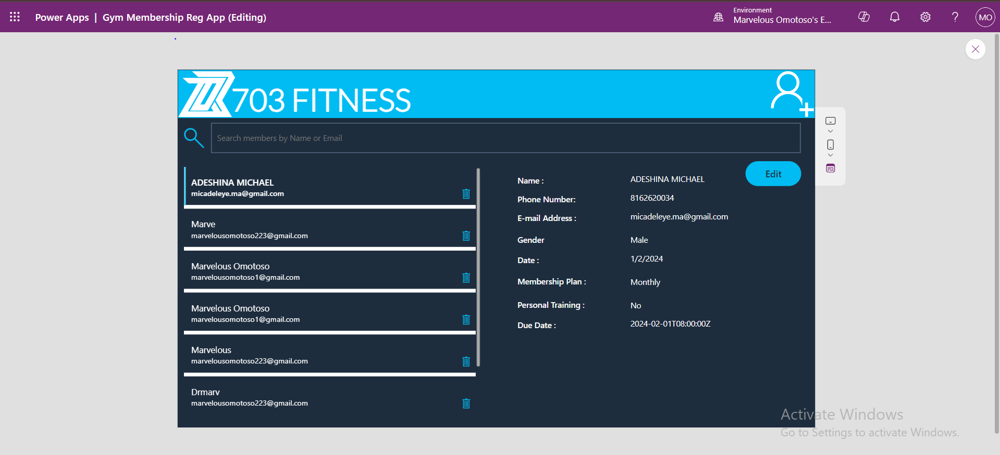
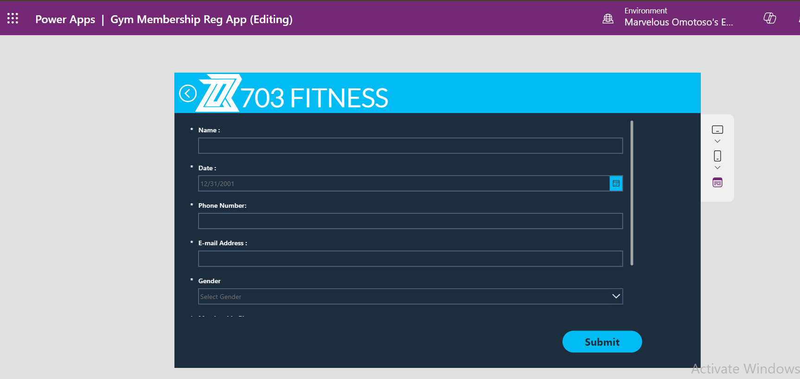
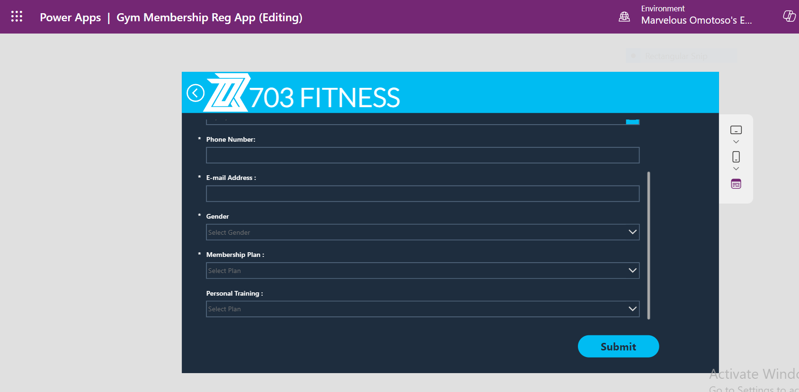
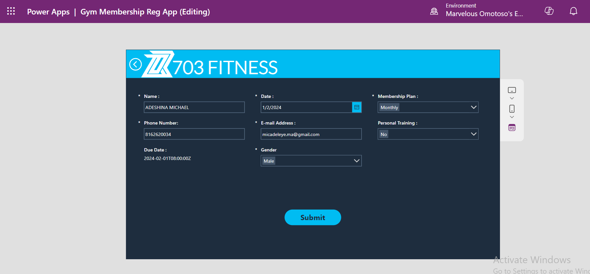
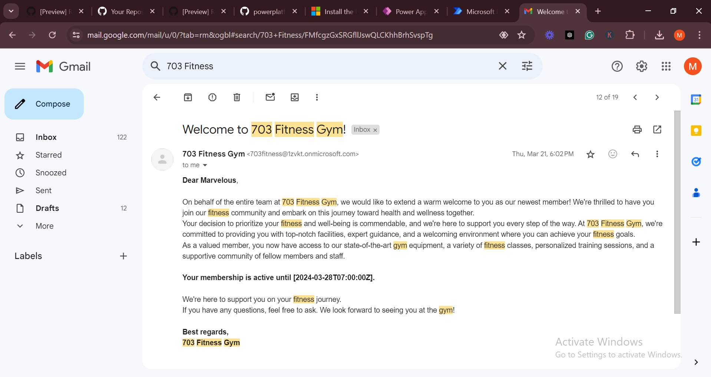
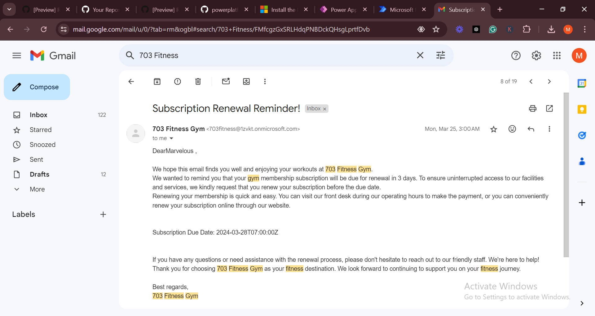
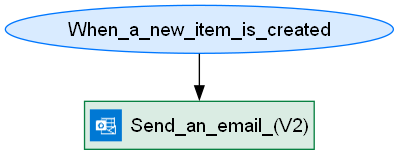
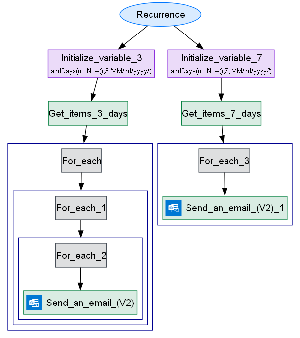
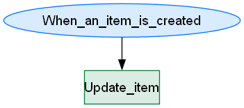

# Gym Membership Registration

## Summary

The Gym Membership Registration App is designed to enhance efficiency and reduce costs for gym owners. This application streamlines the process of member registration, subscription management, and communication through automated workflows.



## Applies to


## Compatibility


## Contributors

- [Marvelous Omotoso](https://github.com/Marvelous-O)

## Version history

| Version | Date          | Comments        |
| ------- | ------------- | --------------- |
| 1.0     | July 16, 2024 | Initial release |

## Features

This template not only gives you a good foundation for customizing your own Membership Registration system, it also demonstrates patterns that you can use across other apps.

### Key Features of the solution include:

- A dashboard landing page featuring Registered Memebers and Subscription Due Date which was calculated by the app in respect to the Memeber's Subcription Package . Ability to search for a member's details either by Name or E-mail, without having to search through a long list of Excel Spreadsheet.
  

**Automated Member Registration**: New members' information is directly entered into the app, eliminating manual data entry.



**Subscription Management**: The app automatically calculates the subscription due date based on the plan selected during registration.


**Automated Communication**:

- Sends a welcome message immediately after registration.
  

- Sends a reminder email 7 days before the subscription is due.
- Sends another reminder email 3 days before the subscription is due.
  

* The Ability to edit already registered member if he or she changes contacts.
  

## Data Sources

- Sharepoint

## Automated Flow

**Automated Welcome Message**



**Automated Subscription Renewal**



**Due Date Flow:** (How i used a calculated column for Filter Query in Power Automate)



Calculated columns can't be used for filter queries in Power Automate. Here's what I did: I created another flow to always copy the data from the calculated column (which is the calculated due date) to another column named DueDate2 as soon as a new member is registered. This new column became a regular date column, making it non-calculated. The Subscription Reminder Flow filters the DueDate2 column to check which members' subscriptions are almost due.

## Minimal path to awesome

### Creating the Data Source
*  [Download](./solution/gym-registration-data-source.stp) the Sharepoint template from the solution folder and import the template to your SharePoint environment by going to Site Settings > List templates and uploading the .stp file.

## Requirements
* Make sure Office 365 Outlook is enabled in your environment for E-mail sending
* The Sharepoint list that was imported must be the Datasource, the app uses Sharepoint as the Datasource.
<!--
PRO TIP:

For commands, use the `code syntax`

For button labels, page names, dialog names, etc. as they appear on the screen, use **Bold**

Don't use "click", use "select" or "use"

As tempting as it may be, don't just use images to describe the steps. Let's be as inclusive as possible and think about accessibility.

-->

### Using the solution zip

- [Download](./solution/GymMembershipRegistration_1_0_0_2.zip) the `.zip` from the `solution` folder
- Within **Power Apps Studio**, import the solution `.zip` file using **Solutions** > **Import Solution** and select the `.zip` file you just packed.
- Open the app in edit mode and make sure the data source **Data source name** is connected correctly.

### Using the source code

You can also use the [Power Apps CLI](https://docs.microsoft.com/powerapps/developer/data-platform/powerapps-cli) to pack the source code by following these steps:

- Clone the repository to a local drive
- Pack the source files back into a solution `.zip` file:

  ```bash
  pac solution pack --zipfile pathtodestinationfile --folder pathtosourcefolder --processCanvasApps
  ```

  Making sure to replace `pathtosourcefolder` to point to the path to this sample's `sourcecode` folder, and `pathtodestinationfile` to point to the path of this solution's `.zip` file (located under the `solution` folder)

- Within **Power Apps Studio**, import the solution `.zip` file using **Solutions** > **Import Solution** and select the `.zip` file you just packed.
<!--
RESERVED FOR REPO MAINTAINERS

We'll add the video from the community call recording here

## Video

[](https://www.youtube.com/watch?v=XXXXX "YouTube video title")
-->

## Help

We do not support samples, but this community is always willing to help, and we want to improve these samples. We use GitHub to track issues, which makes it easy for community members to volunteer their time and help resolve issues.

If you encounter any issues while using this sample, you can [create a new issue](https://github.com/pnp/powerapps-samples/issues/new?assignees=&labels=Needs%3A+Triage+%3Amag%3A%2Ctype%3Abug-suspected&template=bug-report.yml&sample=Gym-Membership-Registration&authors=@Marvelous-O&title=Gym-Membership-Registration%20-%20).

For questions regarding this sample, [create a new question](https://github.com/pnp/powerapps-samples/issues/new?assignees=&labels=Needs%3A+Triage+%3Amag%3A%2Ctype%3Abug-suspected&template=question.yml&sample=Gym-Membership-Registration&authors=@Marvelous-O&title=Gym-Membership-Registration%20-%20).

Finally, if you have an idea for improvement, [make a suggestion](https://github.com/pnp/powerapps-samples/issues/new?assignees=&labels=Needs%3A+Triage+%3Amag%3A%2Ctype%3Abug-suspected&template=suggestion.yml&sample=YGym-Membership-Registration&authors=@Marvelous-O&title=Gym-Membership-Registration%20-%20).

## Disclaimer

**THIS CODE IS PROVIDED _AS IS_ WITHOUT WARRANTY OF ANY KIND, EITHER EXPRESS OR IMPLIED, INCLUDING ANY IMPLIED WARRANTIES OF FITNESS FOR A PARTICULAR PURPOSE, MERCHANTABILITY, OR NON-INFRINGEMENT.**


