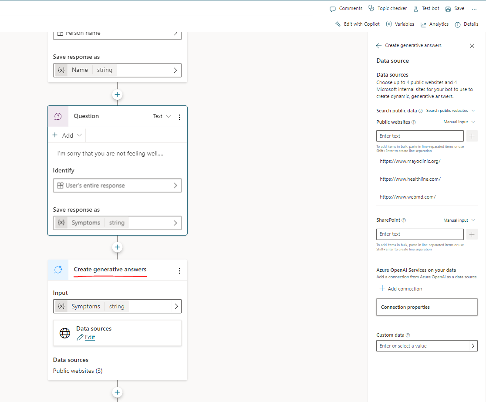
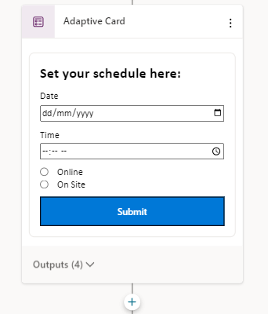
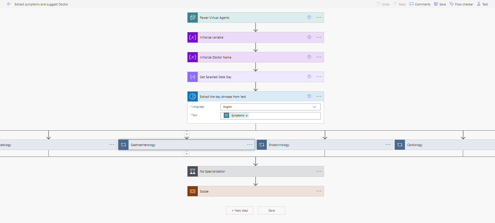
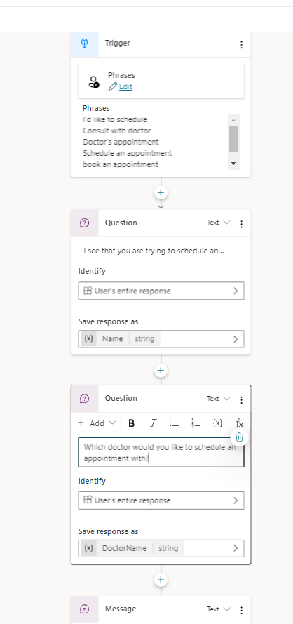
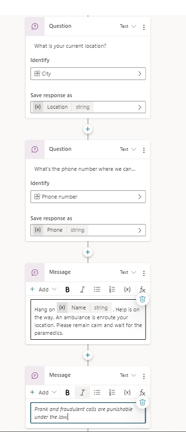

# Healthcare AI Chatbot

## Summary

This sample uses a Power Virtual Agents chatbot to diagnose and suggest a fitting doctor based on the user's inputted symptoms.
NOTE: "healthAlde" is a placeholder brand name for the bot & the Power Pages portal

## Applies to

## Compatibility

## Contributors
* [Miguel Espiritu](https://github.com/thepersonwho)

## Version history

Version|Date|Comments
-------|----|--------
1.0.0.1|Sept. 27, 2023|Initial release

## Prerequisites

* A Dataverse user account with access to System Admin Security Role
* AI Builder capacity (could be trial)
* An existing Power Pages site (optional, files will be provided in the "powerpages-portalfiles" folder)

## Data Sources

* Dataverse

## Minimal Path to Awesome

* Download the **(./solution/healthcare-ai-chatbot.zip)** solution `.zip` from the `solution` folder
* Within **<https://make.powerapps.com>**, import the solution `.zip` file via **Solutions** > **Import solution** > **Browse** and select the `.zip` file you just downloaded
* Click next
* Click Import
* Go to the Chatbot and either import it your existing Power Pages site (optional), or open it on a demo website

## Features

The PVA chatbot lets the user input their current symptoms to let the Chatbot diagnose the user via generative answers located in the of the chatbot's topic. 

After that, the chatbot displays an adaptive card asking for a specific date & time 

From there, a Power Automate flow in the same topic uses AI to check the user's symptoms for any key words/phrases, then uses that to determine which doctor is the best fit for them based on their specialization. It also checks whether the doctor wil lbe available based on the user's selected date & time on the previous step.

There are also 2 alternate topics in the chatbot: 
* One for directly setting up a consultation with a specific doctor by specifying the requested doctor and date & time of the appointment

* And another one for requesting an ambulance on demand

## Help

We do not support samples, but this community is always willing to help, and we want to improve these samples. We use GitHub to track issues, which makes it easy for  community members to volunteer their time and help resolve issues.

If you encounter any issues while using this sample, you can [create a new issue](https://github.com/pnp/powerapps-samples/issues/new?assignees=&labels=Needs%3A+Triage+%3Amag%3A%2Ctype%3Abug-suspected&template=bug-report.yml&sample=healthcare-ai-chatbot&authors=@thepersonwho&title=healthcare-ai-chatbot%20-%20).

For questions regarding this sample, [create a new question](https://github.com/pnp/powerapps-samples/issues/new?assignees=&labels=Needs%3A+Triage+%3Amag%3A%2Ctype%3Abug-suspected&template=question.yml&sample=healthcare-ai-chatbot&authors=@thepersonwho&title=healthcare-ai-chatbot%20-%20).

Finally, if you have an idea for improvement, [make a suggestion](https://github.com/pnp/powerapps-samples/issues/new?assignees=&labels=Needs%3A+Triage+%3Amag%3A%2Ctype%3Abug-suspected&template=suggestion.yml&sample=healthcare-ai-chatbot&authors=@thepersonwho&title=healthcare-ai-chatbot%20-%20).

## Disclaimer

**THIS CODE IS PROVIDED *AS IS* WITHOUT WARRANTY OF ANY KIND, EITHER EXPRESS OR IMPLIED, INCLUDING ANY IMPLIED WARRANTIES OF FITNESS FOR A PARTICULAR PURPOSE, MERCHANTABILITY, OR NON-INFRINGEMENT.**

