# Image Creator / Generator

## Summary

This sample allows the user to enter a prompt into a copilot and then it generates an image based on the prompt using the Azure OpenAI Service Dalle-3 model.

Sample consists of a Power Automate flow and a Copilot Studio copilot.

🗣️ Start a simple conversation with the copilot by asking it how to generate an image. The copilot will prompt you to enter a description of the image you want to generate.

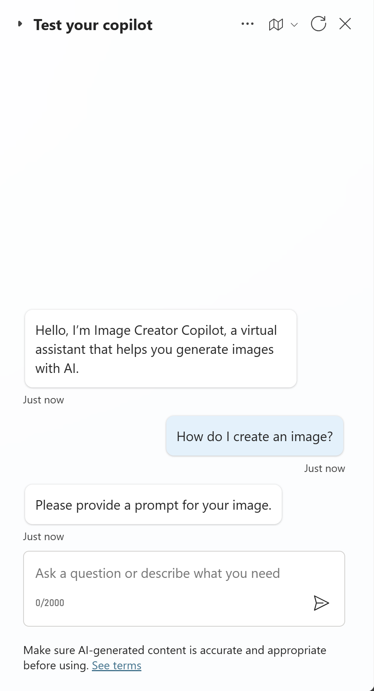

🤖 Once you enter the description, the copilot will generate an image based on the description you provided.

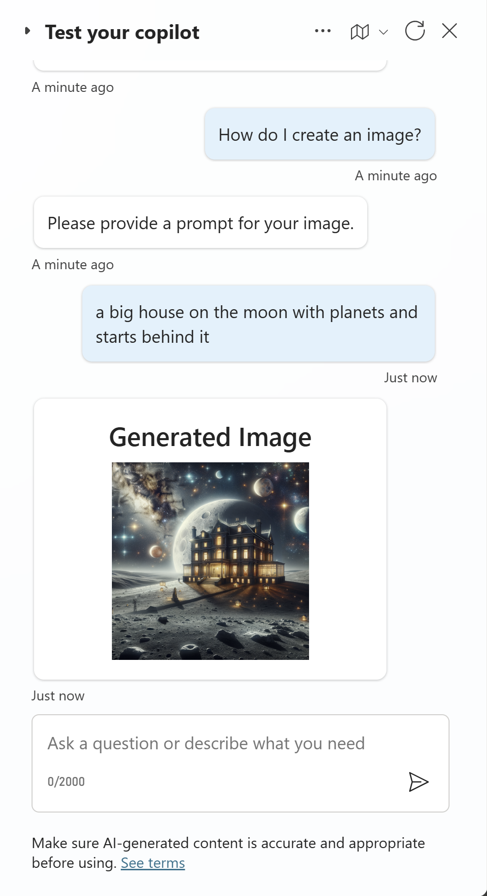

## Applies to


## Compatibility


## Contributors

* [Gomolemo Mohapi](https://github.com/gomomohapi)

## Version history

Version|Date|Comments
-------|----|--------
1.0|July 25, 2024|Initial release

## Prerequisites

* Make sure you have access to Power Apps, Power Automate, and Copilot Studio.
* Create an [Azure account](https://azure.microsoft.com/free/) and select **Start Free** and then fill in profile details to complete the sign up process.

    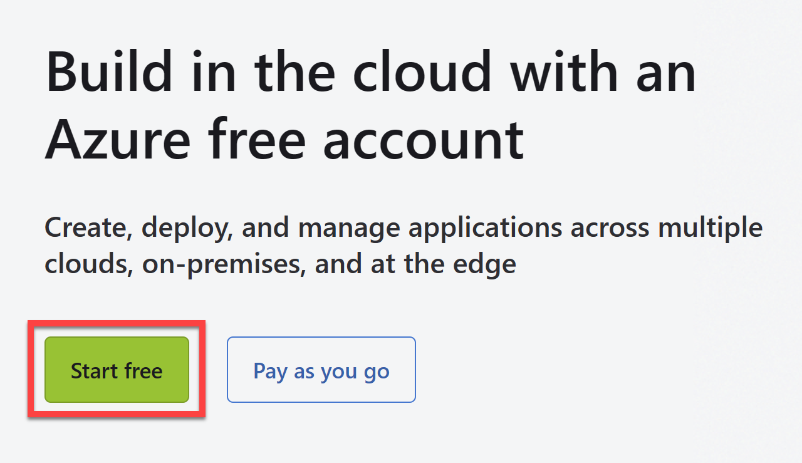

* To use any of the Azure OpenAI Service AI models, you'll need to request access by completing [this form](https://aka.ms/oai/access).

* Once you have an Azure account and access to Azure OpenAI Service, go to [portal.azure.com](https://aka.ms/PowerPodcast/AzurePortal) and login with your Azure account to create a resource group.
    
    * Search for and select **Resource Groups**.
    * Click on **+ Create**.

        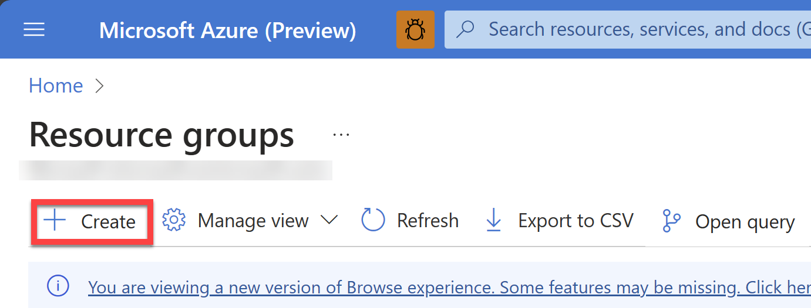

    * Name it `ImageCreator` and click on **Review + Create**. Then click on **Create**.

* Create a new Azure OpenAI Service resource (for image generating) by clicking [here](https://ms.portal.azure.com/#create/Microsoft.CognitiveServicesOpenAI) and set the following parameters:

    * **Subscription**: Select your Azure subscription
    * **Resource Group**: Select the `ImageCreator` resource group you created in the previous step
    * **Region**: `Sweden Central`
    * **Name**: `imagecreatorcopilot-{your initials}` (e.g. `imagecreatorcopilot-jd` to make it unique)
    * **Pricing Tier**: Select the `Standard S0` pricing tier

        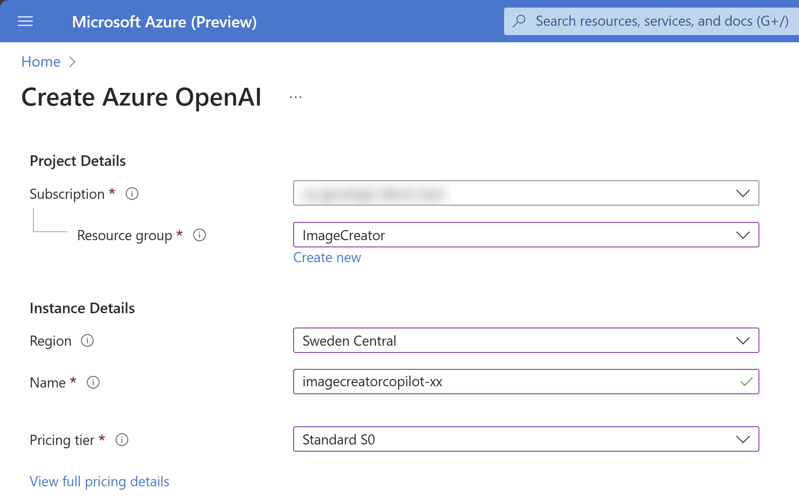

    * Click on **Next** until you get to the **Review + Submit** page and then click on **Create** to create the resource.

* Create a model deployment in Azure OpenAI Studio

    * Open up your `ImageCreator` resource group in the Azure portal
    * Select the `imagecreatorcopilot-{your initials}` resource
    * Click on **Go to Azure OpenAI Studio**

        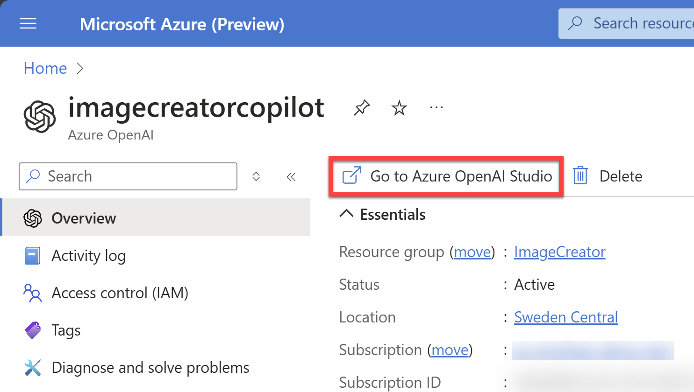

    * In the Azure OpenAI Studio, click on **Deployments** on the left menu.
    * Click on **+ Create New Deployment** and set the following parameters:
        * **Select a model**: `dall-e-3`
        * **Model version**: `Auto-update to default`
        * **Deployment name**: `dalle3`
    * Click **Create** to create the deployment.
    * Select the **dalle3** deployment and click on **Open in Playground**.
    * Select **View Code** and note down the endpoint and the key somewhere safe

        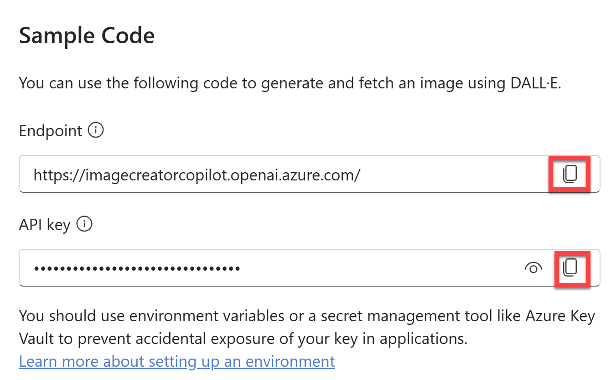

* Set up local environment variables to store the Azure OpenAI Service endpoint and key. Open up a command prompt on your computer and run this command:

    ```bash
    setx AZURE_OPENAI_KEY "REPLACE_WITH_YOUR_KEY_VALUE_HERE"
    ```

    Then run this command:

    ```bash
    setx AZURE_OPENAI_ENDPOINT "https://imagecreatorcopilot-{your initials}.openai.azure.com/" 
    ```

* To use this sample, you will create your own Custom Connector using the [Visual Studio Connected Service for the Power Platform](https://learn.microsoft.com/en-us/power-platform/developer/visual-studio-connected-service). For this; download and install [Visual Studio (Community Edition)](https://visualstudio.microsoft.com/vs/features/net-development/)

    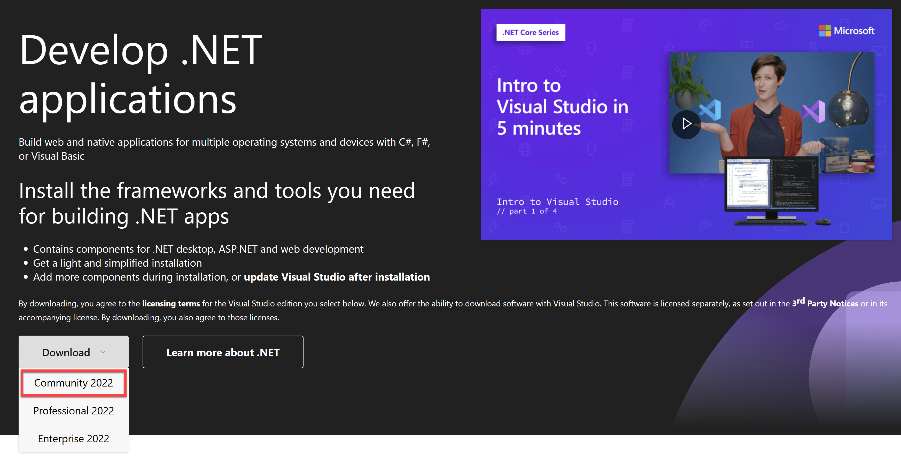

    This installer comes pre-packaged with all the components you need for .NET development.

* Finally, clone the [ImageCreatorAPI Sample Project](https://github.com/gomomohapi/ImageCreatorAPI) to your local machine and open with Visual Studio.
    * Once you follow the link to the project, select **Code** and then copy the git URL.

        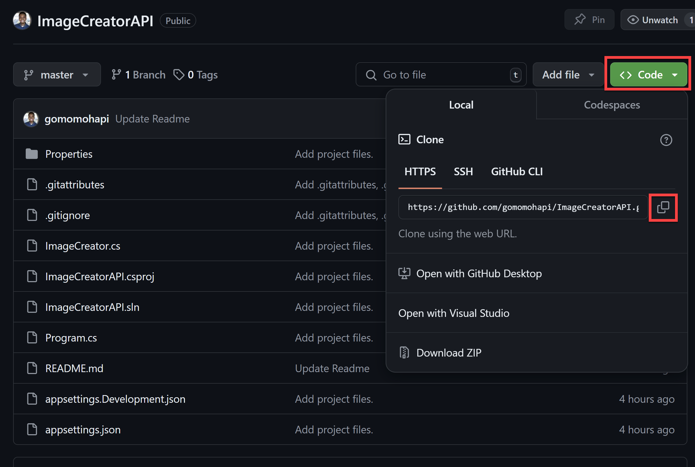

    * Open Visual Studio and select **Clone a repository**.

        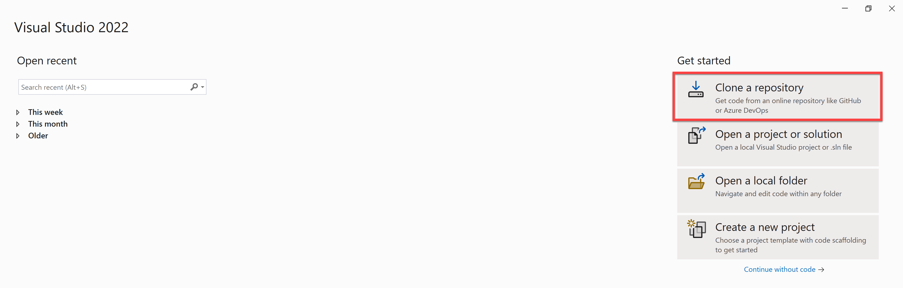

    * Then paste in the link you copied from GitHub and select **Clone**.

    * The project will then open in Visual Studio.

## Minimal path to awesome

### Using the solution zip

**Step 1: Import the solution into your Power Apps environment.**

* [Download](./solution/image-creator.zip) the `.zip` from the `solution` folder
* Within **Power Apps Studio**, import the solution `.zip` file using **Solutions** > **Import Solution** and select the `.zip` file you just downloaded.
* Once the solution has been imported, leave the Solutions tab open and then open Visual Studio with the cloned ImageCreatorAPI project.

**Step 2: Create a Custom Connector using the Visual Studio Connected Service for the Power Platform.**

* In Visual Studio, open the solution explorer and right-click on **Connected Services** and select **Add** > **Microsoft Power Platform**.

    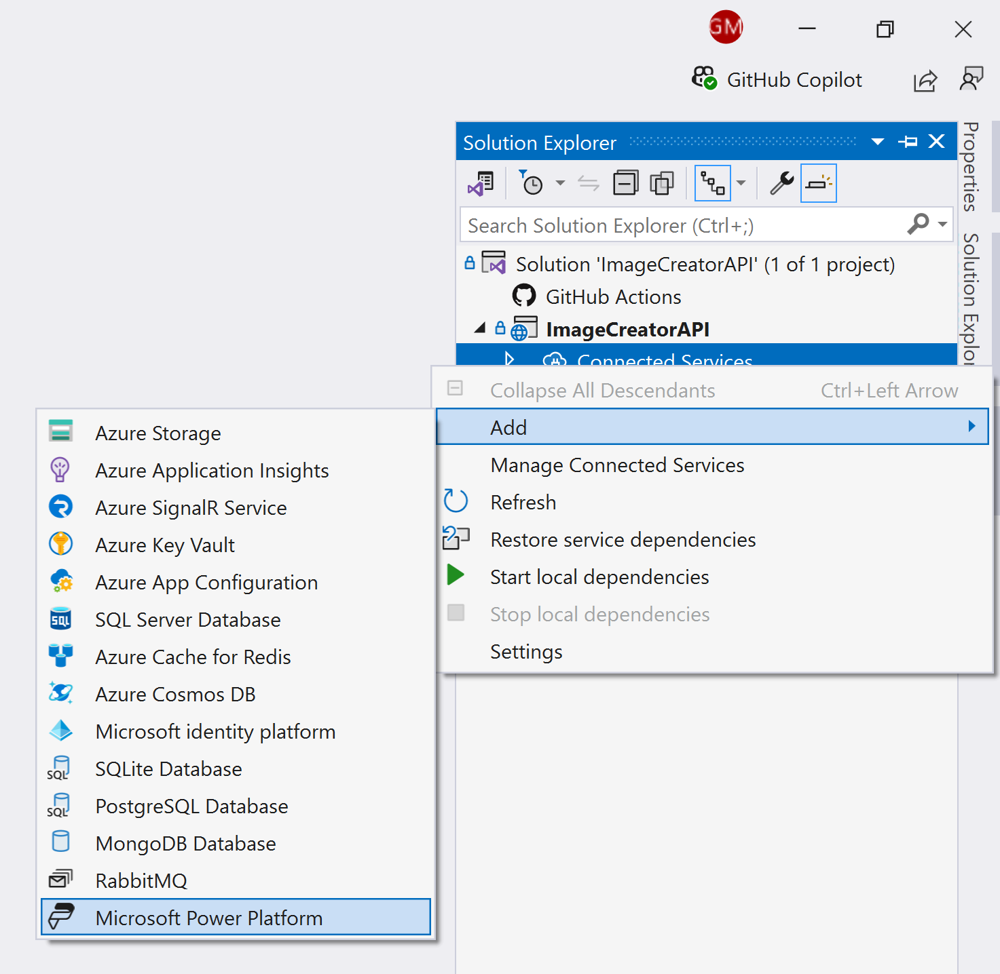

* Ensure you're signed in with the same Power Apps account you used to import the solution, and configure the following:
    * **Power Platform environments**: Select the environment where you imported the solution
    * **Solution**: Select the **Image Creator Solution**
    * **Custom Connector**: Create a new custom connector and call it `ImageCreator_Connector`
    * **OpenAPI specification**: Select the `Auto-generate the OpenAPI V2 Specification` option
    * **Dev Tunnel**: Create a new dev tunnel and call it `ImageCreator_Tunnel`
* Select **Finish** and the custom connector will be created.
* Once complete, run the project in Visual Studio.
* In the newly opened browser window, select **Continue** to connect to your Developer Tunnel.

    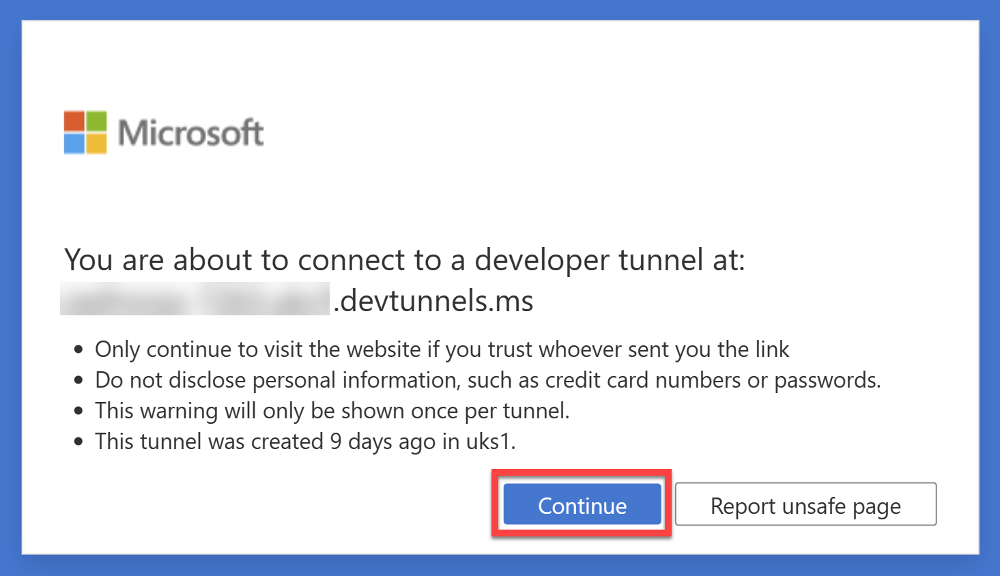

* Once connected, the custom connector will be active and available to use in your Power Apps environment. Don't close the browser window and navigate back to the **Solutions** tab in Power Apps Studio.

**Step 3: Add the Custom Connector to the Power Automate flow.**

* Open the **Image Creator Solution** and navigate to **Cloud Flows** > **Generate Image with AI**.
* Open the flow in **Edit mode**.
* Between the two nodes, add a new action and search for `imagecreator` and select **Generates Image**.

    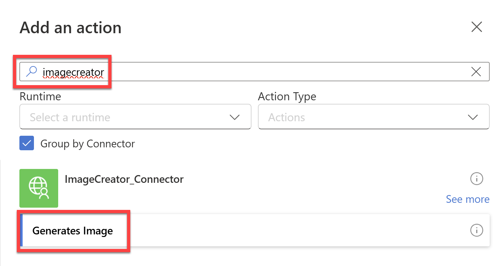

* Create a connection to the `ImageCreator_Connector`.
* Once the connection has been created, select the **Prompt** field and then select the **Dynamic Content** icon and select **Prompt** from the list of dynamic content.
* Then select the **Respond to Copilot** node and select **body/imageUrl** from the Dynamic Content list for ImageUrl

    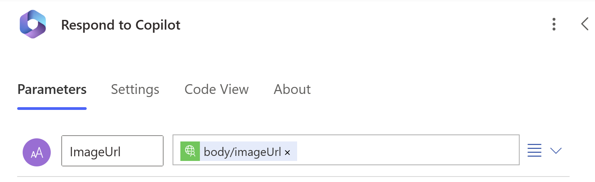

* Publish the flow.

### Using the source code

You can also use the [Power Apps CLI](https://docs.microsoft.com/powerapps/developer/data-platform/powerapps-cli) to pack the source code by following these steps:

* Clone the repository to a local drive
* Pack the source files back into a solution `.zip` file:

  ```bash
  pac solution pack --zipfile pathtodestinationfile --folder pathtosourcefolder --processCanvasApps
  ```

  Making sure to replace `pathtosourcefolder` to point to the path to this sample's `sourcecode` folder, and `pathtodestinationfile` to point to the path of this solution's `.zip` file (located under the `solution` folder)
* Within **Power Apps Studio**, import the solution `.zip` file using **Solutions** > **Import Solution** and select the `.zip` file you just packed.

* Once completed, follow along from **Step 2** above.

## Features

This solution illustrates the following concepts on top of the Power Platform. With the Azure OpenAI Service, .NET, and Power Platform, this solution demonstrates an easy way to generate images with AI through a copilot.

In the copilot, you can start a conversation by asking it how to generate an image:

* The copilot will then trigger a topic that prompts you to enter a description of the image you want to generate.
* Once you enter the description, the copilot will call a Power Automate flow that connects to a Custom Connector.
* This Custom Connector is connected to a .NET API that uses the Azure OpenAI Service Dalle3 model to generate an image based on the description you provided.
* The image is then returned to the copilot and displayed in the chat as an adaptive card.

## Help

We do not support samples, but this community is always willing to help, and we want to improve these samples. We use GitHub to track issues, which makes it easy for  community members to volunteer their time and help resolve issues.

If you encounter any issues while using this sample, you can [create a new issue](https://github.com/pnp/powerapps-samples/issues/new?assignees=&labels=Needs%3A+Triage+%3Amag%3A%2Ctype%3Abug-suspected&template=bug-report.yml&sample=image-creator&authors=@gomomohapi&title=image-creator%20-%20).

For questions regarding this sample, [create a new question](https://github.com/pnp/powerapps-samples/issues/new?assignees=&labels=Needs%3A+Triage+%3Amag%3A%2Ctype%3Abug-suspected&template=question.yml&sample=image-creator&authors=@gomomohapi&title=image-creator%20-%20).

Finally, if you have an idea for improvement, [make a suggestion](https://github.com/pnp/powerapps-samples/issues/new?assignees=&labels=Needs%3A+Triage+%3Amag%3A%2Ctype%3Abug-suspected&template=suggestion.yml&sample=image-creator&authors=@gomomohapi&title=image-creator%20-%20).

## Disclaimer

**THIS CODE IS PROVIDED *AS IS* WITHOUT WARRANTY OF ANY KIND, EITHER EXPRESS OR IMPLIED, INCLUDING ANY IMPLIED WARRANTIES OF FITNESS FOR A PARTICULAR PURPOSE, MERCHANTABILITY, OR NON-INFRINGEMENT.**


