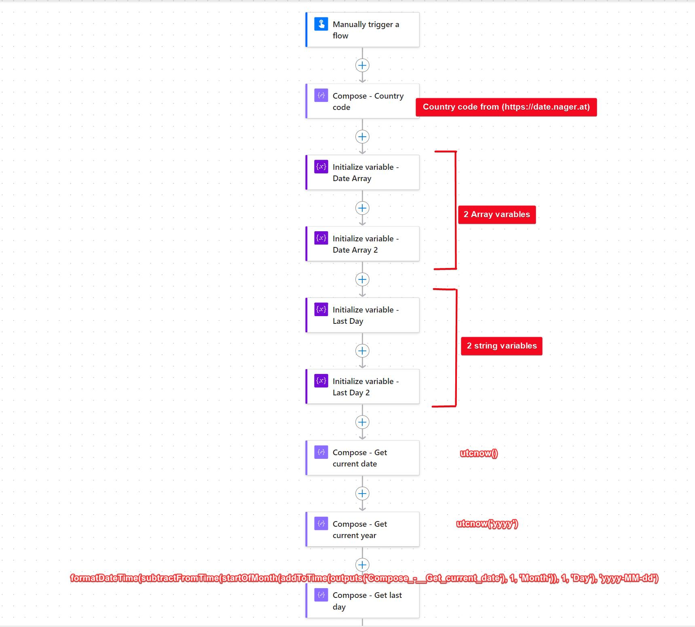
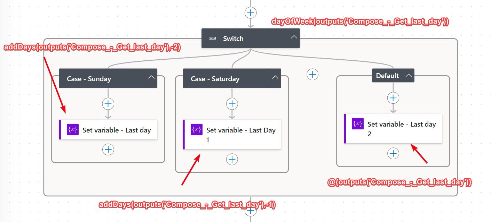
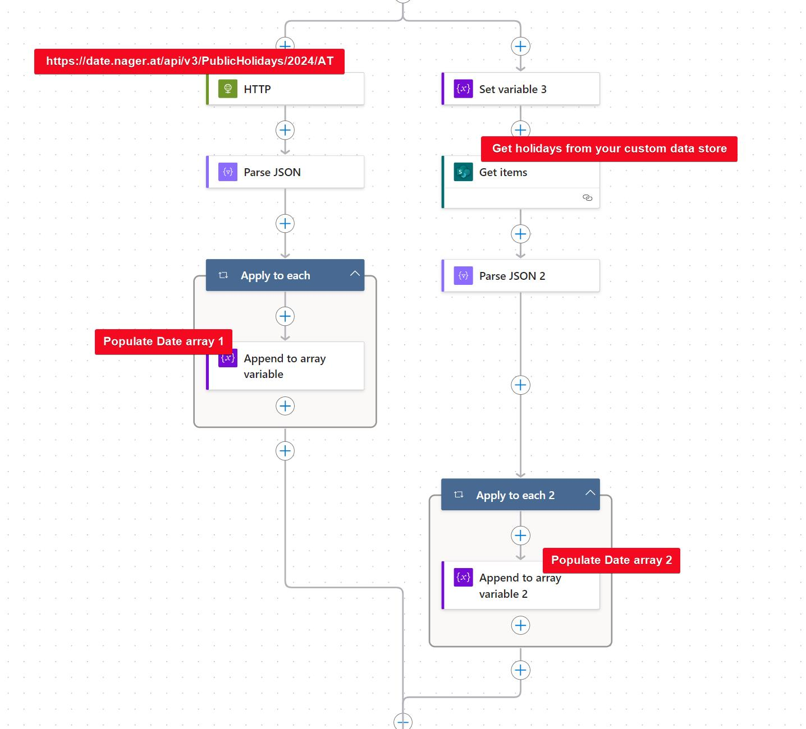
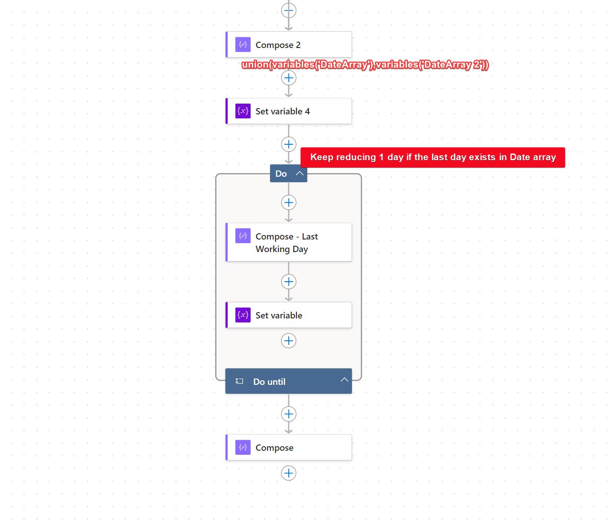
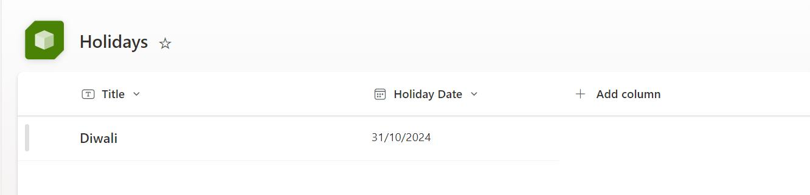

# Date of the last working day of the month

## Summary

This sample flow calculates the last working date of the month, accounting for weekends and holidays. It utilizes the following key components:

* The flow leverages an [API] (https://date.nager.at/swagger/index.html) to retrieve holidays for a specified year and country.
* For holidays not included in the API's response, the flow allows for the addition of special holidays using a custom data store, such as SharePoint.
* The flow takes into account weekends when determining the last working day.
* This approach can be adapted to various countries and organizational needs.







## Applies to


## Compatibility


## Contributors

* [Sudeep Ghatak](https://github.com/sudeepghatak) | [LinkedIn] (https://www.linkedin.com/in/sudeepghatak/)

## Version history

Version|Date|Comments
-------|----|--------
1.0|July 22, 2024|Initial release

## Features

This sample flow demonstrates the following key concepts:

* Calling an External Web Service: Leverage an API to retrieve relevant data (e.g., public holidays).
* Date Calculations: Perform date manipulations to determine specific days, such as the last working day of the month.
* Usage of Arrays: Utilize arrays to store and manage lists of dates, such as holidays and weekends.
* Do While Loops: Implement do while loops to iterate through dates until the desired condition is met.


## Prerequisites

You must have a Power Automate premium license to call external web service.
You must have a list provisioned to store additional holidays.


### Connection References
The solution includes two connection references.
* SharePoint Connection


### Using the solution zip

The following solution components are used in this sample:

Component|Type
---------|-----
Getthelastworkingday_1_0_0_2.zip | Power Automate Solution


## Minimal Path to Awesome

### Using the solution zip
1. [Download](./solution/Getthelastworkingday_1_0_0_2.zip) the solution `.zip` from the `solution` folder.
2. Within **https://make.powerautomate.com**, import the `.zip` file via **Solutions** > **Import solution** > **Browse** and select the `.zip` file you just downloaded.
3. Once the solution is imported, edit it

### Using the source code

You can also use the [Power Apps CLI](https://docs.microsoft.com/powerapps/developer/data-platform/powerapps-cli) to pack the source code by following these steps:

* Clone the repository to a local drive
* Pack the source files back into a solution `.zip` file:

  ```bash
  pac solution pack --zipfile pathtodestinationfile --folder pathtosourcefolder --processCanvasApps
  ```

  Making sure to replace `pathtosourcefolder` to point to the path to this sample's `sourcecode` folder, and `pathtodestinationfile` to point to the path of this solution's `.zip` file (located under the `solution` folder)
* Within **Power Apps Studio**, import the solution `.zip` file using **Solutions** > **Import Solution** and select the `.zip` file you 


## Features

This sample illustrates the following concepts:

* Calculating the last working day of the month
* Calling an external web service to get holidays with Year and Country Codes as parameters
* Getting holidays from an internal data store (SharePoint in this case)
* Date calculations to deduce the last working day

## Help

We do not support samples, but this community is always willing to help, and we want to improve these samples. We use GitHub to track issues, which makes it easy for  community members to volunteer their time and help resolve issues.

If you encounter any issues while using this sample, you can [create a new issue](https://github.com/pnp/powerapps-samples/issues/new?assignees=&labels=Needs%3A+Triage+%3Amag%3A%2Ctype%3Abug-suspected&template=bug-report.yml&sample=json-string-generator&authors=@shaheerahmadch&title=json-string-generator%20-%20).

For questions regarding this sample, [create a new question](https://github.com/pnp/powerapps-samples/issues/new?assignees=&labels=Needs%3A+Triage+%3Amag%3A%2Ctype%3Abug-suspected&template=question.yml&sample=json-string-generator&authors=@shaheerahmadch&title=json-string-generator%20-%20).

Finally, if you have an idea for improvement, [make a suggestion](https://github.com/pnp/powerapps-samples/issues/new?assignees=&labels=Needs%3A+Triage+%3Amag%3A%2Ctype%3Abug-suspected&template=suggestion.yml&sample=json-string-generator&authors=@shaheerahmadch&title=json-string-generator%20-%20).

## Disclaimer

**THIS CODE IS PROVIDED *AS IS* WITHOUT WARRANTY OF ANY KIND, EITHER EXPRESS OR IMPLIED, INCLUDING ANY IMPLIED WARRANTIES OF FITNESS FOR A PARTICULAR PURPOSE, MERCHANTABILITY, OR NON-INFRINGEMENT.**


