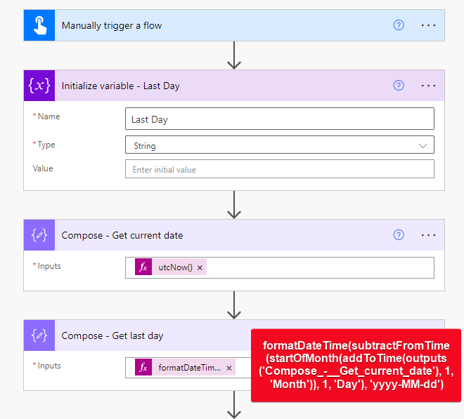
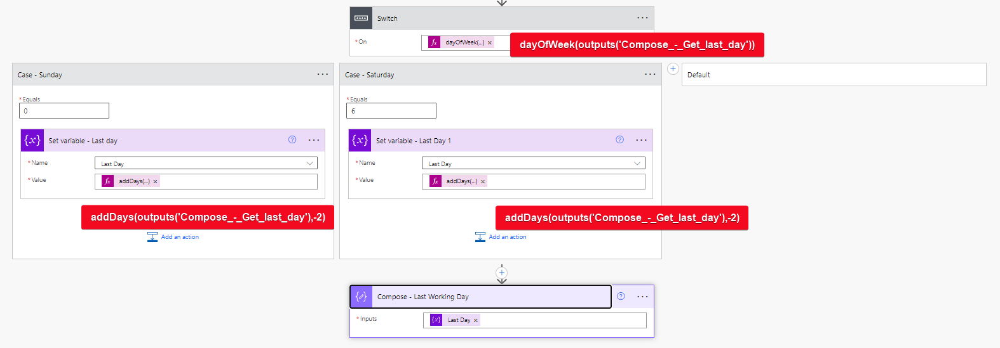

# Date of the last working day of the month

## Summary

This sample flow calculates the last working date of the month taking into account the weekends. See more information on [my blog](https://sudeepghatak.com/last-working-day-of-the-month/) 

## Applies to

## Compatibility

## Contributors

* [Sudeep Ghatak](https://www.linkedin.com/in/sudeepghatak/)

## Version history

Version|Date|Comments
-------|----|--------
1.0|July 22, 2024|Initial release

## Prerequisites

None

## Solution Components

The following solution components are used in this sample:

Component|Type
---------|-----
Getthelastworkingday_1_0_0_1.zip | Power Automate Solution
Flow_Get-the-last-working-day.zip | Power Automate Flow

## Minimal Path to Awesome

You can either import individual flows or entire solutions, depending on your needs. 

### Import the solution
1. [Download](./solution/Getthelastworkingday_1_0_0_1.zip) the solution `.zip` from the `solution` folder.
2. Within **https://make.powerautomate.com**, import the `.zip` file via **Solutions** > **Import solution** > **Browse** and select the `.zip` file you just downloaded.
3. Follow the on-screen instructions to deploy the application.
4. Access the Power Automate flow from within the imported solution

### Import the flow
1. [Download](./flow/Flow_Get-the-last-working-day.zip) the flow `.zip` from the `flow` folder.
2. Within **https://make.powerautomate.com**, import the `.zip` file by following the instructions below:
3. Click on the “Upload” button and select the `.zip` file you downloaded.
4. The package details will be displayed, showing the components included in the package.
5. Map the resources in the package to existing resources or create new ones. This might include connections, custom connectors, or other dependent components.
6. After configuring the necessary components, click “Import” to begin the import process.
7. Wait for the import process to complete. This may take a few minutes depending on the complexity of the flow.

## Features

This sample illustrates the following concepts:

* Calculating the last working day of the month

## Help

We do not support samples, but this community is always willing to help, and we want to improve these samples. We use GitHub to track issues, which makes it easy for  community members to volunteer their time and help resolve issues.

If you encounter any issues while using this sample, you can [create a new issue](https://github.com/pnp/powerapps-samples/issues/new?assignees=&labels=Needs%3A+Triage+%3Amag%3A%2Ctype%3Abug-suspected&template=bug-report.yml&sample=json-string-generator&authors=@shaheerahmadch&title=json-string-generator%20-%20).

For questions regarding this sample, [create a new question](https://github.com/pnp/powerapps-samples/issues/new?assignees=&labels=Needs%3A+Triage+%3Amag%3A%2Ctype%3Abug-suspected&template=question.yml&sample=json-string-generator&authors=@shaheerahmadch&title=json-string-generator%20-%20).

Finally, if you have an idea for improvement, [make a suggestion](https://github.com/pnp/powerapps-samples/issues/new?assignees=&labels=Needs%3A+Triage+%3Amag%3A%2Ctype%3Abug-suspected&template=suggestion.yml&sample=json-string-generator&authors=@shaheerahmadch&title=json-string-generator%20-%20).

## Disclaimer

**THIS CODE IS PROVIDED *AS IS* WITHOUT WARRANTY OF ANY KIND, EITHER EXPRESS OR IMPLIED, INCLUDING ANY IMPLIED WARRANTIES OF FITNESS FOR A PARTICULAR PURPOSE, MERCHANTABILITY, OR NON-INFRINGEMENT.**

