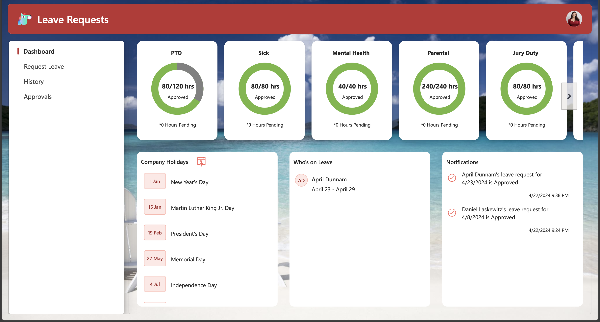
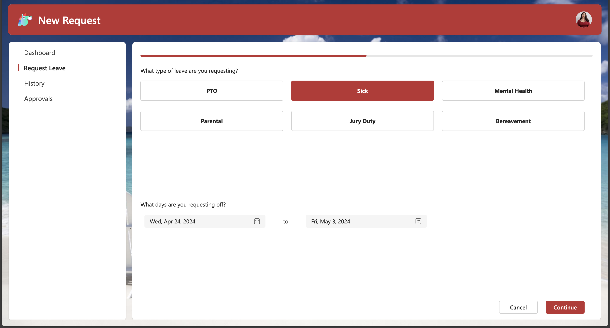
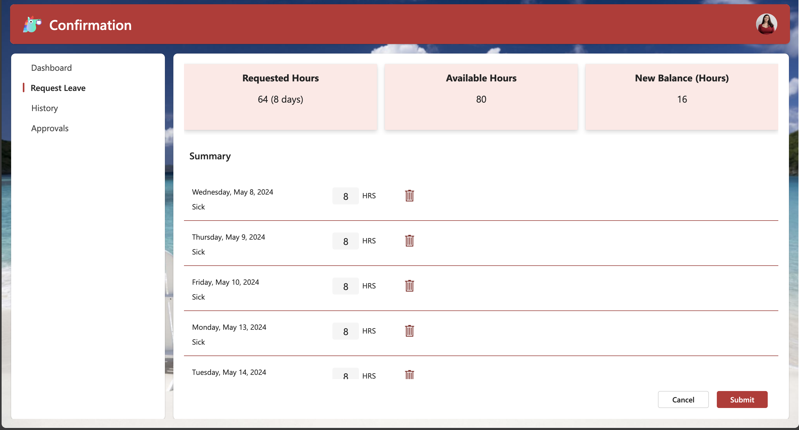
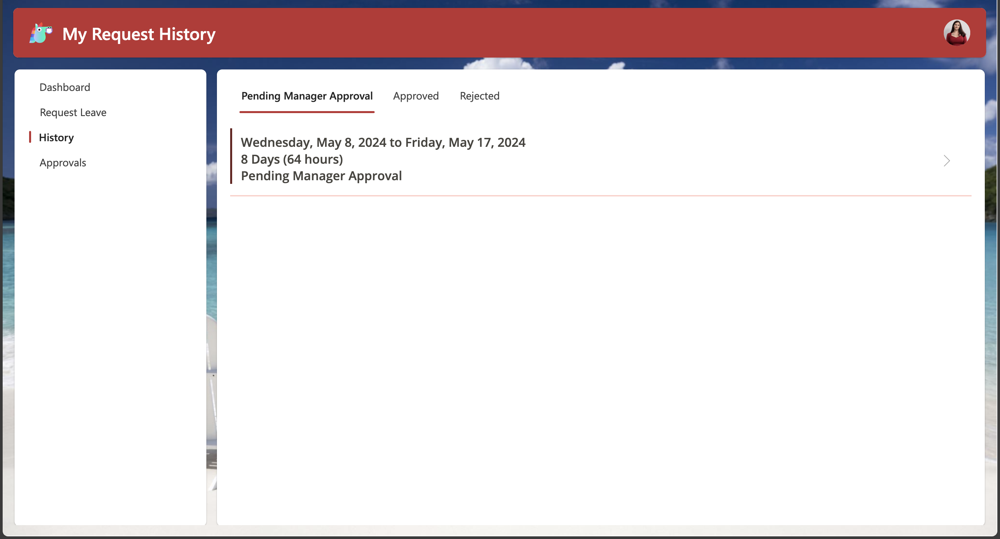
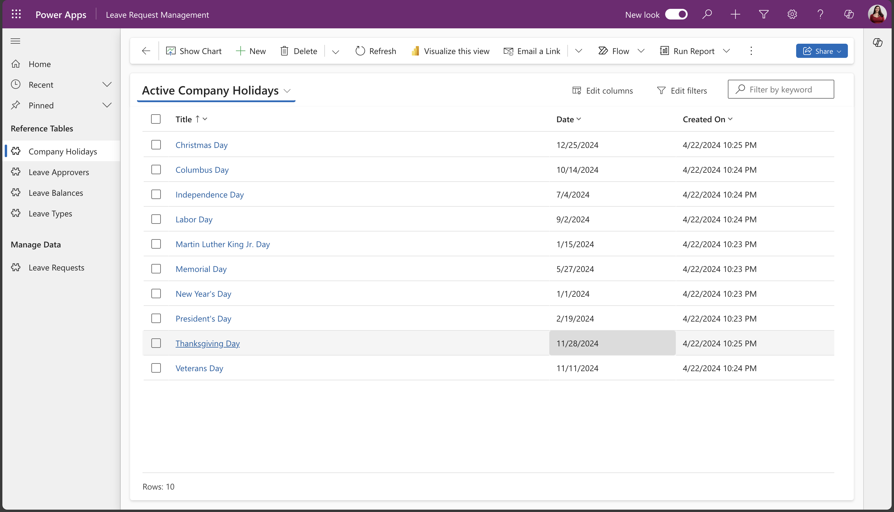
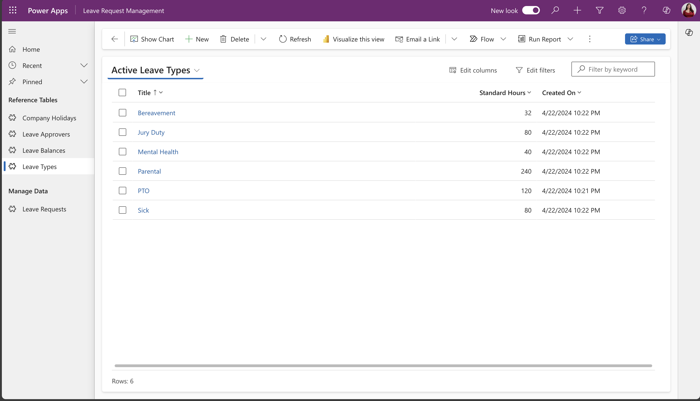
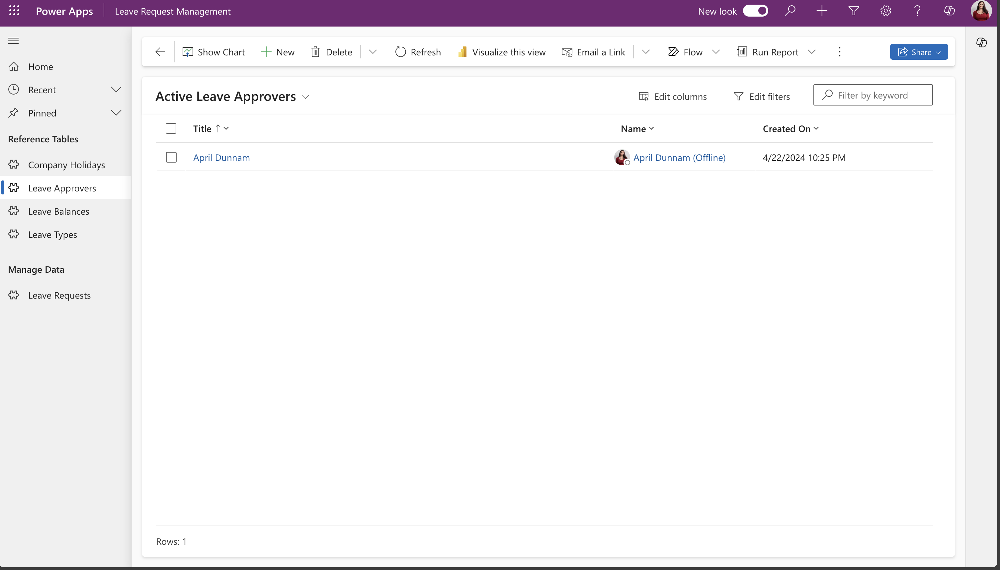
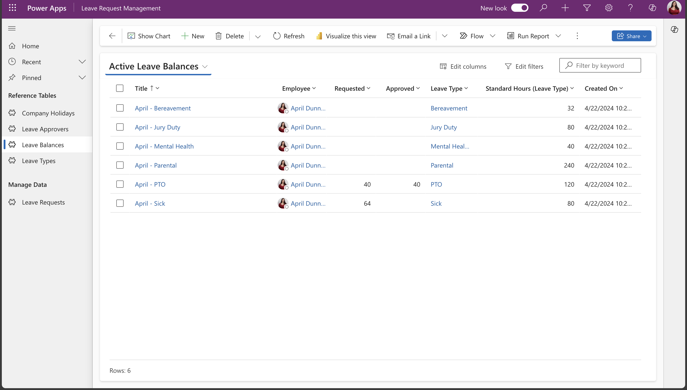

# Leave Request Template

## Summary

This template provides you with a solid foundation for a leave request system, consisting of a canvas app for users to see and submit their requests and a model driven app for administrators to manage the underlying data in Dataverse.



## Applies to


## Compatibility


## Contributors

- [April Dunnam](https://github.com/aprildunnam)

## Version history

Version|Date|Comments
-------|----|--------
1.0|April 22, 2024|Initial release

## Features

This template not only gives you a good foundation for customizing your own leave request system, it also demonstrates multiple patterns that you can use across other apps.

### Key Features of the solution include:
* A dashboard landing page featuring custom SVG's to see a visual of remaining leave balances, notifications, a list of your fellow team members who have upcoming leave and a list of company holidays which you can add to your calendar from the app.

* The ability to add new leave requests by category with the added built-in functionality to exclude weekends from your total days/hours requested calculation and the ability to limit submitting multiple leave requests for the same period.

* A custom confirmation screen which will show the user what their new leave balance will be if the request is approved and the ability to customize how many hours they will be gone each day.

* A history page where users can see all of their submitted requests and filter by status.

* An approvals page for designated approvers to process leave requests. When a request is processed by the approver, an email is automatically sent to the requestor informing them of the outcome.


## Data Sources

* Dataverse

## Minimal Path to Awesome

* [Download](./solution/leave-request.zip) the `.zip` from the `solution` folder
* Within **Power Apps Studio**, import the solution `.zip` file using **Solutions** > **Import Solution** and select the `.zip` file you just packed.
* Open the Leave Request Management App and add in your data in the Company Holidays, Leave Types, Leave Approvers and Leave Balances tables.  See examples of the data below:





## Using the Source Code

You can also use the [Power Apps CLI](https://docs.microsoft.com/powerapps/developer/data-platform/powerapps-cli) to pack the source code by following these steps::

* Clone the repository to a local drive
* Pack the source files back into a solution `.zip` file:

  ```bash
  pac solution pack --zipfile pathtodestinationfile --folder pathtosourcefolder --processCanvasApps
  ```

  Making sure to replace `pathtosourcefolder` to point to the path to this sample's `sourcecode` folder, and `pathtodestinationfile` to point to the path of this solution's `.zip` file (located under the `solution` folder)
* Within **Power Apps Studio**, import the solution `.zip` file using **Solutions** > **Import Solution** and select the `.zip` file you just packed.

## Disclaimer

**THIS CODE IS PROVIDED *AS IS* WITHOUT WARRANTY OF ANY KIND, EITHER EXPRESS OR IMPLIED, INCLUDING ANY IMPLIED WARRANTIES OF FITNESS FOR A PARTICULAR PURPOSE, MERCHANTABILITY, OR NON-INFRINGEMENT.**

## Help

We do not support samples, but we this community is always willing to help, and we want to improve these samples. We use GitHub to track issues, which makes it easy for  community members to volunteer their time and help resolve issues.

If you encounter any issues while using this sample, you can [create a new issue](https://github.com/pnp/powerapps-samples/issues/new?assignees=Laskewitz&labels=Needs%3A+Triage+%3Amag%3A%2Ctype%3Abug-suspected&template=bug-report.yml&sample=leave-request&authors=@aprildunnam&title=leave-request%20-%20).

For questions regarding this sample, [create a new question](https://github.com/pnp/powerapps-samples/issues/new?assignees=Laskewitz&labels=Needs%3A+Triage+%3Amag%3A%2Ctype%3Abug-suspected&template=question.yml&sample=leave-request&authors=@aprildunnam&title=leave-request%20-%20).

Finally, if you have an idea for improvement, [make a suggestion](https://github.com/pnp/powerapps-samples/issues/new?assignees=Laskewitz&labels=Needs%3A+Triage+%3Amag%3A%2Ctype%3Abug-suspected&template=suggestion.yml&sample=leave-request&authors=@aprildunnam&title=leave-request%20-%20).

## For more information

* [Overview of creating apps in Power Apps](https://docs.microsoft.com/powerapps/maker/)
* [Power Apps canvas apps documentation](https://docs.microsoft.com/powerapps/maker/canvas-apps/)


