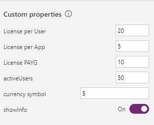

# Power Apps License Calculator

## Summary

Full Power Apps capabilities are licensed via Power Apps subscriptions on a per app/user or per user basis and via pay-as-you-go.
||Power Apps Premium|Power Apps per app|Power Apps per app pay-as-you-go|
|-|-|-|-|
|Licensing scheme|Per user|Per user, per app|Per Active User|
|Description|Equips user to run unlimited applications and access unlimited Power Pages websites|Licenses individual user to run 1 application or access 1 Power Pages website|Allows user to access 1 application|
|Cost|$20|$5|$10|

The latest information about Power Platform can be found here: [Licensing overview for Microsoft Power Platform](https://learn.microsoft.com/en-us/power-platform/admin/pricing-billing-skus#:~:text=More%20details%20around%20capabilities%20and%20pricing%20of%20the%20Power%20Platform)

These licensing models and their impact on the final license cost may be confusing at first. The "licence calculator" is a component that can be easily embedded in any Canvas App or App for Teams, to provide stakeholders with estimates of total licensing costs, and recommendations for the license types that are most cost effective.

> Please note that licensing is not that simple, and the license you chose will also depend on which licenses are already in use. This calculator may give you a general feeling about what may happen in the future, as more and more applications are used in your company. Make sure to consult your procurement department and Microsoft sales representative before making decisions. Remember that this calculator is just a toy 😁

By default, the application displays a matrix of the **license prices** for different number of users and applications, assuming that the cheapest option is choosen.

Users may switch the calculator mode to see the **licensing type**, and can also see how a number of **active monthly users** will impact the final cost.


The prices may change, and some companies may benefit from Volume Licensing. The component is configurable and allows defining current prices, along with the currency:



## Applies to


## Compatibility


## Contributors

* [Kinga Kazala](https://github.com/kkazala)

## Version history

|Version|Date|Comments|
|-|-|-|
|1.0|January 30, 2024|Initial release|

## Prerequisites

None

## Solution Components

The following solution components are used in this sample:

|Component|Type|
|-|-|
|License Calculator Component | Component Library|
|License Calculator | Canvas App|

## Minimal Path to Awesome

1. [Download](./solution/license-calculator.zip) the solution `.zip` from the `solution` folder.
2. Within **https://make.powerapps.com**, import the `.zip` file via **Solutions** > **Import solution** > **Browse** and select the `.zip` file you just downloaded.
3. Follow the on-screen instructions to deploy the application.
4. Access the License Calculator Canvas App to see the licensing costs and recommendations.

## Using the Source Code

You can also use the [Power Apps CLI](https://aka.ms/pac/docs) to pack the source code by following these steps:

1. Clone the repository to a local drive.
2. Pack the source files back into `.zip` file:
   ```bash
   pac solution pack --folder pathtosourcefolder --zipfile pathtosolution  --processCanvasApps
   ```

## Features

This sample illustrates the following concepts:

* using Components Library
* using Galleries, along with `wrap` parameter to easily generate visually compelling matrix, using simple collections
* and most importantly, the impact of different license models on the solution cost.

## Help

We do not support samples, but this community is always willing to help, and we want to improve these samples. We use GitHub to track issues, which makes it easy for  community members to volunteer their time and help resolve issues.

If you encounter any issues while using this sample, you can [create a new issue](https://github.com/pnp/powerapps-samples/issues/new?assignees=&labels=Needs%3A+Triage+%3Amag%3A%2Ctype%3Abug-suspected&template=bug-report.yml&sample=license-calculator&authors=@kkazala&title=license-calculator%20-%20).

For questions regarding this sample, [create a new question](https://github.com/pnp/powerapps-samples/issues/new?assignees=&labels=Needs%3A+Triage+%3Amag%3A%2Ctype%3Abug-suspected&template=question.yml&sample=license-calculator&authors=@kkazala&title=license-calculator%20-%20).

Finally, if you have an idea for improvement, [make a suggestion](https://github.com/pnp/powerapps-samples/issues/new?assignees=&labels=Needs%3A+Triage+%3Amag%3A%2Ctype%3Abug-suspected&template=suggestion.yml&sample=license-calculator&authors=@kkazala&title=license-calculator%20-%20).

## Disclaimer

**THIS CODE IS PROVIDED *AS IS* WITHOUT WARRANTY OF ANY KIND, EITHER EXPRESS OR IMPLIED, INCLUDING ANY IMPLIED WARRANTIES OF FITNESS FOR A PARTICULAR PURPOSE, MERCHANTABILITY, OR NON-INFRINGEMENT.**


