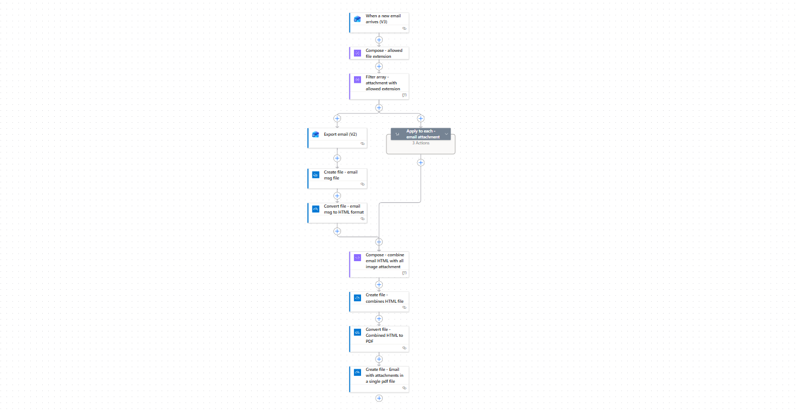

# Archive email and attachments in a pdf file

## Summary

This sample showcases how to merge an email and its attachments into a single PDF file using standard Power Automate actions. The generated archive PDF is stored in a designated OneDrive folder. Additionally, the flow highlights how to leverage the conversion capabilities of the OneDrive connector to handle Office documents and PDF files as part of the archival process.

**Features:**

* Archive email and attachments (office docs, pdf etc.) into a pdf file
* Export email as html file 
* Method to combine email and attachments 
* Expression



## Applies to


## Compatibility


## Contributors

* [Manish Solanki](https://github.com/Solanki-Manish)

## Version history

Version|Date|Comments
-------|----|--------
1.0|Jan 24, 2026|Initial release

## Prerequisites

### Connection References
The solution includes two connection references.
* Office 365 Outlook Connection
* OneDrive For Business  Connection

### Environment Variable
When importing the solution, there are a variety of environment variables that need to be completed.

Variable|Type|Details
-------|----|--------
Incoming Email Subject | Text | Defines the subject filter used to trigger the workflow from an email
Output Archive Folder | Text | Specifies the OneDrive folder path where the archived PDF will be saved

## Minimal Path to Awesome

### Import Solution

* [Download](./solution/mail-archive-pdf.zip) the `.zip` from the `solution` folder
* [Import](https://learn.microsoft.com/en-us/power-apps/maker/data-platform/import-update-export-solutions) the `.zip` file using **Solutions** > **Import Solution**.

### Using the source code

You can also use the [Power Apps CLI](https://docs.microsoft.com/powerapps/developer/data-platform/powerapps-cli) to pack the source code by following these steps:

* Clone the repository to a local drive
* Pack the source files back into a solution `.zip` file:

  ```bash
  pac solution pack --zipfile pathtodestinationfile --folder pathtosourcefolder --processCanvasApps
  ```

  Making sure to replace `pathtosourcefolder` to point to the path to this sample's `sourcecode` folder, and `pathtodestinationfile` to point to the path of this solution's `.zip` file (located under the `solution` folder)
* Within **Power Apps Studio**, import the solution `.zip` file using **Solutions** > **Import Solution** and select the `.zip` file you just packed.

## Features

This sample illustrates the following concepts:

* Reusablility
* Use of XML & XPATH for complex automation scenerios  
* Use of complex nested expressions
* Concept of parent-child flow

## Help

We do not support samples, but this community is always willing to help, and we want to improve these samples. We use GitHub to track issues, which makes it easy for  community members to volunteer their time and help resolve issues.

If you encounter any issues while using this sample, you can [create a new issue](https://github.com/pnp/powerapps-samples/issues/new?assignees=&labels=Needs%3A+Triage+%3Amag%3A%2Ctype%3Abug-suspected&template=bug-report.yml&sample=mail-archive-pdf&authors=@Solanki-Manish&title=mail-archive-pdf).

For questions regarding this sample, [create a new question](https://github.com/pnp/powerapps-samples/issues/new?assignees=&labels=Needs%3A+Triage+%3Amag%3A%2Ctype%3Abug-suspected&template=question.yml&sample=mail-archive-pdf&authors=@Solanki-Manish&title=mail-archive-pdf).

Finally, if you have an idea for improvement, [make a suggestion](https://github.com/pnp/powerapps-samples/issues/new?assignees=&labels=Needs%3A+Triage+%3Amag%3A%2Ctype%3Abug-suspected&template=suggestion.yml&sample=mail-archive-pdfy&authors=@Solanki-Manish&title=mail-archive-pdf).

## Disclaimer

**THIS CODE IS PROVIDED *AS IS* WITHOUT WARRANTY OF ANY KIND, EITHER EXPRESS OR IMPLIED, INCLUDING ANY IMPLIED WARRANTIES OF FITNESS FOR A PARTICULAR PURPOSE, MERCHANTABILITY, OR NON-INFRINGEMENT.**


