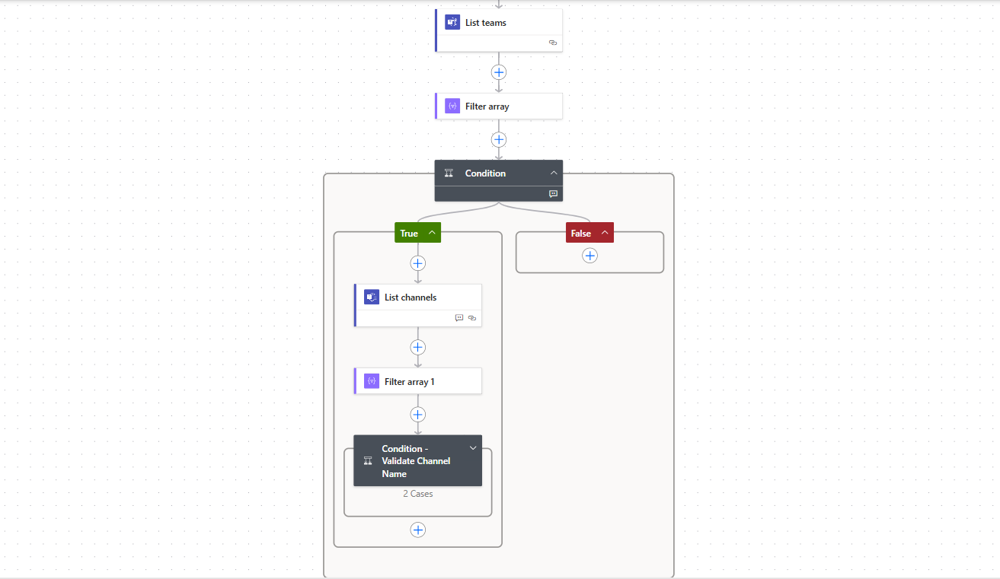

# Mention Teams or Channel in the message post

## Summary

This sample mention team or channel in the message post. This flow can be used as a child flow to mention team or channel in message based on the values of input parameters.




## Applies to

* [Power Automate](https://docs.microsoft.com/power-automate/)
* [Microsoft Graph](https://learn.microsoft.com/en-us/graph/)
* [Microsoft Teams](https://learn.microsoft.com/en-us/microsoftteams/)

## Compatibility


## Contributors

* [Manish Solanki](https://github.com/Solanki-Manish)


## Version history

Version|Date|Comments
-------|----|--------
1.0|Mar 2, 2025|Initial release


## Features

This sample illustrates the following concepts:

* Mention team to channel in message post using standard connectors
* Standard action 'Send a Microsoft Graph HTTP request' 
* Graph API call to to mention team or channel using standard teams action
* Child flow with input parameters
* Reusablility of child flow
* Expression


## Prerequisites

### Connection References
The solution includes a connection references.
* Microsoft Teams Connection

### Flow Input Parameters
Following are the flow input variables.

Parameter|Type|Details
-------|----|--------
Mention To | Drop Down List | Option to choose mention (team or channel).
Teams Name | String | Display name of the Microsoft Teams.
Channel Name | String | Display name of the Microsoft Teams Channel.
Message Text | String | Text message in the post.


## Minimal Path to Awesome

### Using the solution zip

* [Download](./solution/mention-teams-channel-in-post.zip) the `.zip` from the `solution` folder
* Within **Power Apps Studio**, [import](https://learn.microsoft.com/en-us/power-apps/maker/data-platform/import-update-export-solutions) the solution `.zip` file using **Solutions** > **Import Solution** and select the `.zip` file you just packed.

### Using the source code

You can also use the [Power Apps CLI](https://docs.microsoft.com/powerapps/developer/data-platform/powerapps-cli) to pack the source code by following these steps:

* Clone the repository to a local drive
* Pack the source files back into a solution `.zip` file:

  ```bash
  pac solution pack --zipfile pathtodestinationfile --folder pathtosourcefolder --processCanvasApps
  ```

  Making sure to replace `pathtosourcefolder` to point to the path to this sample's `sourcecode` folder, and `pathtodestinationfile` to point to the path of this solution's `.zip` file (located under the `solution` folder)
* Within **Power Apps Studio**, import the solution `.zip` file using **Solutions** > **Import Solution** and select the `.zip` file you just packed.

## Help

We do not support samples, but this community is always willing to help, and we want to improve these samples. We use GitHub to track issues, which makes it easy for  community members to volunteer their time and help resolve issues.

If you encounter any issues while using this sample, you can [create a new issue](https://github.com/pnp/powerapps-samples/issues/new?assignees=&labels=Needs%3A+Triage+%3Amag%3A%2Ctype%3Abug-suspected&template=bug-report.yml&sample=mention-teams-channel-in-post&authors=@Solanki-Manish&title=mention-teams-channel-in-post).

For questions regarding this sample, [create a new question](https://github.com/pnp/powerapps-samples/issues/new?assignees=&labels=Needs%3A+Triage+%3Amag%3A%2Ctype%3Abug-suspected&template=question.yml&sample=mention-teams-channel-in-post&authors=@Solanki-Manish&title=mention-teams-channel-in-post).

Finally, if you have an idea for improvement, [make a suggestion](https://github.com/pnp/powerapps-samples/issues/new?assignees=&labels=Needs%3A+Triage+%3Amag%3A%2Ctype%3Abug-suspected&template=suggestion.yml&sample=mention-teams-channel-in-post&authors=@Solanki-Manish&title=mention-teams-channel-in-post).

## Disclaimer

**THIS CODE IS PROVIDED *AS IS* WITHOUT WARRANTY OF ANY KIND, EITHER EXPRESS OR IMPLIED, INCLUDING ANY IMPLIED WARRANTIES OF FITNESS FOR A PARTICULAR PURPOSE, MERCHANTABILITY, OR NON-INFRINGEMENT.**


