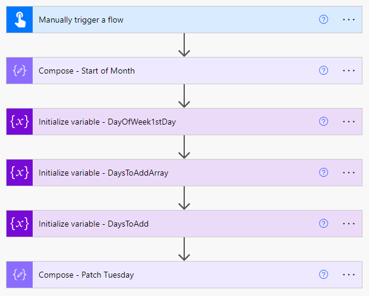

# Patch Tuesday

## Summary

### Methods for calculating Microsoft Patch Tuesday dates

Everyone knows about Microsoft's "Patch Tuesday", and that it falls on the 2nd Tuesday of every month.  It's easy for humans to calculate when Patch Tuesday occurs.  All you have to do is look at a calendar and look for the 2nd Tuesday.  However, what is easy for humans is a bit more difficult for computers to do.  This sample shows a few ways to calculate Patch Tuesday in Power Automate.  With these flows (all included in one sample), you can kick-off other processes that need to occur on Patch Tuesday.

Sample includes (1) an instant cloud flow that will provide a timestamp for Patch Tuesday in the current month, (2) a scheduled cloud flow to run every Tuesday that will determine if it is running on Patch Tuesday, (3) a canvas app that will return a timestamp for Patch Tueday when selecting an arbitrary date, and (4) an instant cloud flow, to support the arbitrary date app.

Patch Tuesday This Month



Is it Patch Tuesday?


Patch Tuesday for an Arbitrary Date


## Applies to


## Compatibility


## Contributors

* [Bob Lamaster](https://github.dev/korebreach)

## Version history

Version|Date|Comments
-------|----|--------
1.1|December 18, 2023|Initial release

## Prerequisites

There are no prerequisites to use the included samples.

## Minimal path to awesome

The included samples may be used in the following ways:

- If you have a need within your own Power Automate flow to determine the date of Patch Tuesday in the current month, incorporate the flow steps found in the flow, "Patch Tuesday This Month".

- If you have a need to launch specific actions from Power Automate on Patch Tuesday, start your own flow with the steps found in the flow, "Is it Patch Tuesday".  This is a scheduled (recurring) flow that runs on every Tuesday to determine if it is Patch Tuesday.  You can put your own steps at the bottom of this flow to replace the example branching step.

- If you have a need to calculate the date of Patch Tuesday related to any past, current or future date, you can use "Patch Tuesday Arbitrary Date Flow".  To use this flow, you need to supply any date (which will be used to calculate the Patch Tuesday date relative to the supplied date).  The example Power App, "Patch Tuesday Arbitrary Date" and the flow, "Patch Tuesday Arbitrary Date Flow" are designed to work together, and should only be used as an example of how to send the date to the flow and get results back to the app.

### Using the solution zip

* [Download](./solution/patch-tuesday.zip) the `.zip` from the `solution` folder
* Within **Power Apps Studio**, import the solution `.zip` file using **Solutions** > **Import Solution** and select the `.zip` file you just packed.
* Review the provided app and flows to determine which function you need (based on "Minimal path to awesome" above), and copy the steps/code to your own flows.

### Using the source code

You can also use the [Power Apps CLI](https://docs.microsoft.com/powerapps/developer/data-platform/powerapps-cli) to pack the source code by following these steps:

* Clone the repository to a local drive
* Pack the source files back into a solution `.zip` file:

  ```bash
  pac solution pack --zipfile pathtodestinationfile --folder pathtosourcefolder --processCanvasApps
  ```

  Making sure to replace `pathtosourcefolder` to point to the path to this sample's `sourcecode` folder, and `pathtodestinationfile` to point to the path of this solution's `.zip` file (located under the `solution` folder)
* Within **Power Apps Studio**, import the solution `.zip` file using **Solutions** > **Import Solution** and select the `.zip` file you just packed.

## Features

Summary of features:

* Determine the date of Patch Tuesday in the current month
* Determine if today is Patch Tuesday and take separate actions depending on the result
* Determine the date of Patch Tuesday corresponding to any date

This solution illustrates the following concepts on top of the Power Platform:

* Sending information from a Power App, processing that information in a flow, and returning the result back to the Power App

<!--
RESERVED FOR REPO MAINTAINERS

We'll add the video from the community call recording here

## Video

[](https://www.youtube.com/watch?v=XXXXX "YouTube video title")
-->

## Help

<!--
You can just search and replace this page with the following values:

Search for:
YOUR-SOLUTION-NAME

Replace with your sample folder name. E.g.: my-cool-sample

Search for:
@korebreach

Replace with your GitHub username, prefixed with an "@". If you have more than one author, use %20 to separate them, making sure to prefix everyone's username individually with an "@".

Example:
@hugoabernier

Or:
@hugoabernier%20@VesaJuvonen%20@PopWarner
-->

> Note: don't worry about this section, we'll update the links.

We do not support samples, but this community is always willing to help, and we want to improve these samples. We use GitHub to track issues, which makes it easy for  community members to volunteer their time and help resolve issues.

If you encounter any issues while using this sample, you can [create a new issue](https://github.com/pnp/powerapps-samples/issues/new?assignees=&labels=Needs%3A+Triage+%3Amag%3A%2Ctype%3Abug-suspected&template=bug-report.yml&sample=patch-tuesday&authors=@korebreach&title=patch-tuesday%20-%20).

For questions regarding this sample, [create a new question](https://github.com/pnp/powerapps-samples/issues/new?assignees=&labels=Needs%3A+Triage+%3Amag%3A%2Ctype%3Abug-suspected&template=question.yml&sample=patch-tuesday&authors=@korebreach&title=patch-tuesday%20-%20).

Finally, if you have an idea for improvement, [make a suggestion](https://github.com/pnp/powerapps-samples/issues/new?assignees=&labels=Needs%3A+Triage+%3Amag%3A%2Ctype%3Abug-suspected&template=suggestion.yml&sample=patch-tuesday&authors=@korebreach&title=patch-tuesday%20-%20).

## Disclaimer

**THIS CODE IS PROVIDED *AS IS* WITHOUT WARRANTY OF ANY KIND, EITHER EXPRESS OR IMPLIED, INCLUDING ANY IMPLIED WARRANTIES OF FITNESS FOR A PARTICULAR PURPOSE, MERCHANTABILITY, OR NON-INFRINGEMENT.**


