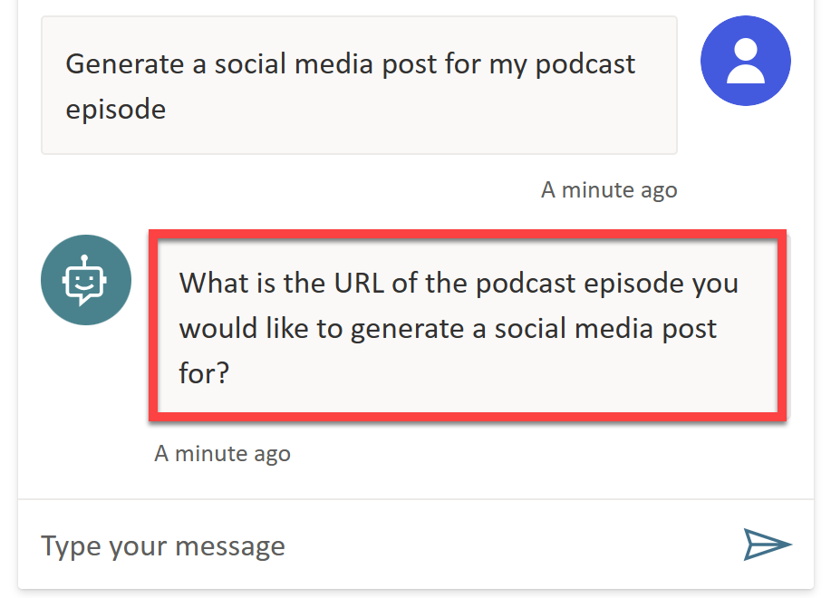
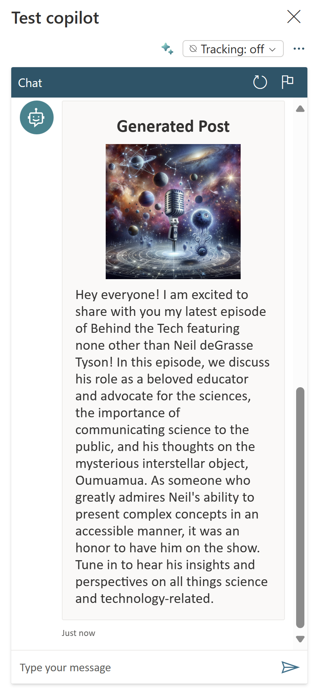
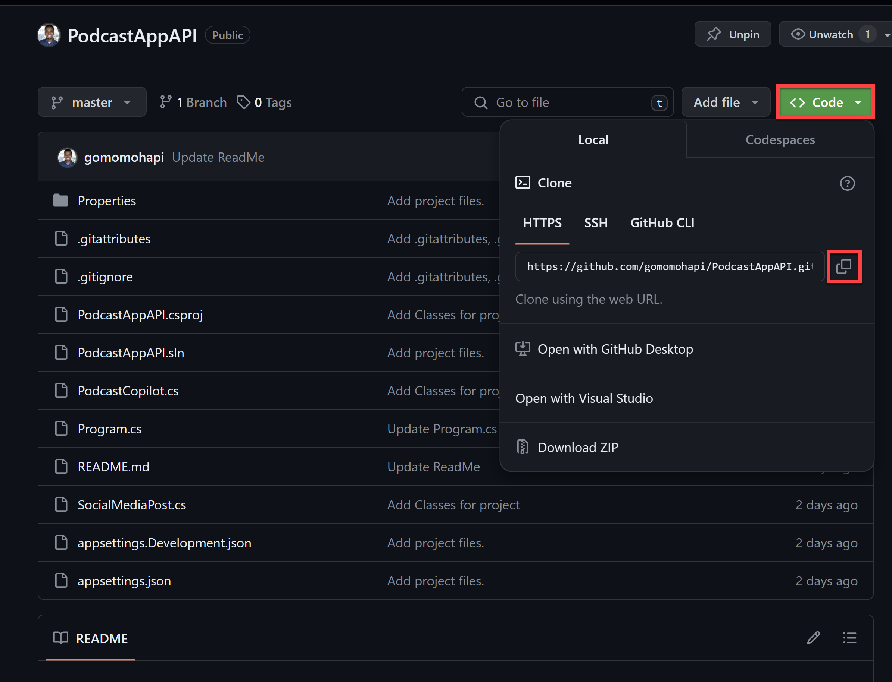
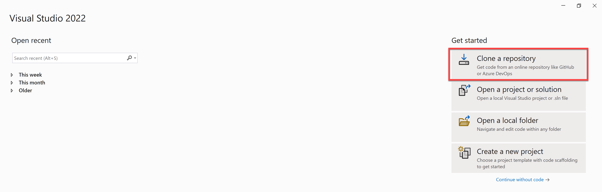
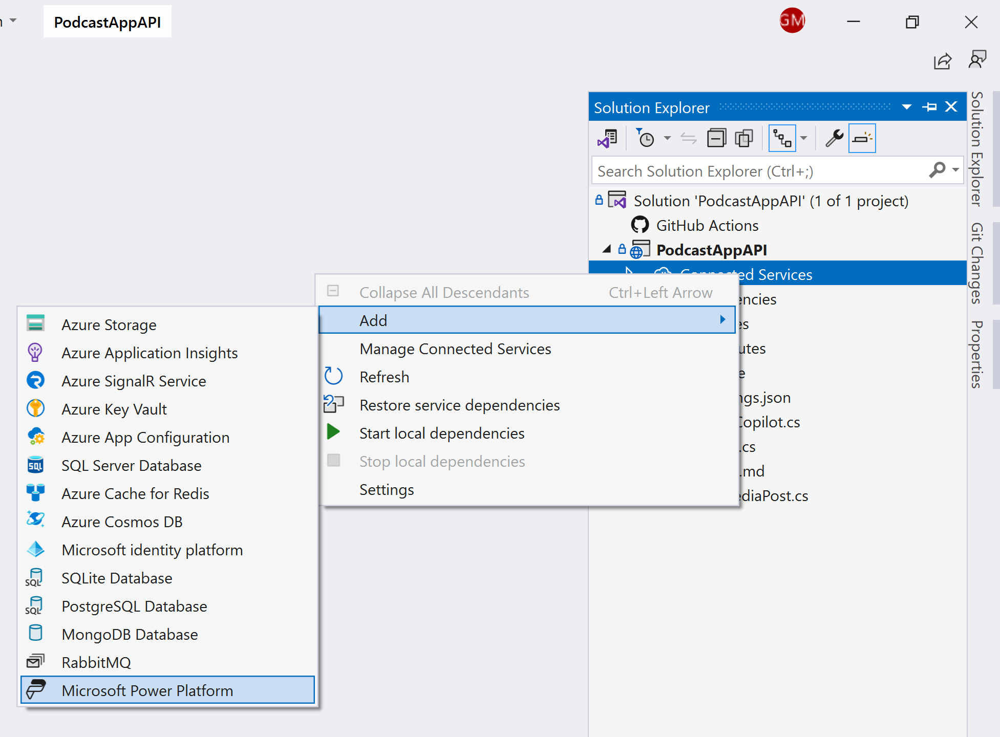
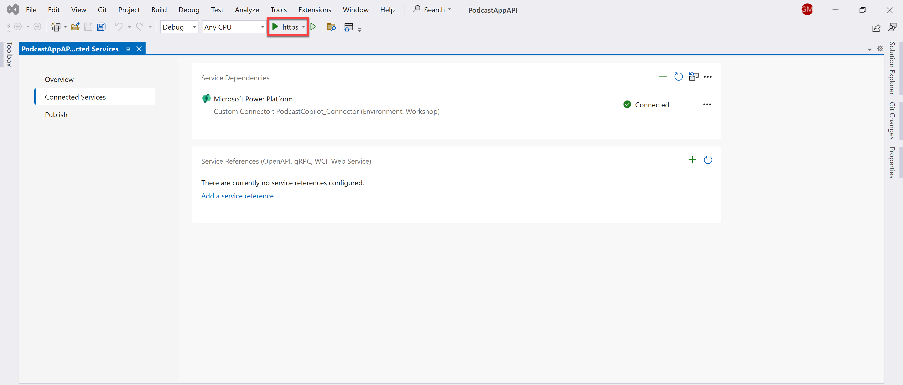
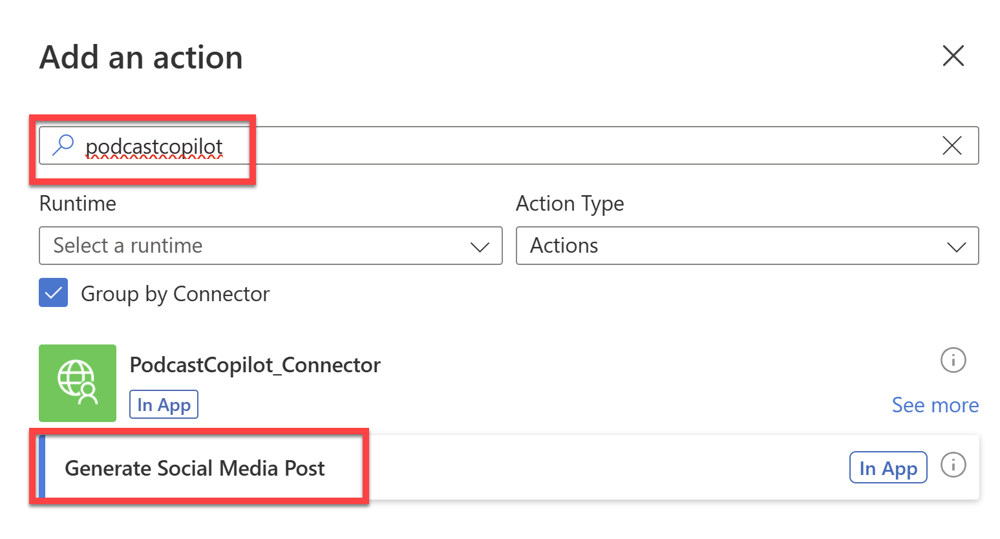
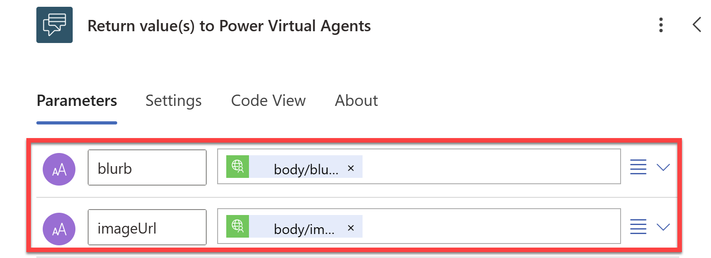

# Podcast Copilot

## Summary

This sample allows the user to enter a link to a podcast episode and then it generates a promotional social media image and blurb for the episode with AI. The user can then download the image and blurb to share on social media.

Sample consists of a Power Apps canvas app, a Power Automate cloud flow, and a Copilot Studio copilot.

### It works in two ways

**Power Apps**

User enters a link to a podcast episode and then a custom connector is called to generate the promotional image and blurb for the episode.


**Copilot Studio and Power Automate**

User asks the copilot to generate a promotional social media post and then proceeds to provide the link to the podcast episode.



The copilot then calls the Power Automate cloud flow which in turn invokes the custom connector to generate the promotional image and blurb for the episode.



## Applies to


## Compatibility


## Contributors

* [Gomolemo Mohapi](https://github.com/gomomohapi)

## Version history

Version|Date|Comments
-------|----|--------
1.0|April 12, 2024|Initial release

## Prerequisites

* Make sure you have access to Power Apps, Power Automate and Copilot Studio.
* Create an [Azure account](https://azure.microsoft.com/free/) and select **Start Free** and then fill in profile details to complete the sign up process.

    

* To use all the Azure OpenAI Service AI Models, you'll need to request access by completing [this form](https://aka.ms/oai/access). For the question; **Which Azure OpenAI service features are you requesting access for?**, select GPT-3.5, GPT-3.5 Turbo, GPT-4, GPT-4 Turbo, and/or Embeddings Models, DALL-E 2 and/or DALL-E 3 models, and OpenAI Whisper model.

    

* Once you have access to Azure OpenAI Service, 
    * follow the instructions [found here](https://github.com/microsoft/PowerPlatformAdvocates/tree/main/Workshops/PodcastCopilotPowerApp/Lab1#creating-the-azure-openai-service-resources) to create the Azure OpenAI Service resources.
    * follow the instructions [found here](https://github.com/microsoft/PowerPlatformAdvocates/tree/main/Workshops/PodcastCopilotPowerApp/Lab1#creating-the-bing-search-resource-in-azure) to create a Bing Search resource in Azure.
    * follow the instructions [found here](https://github.com/microsoft/PowerPlatformAdvocates/tree/main/Workshops/PodcastCopilotPowerApp/Lab1#creating-model-deployments-in-azure-openai-studio) to create model deployments in Azure OpenAI Studio.
    * follow the instructions [found here](https://github.com/microsoft/PowerPlatformAdvocates/blob/main/Workshops/PodcastCopilotPowerApp/Lab2/README.md#setting-the-environment-variables) to set local environment variables
* To use this sample, you will create your own Custom Connector using the [Visual Studio Connected Service for the Power Platform](https://learn.microsoft.com/en-us/power-platform/developer/visual-studio-connected-service). For this; download and install [Visual Studio (Community Edition)](https://visualstudio.microsoft.com/vs/features/net-development/)

    

    This installer comes pre-packaged with all the components you need for .NET development.
* Finally, clone the [PodcastAppAPI Sample Project](https://github.com/gomomohapi/PodcastAppAPI) to your local machine and open with Visual Studio.
    * Once you follow the link to the project, select **Code** and then copy the git URL.

         

    * Open Visual Studio and select **Clone a repository**.

        

    * Then paste in the link you copied from GitHub and select **Clone**.

    * The project will then open in Visual Studio.

## Minimal path to awesome

### Using the solution zip file

**Step 1: Import the solution into your Power Apps environment.**
* [Download](solution/podcast-copilot.zip) the `.zip` from the `solution` folder.
* Within **Power Apps Studio**, import the solution `.zip` file using **Solutions** > **Import Solution** and select the `.zip` file you just downloaded.
* Once the solution has been imported, leave the **Solutions** tab open and then open Visual Studio with the cloned PodcastAppAPI project.

**Step 2: Create a Custom Connector using the Visual Studio Connected Service for the Power Platform.**

* In Visual Studio, open the solution explorer and right-click on **Connected Services** and select **Add** > **Microsoft Power Platform**.

    

* Ensure you're signed in with the same Power Apps account you used to import the solution, and configure the following:
    * **Power Platform environments**: Select the environment where you imported the solution
    * **Solution**: Select the **PodcastCopilotSolution**
    * **Custom Connector**: Create a new custom connector and call it `PodcastCopilot_Connector`
    * **OpenAPI specification**: Select the `Auto-generate the OpenAPI V2 Specification` option
    * **Dev Tunnel**: Create a new dev tunnel and call it `PodcastCopilot_Tunnel`
* Select **Finish** and the custom connector will be created.
* Once complete, run the project in Visual Studio.

    

* In the newly opened browser window, select **Continue** to connect to your Developer Tunnel.

    

* Once connected, the custom connector will be active and available to use in your Power Apps environment. Don't close the browser window and navigate back to the **Solutions** tab in Power Apps Studio.

**Step 3: Add the Custom Connector to the Power App.**

* Open the **Podcast Copilot Solution** and navigate to **Apps** > **Podcast Copilot App** canvas app.
* Open the app in **Edit mode**.
* Select **Data** > **+ Add Data** and then search for `PodcastCopilot_Connector` and select **Connect**.
* Save the app and then publish it.

**Step 4: Add the Custom Connector to the Power Automate flow.**

* Open the **Podcast Copilot Solution** and navigate to **Cloud Flows** > **Generate Social Media Post**.
* Open the flow in **Edit mode**.
* Between the two nodes, add a new action and search for `PodcastCopilot` and select **Generate Social Media Post**.

    
* Create a connection to the `PodcastCopilot_Connector`.
* Once the connection has been created, select the **podcastUrl** field and then select the **Dynamic Content** icon and select **podcastURL** from the list of dynamic content.
* Then select the **Return value(s) to Power Virtual Agents** node and
    * select **body/blurb** from the Dynamic Content list for Blurb
    * select **body/imageUrl** from the Dynamic Content list for ImageURL

    
* Save the flow and then publish it.

### Using the source code

You can also use the [Power Apps CLI](https://docs.microsoft.com/powerapps/developer/data-platform/powerapps-cli) to pack the source code by following these steps:

* Clone this repository to a local drive
* Pack the source files back into a solution `.zip` file:

  ```bash
  pac solution pack --zipfile pathtodestinationfile --folder pathtosourcefolder --processCanvasApps
  ```

  Making sure to replace `pathtosourcefolder` to point to the path to this sample's `sourcecode` folder, and `pathtodestinationfile` to point to the path of this solution's `.zip` file (located under the `solution` folder)
* Within **Power Apps Studio**, import the solution `.zip` file using **Solutions** > **Import Solution** and select the `.zip` file you just packed.
* Once completed, follow along from **Step 2** above.

## Features

This solution illustrates many concepts on top of the Power Platform. With the Azure OpenAI Service, .NET, and Power Platform, this solution demonstrates an easy way to generate a social media post promoting a new episode of your podcast:

Starting from the podcast URL provided by the user in either Power Apps or Copilot Studio, the solution generates a promotional image and blurb for the episode with AI. Behind the scenes, the solution:

* gets the transcription of the podcast with the Whisper model
* Given that transcript, you use GPT to extract the name of the guest
* With the guest name, you retrieve their bio with Bing Search
* With the transcription and the guest bio, you generate a social media blurb with GPT
* With the social media blurb, you generate a relevant DALL-E prompt with GPT
* Finally, you use DALL-E to generate an image for the social media post with the prompt


## Help


We do not support samples, but this community is always willing to help, and we want to improve these samples. We use GitHub to track issues, which makes it easy for  community members to volunteer their time and help resolve issues.

If you encounter any issues while using this sample, you can [create a new issue](https://github.com/pnp/powerapps-samples/issues/new?assignees=&labels=Needs%3A+Triage+%3Amag%3A%2Ctype%3Abug-suspected&template=bug-report.yml&sample=podcast-copilot&authors=@gomomohapi&title=podcast-copilot%20-%20).

For questions regarding this sample, [create a new question](https://github.com/pnp/powerapps-samples/issues/new?assignees=&labels=Needs%3A+Triage+%3Amag%3A%2Ctype%3Abug-suspected&template=question.yml&sample=podcast-copilot&authors=@gomomohapi&title=podcast-copilot%20-%20).

Finally, if you have an idea for improvement, [make a suggestion](https://github.com/pnp/powerapps-samples/issues/new?assignees=&labels=Needs%3A+Triage+%3Amag%3A%2Ctype%3Abug-suspected&template=suggestion.yml&sample=podcast-copilot&authors=@gomomohapi&title=podcast-copilot%20-%20).

## Disclaimer

**THIS CODE IS PROVIDED *AS IS* WITHOUT WARRANTY OF ANY KIND, EITHER EXPRESS OR IMPLIED, INCLUDING ANY IMPLIED WARRANTIES OF FITNESS FOR A PARTICULAR PURPOSE, MERCHANTABILITY, OR NON-INFRINGEMENT.**

## 🚀 Full workshop 🚀

If you want to build everything above from scratch where you will:

* Setup your Development and Power Platform environments
* Learn about the Azure OpenAI Service and create model deployments
* Build this .NET API using the .NET Azure OpenAI SDK and creating a Custom Connector from Visual Studio
* And finally integrating the API with Power Apps and Copilot Studio

🔗 You can follow the full workshop here: [Podcast Copilot with Azure OpenAI Service, .NET, and Power Platform Workshop](https://aka.ms/PowerPodcastCopilot). 


