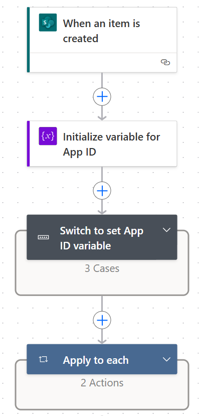
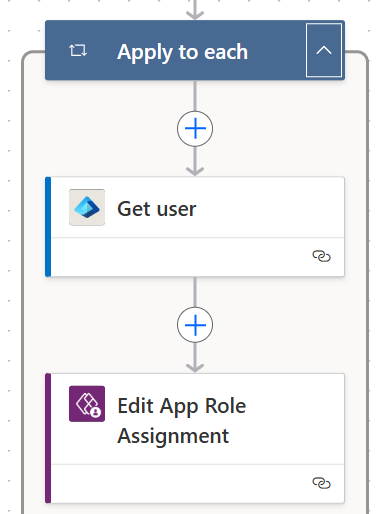

# Power Automate flow to automate sharing of a Canvas App

## Summary

This sample is a cloud flow that can be used to automate sharing of a canvas app. This flow initializes App ID variable & then uses a Switch condition to set the App ID variable based on the App Name present in a SharePoint List. It then leverages Apply to each to get users from SharePoint list, and uses Get User Entra ID action to get the user id based on email address. Finally, Edit App Role Assignment action is used to share the canvas app.





## Applies to


## Compatibility


## Contributors

* [Vipul Jain](https://github.com/vipulj03/)

## Version history

Version|Date|Comments
-------|----|--------
1.0|March 05, 2025|Initial release
2.0|June 01, 2025|Updated Version with suggested changes

## Prerequisites
* This app uses Microsoft Entra ID connection.
* This app uses **Edit App Role Assignment** action.
* This app uses SharePoint as a data source and requires a SharePoint List with the following fields:
   - List Name: App Sharing
   - List Fields:
        - Users (Person or Group) => allow multiple selection = yes
        - AppNameNew (Choice) => E.g. - names of your app in the environment
        - AppID (Single line of text) => enter the app ID of your app. This value will be read dynamically in the flow.

## Minimal path to awesome

### Using the solution zip

* [Download](./solution/power-automate-flow-to-share-an-app.zip) the `.zip` from the `solution` folder
* Within **Power Apps Studio**, import the solution `.zip` file using **Solutions** > **Import Solution** and select the `.zip` file you just packed.
* Open the app in edit mode and make sure the data source **Data source name** is connected correctly.

### Using the source code

You can also use the [Power Apps CLI](https://docs.microsoft.com/powerapps/developer/data-platform/powerapps-cli) to pack the source code by following these steps:

* Clone the repository to a local drive
* Pack the source files back into a solution `.zip` file:

  ```bash
  pac solution pack --zipfile pathtodestinationfile --folder pathtosourcefolder --processCanvasApps
  ```

  Making sure to replace `pathtosourcefolder` to point to the path to this sample's `sourcecode` folder, and `pathtodestinationfile` to point to the path of this solution's `.zip` file (located under the `solution` folder)
* Within **Power Apps Studio**, import the solution `.zip` file using **Solutions** > **Import Solution** and select the `.zip` file you just packed.

## Features

This sample illustrates the following concepts:
* Automate the sharing of Canvas App, instead of manually sharing the app with multiple users
* Use of Switch case in power automate flow
* Use of Microsoft Entra ID action to get the user id
* Use of Edit App Role Assignment action to assign the users to an app

## Help

We do not support samples, but this community is always willing to help, and we want to improve these samples. We use GitHub to track issues, which makes it easy for  community members to volunteer their time and help resolve issues.

If you encounter any issues while using this sample, you can [create a new issue](https://github.com/pnp/powerapps-samples/issues/new?assignees=&labels=Needs%3A+Triage+%3Amag%3A%2Ctype%3Abug-suspected&template=bug-report.yml&sample=power-automate-flow-to-share-an-app&authors=@vipulj03&title=power-automate-flow-to-share-an-app%20-%20).

For questions regarding this sample, [create a new question](https://github.com/pnp/powerapps-samples/issues/new?assignees=&labels=Needs%3A+Triage+%3Amag%3A%2Ctype%3Abug-suspected&template=question.yml&sample=power-automate-flow-to-share-an-app&authors=@vipulj03&title=power-automate-flow-to-share-an-app%20-%20).

Finally, if you have an idea for improvement, [make a suggestion](https://github.com/pnp/powerapps-samples/issues/new?assignees=&labels=Needs%3A+Triage+%3Amag%3A%2Ctype%3Abug-suspected&template=suggestion.yml&sample=power-automate-flow-to-share-an-app&authors=@vipulj03&title=power-automate-flow-to-share-an-app%20-%20).

## Disclaimer

**THIS CODE IS PROVIDED *AS IS* WITHOUT WARRANTY OF ANY KIND, EITHER EXPRESS OR IMPLIED, INCLUDING ANY IMPLIED WARRANTIES OF FITNESS FOR A PARTICULAR PURPOSE, MERCHANTABILITY, OR NON-INFRINGEMENT.**

