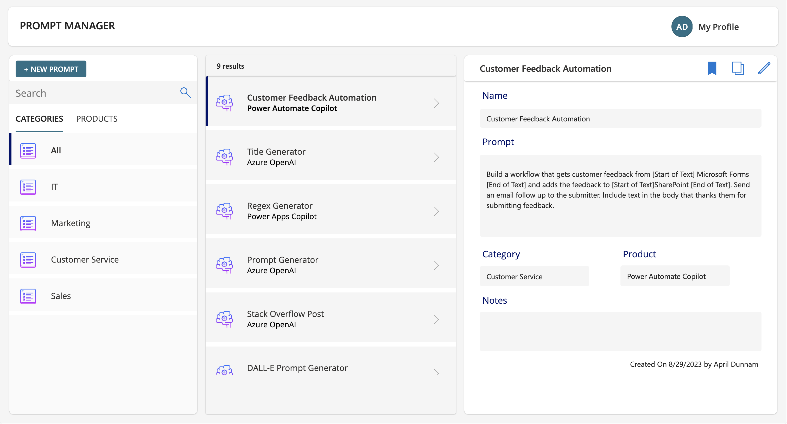
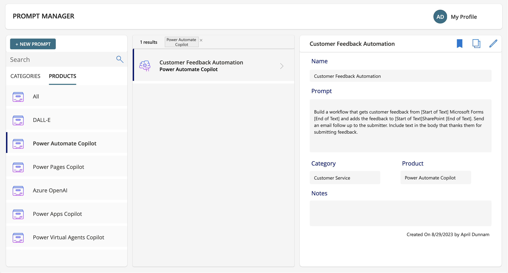
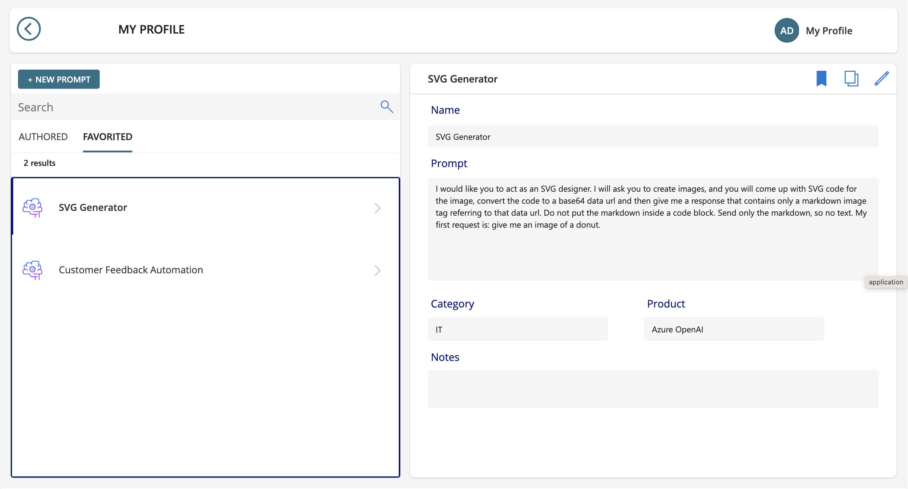
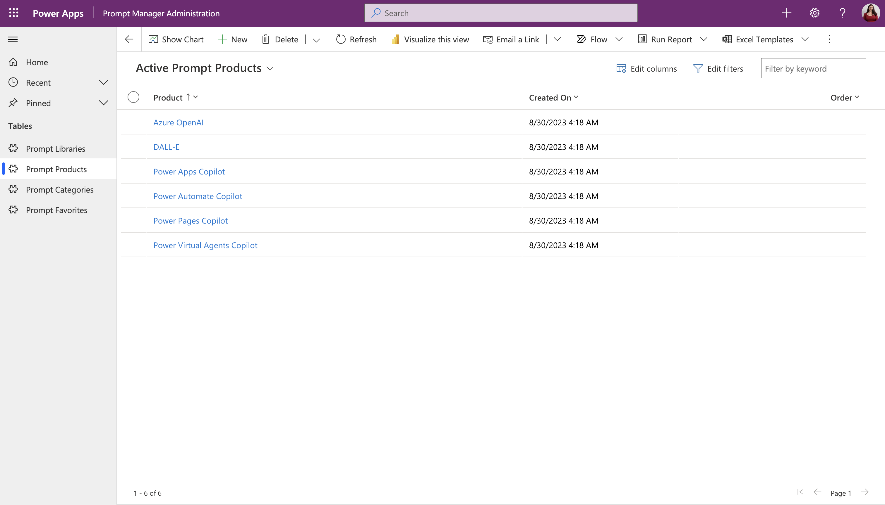

# Prompt Management Solution

## Summary

This sample shows how to implement an internal prompt management solution to help your organize the prompts you are using for your AI tools and Copilots.



## Applies to


## Compatibility


## Contributors

- [April Dunnam](https://github.com/aprildunnam)

## Version history

Version|Date|Comments
-------|----|--------
1.0|September 25, 2023|Initial release

## Features

This sample illustrates how to implement an internal prompt management solution.  The solution is built on Dataverse and is responsive and accessible.  

### Key Features of the solution include:
* The ability organize prompts by Categories (Marketing, IT, Operations, etc realted prompts) and by Products that you would use the prompts in (Power Apps Copilot, Azure Open AI, Dall-E, Midjourney, etc)
* Search and filter prompts by category, product, etc

* Built in copy buttom to easily copy the prompt so you can paste it into your tool of choice
* The ability for a use to "bookmark" prompts to curate a list of their favorite and most commonly used prompts on their profile page

* Administration app to easily modify the available categories and products in the app and manage all prompts


## Solution Overview video

Check out [this video](https://youtu.be/4pSJu3qNl7k?si=4oK68HbhGO9P90a5) for a full overview of the solution in action including how it was built and how to install it.

## Data Sources

* Dataverse

## Minimal Path to Awesome

* [Download](./solution/PromptManager_1_0_0_6_managed.zip) the `.zip` from the `solution` folder
* Within **Power Apps Studio**, import the solution `.zip` file using **Solutions** > **Import Solution** and select the `.zip` file you just packed.
* Open the Prompt Manager Administration App and add in your Categories and Products

## Using the Source Code

You can also use the [Power Apps CLI](https://docs.microsoft.com/powerapps/developer/data-platform/powerapps-cli) to pack the source code by following these steps::

* Clone the repository to a local drive
* Pack the source files back into a solution `.zip` file:

  ```bash
  pac solution pack --zipfile pathtodestinationfile --folder pathtosourcefolder --processCanvasApps
  ```

  Making sure to replace `pathtosourcefolder` to point to the path to this sample's `sourcecode` folder, and `pathtodestinationfile` to point to the path of this solution's `.zip` file (located under the `solution` folder)
* Within **Power Apps Studio**, import the solution `.zip` file using **Solutions** > **Import Solution** and select the `.zip` file you just packed.

## Disclaimer

**THIS CODE IS PROVIDED *AS IS* WITHOUT WARRANTY OF ANY KIND, EITHER EXPRESS OR IMPLIED, INCLUDING ANY IMPLIED WARRANTIES OF FITNESS FOR A PARTICULAR PURPOSE, MERCHANTABILITY, OR NON-INFRINGEMENT.**

## Help

We do not support samples, but we this community is always willing to help, and we want to improve these samples. We use GitHub to track issues, which makes it easy for  community members to volunteer their time and help resolve issues.

If you encounter any issues while using this sample, you can [create a new issue](https://github.com/pnp/powerapps-samples/issues/new?assignees=Laskewitz&labels=Needs%3A+Triage+%3Amag%3A%2Ctype%3Abug-suspected&template=bug-report.yml&sample=ChuckNorrisIO&authors=@Laskewitz&title=ChuckNorrisIO%20-%20).

For questions regarding this sample, [create a new question](https://github.com/pnp/powerapps-samples/issues/new?assignees=Laskewitz&labels=Needs%3A+Triage+%3Amag%3A%2Ctype%3Abug-suspected&template=question.yml&sample=ChuckNorrisIO&authors=@Laskewitz&title=ChuckNorrisIO%20-%20).

Finally, if you have an idea for improvement, [make a suggestion](https://github.com/pnp/powerapps-samples/issues/new?assignees=Laskewitz&labels=Needs%3A+Triage+%3Amag%3A%2Ctype%3Abug-suspected&template=suggestion.yml&sample=ChuckNorrisIO&authors=@Laskewitz&title=ChuckNorrisIO%20-%20).

## For more information

* [Overview of creating apps in Power Apps](https://docs.microsoft.com/powerapps/maker/)
* [Power Apps canvas apps documentation](https://docs.microsoft.com/powerapps/maker/canvas-apps/)


