# Prompt Wagon

## Summary

This app is designed for organizations seeking to seamlessly integrate AI technologies, with features catering to beginners and administrators.

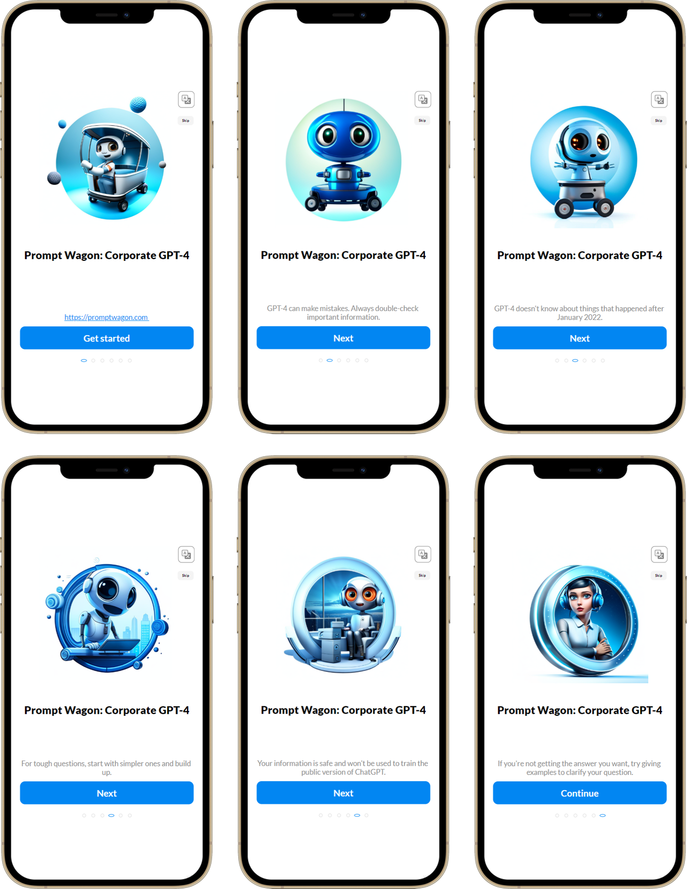

## Applies to


## Compatibility


## Contributors

* [Artem Chernevskiy](https://github.com/ArtemChern)

## Version history

Version|Date|Comments
-------|----|--------
1.0|September 27, 2023|Initial release

## Prerequisites

* Azure OpenAI resource
* GPT-4 model deployed in the Azure OpenAI resource
* Save the following information from your GPT-4 model deployment (this will be needed during the solution import process):

1) AzureOpenAI Host
2) AzureOpenAI Key
3) AzureOpenAI URL

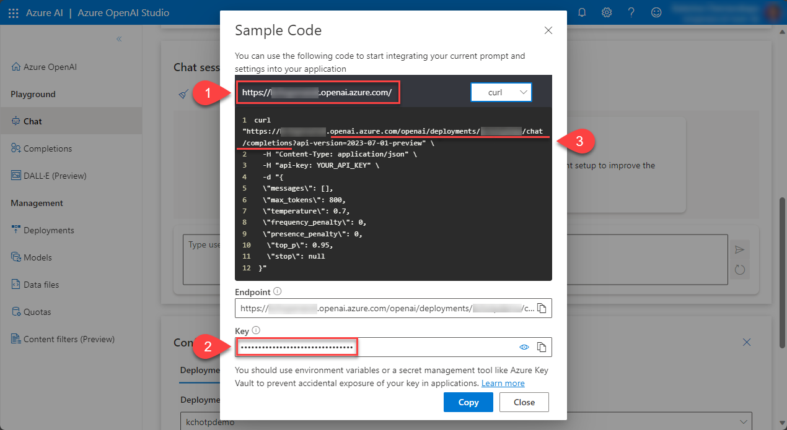

## Minimal path to awesome

### Using the solution zip

* [Download](./solution/prompt-wagon.zip) the `.zip` from the `solution` folder.

* Navigate to [https://make.powerapps.com](https://make.powerapps.com).

* Open **Solutions** from the left-hand panel, select **Import solution**. Select **Brows** to choose downloaded Zip file, and select **Next**.
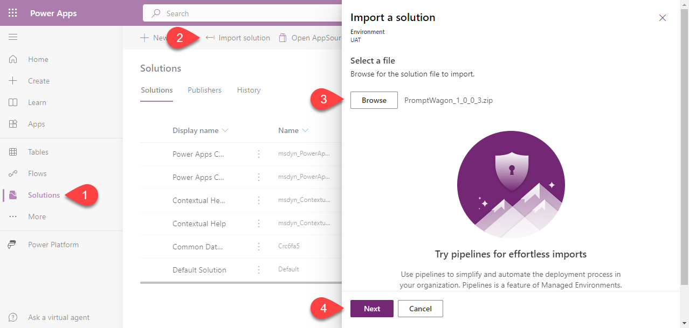

* Select **Next** on the **Details** screen.
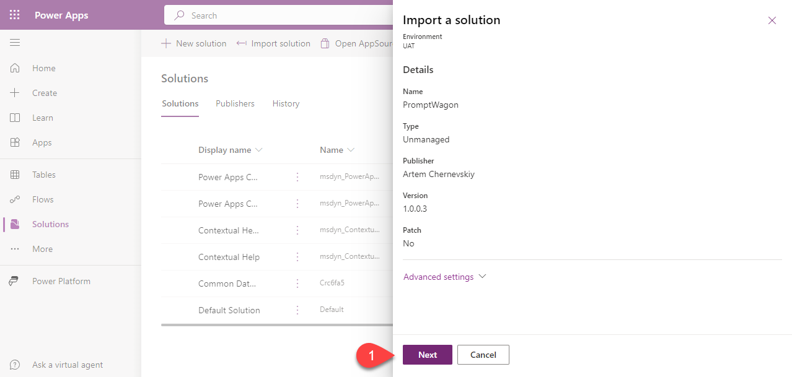

* On the **Environment Variables** screen enter values for all environment variables. Once you are ready, select **Import**
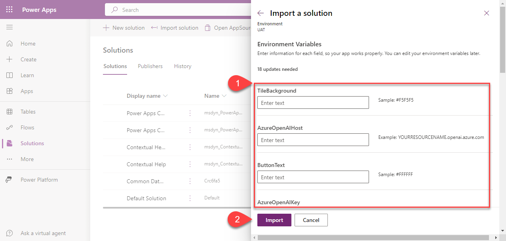

* Wait till the end of the import process.
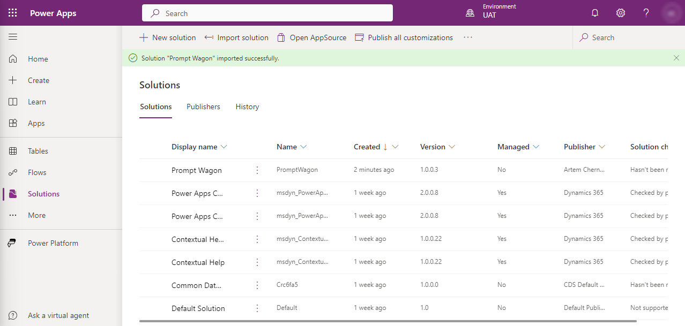

* Open the imported solution, Select **Apps**, click on three dots next to the app name, select **Play**.
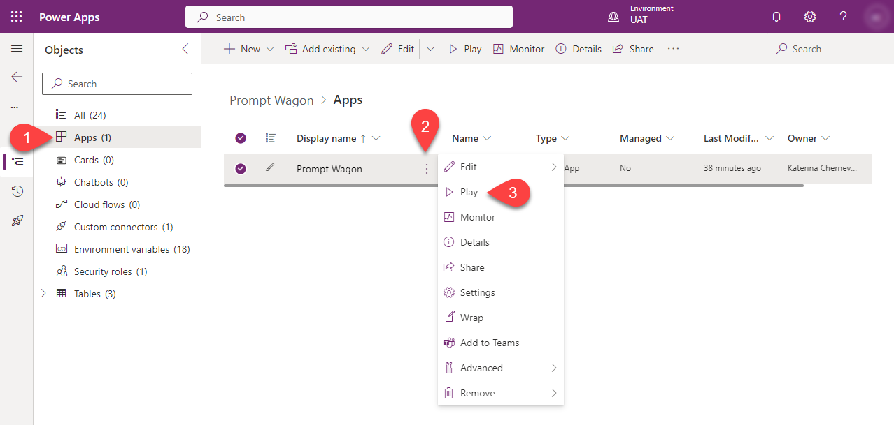

* Select **Sign in**.
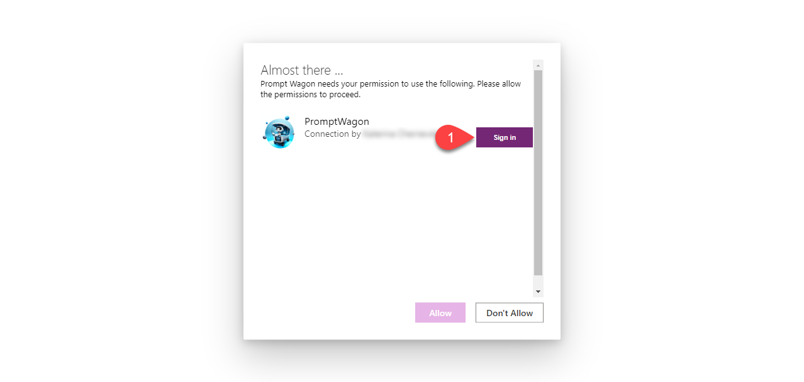

* Enter Azure OpenAI API key, and select **Create**.
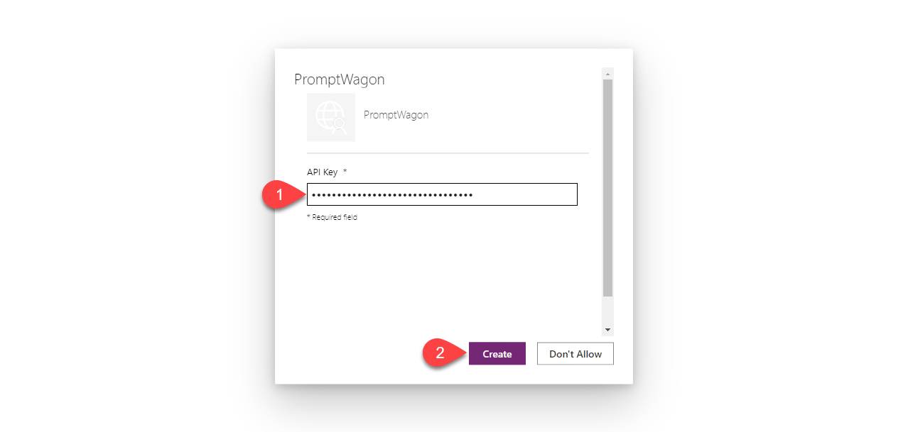

* Select **Allow**.
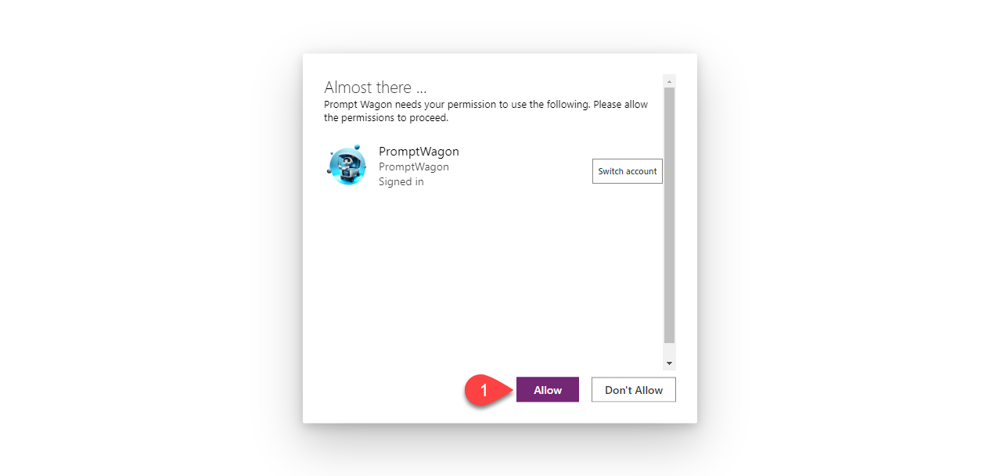

* Navigate to **Connections**, click three dots next to connection name, select **Share**.
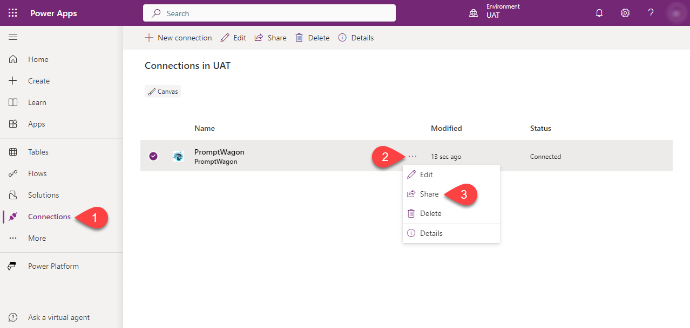

* Select **Add everyone in my org** (or select your colleagues with whom you want to share the app).
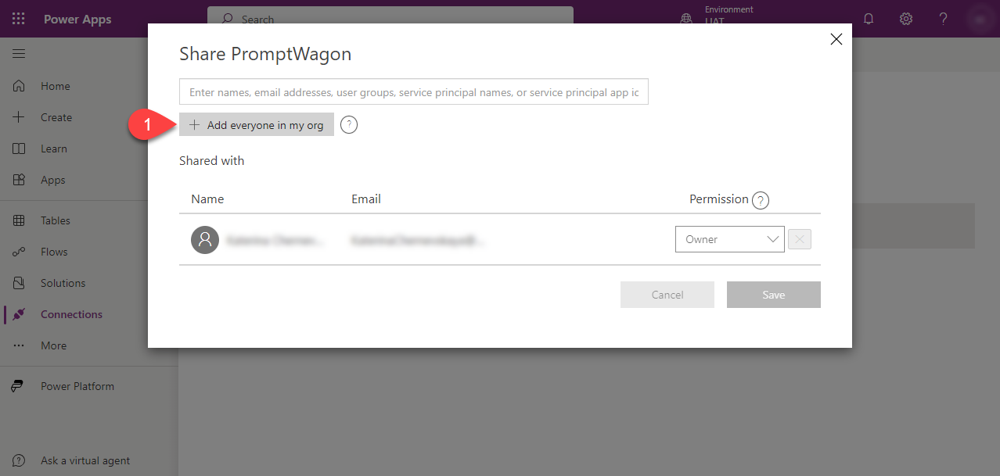

* Select **Save**.
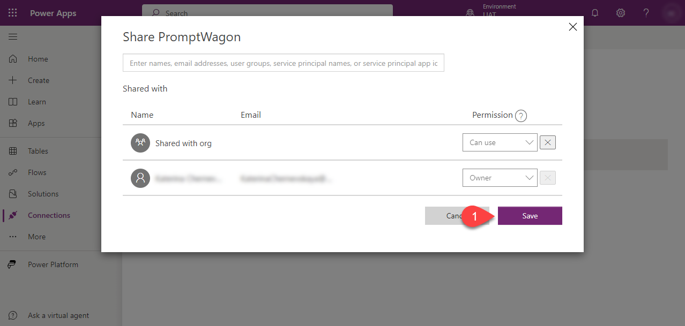

* Go back to the solution, click three dots next to the app name, select **Share**.
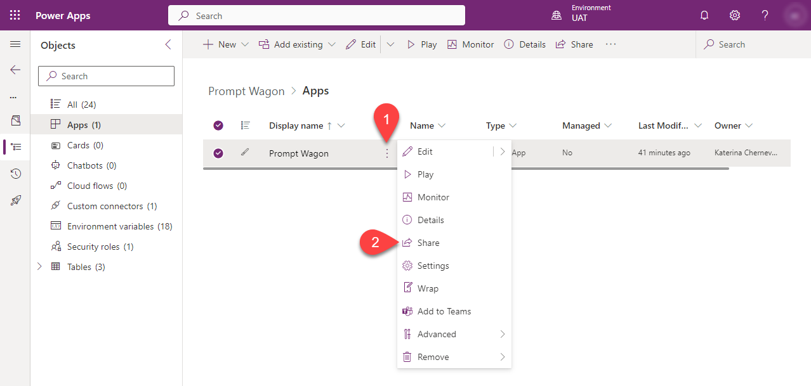

* Add security roles **Prompt Wagon User** and **Basic User**, select **Share**.
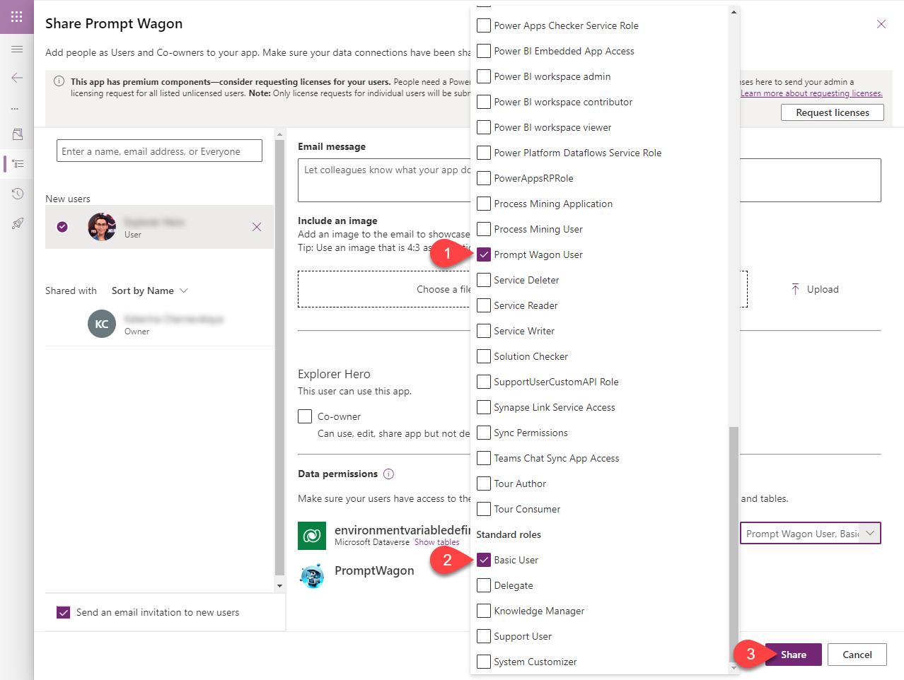

On the initial launch, users will encounter a pop-up prompting them to grant permission for connections to Azure OpenAI. Once authorized, this pop-up will not appear in subsequent launches.


### Import sample data

This step is optional. You have the option to populate the Dataverse tables with your content, such as interface text, images, prompts, and translations into two other languages. If you'd prefer to begin with sample data, follow the steps outlined below.

* [Download](./sample-data/PromptWagonSampleData.zip) the `.zip` from the `sample-data` folder.

* Make sure that you have version 1.19.3 (or newer) of [Power Platform CLI](https://learn.microsoft.com/power-platform/developer/cli/introduction).
To install the latest version:

  ```bash
  pac install latest
  ```

* Now get help on the tools.

  ```bash
  pac tool help
  ```

* See what tools are installed.

  ```bash
  pac tool list
  ```

* Download and launch the Configuration Migration Tool

  ```bash
  pac tool CMT
  ```


* Select **Import data* and **Continue**
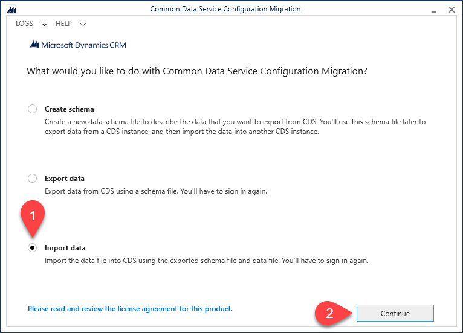

* Select **Office 365**, check **Display list of available organizations** and select **Login**
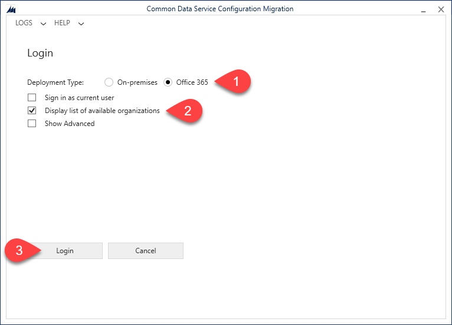

* Select your target environment and select **Login**
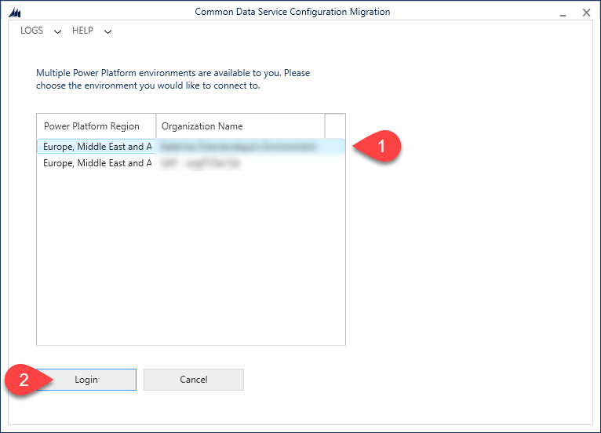

* In the files **Zip File** select **PromptWagonSampleData.zip** downloaded earlier, and select **Import Data**.
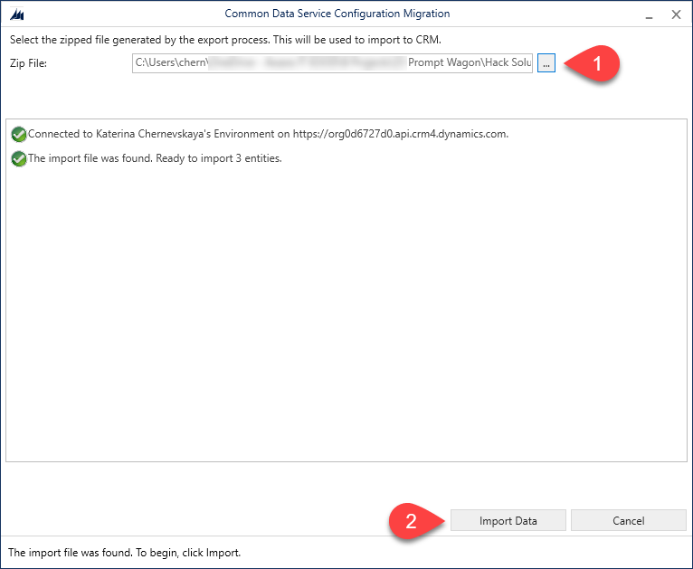

* Once the import process will be completed, select **Exit**.
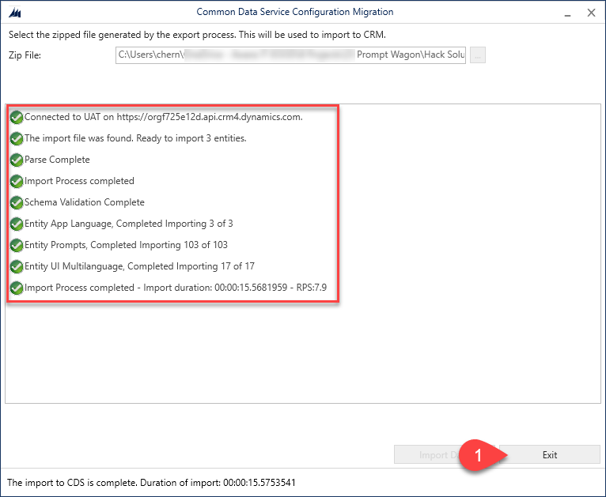

## Features

* The app's responsive design ensures compatibility with both PC and mobile devices.
* With Sample Data, users receive 103 preset prompts spread across three categories: Business, Data, and Education. This facilitates interaction with GPT-4, even for those unfamiliar with prompt engineering.
* The interface supports multiple languages: English, German, and French.
* Administrative features empower admins to adjust prompts directly within the app. They can edit text for both system and user roles, modify the super prompt, and tweak request parameters like temperature, top p, and more.
* A super prompt enables the provision of overarching instructions to GPT-4, which apply to all prompts. This can include company style guidelines, restrictions, and more.

<!--
RESERVED FOR REPO MAINTAINERS

We'll add the video from the community call recording here

## Video

[](https://www.youtube.com/watch?v=XXXXX "YouTube video title")
-->

## Help

We do not support samples, but this community is always willing to help, and we want to improve these samples. We use GitHub to track issues, which makes it easy for  community members to volunteer their time and help resolve issues.

If you encounter any issues while using this sample, you can [create a new issue](https://github.com/pnp/powerapps-samples/issues/new?assignees=&labels=Needs%3A+Triage+%3Amag%3A%2Ctype%3Abug-suspected&template=bug-report.yml&sample=prompt-wagon&authors=@ArtemChern&title=prompt-wagon%20-%20).

For questions regarding this sample, [create a new question](https://github.com/pnp/powerapps-samples/issues/new?assignees=&labels=Needs%3A+Triage+%3Amag%3A%2Ctype%3Abug-suspected&template=question.yml&sample=prompt-wagon&authors=@ArtemChern&title=prompt-wagon%20-%20).

Finally, if you have an idea for improvement, [make a suggestion](https://github.com/pnp/powerapps-samples/issues/new?assignees=&labels=Needs%3A+Triage+%3Amag%3A%2Ctype%3Abug-suspected&template=suggestion.yml&sample=prompt-wagon&authors=@ArtemChern&title=prompt-wagon%20-%20).

## Disclaimer

**THIS CODE IS PROVIDED *AS IS* WITHOUT WARRANTY OF ANY KIND, EITHER EXPRESS OR IMPLIED, INCLUDING ANY IMPLIED WARRANTIES OF FITNESS FOR A PARTICULAR PURPOSE, MERCHANTABILITY, OR NON-INFRINGEMENT.**


