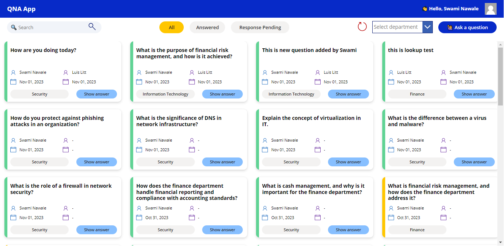

# Editable Subgrid Power App Sample

## Summary

QNA app is all about making communication smoother between users and different departments. With a simple login, users can ask questions to the relevant department and get response. As soon as a question is asked, the department members receive email notifications, ensuring they're always in the loop. They can then respond to the questions promptly. On top is that users also get email notifications when the members respond to their queries.

## Applies to

## Contributors

- [Swami Nawale](https://www.linkedin.com/in/swaminawale/)

## Version history

| Version | Date         | Comments        |
| ------- | ------------ | --------------- |
| 1.0     | Nov 08, 2023 | Initial release |

## Prerequisites

None

## Data Sources

SharePoint
