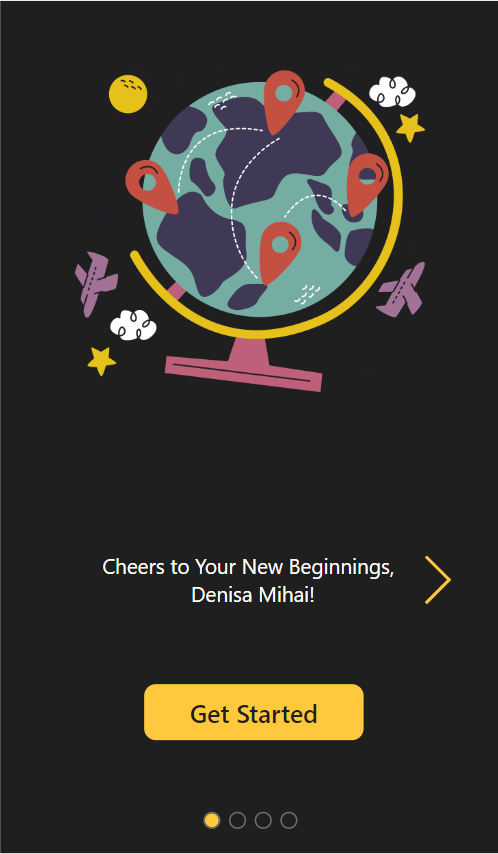
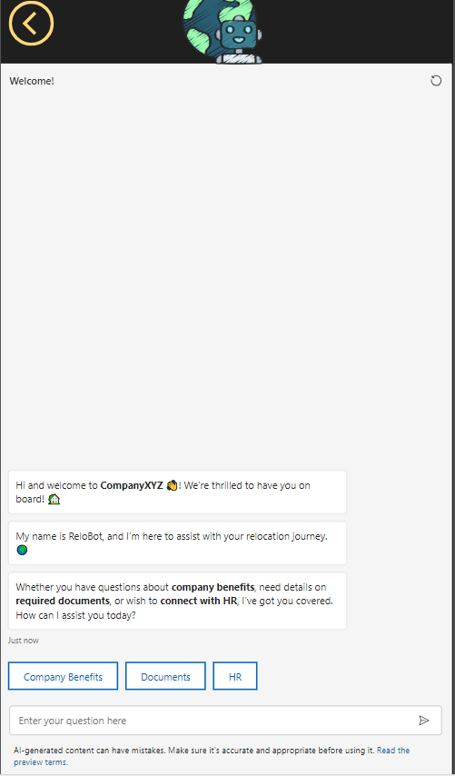
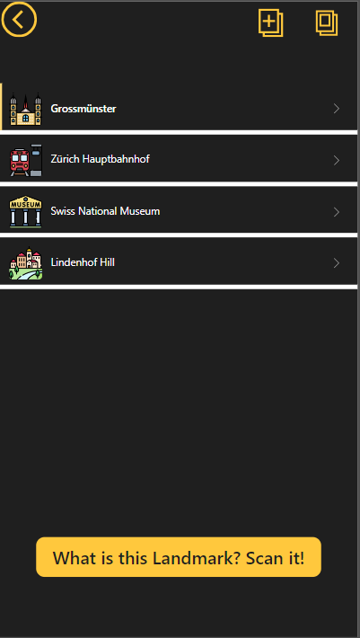
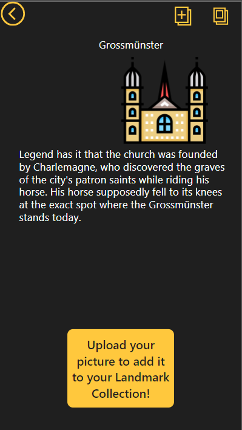
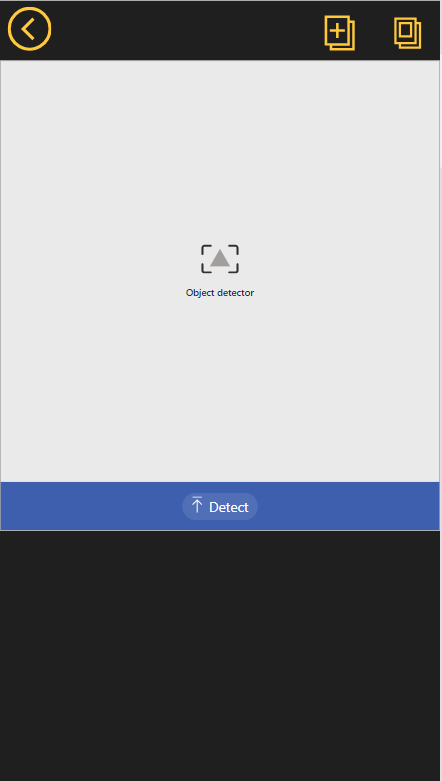
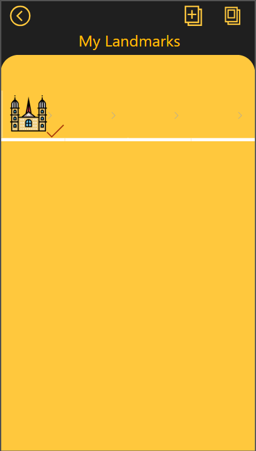

# Relocation App

## Summary

This Power App leverages AI to assist individuals starting a new job in a new city. The main purpose is to enhance the relocation process for people embarking on a new career journey in an unfamiliar city by providing personalized assistance and resources. 



## Applies to


## Compatibility


## Contributors

* [Denisa Mihai](https://github.com/denisamihai)

## Version history

Version|Date|Comments
-------|----|--------
1.1|November 19, 2023|Update sourcecode
1.0|September 24, 2023|Initial release


## Minimal path to awesome

### Using the solution zip

* [Download](./solution/relocation-app.zip) the `.zip` from the `solution` folder
* Within **Power Apps Studio**, import the solution `.zip` file using **Solutions** > **Import Solution** and select the `.zip` file you just packed.
* Open the app in edit mode and make sure the data source **Data source name** is connected correctly.

### Using the source code

You can also use the [Power Apps CLI](https://docs.microsoft.com/powerapps/developer/data-platform/powerapps-cli) to pack the source code by following these steps:

* Clone the repository to a local drive
* Pack the source files back into a solution `.zip` file:

  ```bash
  pac solution pack --zipfile pathtodestinationfile --folder pathtosourcefolder --processCanvasApps
  ```

  Making sure to replace `pathtosourcefolder` to point to the path to this sample's `sourcecode` folder, and `pathtodestinationfile` to point to the path of this solution's `.zip` file (located under the `solution` folder)
* Within **Power Apps Studio**, import the solution `.zip` file using **Solutions** > **Import Solution** and select the `.zip` file you just packed.

## Features

* Power Virtual Agents 

The PVA with Boost Conversation helps users in familiarizing themselves with their new workplace and local regulations by answering questions regarding company benefits, local administration or connects them with HR:

  

The system gathers information from official local websites, making it easy for users to get answers about paperwork and work permits. It's also connected to the company's own benefits site, where employees can discover various company-provided advantages such as language classes and health insurance discounts.


* AI Builder Object Detection

Within the app, users have access to a curated selection of important landmarks in their new city:



  The app provides entertaining and amusing facts about key landmarks in the new city, adding a touch of humor to the discovery of local treasures:



While exploring the landmarks, users can easily snap photos and add them to the app:
  

 
 
 The AI Builder Object Detection model recognizes the landmark...
 
 
 
 ...and then catalogues it into a personalized collection:
 

 
 This fun feature helps users learn about important places in their new city, invites them to explore, and lets them keep track of all the must-see spots as they settle in.

 

## Help

We do not support samples, but this community is always willing to help, and we want to improve these samples. We use GitHub to track issues, which makes it easy for  community members to volunteer their time and help resolve issues.

If you encounter any issues while using this sample, you can [create a new issue](https://github.com/pnp/powerapps-samples/issues/new?assignees=&labels=Needs%3A+Triage+%3Amag%3A%2Ctype%3Abug-suspected&template=bug-report.yml&sample=glassmorphism-sandbox&authors=@KeithAtherton&title=glassmorphism-sandbox%20-%20).

For questions regarding this sample, [create a new question](https://github.com/pnp/powerapps-samples/issues/new?assignees=&labels=Needs%3A+Triage+%3Amag%3A%2Ctype%3Abug-suspected&template=question.yml&sample=glassmorphism-sandbox&authors=@KeithAtherton&title=glassmorphism-sandbox%20-%20).

Finally, if you have an idea for improvement, [make a suggestion](https://github.com/pnp/powerapps-samples/issues/new?assignees=&labels=Needs%3A+Triage+%3Amag%3A%2Ctype%3Abug-suspected&template=suggestion.yml&sample=glassmorphism-sandbox&authors=@KeithAtherton&title=glassmorphism-sandbox%20-%20).

## Disclaimer

**THIS CODE IS PROVIDED *AS IS* WITHOUT WARRANTY OF ANY KIND, EITHER EXPRESS OR IMPLIED, INCLUDING ANY IMPLIED WARRANTIES OF FITNESS FOR A PARTICULAR PURPOSE, MERCHANTABILITY, OR NON-INFRINGEMENT.**


