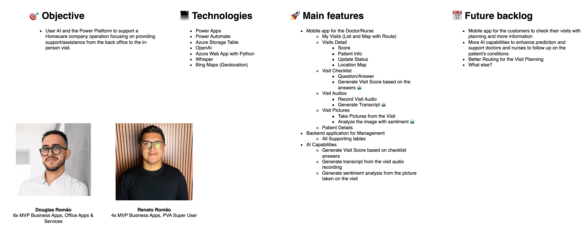
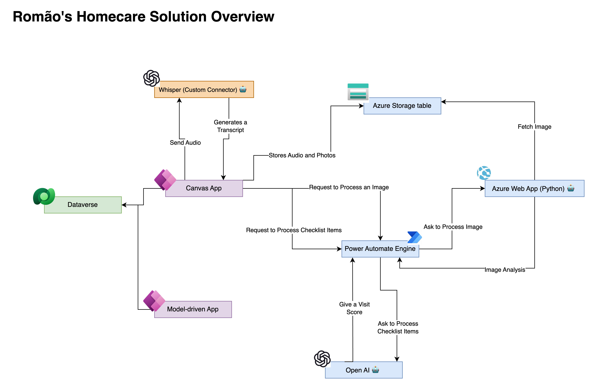
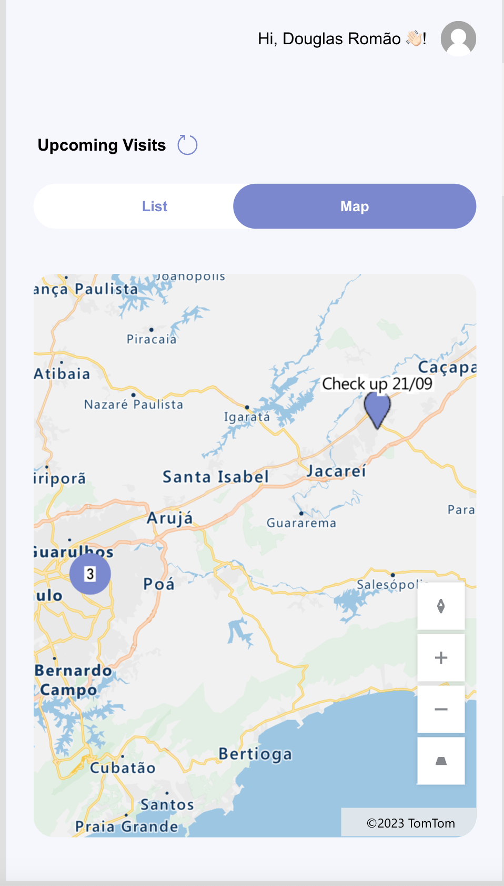
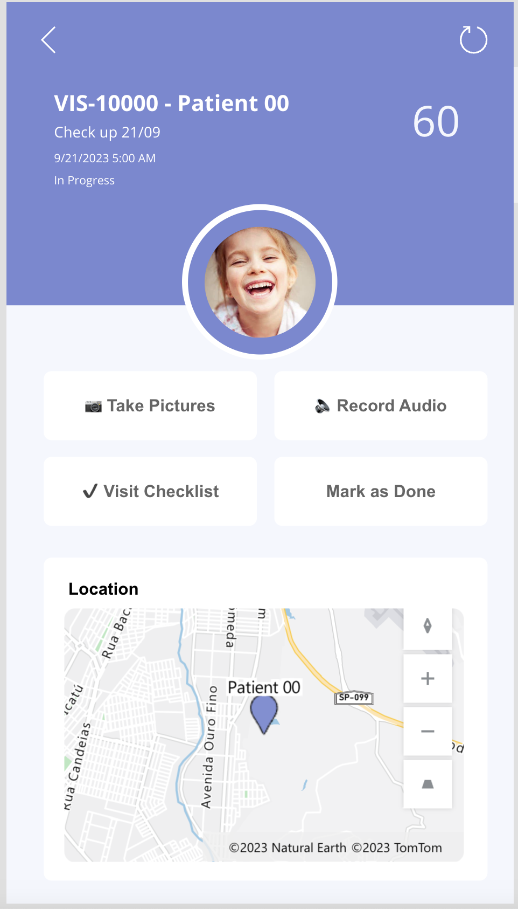
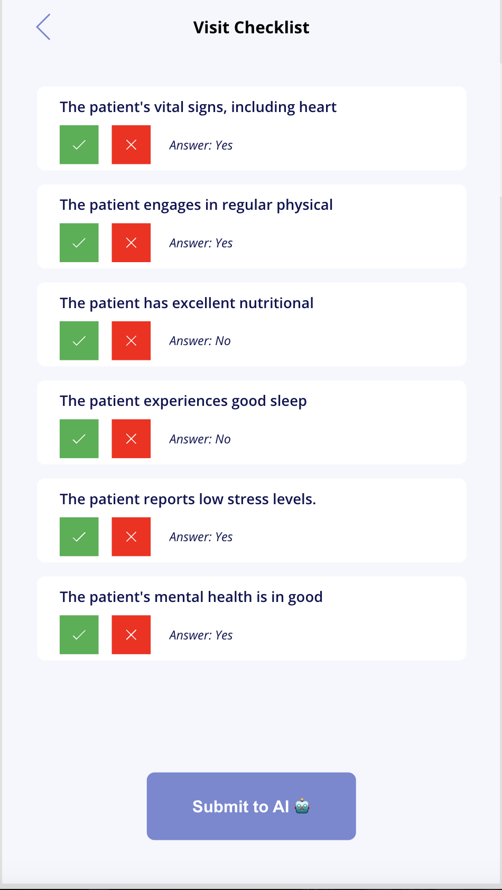
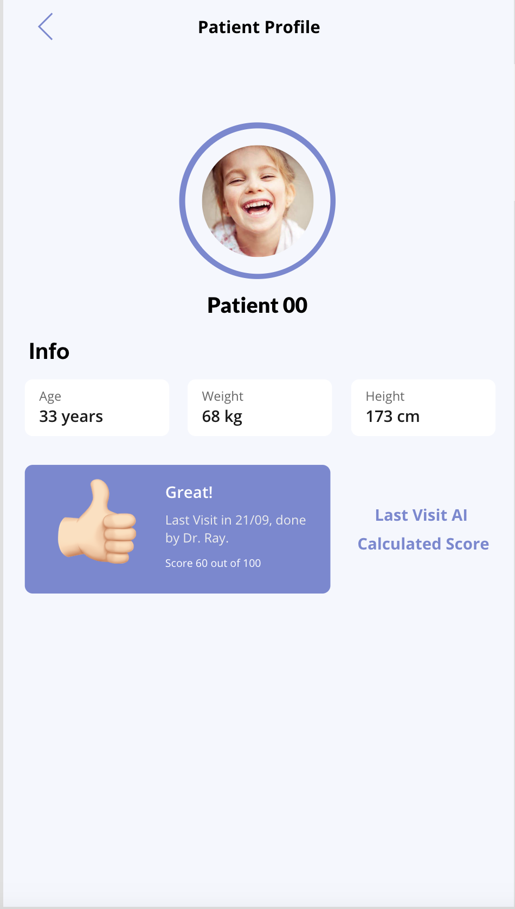
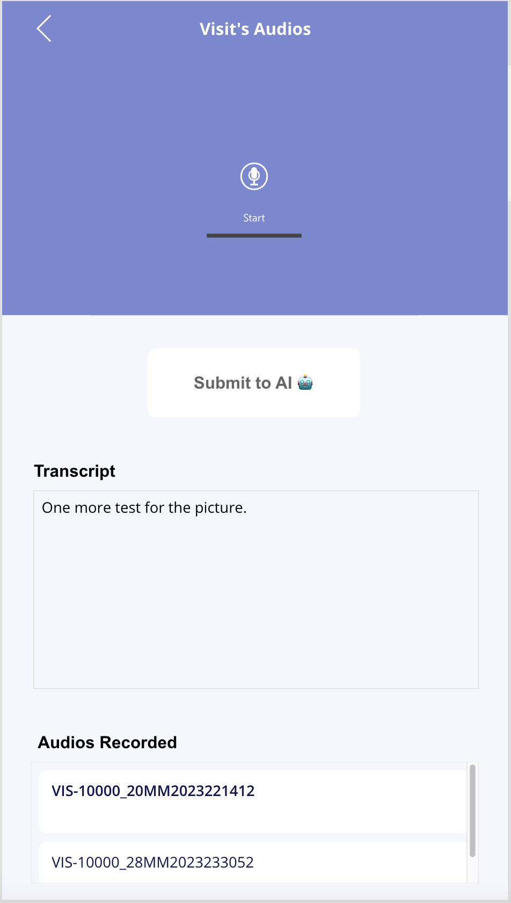
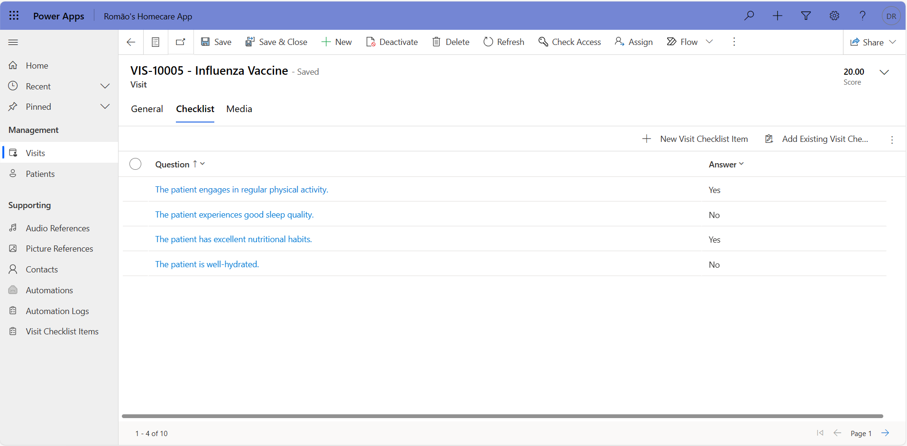
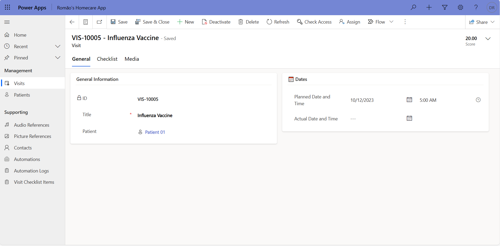

# Romaos HomeCare Solution

## Project team
__Douglas Romão__ 
Senior Architect & Team Lead @ Fellowmind | Microsoft MVP, Business Applications Expert/Tech Innovator 
https://www.linkedin.com/in/douglas-romao/

__Renato Romão__ 
4x Microsoft MVP 🔹 Senior M365 & Power Platform Developer @Storm 
https://www.linkedin.com/in/renatoromao/

## Solution presentation
- Short video (<5 minutes): https://youtu.be/ZR6fmlu08_M
- Architecture video: https://youtu.be/MZUXEhfT2wM

## Overview

Romaos HomeCare is an innovative solution leveraging the capabilities of Microsoft Power Platform and cutting-edge AI technologies to enhance the operations of a Homecare company. This comprehensive platform aims to streamline the workflow from the back office to in-person visits, providing a seamless experience for healthcare professionals and optimizing patient care.

## Main Features

### Mobile App for Doctor/Nurse

#### My Visits
- List and map with route visualization
- Detailed information on each visit

#### Score
- Patient-specific scores based on a checklist of questions
- Integration with AI to generate scores automatically

#### Location Services
- Real-time location tracking on a map
- Visit checklist to ensure all necessary tasks are completed

#### Question/Answer
- Interactive Q&A feature for comprehensive patient information
- AI-driven generation of visit scores based on answers

#### Visit Audios
- Recording of visit audio
- AI-powered transcription for easy reference

#### Visit Pictures
- Capture images during visits
- Sentiment analysis on images using AI

#### Patient Details
- Centralized repository for patient information

### Backend Application for Management

- Robust backend supporting all required tables
- Integration with AI capabilities for data-driven insights

## Objective

The primary goal of Romaos HomeCare is to harness the power of AI and the Power Platform to revolutionize the operations of Homecare companies. The focus is on providing comprehensive support and assistance throughout the entire healthcare process, from back-office management to in-person visits.

## Technologies

Romaos HomeCare leverages a combination of advanced technologies to achieve its objectives:

- **Power Apps:** Building intuitive and responsive mobile applications.
- **Power Automate:** Automating workflows for efficient processes.
- **Azure Storage Table:** Storing and managing structured data.
- **OpenAI:** Harnessing AI capabilities for natural language processing.
- **Azure Web App with Python:** Enabling seamless integration with Python-based functionalities.
- **Whisper:** Utilizing Whisper for secure and efficient audio processing.
- **Bing Maps (Geolocation):** Integrating geolocation services for route visualization.

## Screenshots

## Conclusion

Romaos HomeCare represents a significant step forward in the integration of AI and Power Platform within the healthcare sector. By combining mobile app functionality with backend management and AI-driven insights, the solution aims to enhance the overall efficiency and quality of care provided by Homecare companies.

---

**References:**

- Microsoft Power Platform. (https://powerplatform.microsoft.com/)
- OpenAI. (https://www.openai.com/)
- Azure. (https://azure.microsoft.com/)
- Bing Maps API. (https://www.microsoft.com/maps/choose-your-bing-maps-api)
- Whisper. (https://openai.com/research/whisper)

---