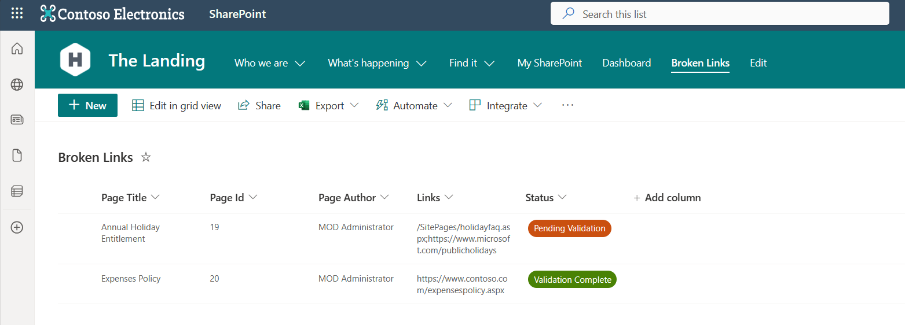
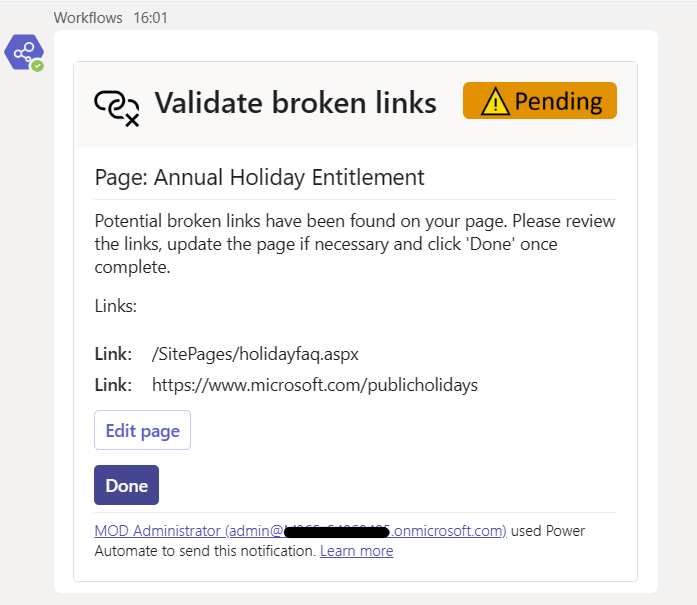
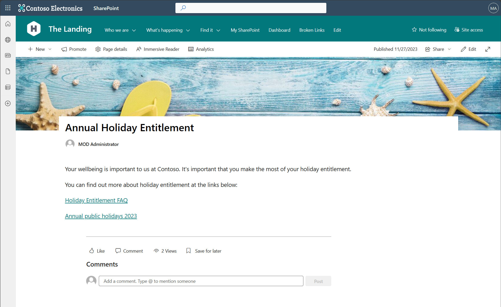

# SharePoint 'Broken Links Checker'

## Summary

This is a proof of concept Power Platform solution for checking broken links in SharePoint pages.

If a link is found to be 'broken' (HTTP 404), a user receives an adaptive card in Microsoft Teams chat to notify them which links are broken and provides a link to their page.

Broken links together with the details of the page that they were found on are stored in a custom SharePoint list for easy management, search and filtering.

The solution is functionally complete but is provided as a POC for you to customise/extend as required.

The solution uses the HTTP connector (premium) and the 'Send an HTTP Request to SharePoint' action to send requests to the links.

It is worth noting that the links MUST have a title for them to be picked up and processed.

  





## Applies to


## Compatibility


## Contributors

* [Alex Clark - Microsoft](https://github.com/alexc-MSFT)

## Version history

Version|Date|Comments
-------|----|--------
1.0.0.0|Nov 27, 2023|Initial release

## Prerequisites

* Power Apps environment (with a Dataverse database created)
* Power Automate premium license for the user who will import the flows/the account the flows will run under
* SharePoint site to create the list in/check for broken links on
* Permissions to create lists in the above site

## Solution Components

The following solution components are used in this sample:

* Check broken links (Flow)
* Broken link validation (Flow)

## Data Sources

* SharePoint
* Microsoft Teams

### Using the sample

Follow the instructions below to deploy this sample to your tenant.

If you want to check for broken links on other sites, you will need to deploy multiple copies of the 'Check broken links' flow.

It is worth noting that the deployment instructions below assume a proficient level of knowledge of Power Automate and SharePoint Online.

## Minimal Path to Awesome

### Create supporting SharePoint list

#### Broken Links

1. Create a new list named **BrokenLinks** in your SharePoint site.
2. Rename the list to **Broken Links** (add a space).
3. Create the following colummns:

***

Internal name: PageTitle

Display name: Page Title

Type: Single line of text


***


Internal name: PageId

Display name: Page Id

Type: Number


***

Internal name: PageAuthor

Display name: Page Author

Type: Person or Group

***

Internal name: Links

Display name: Links

Type: Multiple lines of text

***

Internal name: Status

Display name: Status

Type: Choice

Values: "Pending Validation", "Validation Complete"

Default value: "Pending Validation"

**You may wish to colour the choices accordingly.**

***

4. Hide the 'Title' field from the view as this column is not used in this solution.

### Import Power Power Platform solution

1. Download the **[Unmanaged](./solution/sharepoint-brokenlinkschecker.zip)** solution `.zip` from the **solution** folder.

2. Within **<https://make.powerautomate.com>** choose an environment with a Dataverse database, import the `.zip` file via **Solutions** > **Import solution** > **Browse** and select the `.zip` file you just downloaded.

3. Click next.

4. When prompted connect the Microsoft Teams, SharePoint and Content Conversion data connections and fill out the environment variable values. The 'SPO Tenant Name' variable should be the name of your SharePoint tenant only NOT a URL e.g. for **contoso.sharepoint.com** it would be **contoso**.

You will also need to select the root site as this is used when the flow checks SharePoint links.

5. Click Import. 

6. Share the 'Check broken links' and 'Broken link validation' flows with any users that may need to edit/update them in the future.


## Using the Source Code

You can also use the [Power Apps CLI](https://aka.ms/pac/docs) to pack the source code by following these steps::

* Clone the repository to a local drive.
* Pack the source files back into `.zip` file:

  ```bash
  pac solution pack --folder pathtosourcefolder --zipfile pathtosolution  --processCanvasApps
  ```

  Making sure to replace `pathtosourcefolder` to point to the path to this sample's `sourcecode` folder, and `pathtosolution` to point to the path of this solution's `.zip` file (located under the `Solutions` folder).
* Within **<https://make.powerapps.com>**, import the `.zip` file via **Solutions** > **Import solution** > **Browse** and select the `.zip` file you just downloaded.
* Click next.
* Click import.
* Follow the steps above to configure and use the apps.

## Features

This sample solution is a great way to learn some fundamental Power Automate concepts like:

* Working with SharePoint as a data source
* Power Fx Formulas
* Using the SharePoint REST APIs in Power Automate
* Using the HTTP Connector in Power Automate

### How to use the solution

The solution is designed to be fairly self explanatory.

When you create or edit a page, the 'Check broken links' flow will run and if broken links are found (by sending a request to the links and checking the response), an item is created in the 'Broken Links' list.

This triggers another flow - 'Broken link validation' which sends an adaptive card to the page author (Created by) to inform them of which links are broken.

The adaptive card has a link to edit the page and a submit action button ('Done') which they can click when they have reviewed and edited the page.

Clicking 'Done' sets the validation list item status column to 'Validation Complete'.

If the page is edited again in the future, the process is repeated.

## Help

We do not support samples, but this community is always willing to help, and we want to improve these samples. We use GitHub to track issues, which makes it easy for  community members to volunteer their time and help resolve issues.

If you encounter any issues while using this sample, you can [create a new issue](https://github.com/pnp/powerapps-samples/issues/new?assignees=&labels=Needs%3A+Triage+%3Amag%3A%2Ctype%3Abug-suspected&template=bug-report.yml&sample=sharepoint-brokenlinks-checker&authors=@alexc-MSFT&title=sharepoint-brokenlinks-checker%20-%20).

For questions regarding this sample, [create a new question](https://github.com/pnp/powerapps-samples/issues/new?assignees=&labels=Needs%3A+Triage+%3Amag%3A%2Ctype%3Abug-suspected&template=question.yml&sample=sharepoint-brokenlinks-checker&authors=@alexc-MSFT&title=sharepoint-brokenlinks-checker%20-%20).

Finally, if you have an idea for improvement, [make a suggestion](https://github.com/pnp/powerapps-samples/issues/new?assignees=&labels=Needs%3A+Triage+%3Amag%3A%2Ctype%3Abug-suspected&template=suggestion.yml&sample=sharepoint-brokenlinks-checker&authors=@alexc-MSFT&title=sharepoint-brokenlinks-checker%20-%20).

## Disclaimer

**THIS CODE IS PROVIDED *AS IS* WITHOUT WARRANTY OF ANY KIND, EITHER EXPRESS OR IMPLIED, INCLUDING ANY IMPLIED WARRANTIES OF FITNESS FOR A PARTICULAR PURPOSE, MERCHANTABILITY, OR NON-INFRINGEMENT.**


