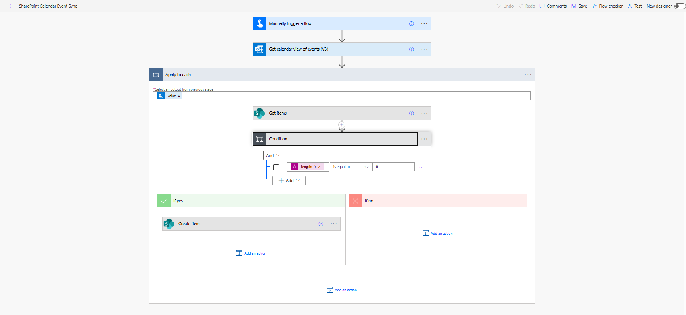

# SharePoint Calendar Event Sync

## Summary

This Power Platform sample demonstrates how to automatically sync Outlook/Teams calendar events to a SharePoint list using Power Automate.

The flow retrieves events from a specified calendar, checks for duplicates using the event iCalUId (Meeting ID), and creates new SharePoint list items with details such as subject, organizer, attendees, location, start/end time, and description.

This solution is provided as a proof-of-concept (POC) for customization or extension.



## Applies to


## Compatibility


## Features

- ✅ Sync Outlook/Teams events to SharePoint automatically
- ✅ Prevent duplicate entries using Meeting ID
- ✅ Map all key event details including attendees, organizer, and location
- ✅ Handles HTML content cleanup in event descriptions
- ✅ Configurable concurrency (up to 20 parallel executions)

## Prerequisites

- Access to a SharePoint Online site with the target list
- Permissions to read calendar events from Outlook or Teams
- Power Automate flow owner must have access to both SharePoint and Microsoft 365 (Outlook/Teams) connectors

## Solution Components

### Data Sources
- SharePoint
- Microsoft Outlook / Teams Calendar

### Flow
- **Calendar Event Sync** - Main automation flow

## Installation

### Step 1: Create Supporting SharePoint List

Create a new list named **Calendar Events** in your SharePoint site with the following columns:

| Internal Name | Display Name | Type | Notes |
|---------------|--------------|------|-------|
| Title | Title | Single line of text | Use event subject |
| Organizer1 | Organizer1 | Single line of text | Event organizer |
| Attendees | Attendees | Multiple lines of text | Required + optional attendees |
| StartTime | Start Time | Date and Time | Start time of the event |
| EndTime | End Time | Date and Time | End time of the event |
| Location | Location | Single line of text | Event location |
| Body | Description | Multiple lines of text | Event body / description |
| MeetingID | Meeting ID | Single line of text | iCalUId to prevent duplicates |


### Step 2: Import Power Platform Solution

1. Download the **managed** solution `.zip` from the solution folder
2. In [Power Apps Maker Portal](https://make.powerapps.com), choose your environment
3. Navigate to **Solutions** > **Import solution** > **Browse**
4. Select the downloaded solution file
5. Connect the SharePoint and Outlook connectors when prompted
6. Click **Import**
7. Share the flow with any additional users who may need to view or edit it

### Alternative: Using Source Code

You can also pack the source code using the Power Apps CLI:

```bash
pac solution pack --folder <path-to-source-folder> --zipfile <path-to-destination-zip> --processCanvasApps
```

- Replace `<path-to-source-folder>` with the local path to the sourcecode folder
- Replace `<path-to-destination-zip>` with the path of the solution .zip

Then import the solution as described above.

## Flow Overview

### Process Flow
1. **Get Calendar Events** – Retrieves events from the selected Outlook/Teams calendar between a start and end date
2. **For Each Event** – Loops through each event retrieved
3. **Check for Duplicates** – Uses a SharePoint Get items action to see if the event's iCalUId (Meeting ID) already exists
4. **Create SharePoint Item** – If the event is not found, creates a new item in the SharePoint list

### Field Mapping

| SharePoint Field | Mapped Flow Value |
|------------------|-------------------|
| Title | Event subject |
| Organizer1 | Event organizer |
| Attendees | Required + optional attendees |
| StartTime | Event start with timezone |
| EndTime | Event end with timezone |
| Location | Event location object |
| Body | Event body with HTML tags removed/replaced |
| MeetingID | Event iCalUId |

### Performance
- **Concurrency**: The flow is configured to run up to 20 repetitions in parallel for faster processing

## Usage

1. The flow runs on a schedule or manually to retrieve calendar events
2. Events are checked against the SharePoint list to avoid duplicates
3. New events are added automatically to the list with all mapped details
4. Your SharePoint list stays in sync with the selected calendar

## Configuration

To customize the solution:
- Modify the calendar source in the flow
- Adjust the date range for event retrieval
- Update field mappings as needed
- Configure the schedule trigger frequency
- Update SharePoint URL: Change the SharePoint URL in the flow from "Sharepointurl (sai_Sharepointurl)": "https://tenant.sharepoint.com/sites/sitename" to match your specific tenant and site name (e.g., "Sharepointurl (sai_Sharepointurl)": "https://tenant.sharepoint.com/sites/sitename")
- Update SharePoint URL: Change the SharePoint URL in the Environment variable from defaultvalue of "Sharepointurl (sai_Sharepointurl)": "https://tenant.sharepoint.com/sites/sitename"

## Version History

| Version | Date | Comments |
|---------|------|----------|
| 1.0.0.0 | Aug 30, 2025 | Initial release |

## Contributors

- [Bandaru Sai](https://github.com/saiiiiiii)

## Support

This sample is provided as-is. If you encounter issues:

- [Create a new issue](https://github.com/pnp/powerplatform-samples/issues)
- [Ask a question](https://github.com/pnp/powerplatform-samples/discussions)
- [Suggest an improvement](https://github.com/pnp/powerplatform-samples/discussions)


## Help

We do not support samples, but this community is always willing to help, and we want to improve these samples. We use GitHub to track issues, which makes it easy for community members to volunteer their time and help resolve issues.

If you encounter any issues while using this sample, you can [create a new issue](https://github.com/pnp/powerplatform-samples/issues/new?assignees=&labels=Needs%3A+Triage+%3Amag%3A%2Ctype%3Abug-suspected&template=bug-report.yml&sample=sharepoint-calendar-event-sync&authors=@bandarusai&title=sharepoint-calendar-event-sync%20-%20).

For questions regarding this sample, [create a new question](https://github.com/pnp/powerplatform-samples/issues/new?assignees=&labels=Needs%3A+Triage+%3Amag%3A%2Ctype%3Abug-suspected&template=question.yml&sample=sharepoint-calendar-event-sync&authors=@bandarusai&title=sharepoint-calendar-event-sync%20-%20).

Finally, if you have an idea for improvement, [make a suggestion](https://github.com/pnp/powerplatform-samples/issues/new?assignees=&labels=Needs%3A+Triage+%3Amag%3A%2Ctype%3Abug-suspected&template=suggestion.yml&sample=sharepoint-calendar-event-sync&authors=@bandarusai&title=sharepoint-calendar-event-sync%20-%20).

## Disclaimer

**THIS CODE IS PROVIDED *AS IS* WITHOUT WARRANTY OF ANY KIND, EITHER EXPRESS OR IMPLIED, INCLUDING ANY IMPLIED WARRANTIES OF FITNESS FOR A PARTICULAR PURPOSE, MERCHANTABILITY, OR NON-INFRINGEMENT.**

