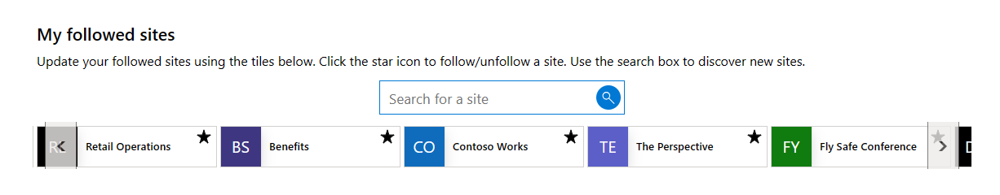
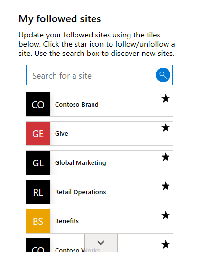
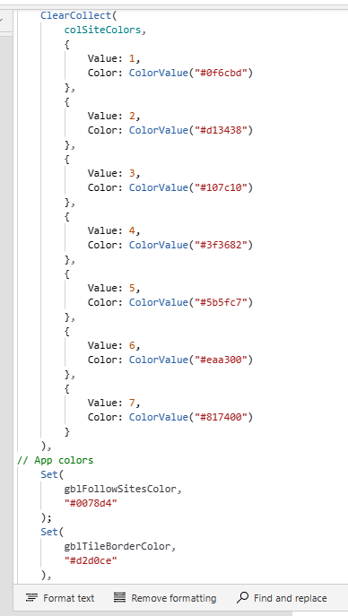

# SharePoint 'Follow/Discover Sites'

## Summary

This is a proof of concept Power Apps solution designed to be embedded within a SharePoint site/page as a Web Part. It is designed as an alternative to the out of the box 'Sites' Web Part.

It provides the user the ability to follow/unfollow a site from their currently followed sites (something which the out of the box 'Sites' Web Part does not do).

In addition the user can discover new sites/search their followed sites by using the search box.

The use of a low code/no code Power App means there is no need for custom development.

The look and feel has been designed to replicate that of the out of the box Web Part.

The Power App is fully responsive so can still render on a SharePoint page on a mobile device. The app supports both horizontal and vertical layouts.

The solution is functionally complete but is provided as a POC for you to customise/extend as required.

The SharePoint REST APIs are used to retrieve followed sites, search for sites and follow/unfollow them.

  

  

  

## Applies to


## Compatibility


## Contributors

* [Alex Clark - Microsoft](https://github.com/alexc-MSFT)

## Version history

Version|Date|Comments
-------|----|--------
1.0.0.0|Sep 14, 2023|Initial release

## Prerequisites

* Power Apps environment
* Permissions to edit the page you wish to add the Power App to
* SharePoint modern Team Site OR Communication Site
* SharePoint site that ALL users who will use the app has **read** permissions to (this can be the same site where you will embed the app)

## Solution Components

The following solution components are used in this sample:

* Follow Sites (Canvas App)
* Get followed sites (Flow)
* Follow Unfollow site (Flow)
* Find sites (Flow)

## Data Sources

* SharePoint

### Using the sample

Follow the instructions below to deploy this sample to your tenant. Once deployed, the app (Follow Sites) is designed to be embedded within a SharePoint page. It can be embedded in a horizontal or vertical section.

I would recommend using the 'Embed' Web Part and defining your own size. This works much better than the native Power Apps Web Part in terms of how it looks on the page. 

The recommended sizing is as follows:

**Horizontal Layout**

Width: 1024px
Height: 170px

**Vertical Layout**

Width: 350px
Height: 500px (reducing the height will display less sites, the user can scroll however)

It is worth noting that the deployment instructions below assume a proficient level of knowledge of Power Apps, Power Automate and SharePoint Online.

## Minimal Path to Awesome

### Import Power Apps solution

1. Download the **[Unmanaged](./solution/sharepoint-followsites.zip)** solution `.zip` from the **solution** folder.

2. Within **<https://make.powerapps.com>**, import the `.zip` file via **Solutions** > **Import solution** > **Browse** and select the `.zip` file you just downloaded.

3. Click next.

4. When prompted connect the SharePoint data connection and select an appropriate SharePoint site that all users have READ access to (this is used for the REST API calls).

5. Click Import. 

6. OPTIONAL - Update the color in the App OnStart event to match your SharePoint branding. Locate the below formula and update the hex codes. This will update the colors in the app.

**colSiteColors**: Collection of Fluent colors that are used for the coloured part of the tiles, colors are selected at random.

**gblFollowSitesColor**: Colors used in the search box.

**gblTileBorderColor**: Border color for the site tiles.




`
Set(gblMyToolsColor,"#0078d4");
`

7. Add ALL users who will use the app as 'Run only users' for each Power Automate flow - 'Find sites', 'Get user followed sites', 'Follow Unfollow site'. This is required so they can be triggered by users from the app and will ensure the REST API calls are executed in the context of their accounts. You can use an AD group containing all users in your organization if you wish.

8. Get the unique Id for the **Follow Sites** Power App from your tenant - Navigate to the Power Apps portal, select the app and click **Details** on the menu bar. Copy the **App ID** value.

9. Embed the app in a SharePoint page. You can use the following embed code, replace the GUID after /apps/ with the Id you copied above. Feel free to change the size as you see fit (size below is for a horizontal layout).

`<iframe width="1024px" height="170px" src="https://web.powerapps.com/webplayer/iframeapp?source=iframe&amp;screenColor=rgba(104,101,171,1)&amp;appId=/providers/Microsoft.PowerApps/apps/6cfd9913-5dac-48f8-b096-520fdf9ece6c"></iframe>`

10. Republish your SharePoint page.

11. Share the app with ALL users that have access to/will use your SharePoint site.


## Using the Source Code

You can also use the [Power Apps CLI](https://aka.ms/pac/docs) to pack the source code by following these steps::

* Clone the repository to a local drive.
* Pack the source files back into `.zip` file:

  ```bash
  pac solution pack --folder pathtosourcefolder --zipfile pathtosolution  --processCanvasApps
  ```

  Making sure to replace `pathtosourcefolder` to point to the path to this sample's `sourcecode` folder, and `pathtosolution` to point to the path of this solution's `.zip` file (located under the `Solutions` folder).
* Within **<https://make.powerapps.com>**, import the `.zip` file via **Solutions** > **Import solution** > **Browse** and select the `.zip` file you just downloaded.
* Click next.
* Click import.
* Follow the steps above to configure and use the apps.

## Features

This sample app is a great way to learn some fundamental Power Apps and Power Automate concepts like:

* Branding out-of-the-box controls
* Working with SharePoint as a data source
* Power Fx Formulas
* Working with local collections
* Building custom UIs
* Responsive design
* Using containers to build responsive layouts
* Using the SharePoint REST APIs in Power Automate

### How to use the app

Using the app is designed to be fairly self explanatory for users.

When the app first loads, the users' followed sites are retrieved by executing the 'Get user followed sites' flow. 

Sites can be followed/unfollowed using the 'star' icon in the tile (executes the 'Follow Unfollow Site' flow).

Users can discover new sites/search their followed sites by using the search box. The search is performed when they tab out of the search box or click the search icon. 

Searches are performed using the SharePoint REST API through a Power Automate flow ('Find sites').

The search box must be cleared before the view is reset and the user can see their followed sites again.

## Help

We do not support samples, but this community is always willing to help, and we want to improve these samples. We use GitHub to track issues, which makes it easy for  community members to volunteer their time and help resolve issues.

If you encounter any issues while using this sample, you can [create a new issue](https://github.com/pnp/powerapps-samples/issues/new?assignees=&labels=Needs%3A+Triage+%3Amag%3A%2Ctype%3Abug-suspected&template=bug-report.yml&sample=sharepoint-followsitess&authors=@alexc-MSFT&title=sharepoint-followsites%20-%20).

For questions regarding this sample, [create a new question](https://github.com/pnp/powerapps-samples/issues/new?assignees=&labels=Needs%3A+Triage+%3Amag%3A%2Ctype%3Abug-suspected&template=question.yml&sample=sharepoint-followsites&authors=@alexc-MSFT&title=sharepoint-followsites%20-%20).

Finally, if you have an idea for improvement, [make a suggestion](https://github.com/pnp/powerapps-samples/issues/new?assignees=&labels=Needs%3A+Triage+%3Amag%3A%2Ctype%3Abug-suspected&template=suggestion.yml&sample=sharepoint-followsites&authors=@alexc-MSFT&title=sharepoint-followsites%20-%20).

## For more information

* [Overview of creating apps in Power Apps](https://docs.microsoft.com/powerapps/maker/)
* [Power Apps canvas apps documentation](https://docs.microsoft.com/powerapps/maker/canvas-apps/)

## Disclaimer

**THIS CODE IS PROVIDED *AS IS* WITHOUT WARRANTY OF ANY KIND, EITHER EXPRESS OR IMPLIED, INCLUDING ANY IMPLIED WARRANTIES OF FITNESS FOR A PARTICULAR PURPOSE, MERCHANTABILITY, OR NON-INFRINGEMENT.**

