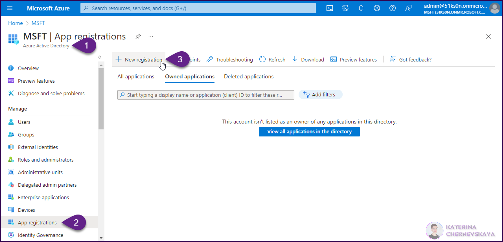
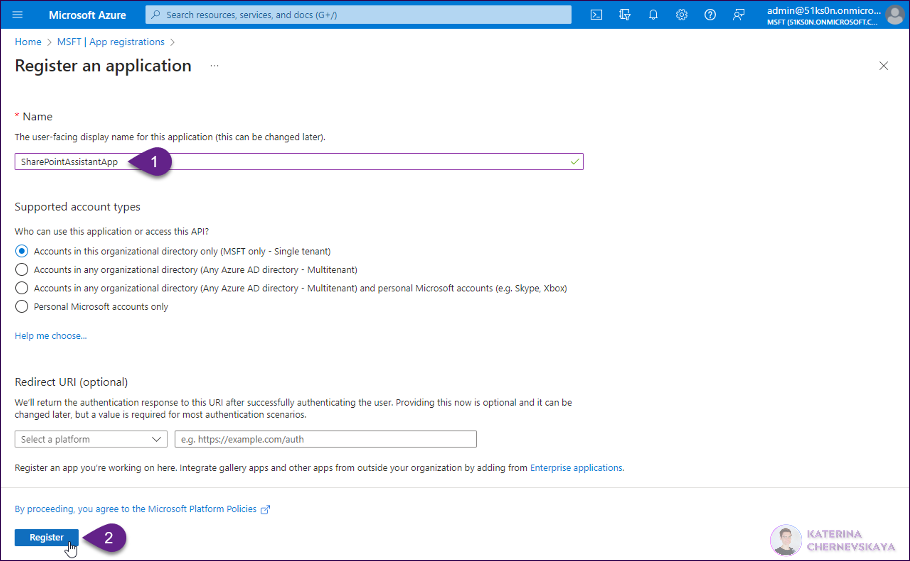
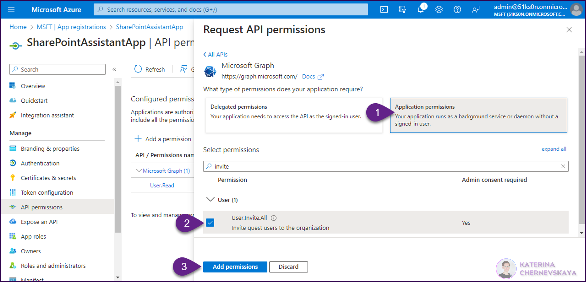
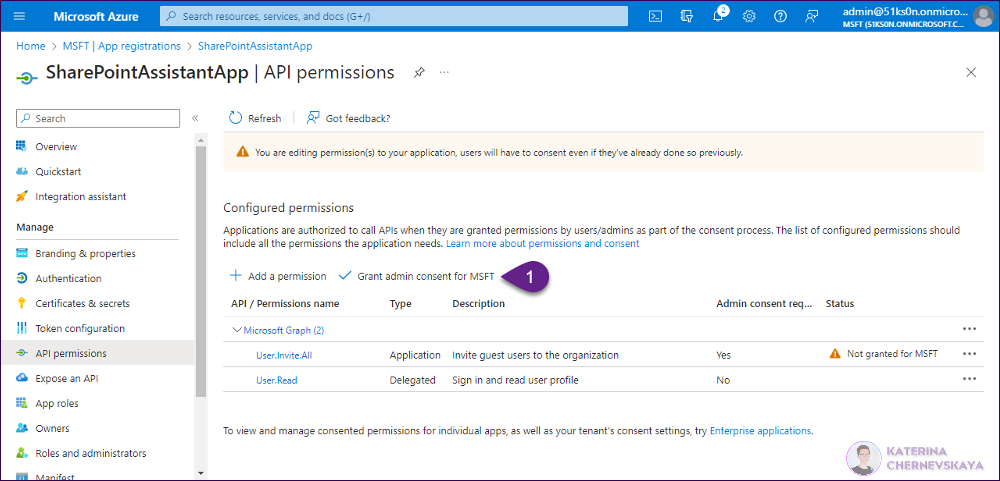
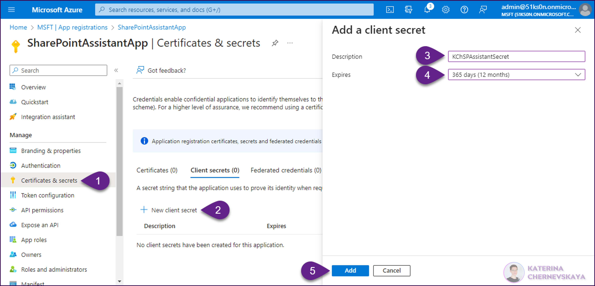
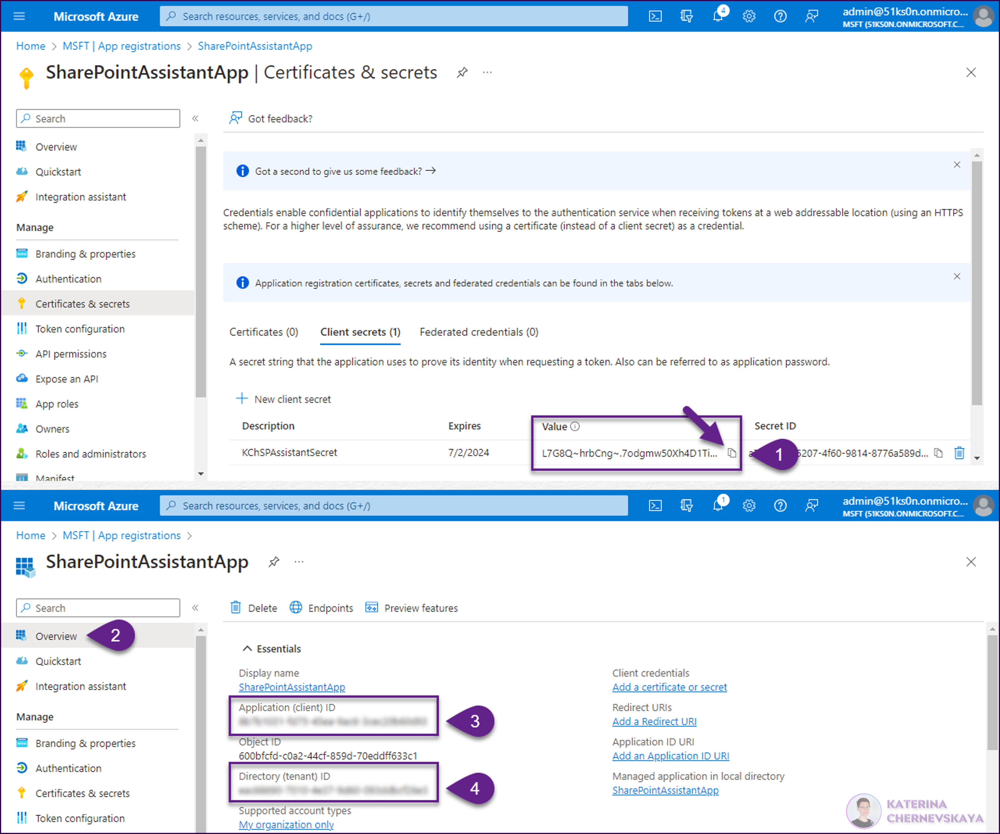
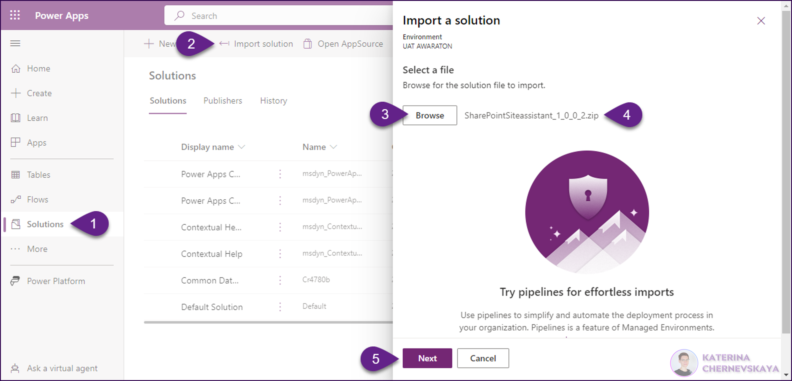
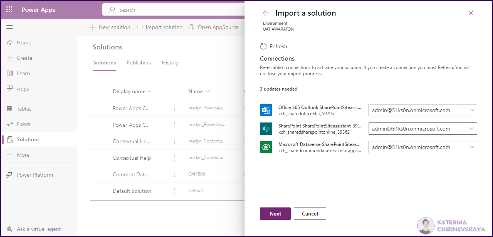
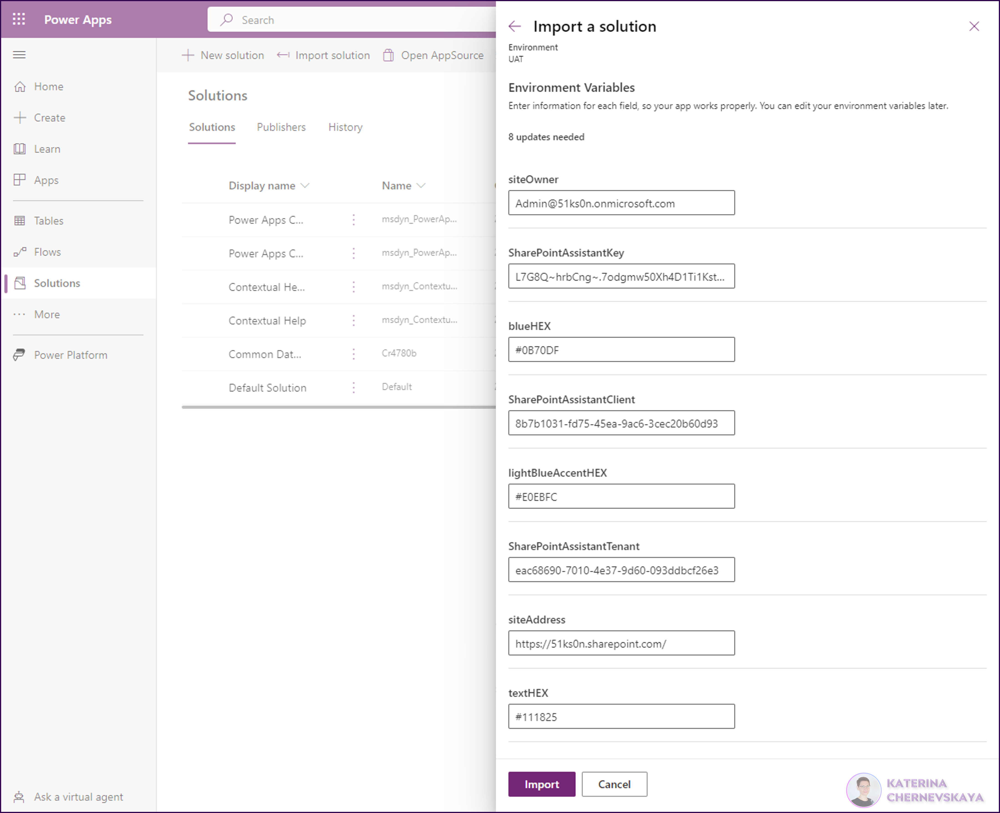
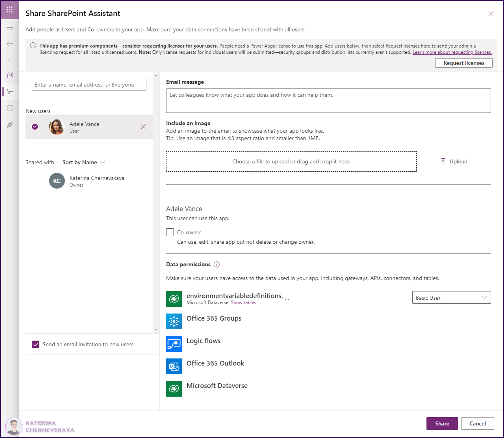

# SharePoint-Site-Assistant

## Summary

This sample serves to simplify and standardize the site creation process within an organization, offering a tailored experience to users. With a user-friendly interface, the application requires users to respond to seven questions on a Canvas App form, which initiates the creation of a new SharePoint site.

Users have the autonomy to specify the desired site language (English and Lithuanian for now), choose a design from predefined templates, and list external users who they wish to invite as members to the new site. Once these parameters are set and the form is submitted, an automated Power Automate flow is launched, which constructs the site according to the given specifications.

A unique feature of this application is its real-time site name validation system. While filling the form, the entered site name is compared against an existing database to avoid duplication. If a match is found, the system promptly notifies the user, preventing submission until a unique name is provided.

Leveraging cutting-edge technologies such as Graph API, Responsive Design, and Azure Application Insights, this solution offers a harmonious blend of simplicity and advanced functionality.

## Applies to

* [Microsoft Power Apps](https://docs.microsoft.com/powerapps/)
* [Microsoft Power Automate](https://docs.microsoft.com/power-automate/)
* [Microsoft Graph API](https://learn.microsoft.com/en-us/graph/use-the-api)

## Compatibility

## Authors

Solution|Author(s)
--------|---------
sharepoint-site-assistant | [Katerina Chernevskaya](https://github.com/Katerina-Chernevskaya) ([LinkedIn](https://www.linkedin.com/in/katerinachernevskaya/)), Awara IT Academy

## Version history

Version|Date|Comments
-------|----|--------
1.0|July 06, 2023|Initial release

## Features

This sample illustrates the following concepts:

* Responsive design of the Power Apps Canvas app allows convinient work on different devices
* Using the Graph API to instantly validate the inputted site name to prevent duplications.
* Verification of correct form filling before submission, directly within Power Apps.
* Options to select the language for the site.
* Options to select the design for the site.
* Recording user actions for the purpose of analyzing user behavior, with the goal of enhancing the application.
* Display of a list of created sites in the tenant using the Graph API.
* Automation of all site creation actions, including the invitation of external users and sending an invitation email with a link to the created site.

## Prerequisites

* Environment with Dataverse
* Microsoft 365 / Office 365 and Power Apps Standalone license
* App registration (will be used for invitation for external users)

## Solution Components

The following solution components are used in this sample:

* SharePoint Assistant (Canvas App)
* SharePoint Assistant - Site creation (Cloud flow)
* SharePoint site requests (Dataverse table)
* siteAddress (Environment variable)
* siteOwner (Environment variable)
* SharePointAssistantTenant (Environment variable)
* SharePointAssistantClient (Environment variable)
* SharePointAssistantKey (Environment variable)
* textHEX (Environment variable)
* blueHEX (Environment variable)
* lightBlueAccentHEX (Environment variable)
* SharePointSiteAssistant-Dataverse (Connection reference)
* SharePointSiteAssistant-Outlook (Connection reference)
* SharePointSiteAssistant-SharePoint (Connection reference)

## Minimal Path to Awesome

### Create the App Registration

* Open [Azure portal](https://portal.azure.com).
* Go to Azure Active Directory, open `App registration` tab and click on the `New registration` button.

* In the registration form enter the `Name` of you new App registration and click the `Register` button.

* When the App registration will be created, go to the `API permissions` tab, click the `Add a permission` and select `Microsoft Graph` in the pop-up window.

* On the next screen select `Application permissions`, find `User.Invite.All`, select it and click on the `Add permissions` button.

* Once you add the permission, click on the `Grant admin consent for <YOUR TENANT NAME>` button.

* Go to `Certificates & secrets` tab, click on the `New client secret` button, add `Description` and `Expires` values, and click the `Add` button.

* Copy to the Notepad the created secret `Value` before close the browser or navigate to another tab, because this value won't be visible once you leave this page. In addition, go to the `Overview` tab and copy to the Notepad `Application (client) ID` and `Directory (tenant) ID` values. Save these 3 values for later.

### Import the solution

* [Download](./solution/SharePointSiteAssistant.zip) the solution `.zip` from the `solution` folder
* Within **[https://make.powerapps.com](https://make.powerapps.com)**, open your target environment, go to the `Solutions` tab, click `Import solution`. In the pop-up window click `Brows` and select the `.zip` file you just downloaded. Click next. Also click `Next` on the next screen.

* On the next screen set up connections for `SharePointSiteAssistant-Dataverse`, `SharePointSiteAssistant-Outlook` and `SharePointSiteAssistant-SharePoint`. If the necessary connections aren't available in your environment, locate the drop-down list adjacent to the required connection and select `New connection`. You will then need to establish a new connection in the tab that opens. After you've created the new connection, return to the solution import dialog tab, click on `Refresh`, and your newly established connection should now be visible in the drop-down list.
Once you are ready, click on the `Next` button.

* On the next screen provide values for Environment Variables and click on the `Import` button.
* **siteOwner** - the app's admin email that will be used to send email notifications after the process will be completed (in both success or failed cases)
* **SharePointAssistantTenant** - value of the `Directory (tenant) ID` from the App Registration created in the previous step
* **SharePointAssistantClient**  - value of the `Application (client) ID` from the App Registration created in the previous step
* **SharePointAssistantKey**  - value of the `Secret value` from the App Registration created in the previous step
* **textHEX** - the color for text (in HEX format)
* **blueHEX** - the color for controls like button or selected icons (in HEX format)
* **lightBlueAccentHEX** - the color for accent (in HEX format)

* After the solution is imported, open it and share the Canvas App with all users who require access. Remember to allocate the suitable security role to these users, as well as to assign the necessary licenses.

Once all the steps have been completed, the users with whom the app was shared will gain the capability to use this app for submitting requests to create SharePoint Sites.

## Disclaimer

**THIS CODE IS PROVIDED *AS IS* WITHOUT WARRANTY OF ANY KIND, EITHER EXPRESS OR IMPLIED, INCLUDING ANY IMPLIED WARRANTIES OF FITNESS FOR A PARTICULAR PURPOSE, MERCHANTABILITY, OR NON-INFRINGEMENT.**

## Help

We do not support samples, but we this community is always willing to help, and we want to improve these samples. We use GitHub to track issues, which makes it easy for  community members to volunteer their time and help resolve issues.

If you encounter any issues while using this sample, you can [create a new issue](https://github.com/pnp/powerapps-samples/issues/new?assignees=&labels=Needs%3A+Triage+%3Amag%3A%2Ctype%3Abug-suspected&template=bug-report.yml&sample=sharepoint-site-assistant&authors=@Katerina-Chernevskaya&title=sharepoint-site-assistant%20-%20).

For questions regarding this sample, [create a new question](https://github.com/pnp/powerapps-samples/issues/new?assignees=&labels=Needs%3A+Triage+%3Amag%3A%2Ctype%3Abug-suspected&template=question.yml&sample=sharepoint-site-assistant&authors=@Katerina-Chernevskaya&title=sharepoint-site-assistant%20-%20).

Finally, if you have an idea for improvement, [make a suggestion](https://github.com/pnp/powerapps-samples/issues/new?assignees=&labels=Needs%3A+Triage+%3Amag%3A%2Ctype%3Abug-suspected&template=suggestion.yml&sample=sharepoint-site-assistant&authors=@Katerina-Chernevskaya&title=sharepoint-site-assistant%20-%20).

## For more information

* [Overview of creating apps in Power Apps](https://docs.microsoft.com/powerapps/maker/)
* [Power Apps canvas apps documentation](https://docs.microsoft.com/en-us/powerapps/maker/canvas-apps/)

