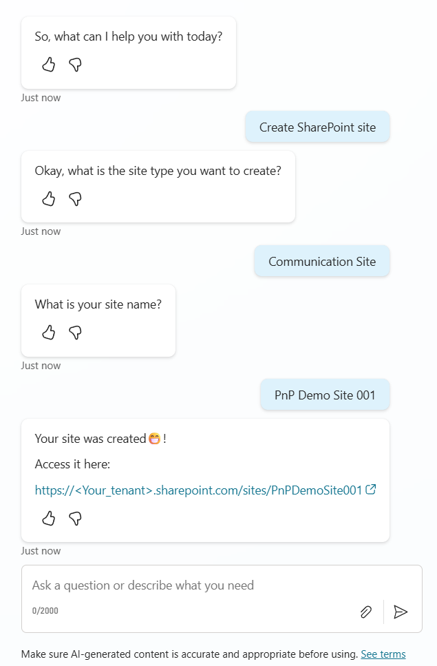

# SharePoint Site Creation Bot

## Summary

Sample Bot that creates a SharePoint Site by calling Power Automate and using Microsoft Graph/SharePoint Rest APIs. 

This bot can create either a blank Communication site or a blank Team site (Group connected).

This solution was built and targeted to be used in Dataverse for Teams.

## Applies to

## Compatibility

## Contributors
<!--
We use this section to recognize and promote your contributions. Please provide one author per line -- even if you worked together on it.

We'll only use the info you provided here. Make sure to include your full name, not just your GitHub username.

Provide a link to your GitHub profile to help others find more cool things you have done. The only link we'll accept is a link to your GitHub profile.

If you want to provide links to your social media, blog, and employer name, make sure to update your GitHub profile.
-->

* [Michel Mendes](https://github.com/michelcarlo) ([@michelcarlo](https://twitter.com/michelcarlo))

## Version history

Version|Date|Comments
-------|----|--------
1.0|July 16, 2022|Initial release
2.0|July 16, 2022|Migration from poverva-samples repository with codebase change to copilot studio by [Jan Chlebek](https://github.com/jan-chlebek)

## Minimal path to awesome
* [Download](solution/SharePointSiteCreationBot_2_0_0_0.zip) the `.zip` from the `solution` folder
* Import the `.zip` file to Copilot Studio
* Configure the connection References, and proceed importing.
* After the import has suceeded, you can edit the chatbots from Copilot Studio, and publish it to any Team you have permissions to, or submit it to be published to your tenant if you have the rights.

## Features

This is a bot built and targeted to be used within a Dataverse for Teams environments. No premium licenses are required.

The bot is triggered by any of the phrases:
* Create a site
* Create a SharePoint site
* I want a site
* I want a SharePoint site
* Give me a site

You can then choose to create a Communication site or a Team site. 

After specifiying your site name, the bot will then trigger a Power Automate flow that handles the SharePoint site creation (part of the solution package).

Before creating the site, the flow checks if a site with the same destination URL exists. If it does not exist then if the site to be created is a Communication Site, it will use the SharePoint REST API to create it, if it is a Team site we use Microsoft Graph (using the Send an HTTP request - Preview action from the Office 365 Groups connector).

## Help

We do not support samples, but this community is always willing to help, and we want to improve these samples. We use GitHub to track issues, which makes it easy for  community members to volunteer their time and help resolve issues.

If you encounter any issues while using this sample, you can [create a new issue](https://github.com/pnp/powerapps-samples/issues/new?assignees=&labels=Needs%3A+Triage+%3Amag%3A%2Ctype%3Abug-suspected&template=bug-report.yml&sample=sharepoint-site-creation-bot&authors=@michelcarlo&title=sharepoint-site-creation-bot%20-%20).

For questions regarding this sample, [create a new question](https://github.com/pnp/powerapps-samples/issues/new?assignees=&labels=Needs%3A+Triage+%3Amag%3A%2Ctype%3Abug-suspected&template=question.yml&sample=sharepoint-site-creation-bot&authors=@michelcarlo&title=sharepoint-site-creation-bot%20-%20).

Finally, if you have an idea for improvement, [make a suggestion](https://github.com/pnp/powerapps-samples/issues/new?assignees=&labels=Needs%3A+Triage+%3Amag%3A%2Ctype%3Abug-suspected&template=suggestion.yml&sample=sharepoint-site-creation-bot&authors=@michelcarlo&title=sharepoint-site-creation-bot%20-%20).

## Disclaimer

**THIS CODE IS PROVIDED *AS IS* WITHOUT WARRANTY OF ANY KIND, EITHER EXPRESS OR IMPLIED, INCLUDING ANY IMPLIED WARRANTIES OF FITNESS FOR A PARTICULAR PURPOSE, MERCHANTABILITY, OR NON-INFRINGEMENT.**

