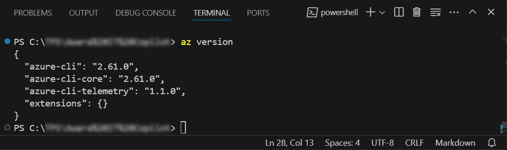
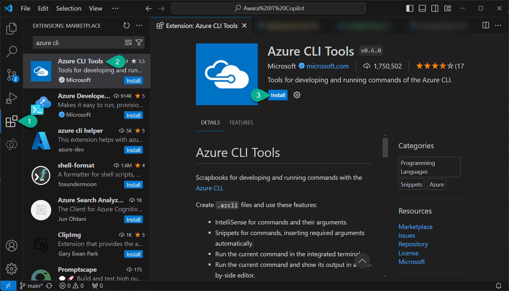
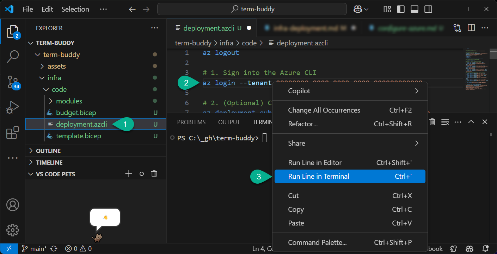
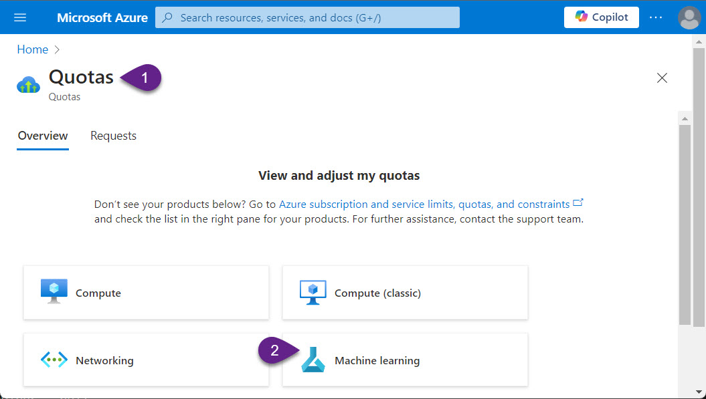
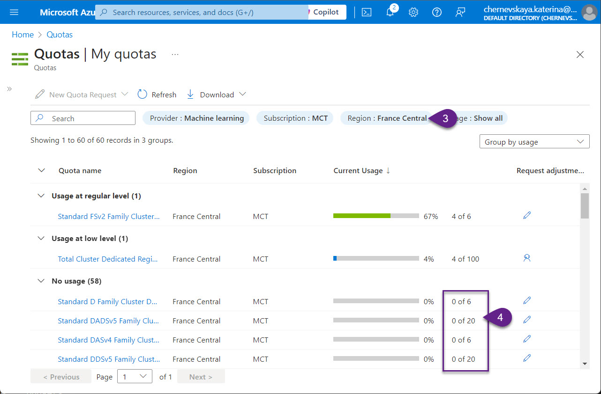
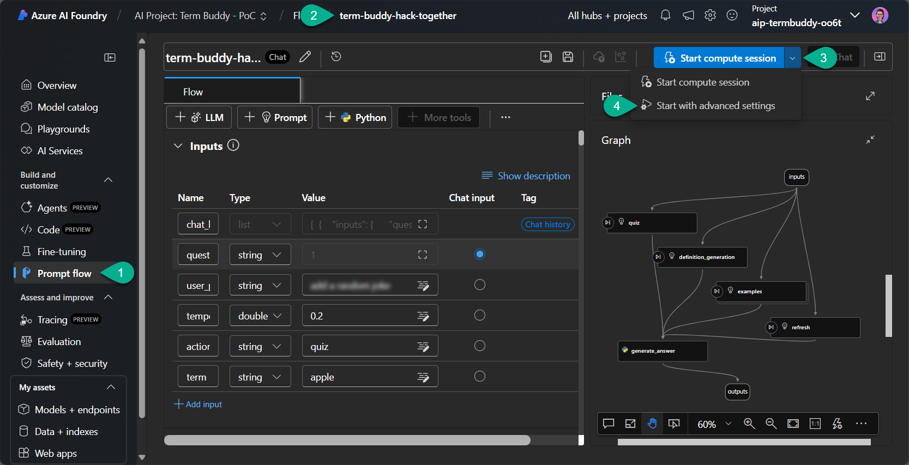
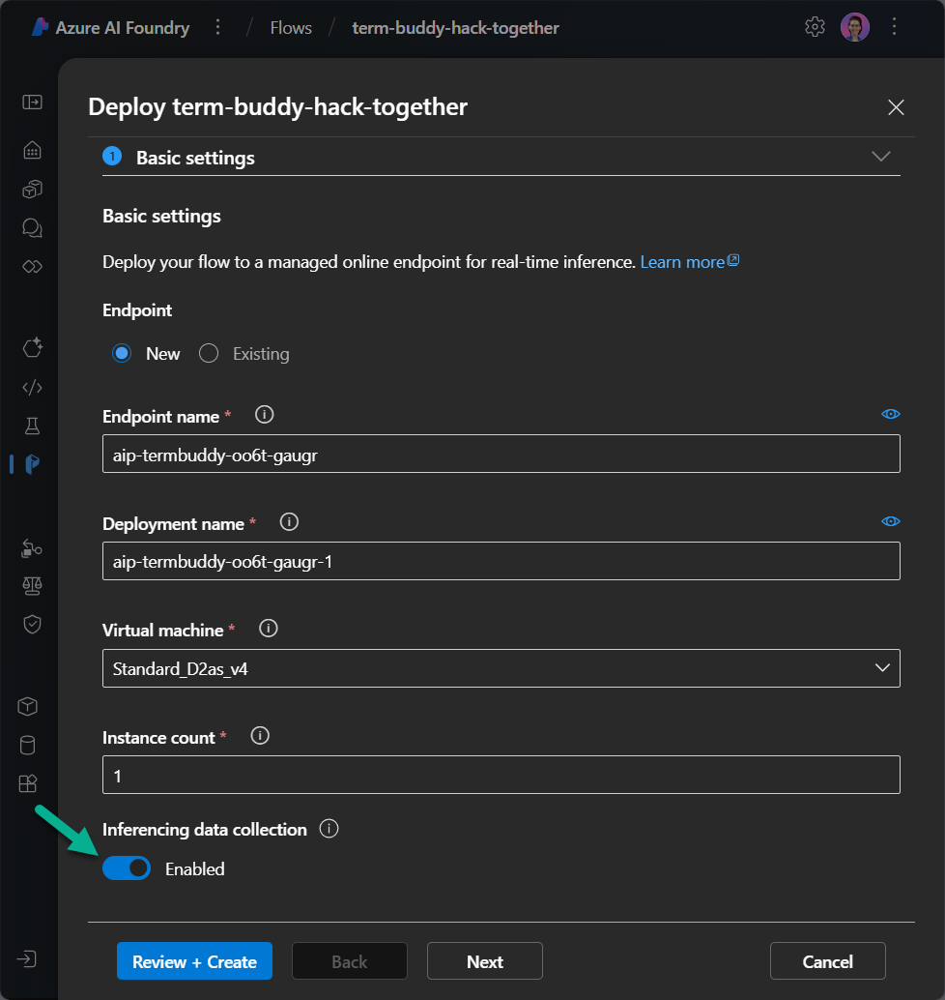
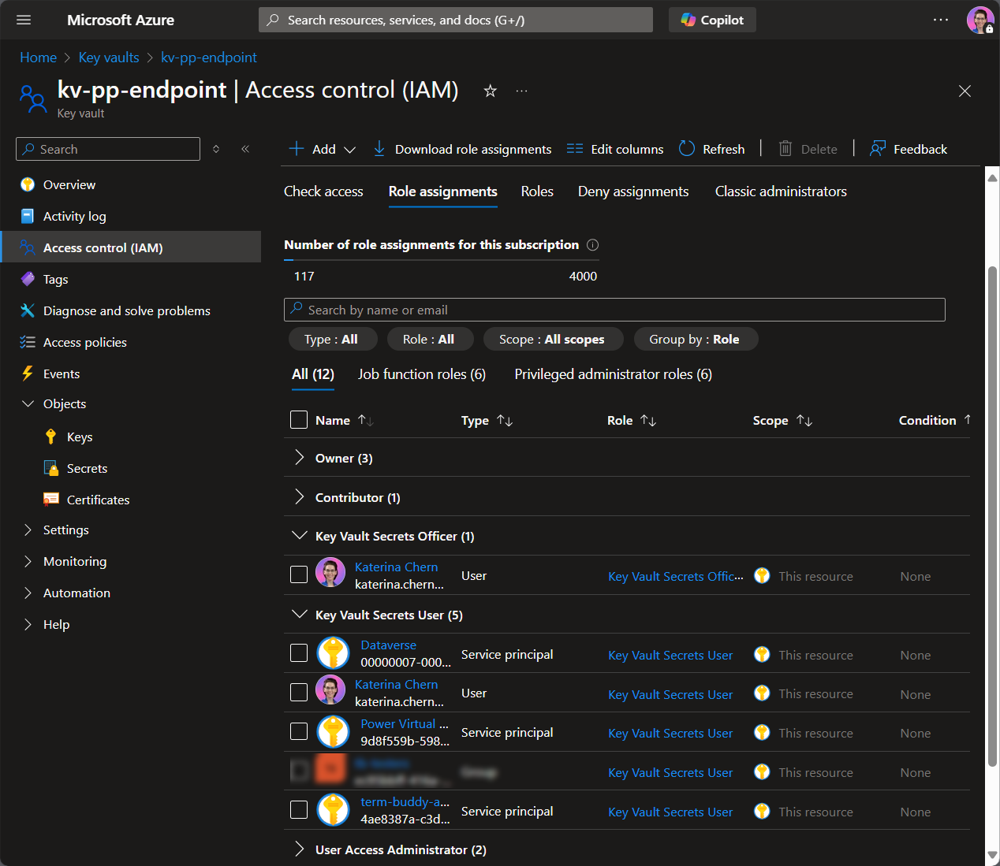
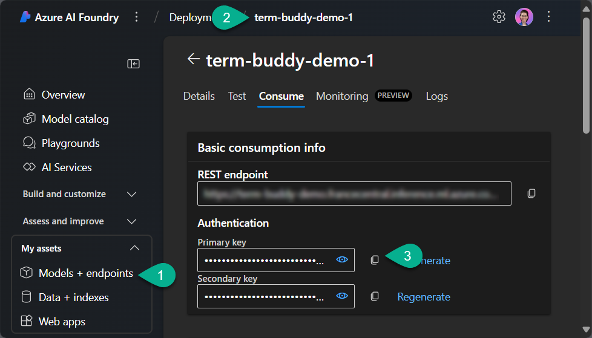

# Term Buddy Infrastructure Deployment Guide

## 1. Prepare Development Environment
Before deploying the infrastructure, ensure the following:

### 1.1 Install Azure CLI and Configure VS Code

1. Download and install Azure CLI: [Install Azure CLI](https://learn.microsoft.com/en-us/cli/azure/install-azure-cli-windows?tabs=azure-cli#install-or-update).
2. Open **VS Code** and run the following command in the terminal to verify installation:
   ```
   az version
   ```
    

3. Install the **Azure CLI Tools** extension in VS Code:
   - Open **VS Code** > **Extensions**
   - Search for **Azure CLI Tools** and install it.

   

4. Sign into the Azure CLI:
   ```
   az login --tenant <TENANT-ID>
   ```
   Replace `<TENANT-ID>` with your Azure Tenant ID.

## 2. Configure Azure

### 2.1 Download deployment files

1. Clone this repository to a local drive.
2. Open folder `infra` in VS Code.
3. Open `deployment.azcli` file and update values according to your project.

### 2.2 Configure Budgets

1. Log in via **Azure CLI**:
   ```
   az login --tenant <TENANT-ID>
   ```
   You can launch this and next commands directly from `deployment.axcli` file by - right click on the cpmmand and select `Run line in Terminal`.

    

2. Deploy the **budget configuration** (optional):
   ```sh
   az deployment sub create --name <BUDGET_DEPLOYMENT_NAME> --location francecentral --template-file ".\code\budget.bicep" --parameters startDate=<START_DATE_YYYY-MM-DD> endDate=<END_DATE_YYYY-MM-DD> contactEmails='[\"<EMAIL1>\", \"<EMAIL2>\"]' budgetName=<BUDGET_NAME> amount=<BUDGET_AMOUNT>
   ```

### 2.3 Register Resource Provider
1. Check which Resource Providers already registered:
```sh
az provider show --namespace Microsoft.Quota --query "registrationState"
az provider show --namespace Microsoft.CognitiveServices --query "registrationState"
az provider show --namespace Microsoft.Storage --query "registrationState"
az provider show --namespace Microsoft.MachineLearningServices --query "registrationState"
az provider show --namespace Microsoft.AlertsManagement --query "registrationState"
az provider show --namespace Microsoft.PolicyInsights --query "registrationState"
az provider show --namespace Microsoft.Authorization --query "registrationState"
az provider show --namespace Microsoft.PowerPlatform --query "registrationState"
```

2. For those which are not registered run following commands (select only required commands):
```sh
az provider register --namespace Microsoft.Quota --wait
az provider register --namespace Microsoft.CognitiveServices --wait
az provider register --namespace Microsoft.Storage --wait
az provider register --namespace Microsoft.MachineLearningServices --wait
az provider register --namespace Microsoft.AlertsManagement --wait
az provider register --namespace Microsoft.PolicyInsights --wait
az provider register --namespace Microsoft.Authorization --wait
az provider register --namespace Microsoft.PowerPlatform --wait
```

### 2.4 Check ML Quotas

1. Navigate to [Azure Quotas](https://portal.azure.com/#view/Microsoft_Azure_Capacity/QuotaMenuBlade/~/overview).
2. Select the **Machine Learning** provider and region: `France Central` (or another region where you plan to deploy Azure resources).
3. Ensure the **D-series VM quota** (or any other required VM type) is available.
4. If the quota is unavailable, request an increase or raise a ticket with **Microsoft Support**.
    
    

---

## 3. Deploy Core Infrastructure

### 3.1 Create Resource Group
Run the following command to create resource group:
```sh
az group create -l francecentral -n <RESOURCE_GROUP_NAME>
```

### 3.2 Deploy Core Resources
Run the following command to launch the resource deployment process:
```sh
az deployment group create --resource-group <RESOURCE_GROUP_NAME> --template-file ".\code\template.bicep" --parameters name=<FIXED_PART_OF_RESOURCE_NAME> deploymentPrincipalId=<ID_OF_THE_SERVICE_PRINCIPAL> aiHubFriendlyName='AI Hub: Term Buddy' aiProjectFriendlyName='AI Project: Term Buddy' aiHubDescription='Azure AI Hub for the Term Buddy.' tags='{"project": "term-buddy"}'
```

## 4. Deploy Prompt Flow

### 4.1 Import Prompt Flow
1. After the core resources successfully deployed, open [Azure AI Foundry](https://ai.azure.com/) and navigate to the **AI Hub**.
2. Open the **AI Project** and go to the **Prompt Flow** section.
3. Click **Create** > **Upload from local** and upload the [provided solution file](./prompt-flow/term-buddy-hack-together.zip).
4. Configure:
   - **Name**: `term-buddy-hack-together`
   - **Flow Type**: `Chat flow`

### 4.2 Configure Compute
1. In the Prompt Flow canva open **Start compute session** and select **Start with advanced settings**.
    
2. Use the **cheapest serverless compute** with **auto shutdown** after `20 minutes`.

### 4.3. Update LLM tool connections
Once compute has been started, navigate to each of node **quiz**, **definition_generation**, **examples**, **refresh** and update connection to Azure OpenAI and model name.

### 4.4 Deploy the Endpoint
Deploy the **Prompt Flow** with **Application Insights enabled**. 

Make sure you enable **Inferencing data collection:**


## 5. Store Endpoint Key in Azure Key Vault

1. Create a separate [Azure Key Vault resource](https://portal.azure.com/#create/Microsoft.KeyVault).
2. Assign the following roles:
    - `Key Vault Secrets User`:
        - To the service principal or managed identity that needs to access the secrets stored in Azure Key Vault.
        - To service principals `Dataverse` and `Power Virtual Agent Service`.
    - `Key Vaul Secrets Officer`:
        - To the service principal or managed identity that needs to create secrets.
    
3. Navigate to **Secrets** under **Objects**. Generate a new secret.
- For the **Secret value** provide your endpoint's `Primary key`. You can get this key from the **Consume** page of your Endpoint:
    
- For the**Tags** provide the following information:
    ```
    {
        Tag Name: AllowedBots,
        Tag Value: <ENVIRONMENT_ID>/kch_termbuddy
    }
    ```
    > Note: You can provide several Tag Values separated with coma.

---

## **Completion Checklist**

✅ Prepare Development Environment <br>
✅ Configure Azure <br>
✅ Deploy Core Infrastructure <br>
✅ Deploy Prompt Flow <br>
✅ Store Endpoint Key in Azure Key Vault

