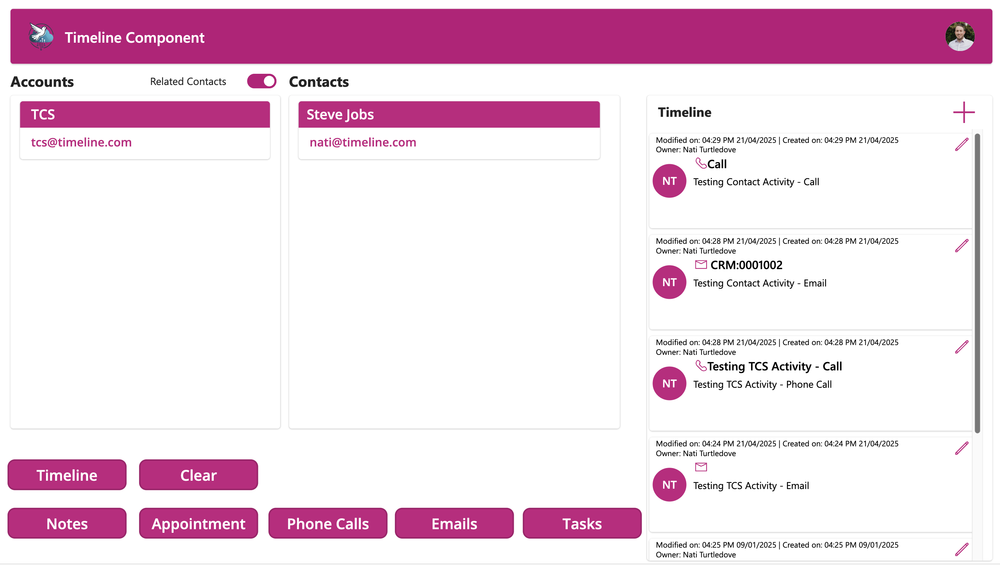
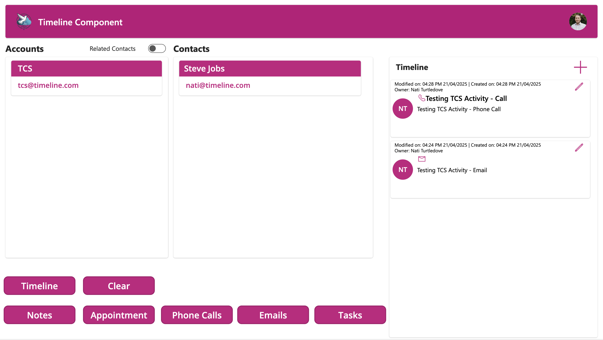
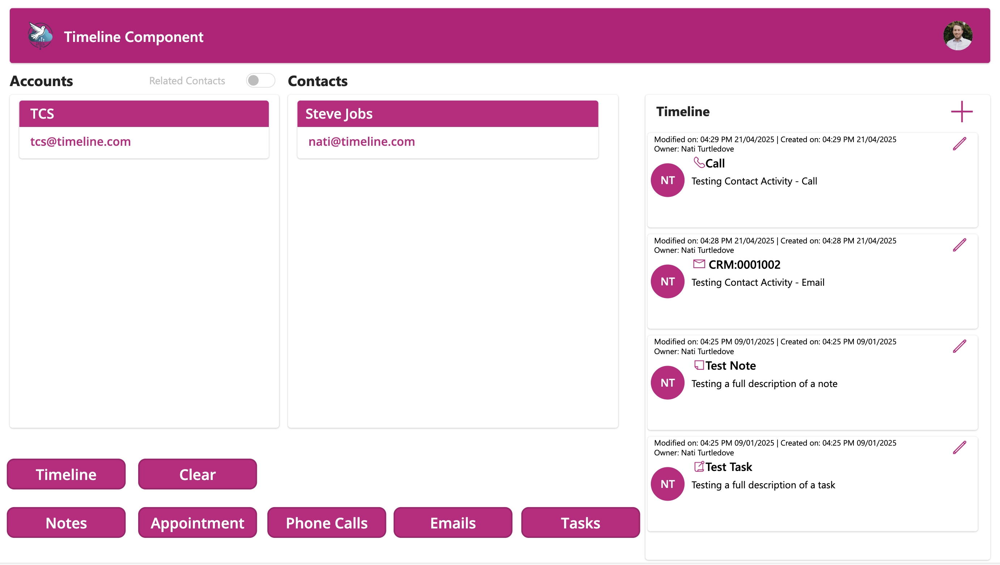

# Timeline Component
A Canvas app version of the timeline feature in a Model-Driven app, this component consolidates all the activities of a contact or account in a single timleine view, just like an MDA.


## Summary
This timeline component collects Notes, Emails, Appointments, Phone Calls and Tasks created as activities for a contact or account and displays them in a single timeline view, similar to the timeline feature in Model-Driven apps. The component is designed to be used in a Canvas app, and it can be customised to fit your specific needs and include addtiional activity tables.



## Applies to
* [Microsoft Power Apps](https://docs.microsoft.com/power-apps)

## Compatibility


## Contributors

* [Nati Turtledove](https://github.com/NatiTurts)

## Version history

Version|Date|Comments
-------|----|--------
1.0.0.0 | April 25, 2025 | Initial release

## Features
* View actvities for an Account in a Canvas app timeline.
* View actvities for an Account and its related contacts in a Canvas app timeline.
* View actvities for a Contact in a Canvas app timeline.
* The activity timeline currently include Notes, Phone Calls, Emails, Appointments and Tasks.


### View Account activities and related contact activities
When you select an account in the gallery, the activities for that account will load and will also include the activities for any contacts related to that account (Just like how the timeline in an MDA works). The Related Contacts toggle will auto set to true. You can toggle between this setting to switch if you want to view activities for the accounts related contacts or not.


### View Account activities only
When you select an account in the gallery and you toggle the Related Contacts off, only activities for the selected account will show in the timeline.


### View Contact activities only
When you select a contact in the gallery, the activities for that contact will load into the timeline.


### Activity Buttons
Buttons in the app are included to see what code is being run for collecting data from each activity table and collating it together.


## Prerequisites
### Licensing
* The component requires users to have a premium licensse as it uses standard Dataverse entities.


### Security
* Users require a minimum of user level read privileges to the following tables:
  * Accounts
  * Contacts
  * Teams
  * Users
  * Tasks
  * Email (Email Messages)
  * Phone Calls
  * Appointments
  * Notes


## Minimal Path to Awesome

* [Download](./solution/timeline-component.zip) the `.zip` from the `solution` folder
* [Import](https://learn.microsoft.com/en-us/power-apps/maker/data-platform/import-update-export-solutions) the `.zip` file using **Solutions** > **Import Solution**.

### Using the source code

You can also use the [Power Apps CLI](https://docs.microsoft.com/powerapps/developer/data-platform/powerapps-cli) to pack the source code by following these steps:

* Clone the repository to a local drive
* Pack the source files back into a solution `.zip` file:

  ```bash
  pac solution pack --zipfile pathtodestinationfile --folder pathtosourcefolder --processCanvasApps
  ```

  Making sure to replace `pathtosourcefolder` to point to the path to this sample's `sourcecode` folder, and `pathtodestinationfile` to point to the path of this solution's `.zip` file (located under the `solution` folder)
* Within **Power Apps Studio**, import the solution `.zip` file using **Solutions** > **Import Solution** and select the `.zip` file you just packed.

## Help

We do not support samples, but this community is always willing to help, and we want to improve these samples. We use GitHub to track issues, which makes it easy for  community members to volunteer their time and help resolve issues.

If you encounter any issues while using this sample, you can [create a new issue](https://github.com/pnp/powerapps-samples/issues/new?assignees=&labels=Needs%3A+Triage+%3Amag%3A%2Ctype%3Abug-suspected&template=bug-report.yml&sample=timeline-component&authors=@NatiTurts&title=timeline-component%20-%20).

For questions regarding this sample, [create a new question](https://github.com/pnp/powerapps-samples/issues/new?assignees=&labels=Needs%3A+Triage+%3Amag%3A%2Ctype%3Abug-suspected&template=question.yml&sample=timeline-component&authors=@NatiTurts&title=timeline-component%20-%20).

Finally, if you have an idea for improvement, [make a suggestion](https://github.com/pnp/powerapps-samples/issues/new?assignees=&labels=Needs%3A+Triage+%3Amag%3A%2Ctype%3Abug-suspected&template=suggestion.yml&sample=timeline-component&authors=@NatiTurts&title=timeline-component%20-%20).

## Disclaimer

**THIS CODE IS PROVIDED *AS IS* WITHOUT WARRANTY OF ANY KIND, EITHER EXPRESS OR IMPLIED, INCLUDING ANY IMPLIED WARRANTIES OF FITNESS FOR A PARTICULAR PURPOSE, MERCHANTABILITY, OR NON-INFRINGEMENT.**


