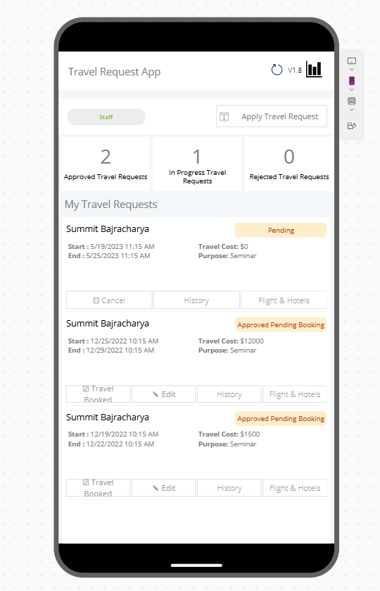

# Travel Request Approval Management Canvas Application

## Summary

Travel Request Approval is a comprehensive corporate travel request solution designed to streamline employee trip approvals while ensuring policy compliance. Transform your travel management process with automated workflows and real-time budget tracking.

📢 This enterprise-ready solution enables organizations to:

✈️ Submit Travel Requests  
✅ Track Multi-Level Approvals  
📊 Enforce Budget Policies  



## Applies to


## Compatibility
  


## Contributors

* [Summit Baj](https://github.com/summitbaj)

## Version history

Version|Date|Comments
-------|----|--------
1.0|Jan 25, 2025|Initial release

## Prerequisites

- Microsoft Dataverse: **Travel Requests**

## Solution Components

Component|Type
---------|-----
Travel Request App | Canvas App
Travel Request Admin Portal | Model Drivel App
Approval Workflow | Power Automate Flow

## Minimal Path to Awesome

1. [Download](./solution/TravelRequestApprovalApp_1_0_0_2.zip) the solution package
2. Import into Power Apps via **Solutions** > **Import solution**
3. Deploy the Travel Request Approval app to your users

## Using the Source Code

To modify and repackage using Power Apps CLI:

```bash
pac solution pack --folder travel-request-src --zipfile travel-request-approval.zip --processCanvasApps