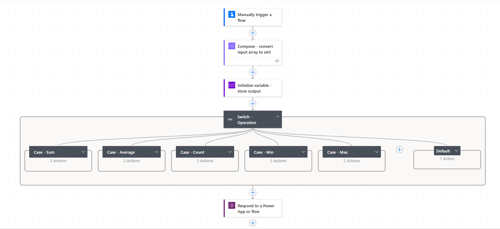

# Utility flow for aggregrate operations on array

## Summary

This sample is a reusable child cloud flow that can be used for performing aggregate operations (Avg, Count, Min, Max & Sum) on array of objects. This flow also demonstrate how we can leverage powerful XML and XPATH functions in fx expression for complex automation scenerios.



## Applies to


## Compatibility


## Contributors

* [Manish Solanki](https://github.com/Solanki-Manish)

## Version history

Version|Date|Comments
-------|----|--------
1.0|Apr 20, 2025|Initial release

## Prerequisites

The caller parent flow should be solution aware to call this child flow using "Run a Child Flow" action.

## Minimal Path to Awesome

### Import Solution

* [Download](./solution/utility-flow-for-aggregrate-operations-on-array.zip) the `.zip` from the `solution` folder
* [Import](https://learn.microsoft.com/en-us/power-apps/maker/data-platform/import-update-export-solutions) the `.zip` file using **Solutions** > **Import Solution**.

### Using the source code

You can also use the [Power Apps CLI](https://docs.microsoft.com/powerapps/developer/data-platform/powerapps-cli) to pack the source code by following these steps:

* Clone the repository to a local drive
* Pack the source files back into a solution `.zip` file:

  ```bash
  pac solution pack --zipfile pathtodestinationfile --folder pathtosourcefolder --processCanvasApps
  ```

  Making sure to replace `pathtosourcefolder` to point to the path to this sample's `sourcecode` folder, and `pathtodestinationfile` to point to the path of this solution's `.zip` file (located under the `solution` folder)
* Within **Power Apps Studio**, import the solution `.zip` file using **Solutions** > **Import Solution** and select the `.zip` file you just packed.

## Features

This sample illustrates the following concepts:

* Reusablility
* Use of XML & XPATH for complex automation scenerios  
* Use of complex nested expressions
* Concept of parent-child flow

## Help

We do not support samples, but this community is always willing to help, and we want to improve these samples. We use GitHub to track issues, which makes it easy for  community members to volunteer their time and help resolve issues.

If you encounter any issues while using this sample, you can [create a new issue](https://github.com/pnp/powerapps-samples/issues/new?assignees=&labels=Needs%3A+Triage+%3Amag%3A%2Ctype%3Abug-suspected&template=bug-report.yml&sample=utility-flow-for-aggregrate-operations-on-array&authors=@Solanki-Manish&title=utility-flow-for-aggregrate-operations-on-array).

For questions regarding this sample, [create a new question](https://github.com/pnp/powerapps-samples/issues/new?assignees=&labels=Needs%3A+Triage+%3Amag%3A%2Ctype%3Abug-suspected&template=question.yml&sample=utility-flow-for-aggregrate-operations-on-array&authors=@Solanki-Manish&title=utility-flow-for-aggregrate-operations-on-array).

Finally, if you have an idea for improvement, [make a suggestion](https://github.com/pnp/powerapps-samples/issues/new?assignees=&labels=Needs%3A+Triage+%3Amag%3A%2Ctype%3Abug-suspected&template=suggestion.yml&sample=utility-flow-for-aggregrate-operations-on-array&authors=@Solanki-Manish&title=utility-flow-for-aggregrate-operations-on-array).

## Disclaimer

**THIS CODE IS PROVIDED *AS IS* WITHOUT WARRANTY OF ANY KIND, EITHER EXPRESS OR IMPLIED, INCLUDING ANY IMPLIED WARRANTIES OF FITNESS FOR A PARTICULAR PURPOSE, MERCHANTABILITY, OR NON-INFRINGEMENT.**


