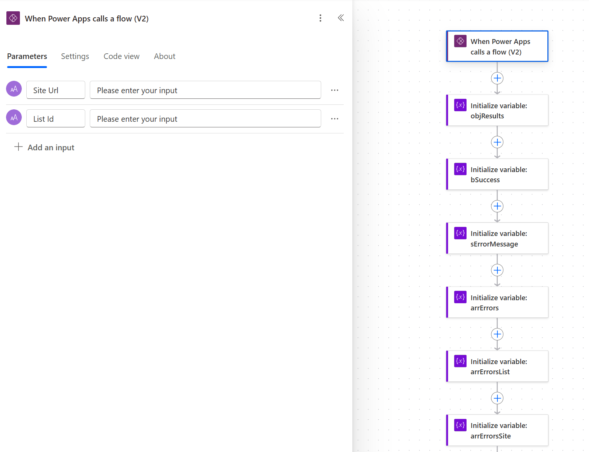

# Get SharePoint information from environment variables

## Summary

> This sample first appeared in [Data Source Environment Variables in Power Automate actions](https://dev.to/kkazala/data-source-environment-variables-in-power-automate-actions-3mo5) blog post.

**Environment variables** in Power Automate flows allow you to manage and reuse values across multiple flows, making updates easier and reducing hardcoding. They also simplify configuration management for different environments, enhancing flexibility and maintainability.

To create reference to a SharePoint site or a SharePoint list, you'd create environment variables of Data source type:

- SharePoint site: Parameter type = `Site`, and choose a site from a drop down
- SharePoint list or library: Parameter type =`List`, and choose a list/library from a drop down.

The site reference is stored as `URL`, but the list references are stored as `GUID`.

In Power Automate, **different actions reference SharePoint lists and libraries differently**. See the  [Data Source Environment Variables in Power Automate actions](https://dev.to/kkazala/data-source-environment-variables-in-power-automate-actions-3mo5) post for examples of different actions and their parameters.

Sometimes, it will be list `Title`, sometimes the `URL` (a.k.a. RootFolder), and other times, an `Id`. When accessing document libraries using drives Graph API, the id is not in GUID format, but rather something like this: `b!WqNS-yXl-EmB9E5tlOY2kP3B7PZTD8lCgoRdFoRzZnK_WYiyUTlZTptnb3lchjmk`.


The "**Get Data Source List Info**" flow retrieves the following site and list information:

| parameter name | description | example |
|-|-|-|
| `host_name` | The URL of the root SharePoint site | `contoso.sharepoint.com` |
| `site_url` | The URL of the current SharePoint site, as defined in the `site URL` parameter.  | `https://contoso.sharepoint.com/sites/XYZ` |
| `site_title` | Title of the current SPO site | `Project XYZ` |
| `site_id` | The `id` of the current SPO site in a `guid` format. | `xxxxxxxx-xxxx-xxxx-xxxx-xxxxxxxxxxxx` |
| `web_id` | The `id` of the current SPO web object in a `guid` format. | `yyyyyyyy-yyyy-yyyy-yyyy-yyyyyyyyyyyy` |
| `list_absolute_url` | The full URL of the list. | `https://contoso.sharepoint.com/sites/xyz/Archives` or `https://contoso.sharepoint.com/sites/xyz/Lists/Issue tracker` |
| `list_name` | The `RootFolder`. Used in the URL, is generated automatically and cannot be changed by users. It can be changed with PowerShell.| `Archive` |
| `list_title` | The title of the list. This property can be changed by the user. | `The Archive Library` |
| `list_id` | The value provided as `List Id `parameter | `zzzzzzzz-zzzz-zzzz-zzzz-zzzzzzzzzzzz` |
| `list_drive_id` | Used by Graph API when referencing libraries. Only for document libraries. | `b!S3SdNSBmTUGa4v5ffh_rslLJssoXH4xEuShkEO-uxKg9bblUMeoaTbQC5t69DJ-x` |
| `error_message` | The error message if any of the actions failed, or empty string. | `{"Error":"Send_an_HTTP_request_to_SharePoint:_get_Site_with_MS_Graph:[...]},{"Error":"Send_an_HTTP_request_to_SharePoint:_get_list_URL: \\"401 UNAUTHORIZED[...]\\""}`   |
| `success` | Result. If `False`, the `error_message` contains error description. Otherwise, `error_message` is an empty string.  | `True` or `False` |

It is designed to be executed as a child flow and accepts two parameters: the `site URL` and `library/list Id`, as provided by the environment variables.

### Workflow preview

#### Input parameters



#### Main logic and error handling


#### Return parameters


## Applies to


## Compatibility


## Contributors

* [Kinga Kazala](https://github.com/kkazala/)

## Version history

Version|Date|Comments
-------|----|--------
1.0|April 22, 2025|Initial release

## Minimal path to awesome


### Using the solution zip

* [Download](./solution/utility-flow-get-sharepoint-info-from-environment-variables.zip) the `.zip` from the `solution` folder
* Within **Power Apps Studio**, import the solution `.zip` file using **Solutions** > **Import Solution** and select the `.zip` file you just packed.
* During the import process, update the **connection references** and **environment variables**.
* If required, configure the flow to be executed as a child flow. Navigate the solution, select the **Get Data Source List Info** flow and on the details page, select **Edit** in the **Run only users** section.
   
* Click on **Edit** link and change the connection in the **Connections Used** section
   
* Add a [service principal](https://learn.microsoft.com/en-us/power-automate/service-principal-support) as an additional owner to ensure business continuity.

### Using the source code

You can also use the [Power Apps CLI](https://docs.microsoft.com/powerapps/developer/data-platform/powerapps-cli) to pack the source code by following these steps:

* Clone the repository to a local drive
* Pack the source files back into a solution `.zip` file:

  ```bash
  pac solution pack --zipfile pathtodestinationfile --folder pathtosourcefolder --processCanvasApps
  ```

  Making sure to replace `pathtosourcefolder` to point to the path to this sample's `sourcecode` folder, and `pathtodestinationfile` to point to the path of this solution's `.zip` file (located under the `solution` folder)
* Within **Power Apps Studio**, import the solution `.zip` file using **Solutions** > **Import Solution** and select the `.zip` file you just packed.

## Features

This solution illustrates the following concepts on top of the Power Platform:

* Retrieving SharePoint list/library information based on **Data source** environment variables
* Error handling for errors caused by API calls and flow actions

See the [Data Source Environment Variables in Power Automate actions](https://dev.to/kkazala/data-source-environment-variables-in-power-automate-actions-3mo5) article for detailed explanation of this workflow.

## Help

> Note: don't worry about this section, we'll update the links.

We do not support samples, but this community is always willing to help, and we want to improve these samples. We use GitHub to track issues, which makes it easy for  community members to volunteer their time and help resolve issues.

If you encounter any issues while using this sample, you can [create a new issue](https://github.com/pnp/powerapps-samples/issues/new?assignees=&labels=Needs%3A+Triage+%3Amag%3A%2Ctype%3Abug-suspected&template=bug-report.yml&sample=utility-flow-get-sharepoint-info-from-environment-variables&authors=@kkazala&title=utility-flow-get-sharepoint-info-from-environment-variables-NAME%20-%20).

For questions regarding this sample, [create a new question](https://github.com/pnp/powerapps-samples/issues/new?assignees=&labels=Needs%3A+Triage+%3Amag%3A%2Ctype%3Abug-suspected&template=question.yml&sample=utility-flow-get-sharepoint-info-from-environment-variables&authors=@kkazala&title=utility-flow-get-sharepoint-info-from-environment-variables%20-%20).

Finally, if you have an idea for improvement, [make a suggestion](https://github.com/pnp/powerapps-samples/issues/new?assignees=&labels=Needs%3A+Triage+%3Amag%3A%2Ctype%3Abug-suspected&template=suggestion.yml&sample=utility-flow-get-sharepoint-info-from-environment-variables&authors=@kkazala&title=utility-flow-get-sharepoint-info-from-environment-variables%20-%20).

## Disclaimer

**THIS CODE IS PROVIDED *AS IS* WITHOUT WARRANTY OF ANY KIND, EITHER EXPRESS OR IMPLIED, INCLUDING ANY IMPLIED WARRANTIES OF FITNESS FOR A PARTICULAR PURPOSE, MERCHANTABILITY, OR NON-INFRINGEMENT.**

