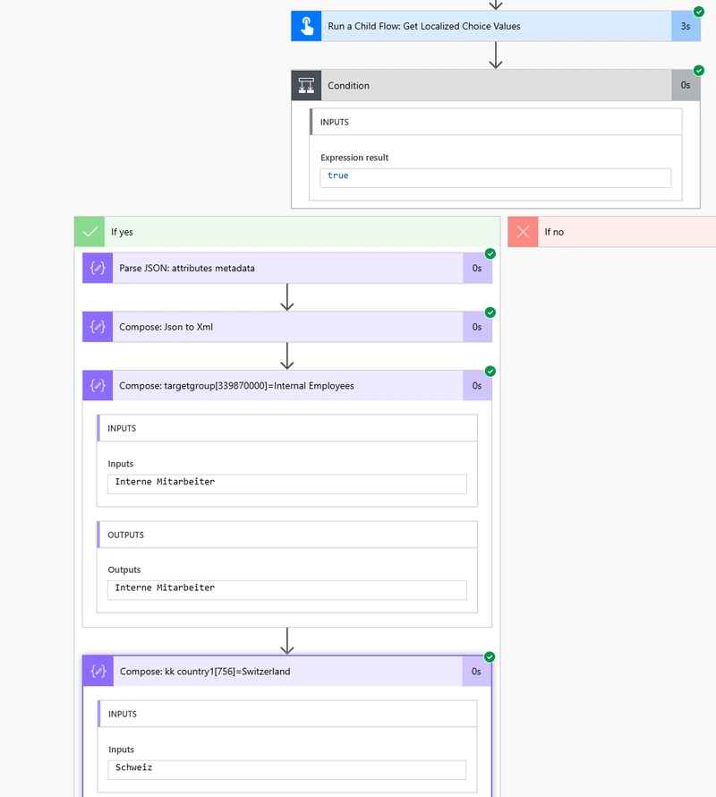
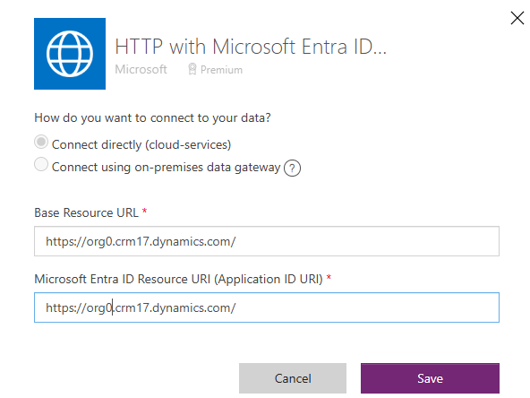
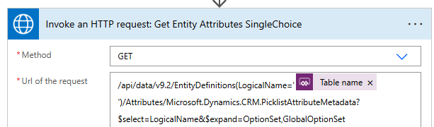
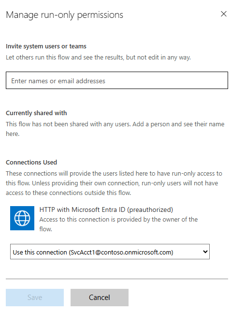

# Get Localized choice values for Dataverse record

## Summary

Model-driven applications offer excellent support for building multilingual applications. Translations for UI elements and entity configurations can be easily provided using an Excel file, and the application adapts to the user's selected language through the Personalization settings (see [Languages tab options](https://learn.microsoft.com/en-us/power-apps/user/set-personal-options#languages-tab-option)).

When accessing record information through Power Automate, choice field values are presented as numerical codes rather than their display names. To obtain the choice display names in the user's language, these numerical values must be retrieved using tools like Power Automate.

The "Utils - Get Localized choice values for record" workflow retrieves definitions of choice and multi-choice fields in a Dataverse table, providing numerical values and labels for each choice in a specified language. It can be used either as a child workflow or as a standalone flow, and  accepts the following **parameters**:

| Parameter name | Description |
| - | - |
| Table name  | The  logical name of dataverse entity, as defined in _Properties / Advanced options / Logical name_ |
| lcid | LCID code of a language, e.g. 1033 for English. Consider saving the language used by the user when a record is created. You may retrieve the language code using JavaScript: `Xrm.Utility.getGlobalContext().userSettings.languageId`   |
| lcid fallback | LCID code of language used as a fallback, in case the primary language is not detected. Use the default language of your environment. |

The flow **returns** the following values:

| Name | Description |
| - | - |
| Results | JSON object with the following structure: 	`[{"LogicalName":"fieldName","Options":[{"Value":339870000,"Label":""}]}]` |
| Error message |	Empty, if success. Otherwise error message |
| Success | "True" or "False" |

## Using the flow

The **Get Localized choice values - test** flow provides an example on how to use the results returned by the **Get Localized choice values** flow.

To speed up the retrieval of the localized label, the results from the child flow are converted into an `XML` object, and an `xpath` expression is used to quickly extract the correct value.

The `sxPathQuery` variable is set to the following expression:

`//arr[LogicalName="{fieldName}"]/Options[Value={fieldValue}]/Label`

The `{fieldName}` and `{fieldValue}` tokens are replaced by a field logical name and a numerical value, and used in the `xpath()` expression, e.g.

`xpath(outputs('Compose:_Json_to_Xml'), concat('string(', replace(replace(variables('sxPathQuery'), '{fieldName}', 'kk_targetgroup'), '{fieldValue}', '339870000'), ')'))`, or

`xpath(outputs('Compose:_Json_to_Xml'), concat('string(', replace(replace(variables('sxPathQuery'), '{fieldName}', 'kk_country1'), '{fieldValue}', '756'), ')'))`

When building real-life solution, you would define the `fieldValues` based on the record's properties.



## Applies to


## Compatibility


## Contributors

* [Kinga Kazala](https://github.com/kkazala/)

## Version history

Version|Date|Comments
-------|----|--------
1.0|April 22, 2025|Initial release

## Prerequisites

The "[HTTP with Microsoft Entra ID (preauthorized)](https://learn.microsoft.com/en-us/connectors/webcontents/)" connector operates through a Microsoft 1st party trusted application. This application includes preauthorization for various Microsoft services and there is no need for administrators to explicitly grant consent for actions to be executed by the application on behalf of the user.
Microsoft also released a new version of the connector, the "[HTTP With Microsoft Entra ID](https://learn.microsoft.com/en-us/connectors/webcontentsv2/)", allowing administrators to grant discrete consent.

Update the workflow to use the "HTTP With Microsoft Entra ID" connector, if required.

## Minimal path to awesome


### Using the solution zip

* [Download](./solution/solution.zip) the `.zip` from the `solution` folder
* Within **Power Apps Studio**, import the solution `.zip` file using **Solutions** > **Import Solution** and select the `.zip` file you just packed.
* When importing a solution, you will need to provide a connection reference to your Power Platform Environment. Ensure that the connection is created using the URL of your Power Platform Environment.

    

    The value of "URL of the request"  does not include a host name. The request URL will be created by combining the URL specified in the referenced connection with the API endpoint defined in the "URL of the request" field.

    

* After the solution is imported, configure the **Get Localized choice values** cloud flow, to be executed as a child flow. Configure the `run only` permissions, using the flow owner’s embedded connection:

   

    Click on **Edit** link and change the connection in the **Connections Used** section

    

* Add a [service principal](https://learn.microsoft.com/en-us/power-automate/service-principal-support) as an additional owner to ensure business continuity.

### Using the source code

You can also use the [Power Apps CLI](https://docs.microsoft.com/powerapps/developer/data-platform/powerapps-cli) to pack the source code by following these steps:

* Clone the repository to a local drive
* Pack the source files back into a solution `.zip` file:

  ```bash
  pac solution pack --zipfile pathtodestinationfile --folder pathtosourcefolder --processCanvasApps
  ```

  Making sure to replace `pathtosourcefolder` to point to the path to this sample's `sourcecode` folder, and `pathtodestinationfile` to point to the path of this solution's `.zip` file (located under the `solution` folder)
* Within **Power Apps Studio**, import the solution `.zip` file using **Solutions** > **Import Solution** and select the `.zip` file you just packed.
* When importing a solution, you will need to provide a connection reference to your Power Platform Environment. Ensure that the connection is created using the URL of your Power Platform Environment.
* After the solution is imported, configure the **Get Localized choice values** cloud flow, to be executed as a child flow. Configure the `run only` permissions, using the flow owner’s embedded connection

## Help

<!--
You can just search and replace this page with the following values:

Search for:
YOUR-SOLUTION-NAME

Replace with your sample folder name. E.g.: my-cool-sample

Search for:
@YOURGITHUBUSERNAME

Replace with your GitHub username, prefixed with an "@". If you have more than one author, use %20 to separate them, making sure to prefix everyone's username individually with an "@".

Example:
@hugoabernier

Or:
@hugoabernier%20@VesaJuvonen%20@PopWarner
-->

> Note: don't worry about this section, we'll update the links.

We do not support samples, but this community is always willing to help, and we want to improve these samples. We use GitHub to track issues, which makes it easy for  community members to volunteer their time and help resolve issues.

If you encounter any issues while using this sample, you can [create a new issue](https://github.com/pnp/powerapps-samples/issues/new?assignees=&labels=Needs%3A+Triage+%3Amag%3A%2Ctype%3Abug-suspected&template=bug-report.yml&sample=YOUR-SOLUTION-NAME&authors=@YOURGITHUBUSERNAME&title=YOUR-SOLUTION-NAME%20-%20).

For questions regarding this sample, [create a new question](https://github.com/pnp/powerapps-samples/issues/new?assignees=&labels=Needs%3A+Triage+%3Amag%3A%2Ctype%3Abug-suspected&template=question.yml&sample=YOUR-SOLUTION-NAME&authors=@YOURGITHUBUSERNAME&title=YOUR-SOLUTION-NAME%20-%20).

Finally, if you have an idea for improvement, [make a suggestion](https://github.com/pnp/powerapps-samples/issues/new?assignees=&labels=Needs%3A+Triage+%3Amag%3A%2Ctype%3Abug-suspected&template=suggestion.yml&sample=YOUR-SOLUTION-NAME&authors=@YOURGITHUBUSERNAME&title=YOUR-SOLUTION-NAME%20-%20).

## Disclaimer

**THIS CODE IS PROVIDED *AS IS* WITHOUT WARRANTY OF ANY KIND, EITHER EXPRESS OR IMPLIED, INCLUDING ANY IMPLIED WARRANTIES OF FITNESS FOR A PARTICULAR PURPOSE, MERCHANTABILITY, OR NON-INFRINGEMENT.**


