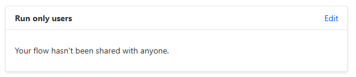

# Get SharePoint location for Dataverse record

<!--
This is how you want the sample to appear in the samples browser.
When naming your sample, try to give it a friendly name that describes what it does. Avoid using terms like `Power Apps` and `Power Automate` -- because that's what all the samples in this repo is all about.
GOOD 👍:
  Kitten Videos
BAD 👎:
  power-apps-kittenvideos
  Kitten Videos App for Power Platform using Creator Kit
-->

## Summary

SharePoint document management for Dataverse offers numerous [advantages](https://ludovicperrichon.com/synchronise-documents-in-between-dataverse-and-sharepoint), but while accessing documents and their locations via a model-driven Power Platform app is straightforward, retrieving them using Power Automate can be quite challenging.

If you need to archive attached documents in a different location or send them all via email as attachments, you must first locate the SharePoint Online (SPO) library and folder associated with the entity.

### Get SharePoint location for record

The "Get SharePoint location for record" flow uses the **Document Location** Dataverse table to gather details about the attachment location, such as the `Relative URL` (folder name) and `sharepointdocumentlocationid`.

Once SharePoint integration with Dataverse is configured for an entity, an entry pointing to the library in SharePoint is added. Note that the library name is based on the table logical name:


Only when the first document is attached to a record, additional entry is created in the **Document Location** table , referencing a folder in the SharePoint library. The folder name is based on the record properties:


The above values are not enough to access the SharePoint location where the documents are stored, but can be used in a call to the [RetrieveAbsoluteAndSiteCollectionUrl()](https://learn.microsoft.com/en-us/power-apps/developer/data-platform/webapi/reference/retrieveabsoluteandsitecollectionurl?view=dataverse-latest) Dataverse function to obtain the SharePoint Online site collection URL:

`/api/data/v9.2/sharepointdocumentlocations(sharepointdocumentlocationid)/Microsoft.Dynamics.CRM.RetrieveAbsoluteAndSiteCollectionUrl()`

The flow then executes a series of SharePoint REST api calls  to obtain a full set of information, like

| parameter name | description | example |
|-|-|-|
| `tenant_name` | the URL of the tenant's root site; also used as a hostname when retrieving SPO site [using GUID](https://learn.microsoft.com/en-us/graph/api/site-get?view=graph-rest-1.0&tabs=http#example-1-get-a-site-using-the-site-id).  | `contoso.sharepoint.com` |
| `site_url` | The URL of the current SharePoint site, as defined in the `site URL` parameter.  | `https://contoso.sharepoint.com/sites/XYZ` |
| `site_title` | Title of the current SPO site | `Project XYZ` |
| `site_id` | The `id` of the current SPO site in a `guid` format. | `xxxxxxxx-xxxx-xxxx-xxxx-xxxxxxxxxxxx` |
| `web_id` | The `id` of the current SPO web object in a `guid` format. | `yyyyyyyy-yyyy-yyyy-yyyy-yyyyyyyyyyyy` |
| `library_absolute_url` | The full URL of the library. | `https://contoso.sharepoint.com/sites/XYZ/idapps_externalcloudservice` |
| `library_name` | The `RootFolder`. Used in the URL, is generated automatically and cannot be changed by users. It can be changed with PowerShell.| `idapps_externalcloudservice` |
| `library_title` | The title of the library. This property can be changed by the user. | `The Archive Library` |
| `library_id` | Library's id in a `guid` format | `zzzzzzzz-zzzz-zzzz-zzzz-zzzzzzzzzzzz` |
| `library_drive_id` | Used by Graph API when referencing libraries. | `b!S3SdNSBmTUGa4v5ffh_rslLJssoXH4xEuShkEO-uxKg9bblUMeoaTbQC5t69DJ-x` |
| `folder_absolute_url`  | absolute url of a SPO library folder associated with the current teams channel | `https://contoso.sharepoint.com/sites/XYZ/idapps_externalcloudservice/test01_5437302CBC7A4D96AFD9BDFDAF15EF7F`|
| `folder_display_name`  | display name of the folder; white spaces are not encoded | `test01_5437302CBC7A4D96AFD9BDFDAF15EF7F`|
| `folder_drive_id`      | `driveItem Id` for the folder. Can be used in MS Graph API [Get driveItem](https://learn.microsoft.com/en-us/graph/api/driveitem-get)  |  `01JEVXUVBDVF6ZMUFRM5B34EGLOEDAUF5B`|
| `folder_id`            | SPO list item id. Can be used in SharePoint REST API, or MS Graph API [Get listItem](https://learn.microsoft.com/en-us/graph/api/listitem-get) | `15`|
| `error_message` | The error message if any of the actions failed, or empty string. | `{"Error":"..."}`   |
| `success` | | `True` or `False` |


## Applies to


## Compatibility


## Contributors


* [Kinga Kazala](https://github.com/kkazala/)

## Version history

Version|Date|Comments
-------|----|--------
1.0|April 30, 2025|Initial release

## Prerequisites

The "[HTTP with Microsoft Entra ID (preauthorized)](https://learn.microsoft.com/en-us/connectors/webcontents/)" connector operates through a Microsoft 1st party trusted application. This application includes preauthorization for various Microsoft services and there is no need for administrators to explicitly grant consent for actions to be executed by the application on behalf of the user.
Microsoft also released a new version of the connector, the "[HTTP With Microsoft Entra ID](https://learn.microsoft.com/en-us/connectors/webcontentsv2/)", allowing administrators to grant discrete consent.

Update the workflow to use the "HTTP With Microsoft Entra ID" connector, if required.

## Minimal path to awesome


### Using the solution zip

* [Download](./solution/solution.zip) the `.zip` from the `solution` folder
* Within **Power Apps Studio**, import the solution `.zip` file using **Solutions** > **Import Solution** and select the `.zip` file you just packed.
* Open the app in edit mode and make sure the data source **Data source name** is connected correctly.

### Using the solution zip

* [Download](./solution/solution.zip) the `.zip` from the `solution` folder
* Within **Power Apps Studio**, import the solution `.zip` file using **Solutions** > **Import Solution** and select the `.zip` file you just packed.
* When importing a solution, you will need to provide a connection reference to your Power Platform Environment. Ensure that the connection is created using the URL of your Power Platform Environment.

    

    The value of "URL of the request"  does not include a host name. The request URL will be created by combining the URL specified in the referenced connection with the API endpoint defined in the "URL of the request" field.

    

* After the solution is imported, configure the **Get Localized choice values** cloud flow, to be executed as a child flow. Configure the `run only` permissions, using the flow owner’s embedded connection:

   

    Click on **Edit** link and change the connection in the **Connections Used** section

    

* Add a [service principal](https://learn.microsoft.com/en-us/power-automate/service-principal-support) as an additional owner to ensure business continuity.

### Using the source code

You can also use the [Power Apps CLI](https://docs.microsoft.com/powerapps/developer/data-platform/powerapps-cli) to pack the source code by following these steps:

* Clone the repository to a local drive
* Pack the source files back into a solution `.zip` file:

  ```bash
  pac solution pack --zipfile pathtodestinationfile --folder pathtosourcefolder --processCanvasApps
  ```

  Making sure to replace `pathtosourcefolder` to point to the path to this sample's `sourcecode` folder, and `pathtodestinationfile` to point to the path of this solution's `.zip` file (located under the `solution` folder)
* Within **Power Apps Studio**, import the solution `.zip` file using **Solutions** > **Import Solution** and select the `.zip` file you just packed.
* When importing a solution, you will need to provide a connection reference to your Power Platform Environment. Ensure that the connection is created using the URL of your Power Platform Environment.
* After the solution is imported, configure the **Get SharePoint location for record** cloud flow, to be executed as a child flow. Configure the `run only` permissions, using the flow owner’s embedded connection


## Help

<!--
You can just search and replace this page with the following values:

Search for:
YOUR-SOLUTION-NAME

Replace with your sample folder name. E.g.: my-cool-sample

Search for:
@YOURGITHUBUSERNAME

Replace with your GitHub username, prefixed with an "@". If you have more than one author, use %20 to separate them, making sure to prefix everyone's username individually with an "@".

Example:
@hugoabernier

Or:
@hugoabernier%20@VesaJuvonen%20@PopWarner
-->

> Note: don't worry about this section, we'll update the links.

We do not support samples, but this community is always willing to help, and we want to improve these samples. We use GitHub to track issues, which makes it easy for  community members to volunteer their time and help resolve issues.

If you encounter any issues while using this sample, you can [create a new issue](https://github.com/pnp/powerapps-samples/issues/new?assignees=&labels=Needs%3A+Triage+%3Amag%3A%2Ctype%3Abug-suspected&template=bug-report.yml&sample=YOUR-SOLUTION-NAME&authors=@YOURGITHUBUSERNAME&title=YOUR-SOLUTION-NAME%20-%20).

For questions regarding this sample, [create a new question](https://github.com/pnp/powerapps-samples/issues/new?assignees=&labels=Needs%3A+Triage+%3Amag%3A%2Ctype%3Abug-suspected&template=question.yml&sample=YOUR-SOLUTION-NAME&authors=@YOURGITHUBUSERNAME&title=YOUR-SOLUTION-NAME%20-%20).

Finally, if you have an idea for improvement, [make a suggestion](https://github.com/pnp/powerapps-samples/issues/new?assignees=&labels=Needs%3A+Triage+%3Amag%3A%2Ctype%3Abug-suspected&template=suggestion.yml&sample=YOUR-SOLUTION-NAME&authors=@YOURGITHUBUSERNAME&title=YOUR-SOLUTION-NAME%20-%20).

## Disclaimer

**THIS CODE IS PROVIDED *AS IS* WITHOUT WARRANTY OF ANY KIND, EITHER EXPRESS OR IMPLIED, INCLUDING ANY IMPLIED WARRANTIES OF FITNESS FOR A PARTICULAR PURPOSE, MERCHANTABILITY, OR NON-INFRINGEMENT.**


