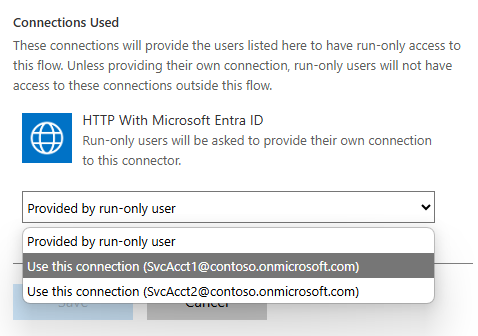

# Get SharePoint library info from Teams context

## Summary

Integration between Power Apps and MS Teams allows creating context-aware applications, that access information stored for example in the SharePoint site connected to the team.

### Embedding vs integrating

[Embedding](https://learn.microsoft.com/en-us/power-apps/teams/embed-teams-app) Power Apps canvas apps is different from [creating](https://learn.microsoft.com/en-us/power-apps/teams/create-apps-overview) Canvas Apps in MS Teams.

A Canvas App **created in Teams** can only be edited using Power Apps app in MS teams.
The environment is **not** displayed in https://make.powerapps.com/, but can be found using https://make.powerautomate.com/. This is useful when you need to export solution.👈 Still, you won't be able to edit this app via browser.
The app has access to a [Teams integration object](https://learn.microsoft.com/en-us/power-apps/teams/use-teams-integration-object), which provides context information, for example team id and group  id, and channel id.


**Embedded** Canvas App, on the other hand, is a standalone Canvas App, added to MS Teams.

Embedding Canvas Apps in MS Teams, available since March 2020, gives an app access to the team's [context](https://learn.microsoft.com/en-us/power-apps/teams/embed-teams-app#use-context-from-teams) information using the `Param('parameterName')`.


### The team Id parameter

However, the id returned by `teamId` parameter is not a team's `guid`, but an `internalId`. The internal id cannot be used with either the Teams Power Automate actions, or the MS Graph API.
Calling the `https://graph.microsoft.com/v1.0/teams?$select=id,internalId` returns `null` for the `internalId`. The only way of retrieving the `guid` is indeed retrieving all the teams the user has access to, and for each of them, retrieving the `id` and `internalId` values.
The best explanation of these `internalIds` can be found in [stackoverflow](https://stackoverflow.com/questions/66491929/is-there-any-microsoft-api-to-get-the-group-id-from-channel-id).

### Get Teams Channel Library Info

The "Get Teams Channel Library Info" flow retrieves all the guids, ids, names and paths that might be useful in building Power Platform solutions.

It may be used either directly from Canvas App added to MS Teams, or as a child flow.
It accepts two parameters: `teamsId` and `channelId`. Depending on the app type, use the following parameters:

|             | Embeded Canvas App   | Integrated Canvas App  |
| ----------- | -------------------- | ---------------------- |
| `teamId`    | `Param("teamId")`    | `Teams.ThisTeam.Id`    |
| `channelId` | `Param("channelId")` | `Teams.ThisChannel.Id` |

It returns the following information for a SharePoint location associated with the team and channel the Canvas App is added to:

| output value           |                                                                                                                                                                                  |
| ---------------------- | -------------------------------------------------------------------------------------------------------------------------------------------------------------------------------- |
| `folder_absolute_url`  | absolute url of a SPO library folder associated with the current teams channel, e.g. `https://contoso.sharepoint.com/sites/Orgteam/Shared%20Documents/Channel%201`               |
| `folder_display_name`  | display name of the folder; white spaces are not encoded, e.g. `Channel 1`                                                                                                       |
| `folder_drive_id`      | `driveItem Id` for the folder, e.g. `01CHDY72JWUJ42GM77UZEYSDW32BJ53M5G`. Can be used in MS Graph API [Get driveItem](https://learn.microsoft.com/en-us/graph/api/driveitem-get) |
| `folder_id`            | SPO list item id, e.g. `1`. Can be used in SharePoint REST API, or MS Graph API [Get listItem](https://learn.microsoft.com/en-us/graph/api/listitem-get)                         |
| `library_absolute_url` | absolute url of a SPO library, e.g. `https://contoso.sharepoint.com/sites/Orgteam/Shared%20Documents`                                                                            |
| `library_drive_id`     | `driveId` of the library, e.g. `b!Xj1cTAreVEyxW0CJgd9XEi27yh4bsARHiduN8u--GKCpBOoIL9i_Qpp1dqNUrygL`. Can be used in MS Graph API [Get Drive](https://learn.microsoft.com/en-us/graph/api/drive-get) |
| `library_id`           | Library id in a `guid` format, e.g. `08ea04a9-d82f-42bf-9a75-76a354af280b`.  Can be used in MS Graph API [Get metadata for a list](https://learn.microsoft.com/en-us/graph/api/list-get) |
| `library_name`         | display name of the library, e.g. `Shared Documents` |
| `library_title`        | internal name of the library, used in the URL, e.g. `Documents`|
| `site_id`              | SPO site id in a `guid` format, `4c5c3d5e-de0a-4c54-b15b-408981df5712`. Can be used in MS Graph API [Get a site resource](https://learn.microsoft.com/en-us/graph/api/site-get?view=graph-rest-1.0&tabs=http) |
| `site_title`           | display name of the sie, e.g. `Org team` |
| `site_url`             | absolute url of the SPO site, e.g. `https://contoso.sharepoint.com/sites/Orgteam` |
| `team_id`              | team's id in a `guid` format. Can be used in MS Graph API [Get team](https://learn.microsoft.com/en-us/graph/api/team-get), e.g. `6e440935-45b1-4bff-ac53-32ca9997e70a` |
| `tenant_name`          | the URL of the tenant's root site, e.g. `contoso.sharepoint.com`. Also used as a hostname when retrieving SPO site [using GUID](https://learn.microsoft.com/en-us/graph/api/site-get?view=graph-rest-1.0&tabs=http#example-1-get-a-site-using-the-site-id). |
| `web_id`               | id of the SPO web in a `guid` format, e.g. `1ecabb2d-b01b-4704-89db-8df2efbe18a0`. Used when retrieving SPO site [using GUID](https://learn.microsoft.com/en-us/graph/api/site-get?view=graph-rest-1.0&tabs=http#example-1-get-a-site-using-the-site-id). |

### Solution components

The solution consists of:

- **Get Teams Channel Library Info** Power Automate flow
- **Get Teams Channel Library Info - test** Canvas App. Add this app to a MS Teams channel to test the workflow
- **HTTP With Microsoft Entra ID** connection reference.

## Applies to


## Compatibility


The licensing document states that the M365 licenses provide _"limited usage rights"_ to Power Platform, allowing users to extend the M365 services in order to support business processes. But finding the team's guid requires using **Premium connector** because the `Send a Microsoft Graph HTTP request` action does not support `https://graph.microsoft.com/v1.0/teams?$select= id,internalId` query.

## Contributors

* [Kinga Kazala](https://github.com/kkazala/)

## Version history

Version|Date|Comments
-------|----|--------
1.0|April 22, 2025|Initial release

## Prerequisites

This Power Automate Flow is using **HTTP with Microsoft Entra ID** connector, which requires **Premium license**.

In order to successfully execute the flow, you need to grant the **PowerPlatform-webcontentsv2-Connector** service principal the following API permissions to `Microsoft Graph` resource:
- `Channel.ReadBasic.All`
- `Team.ReadBasic.All`
- `Files.Read.All`

Follow the [Authorize the connector to act on behalf of a signed-in user](https://learn.microsoft.com/en-us/connectors/webcontentsv2/#authorize-the-connector-to-act-on-behalf-of-a-signed-in-user) procedure to grant the permissions.

## Minimal path to awesome

### Using the solution zip

* [Download](./solution/solution.zip) the `.zip` from the `solution` folder
* Within **Power Apps Studio**, import the solution `.zip` file using **Solutions** > **Import Solution** and select the `.zip` file you just packed.
* During the import process, update the **connection references** and **environment variables**.
* If required, configure the flow to be executed as a child flow. Navigate the solution, select the **Get Teams Channel Library Info** flow and on the details page, select **Edit** in the **Run only users** section.

   

* Click on **Edit** link and change the connection in the **Connections Used** section

   

* Add a [service principal](https://learn.microsoft.com/en-us/power-automate/service-principal-support) as an additional owner to ensure business continuity.

### Using the source code

You can also use the [Power Apps CLI](https://docs.microsoft.com/powerapps/developer/data-platform/powerapps-cli) to pack the source code by following these steps:

* Clone the repository to a local drive
* Pack the source files back into a solution `.zip` file:

  ```bash
  pac solution pack --zipfile pathtodestinationfile --folder pathtosourcefolder --processCanvasApps
  ```

  Making sure to replace `pathtosourcefolder` to point to the path to this sample's `sourcecode` folder, and `pathtodestinationfile` to point to the path of this solution's `.zip` file (located under the `solution` folder)
* Within **Power Apps Studio**, import the solution `.zip` file using **Solutions** > **Import Solution** and select the `.zip` file you just packed.

## Features

Depending on which Power Automate action you are using, you will need to know the target location's `URL`, `guid`, `driveId` or list `title`. I described this topic in my blog post: [Data Source Environment Variables in Power Automate actions](https://dev.to/kkazala/data-source-environment-variables-in-power-automate-actions-3mo5).

Retrieving these values based on the team and channel `internalId` requires the following steps:

- get `guid`s of all teams the user has access to and for each of them, fetch the `internalId` property. If the `internalId` is equal to `teamId` provided by the MS Teams context, this is the team you are looking for. the `guid` will be used to access team information with MS Graph.
_Unfortunately, the `internalId` is `null` when retrieving all teams with `https://graph.microsoft.com/v1.0/teams?$select=id,internalId`_
- get SharePoint folder information for the Teams channel, using the `guid` retrieved in the previous step, and the `channelId` from team's context. The `https://graph.microsoft.com/v1.0/teams/{teamGuid}/channels/{channelId}/filesFolder?$select=id,name,parentReference` query returns `id`, `name` and `parentReference` properties, which are used by `drives` API in the next step.

  

- get SharePoint folder information by calling `https://graph.microsoft.com/v1.0/drives/{driveId}/items/{id}/listItem?$select=id,webUrl,parentReference`. This query returns `folder id` (integer), `absolute URL` and a reference to a SharePoint site used by the channel. The `parentReference/siteId` returns `tenantName,SiteId,WebId`.

  

- get library information using `https://graph.microsoft.com/v1.0/drives/{driveId}/list?$select=id,webUrl,name,displayName,parentReference`. This query returns library information: `display name`, `internal name` which is used as part of the url, `library guid` and `absolute URL`

  

- get site information using `https://graph.microsoft.com/v1.0/sites/{siteId}?$select=name,weburl,displayName`

  

### Results

The output may be used in a parent Power Automate flow, to access library and folder used to store channel's documents.

To test it, add the **Get Teams Channel Library Info - test** Power App to a MS Teams channel.

The top section displays Teams context parameters. The **Fetch folder information** button triggers the **Get Teams Channel Library Info** flow, with results displayed below:


## Help

<!--
You can just search and replace this page with the following values:

Search for:
YOUR-SOLUTION-NAME

Replace with your sample folder name. E.g.: my-cool-sample

Search for:
@YOURGITHUBUSERNAME

Replace with your GitHub username, prefixed with an "@". If you have more than one author, use %20 to separate them, making sure to prefix everyone's username individually with an "@".

Example:
@hugoabernier

Or:
@hugoabernier%20@VesaJuvonen%20@PopWarner
-->

> Note: don't worry about this section, we'll update the links.

We do not support samples, but this community is always willing to help, and we want to improve these samples. We use GitHub to track issues, which makes it easy for  community members to volunteer their time and help resolve issues.

If you encounter any issues while using this sample, you can [create a new issue](https://github.com/pnp/powerapps-samples/issues/new?assignees=&labels=Needs%3A+Triage+%3Amag%3A%2Ctype%3Abug-suspected&template=bug-report.yml&sample=YOUR-SOLUTION-NAME&authors=@YOURGITHUBUSERNAME&title=YOUR-SOLUTION-NAME%20-%20).

For questions regarding this sample, [create a new question](https://github.com/pnp/powerapps-samples/issues/new?assignees=&labels=Needs%3A+Triage+%3Amag%3A%2Ctype%3Abug-suspected&template=question.yml&sample=YOUR-SOLUTION-NAME&authors=@YOURGITHUBUSERNAME&title=YOUR-SOLUTION-NAME%20-%20).

Finally, if you have an idea for improvement, [make a suggestion](https://github.com/pnp/powerapps-samples/issues/new?assignees=&labels=Needs%3A+Triage+%3Amag%3A%2Ctype%3Abug-suspected&template=suggestion.yml&sample=YOUR-SOLUTION-NAME&authors=@YOURGITHUBUSERNAME&title=YOUR-SOLUTION-NAME%20-%20).

## Disclaimer

**THIS CODE IS PROVIDED *AS IS* WITHOUT WARRANTY OF ANY KIND, EITHER EXPRESS OR IMPLIED, INCLUDING ANY IMPLIED WARRANTIES OF FITNESS FOR A PARTICULAR PURPOSE, MERCHANTABILITY, OR NON-INFRINGEMENT.**


