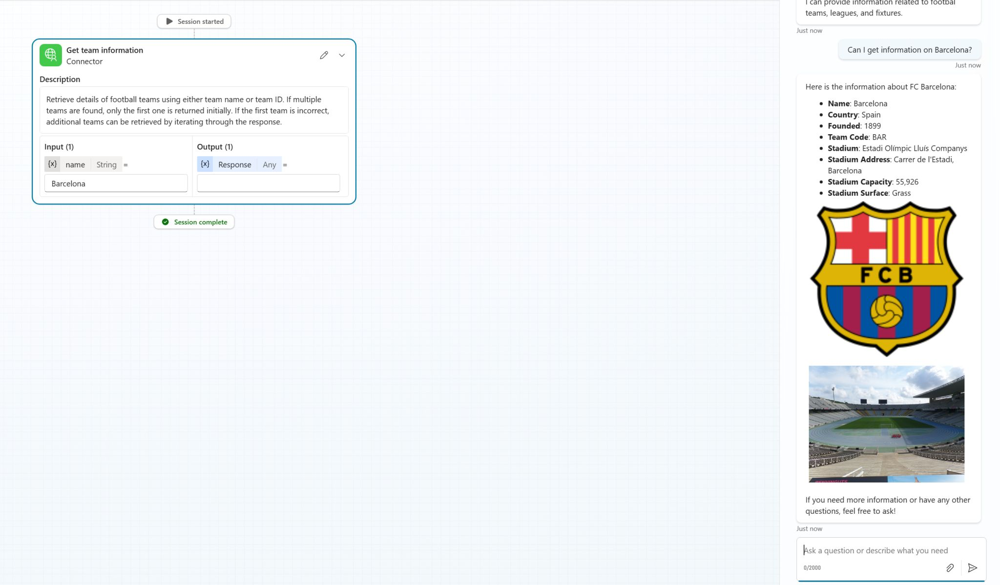
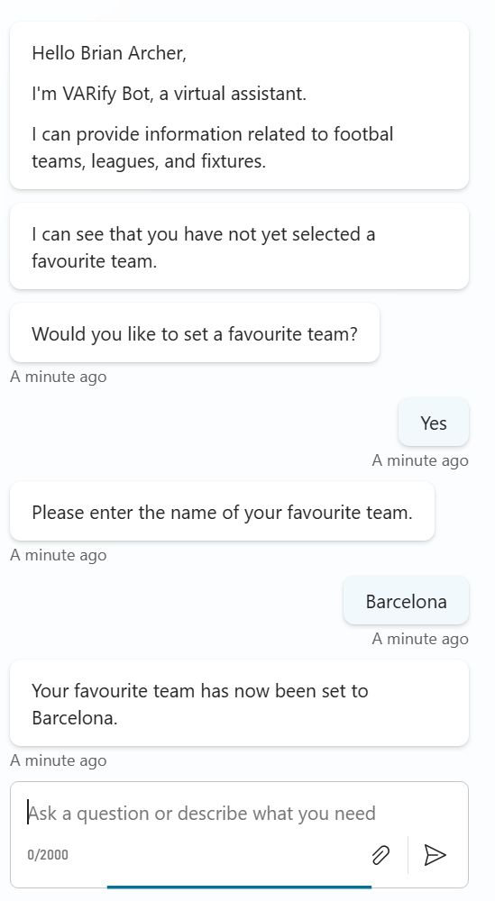
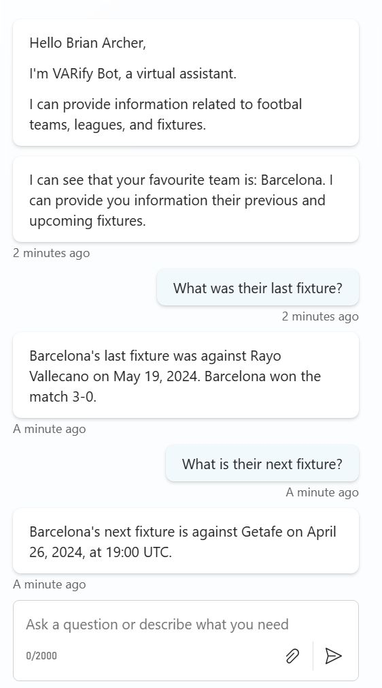

# VARify Bot

## Summary

VARify Bot is an agent built with Copilot Studio for fetching information about football teams and results. The bot integrates with a third-party API (https://www.api-football.com/) to answer queries related to your favourite football teams.

You can also set your preferred favourite team and this will be stored in a Dataverse table and linked to your user account. The bot will have knowledge of your favourite team during subsequent interactions.







## Applies to


## Compatibility


## Contributors


* [Brian Archer](https://github.com/BrianArcher94)

## Version history

Version|Date|Comments
-------|----|--------
1.0|April 14, 2025|Initial release

## Prerequisites

1. Access to Copilot Studio
2. Sign up for an account on https://www.api-football.com/
3. Get your API key from your API-Football portal


### Using the solution zip

* [Download](./solution/varify-bot.zip) the `.zip` from the `solution` folder
* Within **Power Apps Studio**, import the solution `.zip` file using **Solutions** > **Import Solution** and select the `.zip` file you just packed.

### Using the source code

You can also use the [Power Apps CLI](https://docs.microsoft.com/powerapps/developer/data-platform/powerapps-cli) to pack the source code by following these steps:

* Clone the repository to a local drive
* Pack the source files back into a solution `.zip` file:

  ```bash
  pac solution pack --zipfile pathtodestinationfile --folder pathtosourcefolder --processCanvasApps
  ```

  Making sure to replace `pathtosourcefolder` to point to the path to this sample's `sourcecode` folder, and `pathtodestinationfile` to point to the path of this solution's `.zip` file (located under the `solution` folder)
* Within **Power Apps Studio**, import the solution `.zip` file using **Solutions** > **Import Solution** and select the `.zip` file you just packed.

## Features

This solution illustrates the following concepts on top of the Power Platform:

* Custom Copilot Agent
* Integration between Copilot agent and third-part API
* Integration between Copilot Agent and Dataverse

## Help

We do not support samples, but this community is always willing to help, and we want to improve these samples. We use GitHub to track issues, which makes it easy for  community members to volunteer their time and help resolve issues.

If you encounter any issues while using this sample, you can [create a new issue](https://github.com/pnp/powerapps-samples/issues/new?assignees=&labels=Needs%3A+Triage+%3Amag%3A%2Ctype%3Abug-suspected&template=bug-report.yml&sample=varify-bot&authors=@BrianArcher94&title=varify-bot%20-%20).

For questions regarding this sample, [create a new question](https://github.com/pnp/powerapps-samples/issues/new?assignees=&labels=Needs%3A+Triage+%3Amag%3A%2Ctype%3Abug-suspected&template=question.yml&sample=varify-bot&authors=@BrianArcher94&title=varify-bot%20-%20).

Finally, if you have an idea for improvement, [make a suggestion](https://github.com/pnp/powerapps-samples/issues/new?assignees=&labels=Needs%3A+Triage+%3Amag%3A%2Ctype%3Abug-suspected&template=suggestion.yml&sample=varify-bot&authors=@BrianArcher94&title=varify-bot%20-%20).

## Disclaimer

**THIS CODE IS PROVIDED *AS IS* WITHOUT WARRANTY OF ANY KIND, EITHER EXPRESS OR IMPLIED, INCLUDING ANY IMPLIED WARRANTIES OF FITNESS FOR A PARTICULAR PURPOSE, MERCHANTABILITY, OR NON-INFRINGEMENT.**


